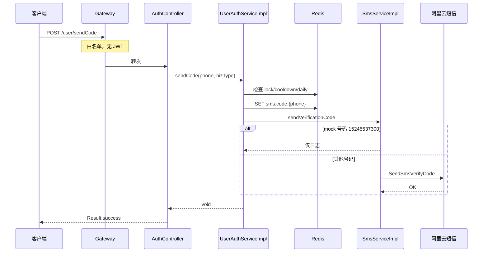
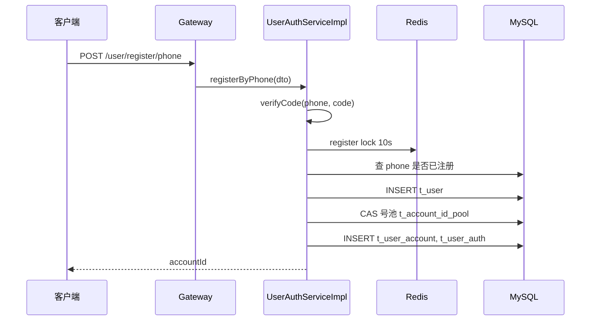
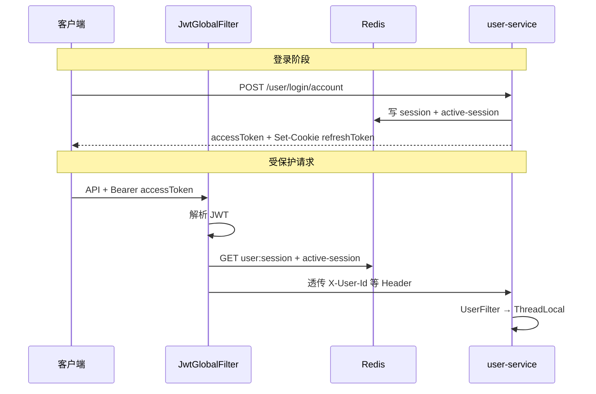

# Level 2：流转过程

> 描述请求在各组件之间的**顺序流转**，不含函数内部细节。

---

## B1. 发送验证码



**步骤摘要（含每步含义）**

| 步骤 | 动作 | 解释 |
|------|------|------|
| 1 | 网关白名单放行 | `JwtGlobalFilter` 匹配路径 `/user/sendCode`，**不校验 JWT**（未登录也可发码），直接转发到 `user-service:8081` |
| 2 | DTO 参数校验 | `@Valid SendCodeDTO`：手机号格式、bizType 非空；失败返回 400 |
| 3 | 检查 `sms:verify:lock:{phone}` | 若该手机号因**验码连续失败 5 次**已被锁定（TTL 30 分钟），**拒绝发码**，防止暴力猜码后继续骚扰 |
| 4 | 检查 `sms:cooldown:{bizType}:{phone}` | 若该手机号在**同一 bizType 下 5 分钟内**已发过码（Key 存在），拒绝并提示「验证码未过期，请稍后再试」 |
| 5 | 检查 `sms:daily:{bizType}:{phone}` | 读取当日已发次数，若 **≥5 次**（`SEND_CODE_DAILY_LIMIT`），拒绝并提示「今日验证码发送次数已达上限」；计数 TTL 到当日 0 点 |
| 6 | 生成并写入验证码 | `Random` 生成 **6 位数字**；`DEL sms:verify:fail:{phone}` 清零历史验码失败计数；`SET sms:code:{phone}` **TTL 300s**（5 分钟，供后续注册/改号验码比对） |
| 7 | 写入频控标记 | `SET sms:cooldown:{bizType}:{phone}=1` **TTL 300s**；`SET sms:daily:{bizType}:{phone}=count+1` **TTL 至午夜** |
| 8 | 调用短信服务 | `SmsServiceImpl`：mock 号仅日志；否则按 bizType 映射模板 100001–100005，调阿里云 `SendSmsVerifyCode`，模板参数 `{code,min}` |
| 9 | 返回成功 | `Result.success(null)`；**响应体不含验证码**，客户端需用户手动输入收到的短信 |

---

## B2. 手机号注册



---

## B3. 登录 + 网关后续请求



---

## B4. Token 刷新

1. 客户端带 Cookie `refreshToken` → `POST /user/token/refresh`
2. 解析 refresh JWT → 取 `userId`、`sessionId`
3. Redis 分布式锁 `user:refresh:lock:{sessionId}`（5s）
4. 校验 session 在线 + refreshTokenHash 一致 + active-session 匹配
5. 轮转 refreshToken，更新 session，返回新 accessToken

---

## E1. 文章发布（立即）

1. `POST /article` status=1 → 写 `t_article`（待审核）
2. 写 `t_task` → 事务提交后推 Redis `task:queue:immediate`
3. `TaskScheduler1` 弹出任务 → `ArticleAuditServiceImpl`
4. DFA → DashScope 文本 → DashScope 图片
5. 通过：写 Mongo 正文、更新文章状态、Kafka 搜索同步
6. Feign 调 social `POST /feign/social/feed/publish` 推 Feed
7. social 产 Kafka `notification-events` → notification SSE 推送

---

## F2. 关注 → Feed → 通知

1. `POST /social/follow/{userId}` → 写 `t_social_follow`
2. 回填被关注者最近 50 篇文章到粉丝 `t_social_feed_item`
3. 发送 `notification-events`（关注/Feed 未读）
4. notification 写库 + SSE 推 `feed_unread`

---

## G1. 通知全链路

```
social/content 事件
    → Kafka notification-events
    → NotificationEventConsumer
    → NotificationServiceImpl.save + updateUserState
    → SseServiceImpl.push(userId)
    → 客户端 EventSource
```

---

## 定时任务流转

| 调度器 | 周期 | 动作 |
|--------|------|------|
| `TaskScheduler1` | 1s | Redis 队列 → 并发执行 content 任务 |
| `AccountStatusScheduler` | 5min | 过期封禁自动解封 |
| `AccountStatusScheduler` | 30min | 注销冷静期到期 → 彻底注销 |
| `UserAuditTaskRecoveryRunner` | 启动时 | 卡住审核任务重置 |
