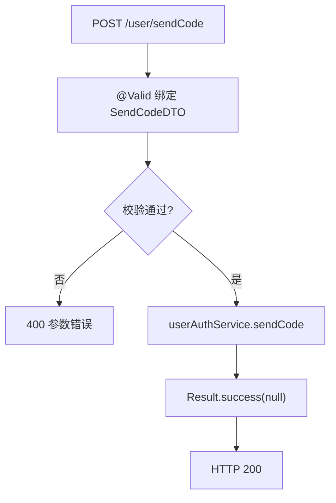
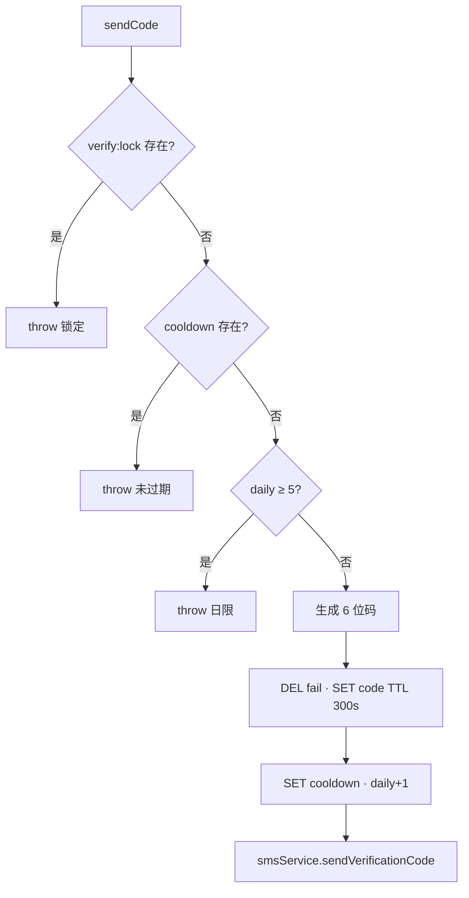

# Level 5：函数内部实现、评价与可扩展点

> **HTML 可视化**：`project-flow.html` 的 L5 采用 **左侧流程图 + 右侧带行号注释的源码** 并排布局。  
> 本文档用 **Mermaid 流程图 + 行级注释表** 表达相同内容，供 Agent 阅读。B1 覆盖 L3 全部 6 个函数。

---

## B1-① `AuthController.sendCode`

**文件**：`service/user-service/.../controller/AuthController.java`

### 执行流程

### 源码 · 行级注释

| 行号 | 代码 | 说明 |
|------|------|------|
| 33 | `@PostMapping("/sendCode")` | 映射 POST `/user/sendCode`（类上 `@RequestMapping("/user")`） |
| 35 | `@Valid @RequestBody SendCodeDTO dto` | 触发 Bean Validation：`phone` 非空+正则；`bizType` 非空 |
| 36 | `userAuthService.sendCode(dto.getPhone(), dto.getBizType())` | 仅传两个字段，不在 Controller 做频控/Redis |
| 37 | `return Result.success(null)` | 统一响应包装；**不包含验证码** |

**评价**：薄 Controller，符合分层。  
**可扩展**：`bizType` 可改枚举 + `@Pattern` 白名单（代码中已有 TODO）。

---

## B1-② `UserAuthServiceImpl.sendCode`

**文件**：`service/user-service/.../service/impl/UserAuthServiceImpl.java` L68–110

### 执行流程

### 源码 · 行级注释

| 行号 | 代码 | Redis / 存储 | TTL | 作用 |
|------|------|--------------|-----|------|
| 70 | `verifyLockKey = CODE_VERIFY_LOCK_PREFIX + phone` | Key: `sms:verify:lock:{phone}` | 读已有 TTL（写入时为 1800s） | 拼接验码失败锁定 Key |
| 71–74 | `if (redisUtils.get(verifyLockKey) != null) throw ...` | 同上 | — | Key **存在**即表示该号处于验码失败锁定期，**禁止再发码**；异常文案含 30 分钟 |
| 77 | `cooldownKey = SEND_CODE_COOLDOWN_PREFIX + bizType + ":" + phone` | Key: `sms:cooldown:{bizType}:{phone}` | 读 | **按业务隔离**的冷却 Key，如 `sms:cooldown:REGISTER:13800138000` |
| 78–80 | `if (get(cooldownKey) != null) throw "验证码未过期..."` | 同上 | Key 存在说明 **5 分钟内**该 bizType 已发过 | 防止同场景短信轰炸 |
| 83 | `dailyKey = SEND_CODE_DAILY_PREFIX + bizType + ":" + phone` | Key: `sms:daily:{bizType}:{phone}` | 读 | 当日该 bizType 发送计数 |
| 84–88 | `dailyCountStr = get(dailyKey)` → `parseInt` | 同上 | — | 无 Key 则视为 0 次 |
| 89–91 | `if (dailyCount >= SEND_CODE_DAILY_LIMIT)` | 常量 `SEND_CODE_DAILY_LIMIT=5` | — | **每个 bizType 每天最多 5 条** |
| 94 | `String.format("%06d", new Random().nextInt(1000000))` | — | — | 生成 **000000–999999** 六位字符串（含前导零） |
| 95 | `redisUtils.del(CODE_VERIFY_FAIL_PREFIX + phone)` | Key: `sms:verify:fail:{phone}` | DEL | 新发码时**清零**验码失败计数，给用户重新尝试机会 |
| 96 | `setEx(CODE_PREFIX + phone, code, CODE_EXPIRE)` | Key: `sms:code:{phone}` | **300s**（`CODE_EXPIRE`） | **服务端权威验证码**；注册/改号时 `verifyCode` 读此 Key 比对；**注意 Key 仅按 phone，不按 bizType** |
| 99 | `setEx(cooldownKey, "1", SEND_CODE_COOLDOWN)` | Key: `sms:cooldown:{bizType}:{phone}` | **300s** | 值固定 `"1"` 作存在标记；5 分钟内同 bizType 不可再发 |
| 102–105 | `secondsUntilMidnight = Duration.between(now, 明日0点)` | — | — | 计算到当日结束的秒数，作为 daily Key 的过期时间 |
| 106 | `setEx(dailyKey, String.valueOf(dailyCount + 1), secondsUntilMidnight)` | Key: `sms:daily:{bizType}:{phone}` | **动态（至 0 点）** | 计数 +1；次日 Key 过期后重新从 1 计 |
| 109 | `smsService.sendVerificationCode(phone, code, bizType)` | — | — | 进入短信层；**code 只经短信下发，不进 HTTP 响应** |

**MySQL**：无读写。  
**评价**：三层频控 + 验码锁分离清晰；`sms:code` 未含 bizType 意味着同号后发的码会覆盖前码。  
**可扩展**：code Key 可改为 `sms:code:{bizType}:{phone}` 支持多场景并行验码。

---

## B1-③ `SmsServiceImpl.sendVerificationCode`

**文件**：`service/user-service/.../service/impl/SmsServiceImpl.java` L117–166

### [简略]
mock → 无 client 降级 → 组请求 → 同步调阿里云 → 校验 OK。

### [详细] 逐行

| 行号 | 代码 | 说明 |
|------|------|------|
| 118–121 | `if (shouldMockSend(phone)) { log...; return; }` | 见 B1-③-a；mock 号（默认 15245537300）**不调阿里云**，仅 INFO 日志含 code（开发调试可见） |
| 123–127 | `if (client == null) { log.warn...; return; }` | `@PostConstruct` 时无 AK 则 client 为 null；**降级为只打日志不抛错**（测试环境友好） |
| 129 | `templateCode = getTemplateCode(bizType)` | 调用 ④ 映射模板 |
| 130 | `templateParam = buildTemplateParam(code)` | 调用 ⑤ 生成 JSON |
| 133–138 | `SendSmsVerifyCodeRequest.builder()...` | 设置：`signName`（默认速通互联验证码）、`templateCode`、`templateParam`、`phoneNumber` |
| 140 | `log.info("[短信发送请求-{}] phone={}, templateCode={}", ...)` | 请求审计日志（**不打印完整 code 到 error 级**） |
| 143–144 | `future = client.sendSmsVerifyCode(request); response = future.get()` | **同步阻塞**等待阿里云异步 SDK 返回 |
| 146–151 | `resultCode = response.getBody().getCode()`；`"OK".equals` | 阿里云业务成功码为字符串 `"OK"` |
| 152–154 | else 分支 `throw RuntimeException` | 阿里云业务失败（余额、模板、签名等）向上抛 |
| 156–158 | response/body 为空 | 防御性校验 |
| 160–164 | catch 非 RuntimeException 包装抛出 | 网络/IO 异常统一为 RuntimeException |

**评价**：mock + 降级双保险；生产应确保 AK 配置且非 mock 号。  
**可扩展**：异步发送 + 发送结果表；失败重试队列。

---

## B1-③-a `SmsServiceImpl.shouldMockSend` / `parseMockPhones` / `normalizePhone`

| 行号 | 代码 | 说明 |
|------|------|------|
| 200–202 | `!forceReal && mockPhoneSet.contains(normalizePhone(phone))` | `SMS_FORCE_REAL=true` 时强制真实发送；否则命中 mock 集合则模拟 |
| 204–212 | `parseMockPhones` | 读配置 `sms.alibaba.mock-phones`（默认 `15245537300`），逗号 split、trim |
| 215–217 | `normalizePhone` | `trim()`，避免空格导致 mock 判断失效 |

---

## B1-④ `SmsServiceImpl.getTemplateCode`

**文件**：L171–190

### [详细] 逐行

| 行号 | 代码 | 输出模板 | 对应场景 |
|------|------|----------|----------|
| 172–174 | `bizType == null` | `templateCodeLogin`（默认 100001） | null 兜底 |
| 175 | `bizType.toUpperCase()` | — | 大小写不敏感 |
| 176–178 | `REGISTER` / `LOGIN` | 100001 | 注册/登录模板 |
| 179–180 | `CHANGE_PHONE` | 100002 | 更换手机号 |
| 181–182 | `RESET_PASSWORD` | 100003 | 重置密码 |
| 183–184 | `BIND_PHONE` | 100004 | 绑定新手机号 |
| 185–186 | `VERIFY_PHONE` | 100005 | 验证已绑定手机号 |
| 187–188 | `default` | 100001 | 未知 bizType 兜底登录模板 |

配置项：`application.yml` → `sms.alibaba.template-code.*`，环境变量可覆盖。

---

## B1-⑤ `SmsServiceImpl.buildTemplateParam`

**文件**：L196–198

| 行号 | 代码 | 说明 |
|------|------|------|
| 197 | `return "{\"code\":\"" + code + "\",\"min\":\"" + codeExpireMinutes + "\"}";` | 手动拼接 JSON；`codeExpireMinutes` 来自配置默认 **5**，对应模板文案「${min}分钟内有效」 |

---

## B1-⑥ 阿里云 `AsyncClient.sendSmsVerifyCode`

| 项 | 说明 |
|----|------|
| **Endpoint** | `dypnsapi.aliyuncs.com`（L80 `@PostConstruct` 配置） |
| **Region** | `cn-hangzhou` |
| **凭证** | `ALIBABA_CLOUD_ACCESS_KEY_ID` / `SECRET` 或 `sms.alibaba.access-key-id` |
| **成功** | `response.body.code == "OK"` |
| **失败** | 抛 RuntimeException，消息为阿里云 `message` 字段 |

---

## B1 整体评价与可扩展点

| 维度 | 评价 |
|------|------|
| 安全性 | 验证码仅服务端 + 短信渠道，HTTP 不返回；频控 + 验码锁双层防刷 |
| 业务隔离 | cooldown/daily 按 bizType；code Key 仅按 phone，多场景并发可优化 |
| 运维 | mock 号 + 无 AK 降级便于本地开发；生产需监控阿里云失败率 |
| 扩展 | bizType 枚举化；code Key 加 bizType；短信发送异步化；多厂商 `SmsProvider` |

---

## B2. `UserAuthServiceImpl.verifyCode`（私有）

### [简略]
1. 查 lock → 有则拒
2. 查 `sms:code:{phone}` → 无则过期
3. 比对 inputCode → 错则 `handleCodeVerifyFailure` 并拒
4. 对则删 fail 计数 + 删 code

### [详细]

**`handleCodeVerifyFailure`**

| 步骤 | Redis | TTL | 说明 |
|------|-------|-----|------|
| failCount++ | `sms:verify:fail:{phone}` | 1800s | 存当前失败次数 |
| count ≥ 5 | `sms:verify:lock:{phone}` = "1" | **1800s (30min)** | 锁定；删 fail key |
| 日志 | — | — | `[验证码验证失败] phone, failCount/5` |

**评价**：与登录失败（DB 层 lock_until）分离，短信防刷独立。  
**可扩展**：可按 bizType 分 lock key；支持图形验证码联动。

---

## B2. `UserAuthServiceImpl.registerByPhone`

### [简略]
1. **先** `verifyCode`（避免 register lock 阻塞重试）
2. `setIfAbsent user:register:lock:{phone}` **10s**
3. 查重 phone → insert t_user → CAS 号池 → insert account/auth
4. 返回 accountId

### [详细]

| 步骤 | 存储 | 说明 |
|------|------|------|
| verifyCode | Redis 验证码 | 成功则 code key 已删 |
| register lock | `user:register:lock:{phone}` TTL **10s** | 防并发双注册 |
| insert user | `t_user` | username, phone, steam_account, audit_status=0 |
| CAS 号池 | `t_account_id_pool` status 0→1 | 最小 digit 优先；失败 expandPool |
| insert account | `t_user_account` | status=NORMAL, register_source=PHONE |
| insert auth | `t_user_auth` | BCrypt 密码, fail_count=0 |

**评价**：验码前置修复了锁竞争问题；号池 CAS 并发安全。  
**可扩展**：register lock 失败时应在 finally 释放（当前成功路径靠 TTL 过期）；可接入邀请码/设备指纹。

---

## B3. `UserAuthServiceImpl.loginByAccount`

### [简略]
1. 查 user/account/auth；`checkAndResolveAccountStatus` 自动解封过期 ban
2. 检查 `lock_until`；BCrypt 验密；失败 `handleLoginFailure`（≥5 次锁 30 分钟，写 DB）
3. `login lock 5s` → 清 fail_count → 更新 last_login → **invalidate 旧 session**
4. `buildLoginVO` 写 Redis 会话 7 天

### [详细] Redis / DB

| 资源 | Key/字段 | TTL | 作用 |
|------|----------|-----|------|
| Redis | `user:login:lock:{userId}` | **5s** | 防重复提交 |
| Redis | `user:session:{sessionId}` | **7 天** | 会话 JSON（含 refreshTokenHash, status=ONLINE） |
| Redis | `user:active-session:{userId}` | **7 天** | 当前有效 sessionId |
| DB | `t_user_auth.fail_count / lock_until` | — | 密码错误计数 |
| DB | `t_user_account.last_login_time/ip` | — | 审计 |
| DB | `t_user_operation_log` operation=LOGIN | — | 操作日志 |

**Token**
- Access JWT：30 分钟，claims 含 userId/type/steamAccount/sessionId
- Refresh JWT：7 天，HttpOnly Cookie

**评价**：单设备登录清晰；MD5→BCrypt 自动升级兼容老数据。  
**可扩展**：多设备策略可改为 session 列表；登录风控（IP/设备）可插桩在 step 1 前。

---

## A1. `JwtGlobalFilter.filter`

### [简略]
1. 路径白名单 → 直接放行
2. 取 Bearer / query token → 解析 Access JWT
3. 读 `user:session:{sessionId}` 反序列化 → 校验 ONLINE
4. 读 `user:active-session:{userId}` → 必须等于当前 sessionId
5. 账号 status 非 BANNED/CANCELLED → 写 Header 放行

### [详细]

| 校验项 | 失败响应 |
|--------|----------|
| 无 token | 401 请先登录 |
| JWT 过期/无效 | 401 登录已过期 |
| session 不存在或非 ONLINE | 401 会话失效 |
| active-session 不匹配 | 401 已在其他设备登录 |
| accountStatus BANNED/CANCELLED | 401 账号状态异常 |

**评价**：网关与 user-service 双层校验（Filter + Aspect）略冗余但防御深。  
**可扩展**：公开读接口可扩白名单；session 可改 Redis Cluster。

---

## E1. `TaskServiceImpl` 任务队列

### [简略]
- 立即任务 → MySQL `t_task` → Redis List `task:queue:immediate`
- 延迟任务（5 分钟内）→ Redis ZSet `task:queue:delay`，score=executeTime epoch
- 调度器：ZSet 到期移到 List → 批量 pop → 线程池执行

### [详细] Redis

| Key | 类型 | TTL | 作用 |
|-----|------|-----|------|
| `task:queue:immediate` | List | 无（持久在 Redis） | 立即任务 ID 队列 |
| `task:queue:delay` | ZSet | 无 | 延迟任务，score=执行时间戳 |

**补偿**：`ContentTaskRecoveryRunner` / `recoverPendingTasks` 把 DB 中 pending 且未 queued 的任务回灌 Redis。

**评价**：DB+Redis 双写防丢任务；事务后入队正确。  
**可扩展**：可迁 XXL-JOB；Redis 队列可改 Stream 消费组。

---

## G1. `SseServiceImpl`

### [简略]
- 内存 `Map<userId, Set<SseEmitter>>` 管理连接
- 25s 心跳 `heartbeat` 事件
- 推送类型：`notification_created`、`notification_summary`、`feed_unread`

### [详细]
- **无 Redis**：多实例部署时 SSE 不能跨节点，需 Sticky Session 或 Redis Pub/Sub 广播
- **断连**：`onCompletion/onTimeout/onError` 从 Map 移除

**评价**：单机简单可靠。  
**可扩展**：生产应用 Redis Pub/Sub + 本地 emitter；或 WebSocket 网关统一推送。

---

# 全局评价与可扩展点

## 架构优点
1. **网关统一鉴权 + Header 透传**，业务服务轻量
2. **会话双 Key**（session + active-session）实现单设备与 refresh 校验
3. **验证码服务端生成**，阿里云只发短信，防客户端伪造
4. **内容/社交/通知** 通过 Kafka 解耦，审核链可独立扩容
5. **任务 DB+Redis** 补偿机制保证发布不丢

## 主要风险 / 技术债
| 项 | 说明 | 建议 |
|----|------|------|
| 网关 JWT 与 `@LoginCheck` 双检 | 维护成本高 | 统一鉴权策略文档化 |
| content 读 `user:follow` Redis 但 social 不写 | 关注动态接口可能空 | 统一关注索引：写 social 时同步 Redis 或改 Feign 查 MySQL |
| SSE 内存 Map | 多实例不一致 | Redis Pub/Sub |
| 大量硬编码 TTL | 10s/5s 锁在代码里 | 抽到 UserConstants 或配置中心 |
| 公开 GET 也需 JWT | 影响 SEO/分享 | 网关白名单扩展 |

## 可扩展路线图
1. **配置中心**：SMS mock 名单、频控阈值、模板码 Nacos 热更新
2. **可观测性**：验证码/登录/审核链 Micrometer 指标 + traceId 贯穿 Gateway
3. **多租户/多游戏**：Header 加 `X-Game-Id`，表加 game_id 分区
4. **搜索/推荐**：已预留 Kafka topic，可水平加 consumer
5. **IdP 接入**：OAuth/Steam 登录可并列 `UserAuthService` 新实现，复用 session 层

---

## 附录：Redis Key 速查

| Key | TTL | 模块 |
|-----|-----|------|
| `sms:code:{phone}` | 300s | 验证码 |
| `sms:cooldown:{biz}:{phone}` | 300s | 发送冷却 |
| `sms:daily:{biz}:{phone}` | 至 0 点 | 日限额 |
| `sms:verify:fail:{phone}` | 1800s | 验码失败计数 |
| `sms:verify:lock:{phone}` | 1800s | 验码锁定 |
| `user:register:lock:{phone}` | 10s | 注册防重 |
| `user:login:lock:{userId}` | 5s | 登录防重 |
| `user:refresh:lock:{sessionId}` | 5s | 刷新防重 |
| `user:session:{sessionId}` | 7d | 会话 |
| `user:active-session:{userId}` | 7d | 当前会话 |
| `task:queue:immediate` | — | 内容任务 |
| `task:queue:delay` | ZSet | 定时任务 |
