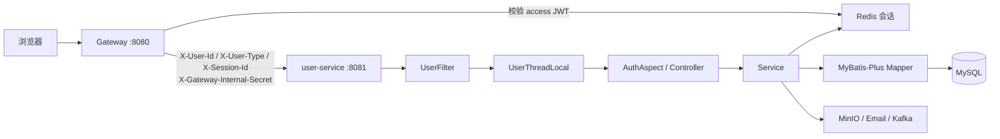
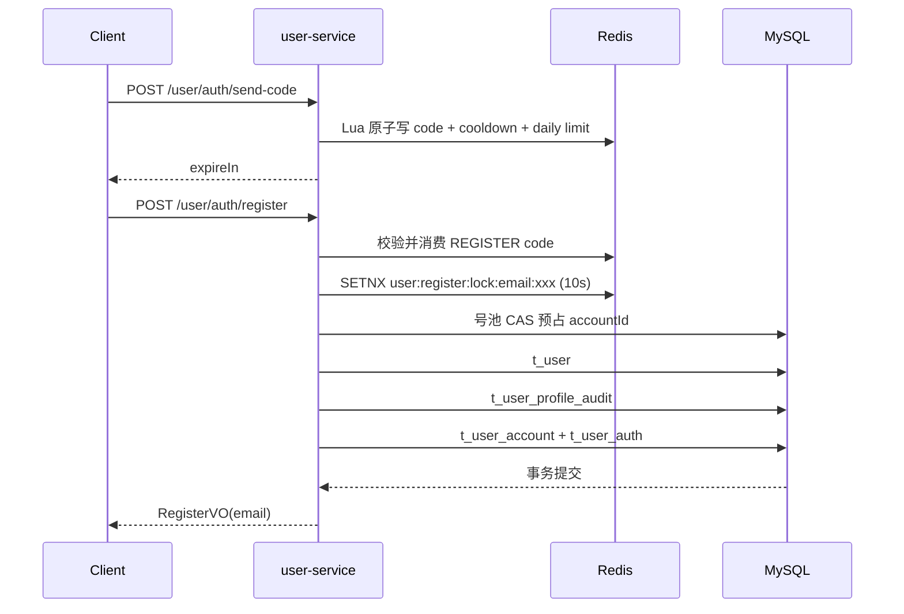
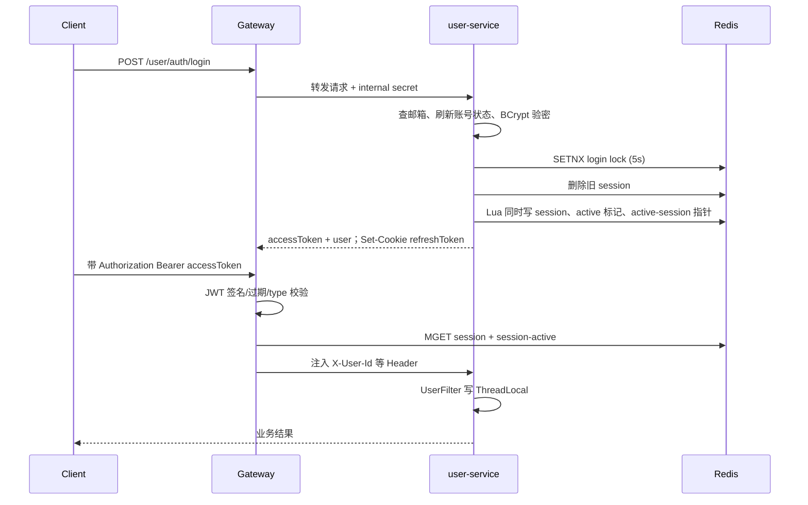
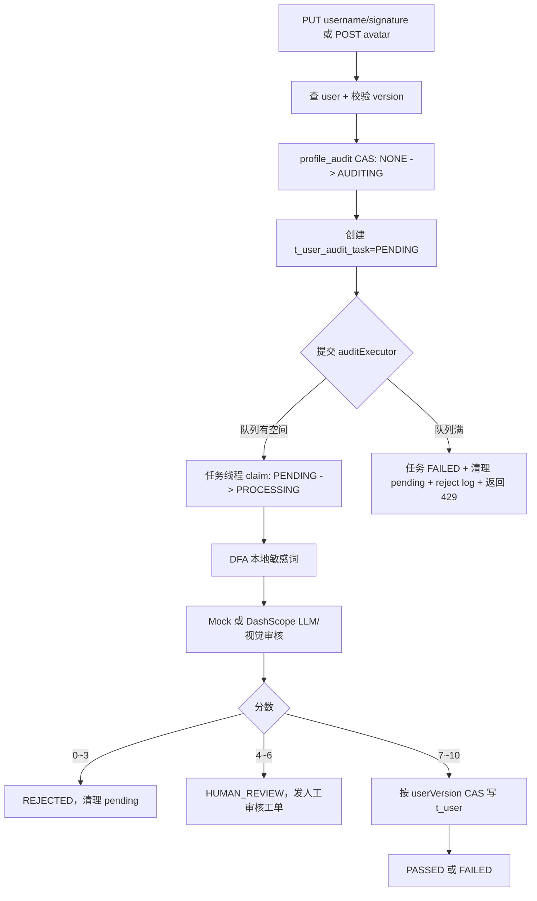

# user-service 交接手册

> 面向只会 Java 基础语法、Spring 基础用法和中间件常规操作的接手人。
>
> 本文按 **当前代码** 整理，代码和 SQL 优先级高于旧 PRD。旧文档中的手机号、`/user/register/phone`、账号 ID 登录、MD5 密码等方案已经废弃，当前实现是：**邮箱注册/登录、BCrypt、accountId 号池、双 Token、Redis 会话、字段级异步审核**。

## 0. 先记住 8 件事

1. 用户对外使用 `accountId`；数据库内部关联使用 `userId = t_user.id`。公开接口不能把 `userId` 返回给前端。
2. `t_user` 只放已生效的资料；`t_user_account` 放封禁、注销、管理员等账号生命周期；`t_user_auth` 只放密码和登录安全数据。
3. 登录返回 JSON 中的 `accessToken`，有效期 30 分钟；`refreshToken` 不返回 JSON，而是写入 HttpOnly Cookie，有效期 7 天。
4. JWT 由 Gateway 校验，user-service 不解析 access JWT；user-service 通过 Gateway 写入的 Header 恢复当前用户上下文。
5. user-service 每个请求都必须带 `X-Gateway-Internal-Secret`。经过 Gateway 时由 Gateway 自动加；Feign 直连时由共享 Feign 拦截器自动加。
6. 昵称、签名、头像不是直接写入 `t_user`，先写 `t_user_profile_audit` 的 pending 字段和 `t_user_audit_task`，审核通过后才 CAS 写回正式资料。
7. 账号状态不是简单的 0/1：`NORMAL -> BANNED / CANCELLING -> CANCELLED`，过期封禁和冷静期注销由访问时被动刷新。
8. 看到 `@Transactional`、`@Version`、Redis `setIfAbsent`、SQL `WHERE version = ?` 时，要想到它们分别在保护“跨表原子性、数据库乐观锁、分布式并发、CAS 更新”。

## 1. 服务位置和调用拓扑

### 1.1 入口

| 项目 | 当前值 |
|---|---|
| Spring Boot 服务 | `service/user-service` |
| 服务名 | `user-service` |
| 本地端口 | `8081` |
| Gateway 访问 | `http://localhost:8080/user/**` |
| 服务直连 | `http://localhost:8081/user/**`，仍需内部密钥 Header |
| MySQL 默认 | `localhost:3307/game_community` |
| Redis 默认 | `localhost:6380`，database 0 |
| Nacos 默认 | `localhost:8848` |
| Kafka 默认 | `localhost:9093` |
| MinIO 默认 | `http://localhost:9000` |

### 1.2 请求链路



### 1.3 代码分层

```text
service/user-service/src/main/java/com/game/community/user
├── controller/       浏览器 HTTP 接口
├── feign/            微服务内部接口，路径 /feign/user/**
├── service/          业务接口
├── service/impl/     业务实现
├── mapper/           MyBatis-Plus Mapper
├── filter/           校验内部调用密钥、恢复 ThreadLocal
├── aspect/           @LoginCheck / @AdminCheck
├── common/support/   当前用户、认证查询、操作日志
├── common/session/   JWT + Redis 会话
├── common/verification/ 邮箱验证码
├── audit/            字段审核状态、任务、CAS 回写
├── event/            Kafka 事件和异步任务入口
├── config/           线程池、MyBatis-Plus、RestTemplate
└── runner/           周期恢复未完成审核任务，支持多实例接管
```

## 2. 通用响应、状态和认证

### 2.1 响应结构

普通接口统一返回：

```json
{
  "code": 200,
  "message": "操作成功",
  "data": {}
}
```

分页接口额外包含 `page`、`size`、`total`：

```json
{
  "code": 200,
  "message": "查询成功",
  "data": [],
  "page": 1,
  "size": 10,
  "total": 0,
  "expanding": false
}
```

参数校验失败通常是 `400`；未登录是 `401` 或业务码 `40101`；refresh 失效是业务码 `40102`；无权限是 `403`；系统异常是 `500`。具体转换在 `common/.../GlobalExceptionHandler.java`。

### 2.2 状态字典

| 枚举 | 值 | 含义 |
|---|---:|---|
| `AccountType.NORMAL` | 0 | 普通用户 |
| `AccountType.ADMIN` | 1 | 管理员 |
| `UserAccountStatus.NORMAL` | 0 | 正常 |
| `UserAccountStatus.BANNED` | 1 | 封禁 |
| `UserAccountStatus.CANCELLING` | 2 | 注销冷静期 |
| `UserAccountStatus.CANCELLED` | 3 | 已注销 |
| `FieldAuditStatus.NONE` | 0 | 无审核任务 |
| `FieldAuditStatus.AUDITING` | 1 | 审核中 |
| `FieldAuditStatus.HUMAN_REVIEW` | 2 | 人工复核 |
| `AuditTaskStatus` | `PENDING` | 已建任务，待执行 |
|  | `PROCESSING` | 已被线程领取 |
|  | `PASSED` | 通过并已回写 |
|  | `REJECTED` | 拒绝并已清理 pending |
|  | `HUMAN_REVIEW` | 进入人工审核 |
|  | `FAILED` | 系统异常或 CAS 回写失败 |

### 2.3 Token 和 Cookie

| 项目 | Access Token | Refresh Token |
|---|---|---|
| 类型 | JWT | JWT |
| 放置 | JSON `data.accessToken` | HttpOnly Cookie `game_community_refresh_token` |
| 有效期 | 30 分钟 | 7 天 |
| secret | `JWT_ACCESS_SECRET` | `JWT_REFRESH_SECRET` |
| claims | `accountId`、`type`、`steamAccount`、`sessionId`、`tokenType=access` | `sessionId`、`tokenType=refresh` |
| 校验位置 | Gateway + Redis | user-service + Redis |

Refresh 每次使用都会轮换。Redis 只保存 refresh 的摘要，不保存明文。摘要是：`SHA-256(refreshToken + JWT_REFRESH_SECRET)`。

## 3. 对外 HTTP 接口

下面的“返回 data”是 `Result.data` 内容，不再重复写外层 `code/message`。

### 3.1 认证接口 `/user/auth`

这些路径在 Gateway 的认证白名单中，不要求已有 access JWT；但仍需经过 Gateway 或携带内部密钥。

| 方法和路径 | 入参 | 成功返回 data | 关键行为 |
|---|---|---|---|
| `POST /user/auth/send-code` | JSON `{email, bizType?}`；`bizType=REGISTER/RESET_PASSWORD` | `{expireIn}` | 发邮箱验证码。默认 `REGISTER`；发送前检查邮箱是否已注册/未注册 |
| `POST /user/auth/register` | JSON `{email,password,code}` | `{email}` | 验码、抢注册锁、分配 accountId、写 4 张用户相关表；不登录 |
| `POST /user/auth/login` | JSON `{email,password}` | `{accessToken,accessExpiresIn,user}` | 验密、清理旧会话、写新会话；refresh 写 Cookie |
| `POST /user/auth/refresh` | 无 body；Cookie 中带 refresh | `{accessToken,accessExpiresIn}` | 校验 refresh、会话、active-session、摘要；轮换双 Token |
| `POST /user/auth/logout` | 无 body；可带 access 或 refresh Cookie | `null` | access 过期时也会尝试用 refresh 找回 session 并下线；清 Cookie |
| `POST /user/auth/reset-password` | JSON `{email,password,code}` | `null` | 验证码找回密码；BCrypt 更新；所有会话失效 |

`bizType` 的枚举还有 `CHANGE_EMAIL_OLD`、`CHANGE_EMAIL_NEW`、`CANCEL_ACCOUNT`，但不能通过公开 `send-code` 随便发送：改邮箱和注销分别走后面的登录态接口。

注册、登录、找回密码、修改密码的密码规则都是 6~10 位，只允许数字、字母和常见特殊字符。当前注册 DTO 没有 `username`，昵称由邮箱 `@` 前面的部分生成，例如 `alice@example.com -> alice`。

登录返回示例：

```json
{
  "accessToken": "eyJ...",
  "accessExpiresIn": 1800,
  "user": {
    "accountId": 10000,
    "username": "alice",
    "avatar": "",
    "email": "alice@example.com"
  }
}
```

### 3.2 当前用户资料 `/user`

以下接口除标注外都需要 `@LoginCheck`。

| 方法和路径 | 入参 | 成功返回 data |
|---|---|---|
| `GET /user/me` | 无；用户来自 ThreadLocal | `UserMeVO` |
| `PUT /user/username` | JSON `{version,username}` | `{taskId,field:"USERNAME",auditStatus:1,pendingValue}` |
| `PUT /user/signature` | JSON `{version,signature}` | `{taskId,field:"SIGNATURE",auditStatus:1,pendingValue}` |
| `POST /user/avatar` | multipart：`avatar` 文件、`version` 参数 | `{taskId,field:"AVATAR",auditStatus:1,pendingValue:预览URL}` |
| `PUT /user/info` | JSON `{version,steamAccount?}` | `null` |
| `PUT /user/password` | JSON `{oldPassword,newPassword,confirmPassword}` | `null`；清 Cookie、全部下线 |
| `POST /user/email/send-old-code` | 无 body | `{expireIn}` |
| `POST /user/email/prepare` | JSON `{oldCode,newEmail}` | `{expireIn}` |
| `PUT /user/email` | JSON `{oldCode,newEmail,newCode}` | `{email}`；清 Cookie、全部下线 |

`UserMeVO` 主要字段：`accountId`、`version`、`username`、`avatar`、`signature`、`email`、`steamAccount`、`status`、`type`、三个 pending 值、三个审核状态/错误消息、`banUntil`、`banReason`。前端修改资料时必须把上一次 `/user/me` 返回的 `version` 带回来。

昵称有效字符数为 2~20，签名有效字符数最多 50；空格和换行不计数。头像只接受 `jpg/png/webp`，业务代码上限 5 MB，待审核文件进入 MinIO 私有桶。

### 3.3 账号生命周期 `/user`

| 方法和路径 | 权限 | 入参 | 成功返回 |
|---|---|---|---|
| `POST /user/cancel/send-code` | 登录 | 无 | `{expireIn}` |
| `POST /user/cancel` | 登录 | JSON `{code}` | `null`；进入 7 天冷静期并全部下线 |
| `POST /user/cancel/revoke` | 登录 | 无 | `null`；冷静期内撤销注销 |
| `POST /user/account/{accountId}/ban` | 管理员 | JSON `{reason,durationHours?}` | `null`；`null/0` 为永久 |
| `POST /user/account/{accountId}/unban` | 管理员 | 无 | `null` |

注销不是立即删除：先改 `t_user_account.status=CANCELLING`，写 `cancel_at=当前时间+7天`，并使 session 失效。冷静期内登录会自动撤销注销；超过时间后，用户访问时被动完成注销，`t_user` 逻辑删除并将邮箱改成 `cancelled_{userId}@invalid.local`。

### 3.4 用户查询 `/user`

| 方法和路径 | 权限 | 入参 | 返回 |
|---|---|---|---|
| `GET /user/{accountId}` | 登录 | 路径 accountId | `UserPublicVO`：accountId、昵称、头像、签名、Steam、关注/粉丝数 |
| `GET /user/simple/{accountId}` | 登录 | 路径 accountId | `UserCardVO`：accountId、昵称、头像、签名 |
| `GET /user/ids?ids=10000&ids=10001` | 游客可读 | accountId 列表，最多 100 个 | `UserCardVO[]`；顺序按数据库结果，不保证与入参相同 |
| `GET /user/simple/search?keyword=ali&page=1&size=10` | 登录 | keyword；page 默认 1；size 默认 10，最大 20 | `PageResult<UserCardVO>` |

搜索规则：纯数字先按 `accountId` 精确查询，未命中再按 `username` 前缀；非数字直接按昵称前缀。空关键字返回空页，不扫全表。

### 3.5 装扮接口 `/user/cosmetic`

| 方法和路径 | 权限 | 入参 | 返回 |
|---|---|---|---|
| `GET /user/cosmetic/backpack/page` | 登录 | `page`、`size`、可选 `effectMode`/`category`/`equipped`/`state`/`keyword` | `PageResult<UserCosmeticVO>` |
| `GET /user/cosmetic/decoration/{accountId}` | Gateway 登录态 | accountId | `UserDecorationVO` |
| `POST /user/cosmetic/decorations/batch` | 游客可读 | `{accountIds:[...]}`，对外是 accountId | `Map<accountId,UserDecorationVO>` |
| `PUT /user/cosmetic/equip` | 登录 | `{slot,code}` | `null` |
| `PUT /user/cosmetic/unequip` | 登录 | `{slot}` | `null` |
| `POST /user/cosmetic/use` | 登录 | `{code}` | `null` |
| `GET /user/cosmetic/admin/def/page` | 管理员 | query `page,size,category?,status?` | `PageResult<CosmeticDefVO>` |
| `POST /user/cosmetic/admin/def` | 管理员 | `SaveCosmeticDefDTO` | `CosmeticDefVO` |

`CosmeticDefVO` 字段为 `id/code/name/category/effectMode/slot/previewUrl/assetJson/consumableConfig/defaultDurationSeconds/status`。`effectMode=EQUIP` 必须有槽位；当前槽位包括 `AVATAR_FRAME`、`COMMENT_CARD`、`COMMENT_FONT`、`POST_CARD`、`PROFILE_BG`。

`UserCosmeticVO` 是背包物品：`cosmeticCode/name/category/effectMode/slot/previewUrl/assetJson/quantity/equipped/canUse/acquiredAt/expireAt`。`UserDecorationVO` 返回五个已装备物品和 `activeEffects`。

### 3.6 内部 Feign 接口 `/feign/user`

这些接口不走用户登录切面，信任边界是 `X-Gateway-Internal-Secret`。外部服务应优先使用 `feign/UserFeignClient.java`，不要自己拼 URL。

| 方法和路径 | 入参含义 | 返回/作用 |
|---|---|---|
| `GET /feign/user/ids?ids=` | **内部 userId** 列表，最多 100 | `UserCardInternalVO[]`，含 userId |
| `GET /feign/user/account-ids?ids=` | accountId 列表，最多 100 | `UserCardVO[]` |
| `GET /feign/user/by-account/{accountId}` | 对外 accountId | 含 userId 的内部名片 |
| `GET /feign/user/{userId}/account` | 内部 userId | `UserAccountVO`：状态、类型、封禁信息 |
| `POST /feign/user/account/{accountId}/ban` | query `reason,durationHours?` | 封禁 |
| `POST /feign/user/account/{accountId}/unban` | 无 | 解封 |
| `POST /feign/user/audit-tasks/{taskId}/approve` | taskId | 人工审核通过 |
| `POST /feign/user/audit-tasks/{taskId}/reject` | query `reason?` | 人工审核拒绝 |
| `GET /feign/user/audit-tasks/{taskId}` | taskId | `UserAuditTaskBriefVO` |
| `POST /feign/user/cosmetic/grant` | `userId,cosmeticCode,quantity,orderNo,sourceType` | 发放结果；orderNo 幂等 |
| `GET /feign/user/cosmetic/purchase-check` | query `userId,cosmeticCode` | `canBuy/reason/nextBuyAt` |
| `GET /feign/user/cosmetic/state` | query `userId,cosmeticCode` | `owned/equipped` |
| `POST /feign/user/cosmetic/decorations/batch` | `{accountIds:[...]}` | 装扮批量查询 |
| `POST /feign/user/{userId}/steam-account` | query `steamAccount` | 更新 Steam 展示字段 |

### 3.7 字段返回安全边界

- 公开 `UserCardVO`、`UserPublicVO` 不返回 `userId`、密码、认证信息、账号内部状态。
- 内部 `UserCardInternalVO` 才允许含 `userId`。
- `UserMeVO` 给本人看邮箱、封禁原因、审核 pending；不要把它当作公开用户 VO 使用。
- `LoginVO.refreshToken` 标了 `@JsonIgnore`，只能由 Controller 写 Cookie。

## 4. 关键业务数据流

### 4.1 注册



注册使用一个 MySQL 事务。邮箱唯一索引是最终兜底；号池先把 `status=0` 改成 `1`，注册事务回滚时会一起回滚。Redis 的验证码已经消费，数据库失败后需要重新发码。

### 4.2 登录和 Gateway 鉴权



Gateway 校验的是 access JWT 和 Redis session 的活跃标志；user-service 的 `UserFilter` 不重新校验 JWT，只信任带正确 internal secret 的 Gateway/Feign 调用。

### 4.3 刷新 Token

1. Controller 从 Cookie 取 refresh。
2. Service 用 refresh secret 解析 JWT，确认 `tokenType=refresh` 和 `sessionId`。
3. 以 sessionId 抢 5 秒 Redis 锁。
4. MGET 会话正文和 `user:session-active:{sessionId}`。
5. 比较 `SHA-256(当前 refresh + refresh secret)` 与 Redis 中的摘要。
6. 重新生成 refresh/access，更新 Redis 会话摘要和时间。
7. Controller 把新 refresh 写回 Cookie。

旧 refresh 再次使用会因摘要不一致失败；**当前代码在摘要不匹配时只返回 refresh 失效，没有在该分支显式销毁整个 session**。如果后续要增强为“检测到重放即销毁会话”，需要补充 `invalidateSession`，并配合 refresh 锁避免误伤新请求。

### 4.4 资料审核



审核任务 payload 里保存 `userVersion`。审核通过时要求 `t_user.version` 仍等于提交时的版本；用户在审核期间修改了资料，CAS 失败，旧审核结果不会覆盖新资料。

头像另外经过：私有桶上传 -> presigned 预览 -> 审核 -> 私有对象复制到公共桶 -> CAS 写公开 URL -> 删除私有对象和旧公共头像。

### 4.5 账号状态机

```text
NORMAL --管理员封禁--> BANNED --banUntil 到期--> NORMAL
NORMAL --申请注销--> CANCELLING --7天到期--> CANCELLED
CANCELLING --冷静期登录--> NORMAL
```

状态没有定时扫描器。登录、`/user/me`、资料修改、Feign 查状态时会调用 `refreshStatus`，发现到期后立即 CAS 回写。这叫“被动刷新”。

## 5. MySQL 表设计

### 5.1 用户核心表

| 表 | 主要字段 | 职责 |
|---|---|---|
| `t_user` | `id,account_id,username,avatar,signature,email,steam_account,version,deleted` | 已生效资料；`account_id` 对外唯一；`email+deleted` 唯一 |
| `t_user_account` | `user_id,status,type,ban_until,ban_reason,cancel_at,register_source,last_login_* ,version` | 账号状态、管理员类型、封禁/注销、登录记录 |
| `t_user_auth` | `user_id,password,salt,fail_count,lock_until,last_password_change,version` | BCrypt 密码、登录失败锁定 |
| `t_user_profile_audit` | 三个 `*_audit_status`、三个 `pending_*`、`version` | 每个用户一行；保存审核占用和待审内容 |
| `t_account_id_pool` | `account_id,digit_count,status,user_id` | 预生成对外账号号段，注册 CAS 占用 |

### 5.2 审核和审计表

| 表 | 作用 |
|---|---|
| `t_user_audit_task` | 记录 USERNAME/SIGNATURE/AVATAR 的审核任务、状态、payload、分数、错误 |
| `t_user_audit_reject_log` | 审核线程池满时记录请求快照和线程池状态 |
| `t_user_operation_log` | LOGIN、LOGOUT、BAN、UNBAN、CANCEL、密码重置等操作日志 |
| `t_user_notification_outbox` | Kafka 通知最终投递失败记录，供排查和人工补偿 |

### 5.3 装扮表

| 表 | 作用 | 关键约束/索引 |
|---|---|---|
| `t_cosmetic_def` | 装扮目录和资源 JSON | `uk_cosmetic_code(code)`、`(category,status)` |
| `t_user_cosmetic` | 用户背包 | `uk_user_cosmetic(user_id,cosmetic_code)`；消耗品数量可堆叠 |
| `t_user_cosmetic_loadout` | 每个用户当前装备槽位 | `user_id` 主键；五个槽位字段；`version` 乐观锁 |
| `t_user_cosmetic_use_log` | 消耗品使用记录 | `(user_id,use_time)` |
| `t_user_active_effect` | 临时效果 | `(user_id,start_at,expire_at)` |
| `t_cosmetic_grant_record` | 商城发放幂等 | `uk_grant_order(order_no)` |

### 5.4 表设计为什么这样拆

- **资料和账号状态分离**：公开资料查询不必把封禁、登录失败等安全字段混在一起；状态变化也不会污染资料版本。
- **密码单独表**：普通资料查询永远不需要触碰密码；即使误日志/误返回 User，也不应包含认证字段。
- **逻辑删除**：MyBatis-Plus 自动给 `deleted=0`；注销完成后资料记录保留，便于审计，但邮箱被改成不可用地址。
- **对外 accountId 号池**：避免把自增 `userId` 直接暴露给前端；号池 CAS 可支撑多实例注册。
- **审核 pending 不写正式表**：审核期间前端能看到 pending，但其他业务仍使用旧的已通过资料。
- **联合/覆盖索引**：注册查邮箱、accountId 查用户、昵称前缀搜索、审核任务按用户/类型/状态查找，都有对应索引。

初始化和迁移顺序看 `scripts/db/migrations.order`：`user.sql -> user-service-v2-migration.sql -> user-notification-outbox-migration.sql -> cosmetic.sql -> cosmetic-performance.sql -> user-audit-reject-log.sql`。

## 6. Redis Key 和原子操作

| Key | 值 | TTL/用途 |
|---|---|---|
| `email:code:{bizType}:{email}` | 6 位验证码 | 默认 300 秒 |
| `email:cooldown:{bizType}:{email}` | `1` | 60 秒发码冷却 |
| `email:daily:{bizType}:{email}` | 发送次数 | 到当天午夜 |
| `email:verify:fail:{email}` | 错误次数 | 1800 秒 |
| `email:verify:lock:{email}` | `1` | 错 5 次锁 30 分钟 |
| `user:register:lock:email:{email}` | `1` | 注册并发锁 10 秒 |
| `user:login:lock:{userId}` | 随机 token | 登录锁 5 秒 |
| `user:refresh:lock:{sessionId}` | 随机 token | 刷新锁 5 秒 |
| `user:session:{sessionId}` | `UserSessionVO JSON` | 7 天 |
| `user:session-active:{sessionId}` | `1` | 7 天；鉴权热路径标记 |
| `user:active-session:{userId}` | 当前 sessionId | 7 天；单设备指针 |
| `user:cosmetic:def:{code}` | `CosmeticDef JSON` | 600 秒 |

验证码发送用 Lua 把“查冷却、查每日次数、写验证码、写冷却、计数、清错误次数”放在一次 Redis 脚本中，避免多实例并发时超发。会话保存也用 Lua 一次写三个 key。

分布式锁必须用随机 token 解锁：`RedisUtils.unlock` 的 Lua 脚本只有发现 key 的 value 等于当前 token 才删除，避免锁过期后旧线程误删新线程的锁。

## 7. Spring 和中间件为什么这样用

### 7.1 启动类

`UserServiceApplication` 上有：

- `@SpringBootApplication(scanBasePackages="com.game.community")`：启动 Spring Boot、自动配置、扫描 Controller/Service/Component。扫描范围覆盖共享 `common/model/utils`，所以共享工具能被注入。
- `@MapperScan("com.game.community.user.mapper")`：MyBatis 为每个 Mapper 接口生成代理对象，Service 只依赖接口，不手写 JDBC。
- `@EnableFeignClients`：注册共享 Feign Client，其他服务调用 user-service 时可以像调用 Java 方法一样发 HTTP。

### 7.2 Controller、Service、Mapper

- `@RestController`：返回对象自动序列化成 JSON。
- `@RequestBody`：JSON 反序列化到 DTO；`@Valid` 触发 DTO 注解校验。
- `@Service`：业务类交给 Spring 管理；配合构造器注入，便于测试和替换依赖。
- `@Transactional`：通过 Spring AOP 开启 MySQL 事务。方法正常返回提交，抛出异常回滚；`rollbackFor=Exception.class` 让受检异常也回滚。
- `BaseMapper<T>`：提供 `selectById/insert/updateById/selectPage` 等通用 CRUD；复杂 CAS 用 `LambdaUpdateWrapper` 明确写 `WHERE` 条件。

### 7.3 权限切面和 Filter

`UserFilter` 是 Servlet Filter，生命周期早于 Controller：

1. 比对 `X-Gateway-Internal-Secret`。
2. 读取 `X-User-Id/X-User-Type/X-Steam-Account/X-Session-Id`。
3. 写入 `UserThreadLocal`。
4. `finally` 中 `removeUser()`，防止 Tomcat 线程复用导致串用户。

`AuthAspect` 用 `@Around("@annotation(...)")` 拦截 `@LoginCheck` 和 `@AdminCheck`。切面先检查 ThreadLocal，再决定是否执行 Controller。这样每个 Controller 不用重复写“从 Header 取用户、判断管理员”。

### 7.4 MyBatis-Plus 配置

`MybatisPlusConfig` 注册：

- `OptimisticLockerInnerInterceptor`：支持 `@Version` 实体的 `updateById` 乐观锁。
- `PaginationInnerInterceptor(DbType.MYSQL)`：把 `Page` 查询转成分页 SQL，并自动执行 count。
- `logic-delete-field=deleted`：普通查询自动过滤逻辑删除记录。
- `map-underscore-to-camel-case=true`：`account_id` 自动映射到 `accountId`。

注意：本项目很多关键写入不是依赖 `updateById`，而是显式 `.eq(version).set(version, old+1)`，这是为了清楚控制 CAS 条件。

### 7.5 有界线程池

审核和邮件都使用 `ThreadPoolTaskExecutor`，队列有上限并配置 `AbortPolicy`。不使用无界队列的原因是：外部 AI/SMTP 变慢时，请求不能无限堆积到内存。队列满时审核会回滚 pending 并返回 429；邮件队列满时返回“邮件发送繁忙”。

审核和邮件分别通过 `event/executor/AuditTaskExecutor`、`event/executor/EmailTaskExecutor` 提交并执行任务；业务类只负责调用任务类入口，审核队列满时仍写拒绝日志。

### 7.6 Nacos、Kafka、MinIO、Sentinel

- Nacos discovery：让 Gateway/Feign 按服务名发现 user-service，不固定写 IP。
- Nacos config：`bootstrap.yml` 中默认 `NACOS_CONFIG_ENABLED=false`，本地主要读 `application.yml`；生产可打开远程配置。
- Kafka：生产者配置 `acks=all`、幂等开启、重试 5 次；资料审核通知直接发送 Kafka，超过 Kafka 重试次数后写入失败记录表。
- MinIO：私有桶放待审头像，公共桶放审核通过头像；私有对象用 presigned URL，避免直接公开。
- Sentinel：当前主要在 Gateway 按 user-service 路由做 QPS/降级控制，不要误以为 user-service Controller 自动拥有限流注解。

## 8. 并发、一致性和高并发设计

### 8.1 已实现的保护

| 场景 | 保护手段 | 原理 |
|---|---|---|
| 重复注册 | Redis 10 秒 SETNX + 邮箱唯一索引 | 快速挡重复请求，数据库最终裁决 |
| 号池竞争 | `UPDATE ... WHERE account_id=? AND status=0` | 只有一个事务能把 0 改为 1 |
| 并发登录 | 用户级 Redis 锁 | 同一用户短时间只允许一个登录收尾，旧 session 被踢 |
| refresh 并发 | sessionId 锁 + refresh 摘要轮换 | 两次同时刷新不会同时复用同一旧 refresh |
| 资料并发修改 | `version` 乐观锁 | 版本不匹配直接冲突，不能静默覆盖 |
| 审核重复提交 | `profile_audit` 字段 CAS | `NONE -> AUDITING` 只有一个请求成功 |
| 审核结果覆盖新资料 | payload 保存 userVersion，审核通过再次 CAS | 旧任务只能更新旧版本，失败就不回写 |
| 审核任务重复执行 | `PENDING -> PROCESSING` 原子领取 | 多线程/重启恢复时只有一个领取者成功 |
| 审核线程池满 | 有界队列 + AbortPolicy + reject log | 背压，不让内存无限增长 |
| 验证码超发 | Lua 脚本 | 把多步检查和写入变成一个原子操作 |
| 消耗品超扣 | `quantity + delta >= 0` 的原子 UPDATE | 影响行数为 0 就说明库存不足 |
| 商城重复发放 | `order_no` 唯一索引 + 先查后插 | 同一订单重复调用返回已有发放结果 |
| 通知投递失败 | Kafka Producer retries + 失败记录表 | Kafka 自己处理短暂失败；重试耗尽后记录事件和错误，供排查/人工补偿 |

### 8.2 本次并发风险修复记录

以下 9 项已在当前代码中处理，接手时仍要理解其边界：

1. **refresh/logout**：作废操作与 refresh 共用 `user:refresh:lock:{sessionId}`；refresh 持锁期间登出会返回“处理中”，不会删除后又被 `saveSession` 复活。
2. **session 删除**：Redis Lua 一次删除 session 正文、active 标记，并仅在用户指针仍指向当前 session 时删除指针，避免误删并发登录的新会话。
3. **管理员降权**：Gateway 同时校验 JWT type 与 Redis session type，并以 session type 写入 `X-User-Type`；旧 access 不再绕过降权。
4. **`PUT /user/info`**：Steam 更新使用 `WHERE id=? AND version=?`，成功后 `version=version+1`，影响行数为 0 时返回冲突。
5. **loadout**：增加 `version` 和迁移；装备/卸载走 MyBatis-Plus 乐观锁，首次创建使用 `INSERT IGNORE`，并发写入失败返回冲突。
6. **背包发放**：使用 `INSERT ... ON DUPLICATE KEY UPDATE`；消费品数量原子累加，装备类重复发放不增加数量。
7. **通知失败记录**：Kafka Producer 重试耗尽后才写入 `t_user_notification_outbox`，该表不再由 user-service 扫描或重试；notification-service 通过 `(user_id,event_id)` 唯一键和 `INSERT IGNORE` 消费幂等。
8. **审核恢复**：各实例按自增主键分批读取，每批最多 `AUDIT_RECOVERY_BATCH_SIZE=100` 条；先用数据库 CAS 抢占为 `PROCESSING` 再入本地有界线程池，避免多实例重复执行，并可接管故障实例遗留任务。
9. **审核首行初始化**：`ensureProfileAuditRow` 捕获并发插入的 `DuplicateKeyException`，随后继续执行数据库 CAS。
10. **对外接口的业务校验不是数据库外键**：当前 SQL 主要使用逻辑关联，没有把所有 `user_id` 都做物理 FK。删除、数据修复、脚本导入时必须自己检查孤儿数据。

### 8.3 高并发时的容量边界

- Gateway 当前 user-service 路由 QPS 默认是 50，先看 Gateway Sentinel 规则，不要只盯着 user-service Tomcat 线程数。
- 批量用户和批量装扮最多 100 个，搜索单页最多 20 个，避免一个请求生成超大 SQL/响应。
- 审核线程池默认 core=2、max=4、queue=200；邮件 core=2、max=4、queue=100。这是保护外部 AI/SMTP 和 JVM 内存的背压阈值。
- Redis 鉴权热路径使用 MGET，装扮定义使用 multiGet；新增循环查询时优先检查是否会产生 N+1。
- 用户名搜索使用 `likeRight`，前缀搜索可利用 `idx_username`；不要改成前缀 `%keyword%` 而不做搜索引擎方案。
- 密码 BCrypt cost=10，登录量暴增时 CPU 会成为瓶颈；不要为了“性能”改回 MD5，应通过限流、缓存不存在用户策略和容量扩展解决。

## 9. 配置清单

### 9.1 必须配置的安全项

| 环境变量 | 用途 | 生产要求 |
|---|---|---|
| `GATEWAY_INTERNAL_SECRET` | Gateway/Feign 到服务的内部调用凭证 | 与 Gateway 相同，随机长字符串 |
| `JWT_ACCESS_SECRET` | access JWT 签名 | 至少 32 字符随机串，Gateway 和 user-service 相同 |
| `JWT_REFRESH_SECRET` | refresh JWT 签名和摘要 | 至少 32 字符随机串，Gateway 和 user-service 相同 |
| `MYSQL_PASSWORD` | MySQL | 禁止使用仓库默认值 |
| `REDIS_HOST/REDIS_PORT` | Redis | 指向生产 Redis |
| `NACOS_ADDR` | Nacos | 指向生产 Nacos |
| `SMTP_HOST/PORT/USERNAME/PASSWORD/FROM` | 真实邮件 | `EMAIL_FORCE_REAL=true` |
| `MINIO_ACCESS_KEY/MINIO_SECRET_KEY` | 对象存储 | 使用最小权限账号 |

### 9.2 user-service `application.yml` 重点

| 配置前缀 | 当前默认 | 说明 |
|---|---|---|
| `server.port` | 8081 | 服务端口 |
| `spring.servlet.multipart.*` | 5MB/6MB | Spring multipart 总体限制；头像业务另有 5MB检查 |
| `spring.datasource.*` | MySQL 3307 | 连接数据库 |
| `spring.data.redis.*` | Redis 6380 | 会话、验证码、锁、缓存 |
| `spring.cloud.nacos.*` | 8848 | 注册发现和可选配置中心 |
| `spring.kafka.*` | 9093 | 审核人工工单/通知相关消息 |
| `minio.*` | 双桶、presigned 900 秒 | 头像上传和审核 |
| `audit.mode` | `mock` | `mock` 或 `llm` |
| `audit.async.*` | 2/4/200 | 审核线程池 |
| `audit.dashscope.*` | qwen-plus/qwen3-vl-plus | LLM/视觉审核 |
| `email.code.expire-seconds` | 300 | Redis TTL 和邮件文案共用 |
| `email.mock.*` | 关闭 | 本地可指定邮箱使用固定验证码 |
| `email.async.*` | 2/4/100 | SMTP 线程池 |
| `auth.cookie.secure` | false | HTTPS 生产必须 true |
| `mybatis-plus.*` | 逻辑删除、驼峰、分页 | ORM 行为 |

`auth.seed.*` 虽然存在于 YAML，但当前 user-service 源码没有找到对应的 seed runner，不能把它当成“启动自动创建测试账号”的保证；需要测试账号时请查数据库脚本和测试工具。

## 10. 关键代码小抄

### 10.1 Redis 锁为什么要带 token

```java
String lockKey = RedisConstants.LOGIN_LOCK_PREFIX + user.getId();
String lockToken = UUID.randomUUID().toString();
if (Boolean.FALSE.equals(redisUtils.setIfAbsent(lockKey, lockToken, 5))) {
    throw new BusinessException("登录处理中，请稍后重试");
}
try {
    // 只有拿到锁的人执行登录收尾
} finally {
    redisUtils.unlock(lockKey, lockToken);
}
```

不要直接 `DEL lockKey`。线程 A 的锁超时后，线程 B 可能拿到新锁；此时 A 再 DEL 会误删 B 的锁。`unlock` 用 Lua 比较 token 后再删。

### 10.2 资料审核 CAS

```java
int rows = userMapper.update(null, new LambdaUpdateWrapper<User>()
        .eq(User::getId, userId)
        .eq(User::getVersion, expectedUserVersion)
        .set(User::getUsername, username)
        .set(User::getVersion, expectedUserVersion + 1));
if (rows == 0) {
    // 用户已经被别的更新改过，不能覆盖
    return false;
}
```

关键不是 Java 里先 `if`，而是把版本条件放进 SQL `WHERE`。因为多个实例的 Java 判断无法互相看见，数据库的单条 UPDATE 才是并发裁判。

### 10.3 消耗品防超扣

```sql
UPDATE t_user_cosmetic
SET quantity = quantity - 1
WHERE user_id = ?
  AND cosmetic_code = ?
  AND quantity - 1 >= 0;
```

用影响行数判断成功/失败，不要“先 SELECT quantity，再在 Java 里减一再 UPDATE”。后者在两个并发请求下会超扣。

### 10.4 审核任务领取

```java
return userAuditTaskMapper.update(null, new LambdaUpdateWrapper<UserAuditTask>()
        .eq(UserAuditTask::getId, taskId)
        .eq(UserAuditTask::getStatus, AuditTaskStatus.PENDING)
        .set(UserAuditTask::getStatus, AuditTaskStatus.PROCESSING)) > 0;
```

返回 1 才能继续审核；返回 0 说明已经被其他线程领取或任务状态已经变化。

### 10.5 通知失败记录

审核结果通知直接调用 `KafkaTemplate`。Kafka Producer 根据 `acks=all`、幂等和 `retries` 配置自动重试；异步发送最终失败时，仅向 `t_user_notification_outbox` 写入一条失败记录，不再由 user-service 定时扫描或二次重试。

## 11. 本地启动、测试和排障

### 11.1 常用命令

在后端仓库 `/Users/ma/IdeaProjects/game-community-platform` 执行：

```bash
# 编译并执行 user-service 及其依赖模块测试
mvn -pl service/user-service -am clean test

# 只看 user-service 文件
rg --files service/user-service

# 检查接口路径
rg -n '@(Get|Post|Put|Delete)Mapping|@RequestMapping' service/user-service/src/main/java

# 查看数据库迁移顺序
sed -n '1,120p' scripts/db/migrations.order
```

启动辅助脚本：`scripts/services/start-user-service.sh`、`scripts/run-local-user-service.ps1`。完整依赖通常由根目录 `docker-compose.yml` 提供。

### 11.2 看到 401 的排查顺序

1. 浏览器是否真的有 `Authorization: Bearer ...`。
2. access JWT 是否过期；过期应调用 `/user/auth/refresh`，请求带 Cookie。
3. Redis 是否还存在 `user:session:{sessionId}` 和 `user:session-active:{sessionId}`。
4. `user:active-session:{userId}` 是否指向当前 session。
5. Gateway 和 user-service 的 `JWT_*` 是否一致。
6. Gateway 转发是否写入 `X-Gateway-Internal-Secret`。
7. user-service 日志是否出现“非法服务调用”。

### 11.3 看到资料“提交成功但没变”的排查顺序

1. 调 `/user/me` 看 `pending*` 和字段审核状态。
2. 查 `t_user_audit_task` 的 `status/score/error_message`。
3. 查审核线程池是否满，查 `t_user_audit_reject_log`。
4. 查 `audit.mode`；`llm` 模式需要 DashScope key 和模型配置。
5. 若任务 PASSED 但正式资料没变，重点看 payload 的 `userVersion` 是否已经过期，CAS 失败会把任务标成 FAILED。
6. 头像问题再查 MinIO 私有/公共桶对象是否存在。

### 11.4 看到注册失败的排查顺序

1. 邮箱格式/MX 校验是否通过。
2. Redis 是否有 `email:code:REGISTER:{email}`，是否被冷却/每日上限限制。
3. 是否触发验证码错误锁 `email:verify:lock:{email}`。
4. 号池是否有 `status=0` 的记录；查看 `t_account_id_pool`。
5. 数据库是否有邮箱唯一键冲突。
6. 注册事务是否回滚了 `t_user/t_user_account/t_user_auth/t_user_profile_audit`。

## 12. 接手人最容易犯的错误

- 不要把 `accountId` 和 `userId` 混用；公开批量接口的 `ids` 是 accountId，Feign `/ids` 的 `ids` 是 userId。
- 不要在 Controller 直接写 JDBC、Redis 业务或调用 axios；后端按 Controller -> Service -> Mapper 分层。
- 不要把密码放回 `t_user`，不要新增 MD5 密码逻辑，当前统一 BCrypt。
- 不要把 pending 昵称/签名/头像直接写入 `t_user`；审核完成前只写 `t_user_profile_audit`。
- 不要在异步线程里依赖 `UserThreadLocal`；ThreadLocal 只在原请求线程有效，异步任务必须把 userId/taskId 放入任务数据。
- 不要在 `@Transactional` 里直接等待很慢的 AI/SMTP；当前审核是提交任务后异步执行，邮件使用有界线程池。
- 不要去掉 SQL 的 `WHERE version=?`、`status=PENDING`、`quantity+delta>=0` 等条件，它们就是并发安全的一部分。
- 不要把 Gateway 白名单扩大到资料、封禁、Feign 等接口；公开白名单只应包含认证入口和明确的游客只读路径。
- 新增接口后要同步检查 Gateway 路由/白名单、Feign Client、前端 service、DTO 校验、SQL 索引和集成测试。

## 13. 真实源码入口索引

| 主题 | 文件 |
|---|---|
| 认证 HTTP | `service/user-service/src/main/java/com/game/community/user/controller/AuthController.java` |
| 资料 HTTP | `.../controller/UserProfileController.java` |
| 账号生命周期 | `.../controller/UserAccountController.java` |
| 查询 HTTP | `.../controller/UserQueryController.java` |
| 装扮 HTTP | `.../controller/CosmeticController.java` |
| 内部接口 | `.../feign/UserFeignController.java` |
| 认证业务 | `.../service/impl/UserAuthServiceImpl.java` |
| 资料业务 | `.../service/impl/UserProfileServiceImpl.java` |
| 账号状态 | `.../service/impl/UserAccountServiceImpl.java` |
| 查询业务 | `.../service/impl/UserQueryServiceImpl.java` |
| 审核执行 | `.../service/impl/UserFieldAuditTaskServiceImpl.java` |
| 装扮业务 | `.../service/impl/CosmeticServiceImpl.java` |
| 会话/JWT | `.../common/session/UserSessionHelper.java` |
| 验证码 | `.../common/verification/VerificationCodeHelper.java` |
| 内部请求过滤 | `.../filter/UserFilter.java` |
| 权限切面 | `.../aspect/AuthAspect.java` |
| 审核 CAS | `.../audit/UserAuditHelper.java` |
| SQL 首次建表 | `sql/user.sql`、`sql/cosmetic.sql` |
| 环境配置 | `service/user-service/src/main/resources/application.yml` |
| Gateway JWT | `gateway/src/main/java/com/game/community/gateway/filter/JwtGlobalFilter.java` |

交接的第一周建议只按这个顺序读：`AuthController -> UserAuthServiceImpl -> UserSessionHelper -> UserFilter -> JwtGlobalFilter`；然后读 `UserProfileController -> UserProfileServiceImpl -> UserAuditHelper -> UserFieldAuditTaskServiceImpl`；最后再读账号状态、Feign 和装扮。这样先掌握“请求怎么进来、身份怎么恢复、数据怎么落库”，再扩展业务。
