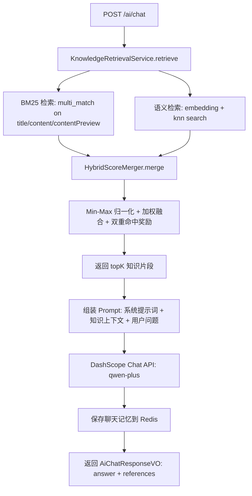
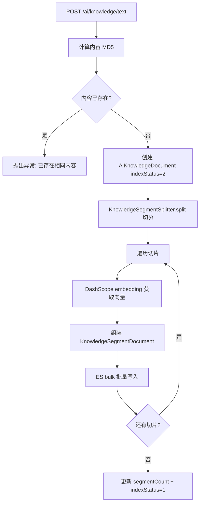
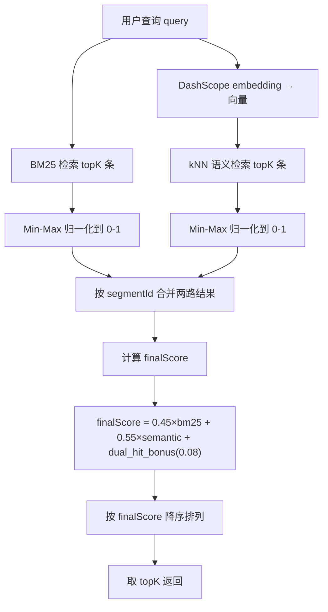
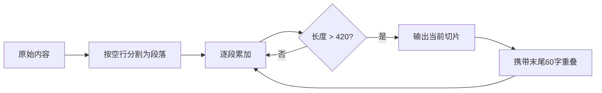

# AI 智能体服务 (ai-agent-service) 技术文档

## 1. 服务概述

AI 智能体服务是游戏社区平台的统一 AI 微服务，基于 Spring AI 与 OpenAI 兼容模型实现可扩展 Agent、文本/图片审核和 RAG 问答。模型选择、提示词、阈值及本地词库全部在本服务集中维护，业务微服务只消费内部协议。

**核心能力**：
- RAG 问答：知识检索 + LLM 生成，返回答案及引用片段
- 混合检索：BM25 全文检索 + kNN 语义向量检索 + 加权融合排序
- 知识库管理：文本录入、文件上传、禁用、删除、重建索引
- 段落感知切分：按段落边界切分，支持重叠窗口
- 向量嵌入：DashScope text-embedding-v4 模型（1024 维）
- 聊天记忆：Redis 存储会话上下文，72h TTL，最多 10 轮
- 知识索引调试：分别查看 BM25 / 语义 / 融合结果，支持统计查询
- ES 索引自动初始化（@PostConstruct）
- 统一审核：文本 AC 自动机预审 + 文本/图片模型评分 + 通过/拒绝/人工审核决策
- 多模型扩展：按 provider 配置 OpenAI 兼容模型，业务代码不绑定具体供应商；当前审核默认 DeepSeek `deepseek-flash`
- 提示词工程：系统、文本、图片与 RAG 提示词位于 `src/main/resources/prompts`

**技术栈**：Spring Boot 3.4.2 + Spring AI 1.0.3 + Elasticsearch 8 + MySQL + Redis + OpenAI Compatible API + MyBatis-Plus + Nacos + Sentinel

**服务端口**：8093

### 1.1 Spring 版本选择

- 保持 Spring Boot 3.4.2，不升级到 4.x。
- Spring AI 固定为 1.0.3，其 Spring Framework 基线为 6.2.x，与 Boot 3.4.x 同代。
- 旧 `spring-ai-alibaba 1.1.0.0-RC2` 会解析到 Spring AI 1.1.0，其自动配置构建基线为 Boot 3.5.x，已从通用 `utils` 模块移除。
- AI 依赖只存在于 `ai-agent-service`；user/content 通过 Feign 使用内部协议，不再各自创建模型 Bean。

参考：[Spring AI 1.0 Getting Started](https://docs.spring.io/spring-ai/reference/1.0/getting-started.html)、[Spring AI ChatClient](https://docs.spring.io/spring-ai/reference/1.0/api/chatclient.html)。

---

## 2. 数据模型

### 2.1 MySQL 表

#### t_ai_knowledge_document（AI 知识文档表）

| 字段 | 类型 | 说明 |
|------|------|------|
| id | BIGINT AUTO_INCREMENT | 主键 |
| title | VARCHAR(128) NOT NULL | 文档标题 |
| source_type | TINYINT NOT NULL | 来源类型（1=文本 2=文件） |
| source_name | VARCHAR(255) | 来源名称（文件名等） |
| content_hash | VARCHAR(64) NOT NULL | 内容MD5哈希（唯一，防重复） |
| status | TINYINT DEFAULT 1 | 文档状态（1=启用 0=禁用） |
| index_status | TINYINT DEFAULT 0 | 索引状态（0=待索引 1=已就绪 2=索引中 3=失败） |
| segment_count | INT DEFAULT 0 | 切分段落数 |
| created_by | BIGINT | 创建人ID |
| updated_by | BIGINT | 更新人ID |
| create_time | DATETIME DEFAULT CURRENT_TIMESTAMP | 创建时间 |
| update_time | DATETIME ON UPDATE CURRENT_TIMESTAMP | 更新时间 |

**索引**：
- `uk_ai_knowledge_content_hash (content_hash)` UNIQUE — 防止相同内容重复入库
- `idx_ai_knowledge_status (status)`
- `idx_ai_knowledge_index_status (index_status)`

### 2.2 Elasticsearch 索引

#### ai_knowledge_segment（知识切片索引）

| 字段 | 类型 | 分词器/参数 | 说明 |
|------|------|-------------|------|
| segmentId | keyword | — | 切片唯一ID（documentId-UUID） |
| documentId | long | — | 所属文档ID |
| title | text | ik_max_word / ik_smart | 文档标题 |
| content | text | ik_max_word / ik_smart | 切片正文 |
| contentPreview | text | ik_max_word / ik_smart | 预览文本（前120字+...） |
| sourceName | keyword | — | 来源名称 |
| segmentOrder | integer | — | 切片序号 |
| status | integer | — | 状态（1=启用 0=禁用） |
| createdAt | date | — | 创建时间 |
| embedding | dense_vector | dims=1024, index=true, similarity=cosine | 向量嵌入 |

**索引设置**：1 分片，0 副本

**创建代码**：

```java
elasticsearchClient.indices().create(CreateIndexRequest.of(c -> c
    .index(properties.getKnowledgeIndex())
    .settings(s -> s.numberOfShards("1").numberOfReplicas("0"))
    .mappings(m -> m
        .properties("segmentId", p -> p.keyword(k -> k))
        .properties("documentId", p -> p.long_(l -> l))
        .properties("title", p -> p.text(t -> t.analyzer("ik_max_word").searchAnalyzer("ik_smart")))
        .properties("content", p -> p.text(t -> t.analyzer("ik_max_word").searchAnalyzer("ik_smart")))
        .properties("contentPreview", p -> p.text(t -> t.analyzer("ik_max_word").searchAnalyzer("ik_smart")))
        .properties("sourceName", p -> p.keyword(k -> k))
        .properties("segmentOrder", p -> p.integer(i -> i))
        .properties("status", p -> p.integer(i -> i))
        .properties("createdAt", p -> p.date(d -> d))
        .properties("embedding", p -> p.denseVector(v -> v.dims(1024).index(true).similarity("cosine")))
    )));
```

### 2.3 Redis 数据结构

#### 聊天记忆

- **Key**：`ai:chat:memory:{sessionId}`
- **Value**：JSON 序列化的 `List<AiChatMessageVO>`
- **TTL**：72 小时
- **容量**：最多 10 轮（20 条消息：10 user + 10 assistant）

---

## 3. 功能模块详解

### 3.1 RAG 问答

**服务类**：`AiChatServiceImpl`

**系统提示词**：

```java
private static final String SYSTEM_PROMPT = """
        你是游戏社区的 AI 助手。
        回答时必须优先基于给定的知识片段，不要编造不存在的内容。
        如果知识片段不足以回答，请明确说明"当前知识库没有足够信息"。
        回答请使用简体中文，尽量简洁。
        """;
```

**问答流程**：

1. 调用 `KnowledgeRetrievalService.retrieve` 检索相关片段
2. 将检索结果格式化为上下文：

```java
String context = references.stream()
    .map(hit -> "[知识片段] 标题: " + hit.getTitle() + "\n内容: " + hit.getContentPreview())
    .collect(Collectors.joining("\n\n"));
```

3. 组装 Prompt：`"请基于以下知识片段回答用户问题。\n\n" + context + "\n\n用户问题: " + message`
4. 通过 Spring AI `AgentModelRegistry` 调用默认 DeepSeek `deepseek-flash`，传入系统提示词 + 历史消息 + 当前 Prompt
5. 保存聊天记忆（用户消息 + 助手回复）
6. 返回答案及引用片段

### 3.2 混合检索

**服务类**：`KnowledgeRetrievalServiceImpl`

**检索流程**：

1. **BM25 检索**：ES `multi_match` 搜索 `title, content, contentPreview` 字段
2. **语义检索**：调用 DashScope embedding API 获取查询向量，ES `knn` 搜索 `embedding` 字段
3. **分数融合**：`HybridScoreMerger.merge` 合并两路结果

```java
// BM25 检索
SearchResponse<KnowledgeSegmentDocument> bm25Response = elasticsearchClient.search(s -> s
    .index(properties.getKnowledgeIndex())
    .size(actualTopK)
    .query(q -> q.multiMatch(m -> m.query(query).fields("title", "content", "contentPreview"))),
    KnowledgeSegmentDocument.class);

// 语义检索
List<Float> vector = dashScopeClient.embedding(query);
SearchResponse<KnowledgeSegmentDocument> semanticResponse = elasticsearchClient.search(s -> s
    .index(properties.getKnowledgeIndex())
    .size(actualTopK)
    .knn(k -> k.field("embedding").queryVector(vector).k(actualTopK).numCandidates(properties.getRetrievalCandidateK())),
    KnowledgeSegmentDocument.class);
```

**HybridScoreMerger 融合算法**：

1. **Min-Max 归一化**：将 BM25 和语义分数分别归一化到 [0, 1]
2. **加权融合**：`finalScore = 0.45 * bm25 + 0.55 * semantic + dual_hit_bonus`
3. **双重命中奖励**：若某个片段同时出现在 BM25 和语义结果中，额外加 0.08 分
4. 按 `finalScore` 降序排列，取 topK

```java
static List<AiKnowledgeSearchHitVO> merge(List<AiKnowledgeSearchHitVO> bm25Hits,
                                          List<AiKnowledgeSearchHitVO> semanticHits,
                                          int topK) {
    Map<String, AiKnowledgeSearchHitVO> merged = new LinkedHashMap<>();
    List<AiKnowledgeSearchHitVO> normalizedBm25 = normalize(bm25Hits, true);
    List<AiKnowledgeSearchHitVO> normalizedSemantic = normalize(semanticHits, false);
    normalizedBm25.forEach(hit -> merged.put(hit.getSegmentId(), hit));
    for (AiKnowledgeSearchHitVO semanticHit : normalizedSemantic) {
        merged.merge(semanticHit.getSegmentId(), semanticHit, (left, right) -> {
            left.setSemanticScore(right.getSemanticScore());
            return left;
        });
    }
    for (AiKnowledgeSearchHitVO hit : merged.values()) {
        float bm25 = hit.getBm25Score() == null ? 0F : hit.getBm25Score();
        float semantic = hit.getSemanticScore() == null ? 0F : hit.getSemanticScore();
        float bonus = bm25 > 0F && semantic > 0F ? AiAgentConstants.DUAL_HIT_BONUS : 0F;
        hit.setFinalScore(AiAgentConstants.BM25_WEIGHT * bm25 + AiAgentConstants.VECTOR_WEIGHT * semantic + bonus);
    }
    return merged.values().stream()
            .sorted(Comparator.comparing(AiKnowledgeSearchHitVO::getFinalScore).reversed())
            .limit(topK)
            .toList();
}
```

**归一化逻辑**：

```java
private static List<AiKnowledgeSearchHitVO> normalize(List<AiKnowledgeSearchHitVO> hits, boolean bm25) {
    float min = hits.stream().map(AiKnowledgeSearchHitVO::getFinalScore).min(Float::compareTo).orElse(0F);
    float max = hits.stream().map(AiKnowledgeSearchHitVO::getFinalScore).max(Float::compareTo).orElse(min);
    float delta = max - min;
    for (AiKnowledgeSearchHitVO hit : hits) {
        float value = delta <= 0.0001f ? 1F : (hit.getFinalScore() - min) / delta;
        if (bm25) copy.setBm25Score(value);
        else copy.setSemanticScore(value);
    }
}
```

**权重常量**（`AiAgentConstants`）：

| 常量 | 值 | 说明 |
|------|------|------|
| BM25_WEIGHT | 0.45 | BM25 分数权重 |
| VECTOR_WEIGHT | 0.55 | 语义向量分数权重 |
| DUAL_HIT_BONUS | 0.08 | 双重命中奖励 |
| RETRIEVAL_TOP_K | 6 | 默认返回条数 |
| RETRIEVAL_CANDIDATE_K | 12 | kNN 候选数 |

### 3.3 知识文档管理

**服务类**：`KnowledgeDocumentServiceImpl`

**文本录入**（`addText`）：

1. 计算内容 MD5 哈希，检查是否已存在
2. 创建 `AiKnowledgeDocument` 记录（status=1, indexStatus=2 索引中）
3. 调用 `KnowledgeIndexService.indexDocument` 切分+嵌入+索引
4. 更新 `segmentCount` 和 `indexStatus=1`（已就绪）

**文件上传**（`addFile`）：

1. 读取文件内容（UTF-8 编码）
2. 调用 `saveDocument`（同文本录入逻辑）

**禁用文档**（`disable`）：
- 设置 `status=0`（禁用），不删除 ES 切片

**删除文档**（`delete`）：
1. 先调用 `knowledgeIndexService.deleteDocumentSegments` 删除 ES 切片
2. 再删除 MySQL 记录

**重建索引**（`reindex`）：
1. 检查当前 indexStatus 不是"索引中"
2. 设置 `indexStatus=2`（索引中），等待后续异步处理

### 3.4 知识索引构建

**服务类**：`KnowledgeIndexServiceImpl`

**indexDocument 方法**：

1. 先删除该文档的旧切片（`deleteDocumentSegments`）
2. 调用 `KnowledgeSegmentSplitter.split` 切分内容
3. 对每个切片：
   - 生成 `segmentId = documentId-UUID`
   - 调用 `dashScopeClient.embedding(segment)` 获取向量
   - 组装 `KnowledgeSegmentDocument`
4. 批量写入 ES（`bulk` API）

**deleteDocumentSegments**：

```java
elasticsearchClient.deleteByQuery(DeleteByQueryRequest.of(d -> d
    .index(properties.getKnowledgeIndex())
    .query(q -> q.term(t -> t.field("documentId").value(documentId)))));
```

### 3.5 段落感知切分

**组件类**：`KnowledgeSegmentSplitter`

**切分策略**：

1. 将内容按连续空行分割为段落列表
2. 逐段累加，当累加长度超过 `segmentTargetLength`(420) 时输出一个切片
3. 每个切片携带前一个切片末尾 `segmentOverlap`(60) 字符作为重叠上下文
4. 最后剩余内容单独输出

```java
public List<String> split(String content) {
    List<String> paragraphs = normalizeParagraphs(content);
    List<String> segments = new ArrayList<>();
    int targetLength = properties.getSegmentTargetLength();  // 420
    int overlap = properties.getSegmentOverlap();             // 60
    StringBuilder current = new StringBuilder();
    for (String paragraph : paragraphs) {
        if (current.length() == 0) {
            current.append(paragraph);
            continue;
        }
        if (current.length() + paragraph.length() + 1 <= targetLength) {
            current.append('\n').append(paragraph);
            continue;
        }
        segments.add(current.toString());
        String carry = current.length() <= overlap ? current.toString() : current.substring(current.length() - overlap);
        current = new StringBuilder(carry).append('\n').append(paragraph);
    }
    if (current.length() > 0) {
        segments.add(current.toString());
    }
    return segments;
}
```

### 3.6 聊天记忆

**服务类**：`ChatMemoryServiceImpl`

**数据结构**：Redis String，Key = `ai:chat:memory:{sessionId}`，Value = JSON `List<AiChatMessageVO>`

**获取消息**（`getMessages`）：
- 从 Redis 读取并反序列化
- 为空时返回空列表

**添加一轮对话**（`appendRound`）：
1. 获取现有消息列表
2. 追加 user 消息和 assistant 消息
3. 调用 `ChatMemoryWindow.trim` 裁剪至最大消息数（`maxRounds * 2 = 20`）
4. 序列化并写回 Redis，设置 TTL = 72h

**清除记忆**（`clear`）：
- 删除 Redis Key

**ChatMemoryWindow.trim**：

```java
static List<AiChatMessageVO> trim(List<AiChatMessageVO> messages, int maxMessages) {
    if (messages == null || messages.size() <= maxMessages) {
        return messages == null ? new ArrayList<>() : new ArrayList<>(messages);
    }
    return new ArrayList<>(messages.subList(messages.size() - maxMessages, messages.size()));
}
```

### 3.7 DashScope 客户端

**组件类**：`SimpleDashScopeClient`

基于 Spring `RestClient` 封装，调用 DashScope 兼容 OpenAI 格式的 API。

**Embedding API**：

```java
public List<Float> embedding(String text) {
    Map<String, Object> payload = new HashMap<>();
    payload.put("model", properties.getEmbeddingModel());  // text-embedding-v4
    payload.put("input", text);
    JsonNode response = restClient.post()
            .uri(properties.getEmbeddingEndpoint())
            .header(HttpHeaders.AUTHORIZATION, "Bearer " + apiKey)
            .contentType(MediaType.APPLICATION_JSON)
            .body(payload)
            .retrieve()
            .body(JsonNode.class);
    JsonNode embeddingNode = response.path("data").get(0).path("embedding");
    List<Float> vector = new ArrayList<>(embeddingNode.size());
    for (JsonNode node : embeddingNode) {
        vector.add(node.floatValue());
    }
    return vector;
}
```

**Chat API**：

```java
public String chat(String systemPrompt, List<AiChatMessageVO> history, String userMessage) {
    List<Map<String, String>> messages = new ArrayList<>();
    if (systemPrompt != null && !systemPrompt.isBlank()) {
        messages.add(message("system", systemPrompt));
    }
    if (history != null) {
        for (AiChatMessageVO item : history) {
            messages.add(message(item.getRole(), item.getContent()));
        }
    }
    messages.add(message("user", userMessage));
    Map<String, Object> payload = new HashMap<>();
    payload.put("model", properties.getChatModel());  // qwen-plus
    payload.put("messages", messages);
    JsonNode response = restClient.post()
            .uri(properties.getChatEndpoint())
            .header(HttpHeaders.AUTHORIZATION, "Bearer " + apiKey)
            .contentType(MediaType.APPLICATION_JSON)
            .body(payload)
            .retrieve()
            .body(JsonNode.class);
    return response.path("choices").get(0).path("message").path("content").asText("");
}
```

### 3.8 调试接口

**debugSearch**：

分别执行 BM25 和语义检索，返回三组结果：
- `bm25Hits`：BM25 检索结果
- `semanticHits`：语义检索结果
- `mergedHits`：融合排序后的最终结果

**stats**：

- 返回 ES 中切片总数（`elasticsearchClient.count`）

---

## 4. Kafka 事件

本服务不消费也不生产 Kafka 事件，完全通过 REST API 交互。

---

## 5. 对外接口声明

### 5.1 经过网关的接口

#### AI 对话（AiChatController）

| 方法 | 路径 | 权限 | 说明 |
|------|------|------|------|
| POST | `/ai/chat` | @LoginCheck | AI 对话 |
| GET | `/ai/chat/session/{sessionId}/messages` | @LoginCheck | 获取会话历史消息 |
| DELETE | `/ai/chat/session/{sessionId}` | @LoginCheck | 清除会话记忆 |

**POST /ai/chat 请求体**（`AiChatRequest`）：

```java
public class AiChatRequest {
    @NotBlank(message = "sessionId 不能为空")
    private String sessionId;
    @NotBlank(message = "消息不能为空")
    private String message;
}
```

**POST /ai/chat 响应**（`AiChatResponseVO`）：

```java
public class AiChatResponseVO {
    private String answer;                          // AI 回答
    private List<AiKnowledgeSearchHitVO> references; // 引用的知识片段
}
```

#### 知识库管理（AiKnowledgeController）

| 方法 | 路径 | 权限 | 说明 |
|------|------|------|------|
| POST | `/ai/knowledge/text` | @AdminCheck | 文本录入知识 |
| POST | `/ai/knowledge/file` | @AdminCheck | 文件上传知识 |
| GET | `/ai/knowledge/page` | @AdminCheck | 分页查询知识文档 |
| GET | `/ai/knowledge/{documentId}` | @AdminCheck | 查看知识文档详情 |
| PUT | `/ai/knowledge/{documentId}/disable` | @AdminCheck | 禁用知识文档 |
| DELETE | `/ai/knowledge/{documentId}` | @AdminCheck | 删除知识文档 |
| POST | `/ai/knowledge/{documentId}/reindex` | @AdminCheck | 重建索引 |

**POST /ai/knowledge/text 请求体**（`AddKnowledgeTextRequest`）：

```java
public class AddKnowledgeTextRequest {
    @NotBlank @Size(max = 128)
    private String title;
    @NotBlank @Size(max = 50000)
    private String content;
    @Size(max = 255)
    private String sourceName;
}
```

#### 调试接口（AiKnowledgeDebugController）

| 方法 | 路径 | 权限 | 说明 |
|------|------|------|------|
| POST | `/ai/knowledge/debug/search` | @AdminCheck | 调试混合检索 |
| GET | `/ai/knowledge/debug/stats` | @AdminCheck | 知识库统计 |

**POST /ai/knowledge/debug/search 请求体**（`KnowledgeSearchDebugRequest`）：

```java
public class KnowledgeSearchDebugRequest {
    @NotBlank(message = "query 不能为空")
    private String query;
    private Integer topK = 6;
}
```

**调试搜索响应**（`AiKnowledgeDebugVO`）：

```java
public class AiKnowledgeDebugVO {
    private String query;
    private List<AiKnowledgeSearchHitVO> bm25Hits;     // BM25 检索结果
    private List<AiKnowledgeSearchHitVO> semanticHits;  // 语义检索结果
    private List<AiKnowledgeSearchHitVO> mergedHits;    // 融合排序结果
}
```

**搜索命中项**（`AiKnowledgeSearchHitVO`）：

```java
public class AiKnowledgeSearchHitVO {
    private String segmentId;
    private Long documentId;
    private String title;
    private String contentPreview;
    private Integer segmentOrder;
    private Float bm25Score;       // 归一化后 BM25 分数
    private Float semanticScore;   // 归一化后语义分数
    private Float finalScore;      // 融合后最终分数
}
```

### 5.2 不经过网关的接口

无。

---

## 6. 关键流程图

### 6.1 RAG 问答完整流程



### 6.2 知识文档录入与索引构建流程



### 6.3 混合检索融合算法



### 6.4 段落感知切分示意图



---

## 7. 配置说明

### 7.1 bootstrap.yml

```yaml
server:
  port: 8093

spring:
  application:
    name: ai-agent-service
  ai:
    dashscope:
      api-key: ${DASHSCOPE_API_KEY:${DASHSCOPE_API_KEY:your-api-key-here}}
      chat:
        options:
          model: ${DASHSCOPE_CHAT_MODEL:qwen-plus}
  cloud:
    nacos:
      discovery:
        enabled: ${NACOS_DISCOVERY_ENABLED:true}
        server-addr: localhost:8848
      config:
        enabled: ${NACOS_CONFIG_ENABLED:false}
        server-addr: localhost:8848
    sentinel:
      eager: true
  datasource:
    driver-class-name: com.mysql.cj.jdbc.Driver
    url: jdbc:mysql://localhost:3307/game_community?useUnicode=true&characterEncoding=UTF-8&serverTimezone=Asia/Shanghai
    username: root
    password: ${MYSQL_PASSWORD:your-password}
  data:
    redis:
      host: localhost
      port: ${REDIS_PORT:6380}
  elasticsearch:
    uris: ${ELASTICSEARCH_URIS:http://localhost:9201}

mybatis-plus:
  mapper-locations: classpath*:mapper/*.xml
  type-aliases-package: com.game.community.model.entity
  configuration:
    map-underscore-to-camel-case: true
  global-config:
    db-config:
      id-type: auto
```

### 7.2 application.yml

```yaml
ai-agent:
  embedding-endpoint: https://dashscope.aliyuncs.com/compatible-mode/v1/embeddings
  chat-endpoint: https://api.deepseek.com/chat/completions
  embedding-model: ${DASHSCOPE_EMBEDDING_MODEL:text-embedding-v4}
  chat-model: ${DEEPSEEK_CHAT_MODEL:deepseek-flash}
  knowledge-index: ai_knowledge_segment
  retrieval-top-k: 6
  retrieval-candidate-k: 12
  segment-target-length: 420
  segment-overlap: 60
  memory-ttl-hours: 72
  max-rounds: 10

springdoc:
  api-docs:
    enabled: true
    path: /v3/api-docs
  swagger-ui:
    enabled: true
    path: /swagger-ui.html

management:
  endpoints:
    web:
      exposure:
        include: '*'
```

### 7.3 关键配置项说明

| 配置项 | 默认值 | 说明 |
|--------|--------|------|
| `server.port` | 8093 | 服务端口 |
| `ai-agent.embedding-endpoint` | DashScope embeddings API | 向量嵌入端点 |
| `ai-agent.chat-endpoint` | DeepSeek chat API | 对话生成端点 |
| `ai-agent.embedding-model` | text-embedding-v4 | 嵌入模型（1024维） |
| `ai-agent.chat-model` | deepseek-flash | 对话模型 |
| `ai-agent.knowledge-index` | ai_knowledge_segment | ES 知识索引名 |
| `ai-agent.retrieval-top-k` | 6 | 检索返回条数 |
| `ai-agent.retrieval-candidate-k` | 12 | kNN 候选数 |
| `ai-agent.segment-target-length` | 420 | 切片目标长度（字符） |
| `ai-agent.segment-overlap` | 60 | 切片重叠长度（字符） |
| `ai-agent.memory-ttl-hours` | 72 | 聊天记忆 TTL（小时） |
| `ai-agent.max-rounds` | 10 | 聊天记忆最大轮数 |
| `spring.elasticsearch.uris` | http://localhost:9201 | ES 连接地址 |

### 7.4 DashScope API 端点

| 端点 | URL | 用途 |
|------|-----|------|
| Embedding | `https://dashscope.aliyuncs.com/compatible-mode/v1/embeddings` | 文本向量化 |
| Chat | `https://api.deepseek.com/chat/completions` | 对话生成（DeepSeek deepseek-flash） |

### 7.5 启动类注解

```java
@SpringBootApplication
@EnableFeignClients(basePackages = "com.game.community.feign")
@MapperScan("com.game.community.ai.mapper")
@ComponentScan(basePackages = {"com.game.community.ai", "com.game.community.utils"})
```

### 7.6 内部关键参数（AiAgentConstants）

| 常量 | 值 | 说明 |
|------|------|------|
| CHAT_MEMORY_KEY_PREFIX | "ai:chat:memory:" | Redis Key 前缀 |
| CHAT_MEMORY_TTL_HOURS | 72 | 记忆 TTL |
| CHAT_MEMORY_MAX_ROUNDS | 10 | 最大轮数 |
| CHAT_MEMORY_MAX_MESSAGES | 20 | 最大消息数（10轮×2） |
| KNOWLEDGE_INDEX | "ai_knowledge_segment" | ES 索引名 |
| SEGMENT_TARGET_LENGTH | 420 | 切片目标长度 |
| SEGMENT_OVERLAP | 60 | 切片重叠长度 |
| RETRIEVAL_TOP_K | 6 | 检索返回条数 |
| RETRIEVAL_CANDIDATE_K | 12 | kNN 候选数 |
| BM25_WEIGHT | 0.45 | BM25 权重 |
| VECTOR_WEIGHT | 0.55 | 语义权重 |
| DUAL_HIT_BONUS | 0.08 | 双重命中奖励 |
| SOURCE_TYPE_TEXT | 1 | 文本来源 |
| SOURCE_TYPE_FILE | 2 | 文件来源 |
| DOCUMENT_STATUS_ACTIVE | 1 | 文档启用 |
| DOCUMENT_STATUS_DISABLED | 0 | 文档禁用 |
| INDEX_STATUS_PENDING | 0 | 待索引 |
| INDEX_STATUS_READY | 1 | 已就绪 |
| INDEX_STATUS_INDEXING | 2 | 索引中 |
| INDEX_STATUS_FAILED | 3 | 索引失败 |

### 7.7 SQL 建表语句

```sql
CREATE TABLE IF NOT EXISTS t_ai_knowledge_document (
    id BIGINT PRIMARY KEY AUTO_INCREMENT,
    title VARCHAR(128) NOT NULL,
    source_type TINYINT NOT NULL,
    source_name VARCHAR(255) DEFAULT NULL,
    content_hash VARCHAR(64) NOT NULL,
    status TINYINT NOT NULL DEFAULT 1,
    index_status TINYINT NOT NULL DEFAULT 0,
    segment_count INT NOT NULL DEFAULT 0,
    created_by BIGINT DEFAULT NULL,
    updated_by BIGINT DEFAULT NULL,
    create_time DATETIME NOT NULL DEFAULT CURRENT_TIMESTAMP,
    update_time DATETIME NOT NULL DEFAULT CURRENT_TIMESTAMP ON UPDATE CURRENT_TIMESTAMP,
    UNIQUE KEY uk_ai_knowledge_content_hash (content_hash),
    KEY idx_ai_knowledge_status (status),
    KEY idx_ai_knowledge_index_status (index_status)
) ENGINE=InnoDB DEFAULT CHARSET=utf8mb4 COLLATE=utf8mb4_unicode_ci COMMENT='AI 知识文档表';
```

---

## 8. 统一 AI 审核

内部接口：`POST /feign/ai/moderation`。请求类型为 `TEXT`、`IMAGE` 或 `ARTICLE`；图片支持 `imageUrl`，也支持 `imageBase64 + mimeType`。`provider` 可选，空值使用 `ai-agent.models.default-provider`。

`ARTICLE` 用于一次上传文章任务：传 `title`、`content` 和 `images[]`，正文与全部图片会组成一条多模态消息，只调用一次模型；内容服务据此写入本地词、AI 文字、AI 图片三个审核流水阶段，不再为每张图单独调用。

文本执行顺序：输入规范化（NFKC、大小写、插入符清理）→ AC 自动机扫描 → 命中高置信屏蔽词则直接拒绝 → 未命中再调用文本模型评分。图片直接调用视觉模型，同时要求模型检查画面文字。

统一响应字段：

| 字段 | 含义 |
|------|------|
| `type` | `TEXT` / `IMAGE` / `ARTICLE` |
| `keywordAudit` | `PASS` / `REJECT` / `NOT_APPLICABLE` |
| `matchedKeywords` | 命中的屏蔽词；无命中为空数组 |
| `aiAudit` | `PASS` / `REJECT` / `HUMAN_REVIEW` / `NOT_EXECUTED` |
| `score` | 0–10 合规分；0–3 拒绝，4–6 人工，7–10 通过 |
| `reason` | 屏蔽词或模型给出的简短原因 |
| `result` | 最终 `PASS` / `REJECT` / `HUMAN_REVIEW` |
| `provider` / `model` | 实际模型信息 |
| `durationMs` / token 字段 | 模型调用观测数据 |

模型不可用默认返回 5 分并进入 `HUMAN_REVIEW`，可通过 `AUDIT_UNAVAILABLE_DECISION` 调整。Feign 调用本身不可达时，user/content 也执行同样的人工审核降级。

### 8.1 扩展模型

当前审核使用 DeepSeek 官方 OpenAI 兼容接口：`https://api.deepseek.com/chat/completions`。官方模型页确认 `deepseek-flash` 同时支持文本和 Vision，`deepseek-v4-pro` 不支持 Vision，因此文字、图片和 ARTICLE 审核统一使用 `deepseek-flash`。

在 `ai-agent.models.providers` 下新增配置即可接入其他 OpenAI 兼容供应商：

```yaml
ai-agent:
  models:
    providers:
      example:
        base-url: https://provider.example.com
        completions-path: /v1/chat/completions
        api-key: ${EXAMPLE_API_KEY:}
        chat-model: example-chat
        text-moderation-model: example-chat
        image-moderation-model: example-vision
        temperature: 0.1
```

`AgentModelRegistry` 按 provider/model 缓存 Spring AI `ChatClient`。审核和 RAG 对话使用工程化 Prompt；Embedding 暂时保留现有 DashScope 接口，不影响后续迁移到 `EmbeddingModel`。

### 8.2 并发与失败保护

- ai-agent 的模型调用使用 `max-concurrent-model-calls` 信号量（默认 8）做有界并发；满载立即返回 `HUMAN_REVIEW`，不会无限堆积 Tomcat 请求线程。
- 文章发布、资料审核仍由各业务服务已有的有界异步线程池执行；Kafka 不放进 ai-agent，避免把同步审核强行改成无法追踪的异步任务。
- 空 key、供应商不可达、超时、图片 URL/内容格式错误、模型返回空或非法 JSON、输入超过 `max-text-chars` 均不误放行，统一返回 5 分 `HUMAN_REVIEW`（可配置失败策略）。响应不泄漏供应商原始错误。
- 业务侧已有 Outbox + Kafka：文章审核后续的人工任务、通知、搜索同步由 content/audit/user 服务投递并重试；ai-agent 本身只负责同步给出审核结果，因此不存在“模型完成但 ai-agent 事件丢失”的隐式事件。若未来需要独立审核完成事件，应在业务落库事务中新增 Outbox 消息和幂等键。
