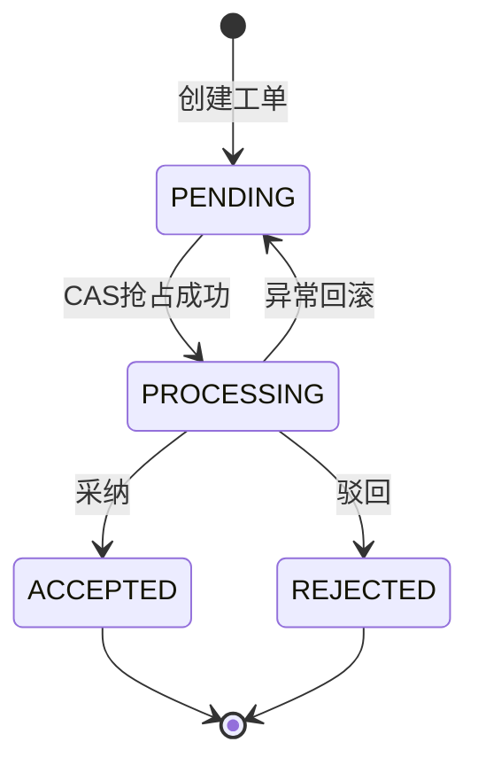
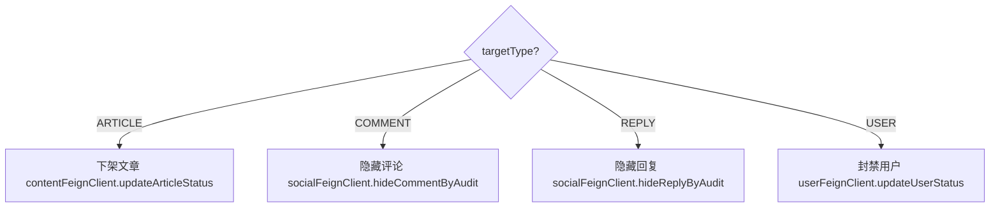

# 审核服务 (audit-service) 技术文档

> 本文中的 `t_audit_report_task` 与 `/audit/report/**` 属于旧版举报审核链路，已由统一审核工单 `t_moderation_task` 和 `/audit/moderation/**` 替代。当前实现及接口以 `docs/social-service-api.md`、`docs/social-service-technical-overview.md` 和源码为准。

## 1. 服务概述

审核服务负责处理游戏社区平台的举报审核工单。当用户提交举报时，社交服务通过 Kafka 发送举报事件，审核服务消费后创建审核工单。管理员可通过接口查看举报列表、查看举报详情（含被举报内容），并对举报做出处理决定（采纳/驳回）。采纳后系统自动执行处罚动作（下架文章、隐藏评论/回复、封禁用户），并通过 Kafka 发送通知事件告知举报人和被举报人。

**核心能力**：
- 消费 Kafka 举报事件，创建审核工单（幂等，防重复）
- 管理员分页查询举报工单（支持按状态、目标类型过滤）
- 查看举报详情（自动填充被举报内容、举报人/被举报人信息）
- 处理举报（乐观锁 CAS 状态流转：PENDING → PROCESSING → ACCEPTED/REJECTED）
- 采纳时自动执行处罚动作（下架/隐藏/封禁）
- 处理完成后发送通知（举报结果通知 + 处罚通知）
- 事务提交后发送 Kafka 事件（避免消息丢失）

**技术栈**：Spring Boot 3 + MyBatis-Plus + MySQL + MongoDB + Redis + Kafka + OpenFeign + Nacos + Sentinel

**服务端口**：8091

---

## 2. 数据模型

### 2.1 MySQL 表

#### t_audit_report_task（举报审核工单表）

| 字段 | 类型 | 说明 |
|------|------|------|
| id | BIGINT AUTO_INCREMENT | 主键 |
| report_id | BIGINT | 原始举报ID（关联 social-service 的举报记录） |
| target_type | TINYINT | 举报目标类型（1=文章 2=评论 3=回复 4=用户） |
| target_id | BIGINT | 举报目标ID |
| reporter_id | BIGINT | 举报人ID |
| reported_user_id | BIGINT | 被举报人ID |
| reason | VARCHAR | 举报原因 |
| status | TINYINT | 工单状态（0=待处理 1=已采纳 2=已驳回 3=处理中） |
| handler_id | BIGINT | 处理人ID |
| handle_remark | VARCHAR(255) | 处理说明 |
| handle_time | DATETIME | 处理时间 |
| version | INT | 乐观锁版本号 |
| create_time | DATETIME | 创建时间 |
| update_time | DATETIME | 更新时间 |

**状态常量**（`SocialConstants.ReportStatus`）：

| 常量 | 值 | 说明 |
|------|------|------|
| PENDING | 0 | 待处理 |
| ACCEPTED | 1 | 已采纳 |
| REJECTED | 2 | 已驳回 |
| PROCESSING | 3 | 处理中 |

**目标类型常量**（`SocialConstants.ReportTargetType`）：

| 常量 | 值 | 说明 |
|------|------|------|
| ARTICLE | 1 | 举报文章 |
| COMMENT | 2 | 举报评论 |
| REPLY | 3 | 举报复 |
| USER | 4 | 举报用户 |

### 2.2 MongoDB

本服务配置了 MongoDB 连接（`mongodb://localhost:27018/game_community_audit`），主要供审核数据存储和内容查询使用。审核工单的结构化数据存储在 MySQL 中，MongoDB 主要用于社交服务的内容存储（评论正文 `social_comment_content` 等），审核服务通过 Feign 调用获取内容详情。

---

## 3. 功能模块详解

### 3.1 举报事件消费

**消费者类**：`ReportAuditListener`

```java
@Slf4j
@Component
@RequiredArgsConstructor
public class ReportAuditListener {

    private final AuditReportService auditReportService;

    @KafkaListener(topics = KafkaTopicConstants.REPORT_AUDIT_TOPIC, groupId = "audit-service-report")
    public void onMessage(ReportAuditMessage message) {
        if (message == null || message.getReportId() == null) return;
        log.info("收到举报审核消息: reportId={}, targetType={}, targetId={}",
                message.getReportId(), message.getTargetType(), message.getTargetId());
        auditReportService.receiveReport(message);
    }
}
```

**创建审核工单**（`receiveReport`）：

```java
@Override
@Transactional(rollbackFor = Exception.class)
public void receiveReport(ReportAuditMessage message) {
    AuditReportTask task = new AuditReportTask();
    task.setReportId(message.getReportId());
    task.setTargetType(message.getTargetType());
    task.setTargetId(message.getTargetId());
    task.setReporterId(message.getReporterId());
    task.setReportedUserId(message.getReportedUserId());
    task.setReason(message.getReason());
    task.setStatus(SocialConstants.ReportStatus.PENDING);
    task.setVersion(0);
    try {
        taskMapper.insert(task);
    } catch (DuplicateKeyException ignored) {
        // Kafka 至少一次投递时，同一个 reportId 只保留一条审核工单
    }
}
```

**幂等保障**：Kafka 至少一次投递可能导致重复消费，通过 `DuplicateKeyException` 捕获唯一索引冲突实现幂等。

### 3.2 举报工单分页查询

**pageReports**：

- 支持按 `status` 和 `targetType` 可选过滤
- 按 `create_time DESC, id DESC` 排序
- 默认每页 20 条，最大 100 条
- 自动填充举报人和被举报人用户名

```java
@Override
public PageResult<AuditReportVO> pageReports(Long page, Long size, Integer status, Integer targetType) {
    long current = page == null || page < 1 ? 1 : page;
    long pageSize = size == null || size < 1 ? 20 : Math.min(size, 100);
    Page<AuditReportTask> result = taskMapper.selectPage(new Page<>(current, pageSize),
            new LambdaQueryWrapper<AuditReportTask>()
                    .eq(status != null, AuditReportTask::getStatus, status)
                    .eq(targetType != null, AuditReportTask::getTargetType, targetType)
                    .orderByDesc(AuditReportTask::getCreateTime)
                    .orderByDesc(AuditReportTask::getId));
    List<AuditReportVO> records = enrichUsers(result.getRecords()).stream().map(this::toVO).toList();
    return PageResult.of(records, current, pageSize, result.getTotal());
}
```

### 3.3 举报详情查询

**getDetail**：

1. 查询审核工单
2. 填充举报人和被举报人用户名
3. 根据目标类型获取被举报内容详情：
   - **文章**：调用 `contentFeignClient.getArticleDetail`，填充标题、正文
   - **评论**：调用 `socialFeignClient.getCommentDetail`，填充评论内容
   - **回复**：调用 `socialFeignClient.getReplyDetail`，填充回复内容
   - **用户**：填充用户名、签名

```java
private void fillTargetDetail(AuditReportDetailVO vo, AuditReportTask task, UserVO reported) {
    if (task.getTargetType() == SocialConstants.ReportTargetType.ARTICLE) {
        ArticleDetailVO detail = unwrap(contentFeignClient.getArticleDetail(task.getTargetId()), "文章服务暂不可用");
        vo.setTarget(detail);
        vo.setTargetTitle(detail == null ? null : detail.getTitle());
        if (detail != null && StringUtils.hasText(detail.getContent())) {
            vo.setTargetContent(detail.getContent());
        } else {
            vo.setTargetContent(detail == null ? null : detail.getSummary());
        }
        return;
    }
    // ... 评论、回复、用户类型处理
}
```

### 3.4 举报处理

**handle 方法** — 核心业务逻辑，采用乐观锁 CAS 状态流转：

```java
@Override
@Transactional(rollbackFor = Exception.class)
public void handle(Long taskId, Long handlerId, HandleAuditReportDTO dto) {
    // 1. 校验处理结果
    validateHandleStatus(dto.getStatus());

    // 2. CAS 抢占：PENDING → PROCESSING
    int claimed = taskMapper.update(null, new LambdaUpdateWrapper<AuditReportTask>()
            .eq(AuditReportTask::getId, taskId)
            .eq(AuditReportTask::getStatus, SocialConstants.ReportStatus.PENDING)
            .set(AuditReportTask::getStatus, SocialConstants.ReportStatus.PROCESSING)
            .set(AuditReportTask::getHandlerId, handlerId)
            .set(AuditReportTask::getUpdateTime, LocalDateTime.now()));
    if (claimed == 0) {
        throw new BusinessException("该举报已被处理或正在处理");
    }

    try {
        // 3. 若采纳，执行处罚动作
        if (Objects.equals(dto.getStatus(), SocialConstants.ReportStatus.ACCEPTED)) {
            applyAcceptedAction(task);
        }

        // 4. 同步处理结果到社交服务
        unwrap(socialFeignClient.markReportHandled(task.getReportId(), dto.getStatus(), handlerId, dto.getHandleRemark()),
                "同步举报处理结果失败");

        // 5. 更新工单最终状态：PROCESSING → ACCEPTED/REJECTED
        int finished = taskMapper.update(null, new LambdaUpdateWrapper<AuditReportTask>()
                .eq(AuditReportTask::getId, taskId)
                .eq(AuditReportTask::getStatus, SocialConstants.ReportStatus.PROCESSING)
                .set(AuditReportTask::getStatus, dto.getStatus())
                .set(AuditReportTask::getHandlerId, handlerId)
                .set(AuditReportTask::getHandleRemark, dto.getHandleRemark())
                .set(AuditReportTask::getHandleTime, LocalDateTime.now())
                .set(AuditReportTask::getUpdateTime, LocalDateTime.now()));
        if (finished == 0) {
            throw new BusinessException("举报处理状态已变化，请刷新后重试");
        }

        // 6. 发送通知
        publishNotification(task, dto.getStatus(), dto.getHandleRemark());
    } catch (RuntimeException e) {
        // 异常回滚：PROCESSING → PENDING
        taskMapper.update(null, new LambdaUpdateWrapper<AuditReportTask>()
                .eq(AuditReportTask::getId, taskId)
                .eq(AuditReportTask::getStatus, SocialConstants.ReportStatus.PROCESSING)
                .set(AuditReportTask::getStatus, SocialConstants.ReportStatus.PENDING)
                .set(AuditReportTask::getHandlerId, null)
                .set(AuditReportTask::getUpdateTime, LocalDateTime.now()));
        throw e;
    }
}
```

**状态流转图**：

```
PENDING(0) → PROCESSING(3) → ACCEPTED(1) / REJECTED(2)
                ↓ (异常)
            PENDING(0)  // 回滚
```

### 3.5 处罚动作执行

**applyAcceptedAction** — 根据举报目标类型执行不同处罚：

| 目标类型 | 处罚动作 | Feign 调用 |
|----------|----------|-----------|
| ARTICLE(1) | 下架文章 | `contentFeignClient.updateArticleStatus(targetId, OFFLINE)` |
| COMMENT(2) | 隐藏评论 | `socialFeignClient.hideCommentByAudit(targetId)` |
| REPLY(3) | 隐藏回复 | `socialFeignClient.hideReplyByAudit(targetId)` |
| USER(4) | 封禁用户 | `userFeignClient.updateUserStatus(targetId, DISABLED)` |

### 3.6 通知事件发送

**NotificationEventProducer** — 事务提交后发送 Kafka 事件，避免事务回滚导致消息丢失：

```java
private void publish(NotificationEventMessage event) {
    if (event == null || event.getRecipientUserId() == null || event.getEventType() == null) return;
    if (TransactionSynchronizationManager.isSynchronizationActive()) {
        TransactionSynchronizationManager.registerSynchronization(new TransactionSynchronization() {
            @Override
            public void afterCommit() {
                doPublish(event);
            }
        });
        return;
    }
    doPublish(event);
}
```

**发送两条通知**：

1. **举报结果通知**（`EventType.REPORT_RESULT = 8`）：发给举报人
   - 采纳："你提交的举报已成立"
   - 驳回："你提交的举报未通过"

2. **处罚结果通知**（`EventType.PENALTY_RESULT = 9`）：发给被举报人（仅采纳时）
   - 举报用户："你的账号因举报已被封禁"
   - 其他类型："你发布的内容因举报已被处理"

**路由上下文解析**（`resolveRouteContext`）：

| 目标类型 | 跳转类型 | 关联ID |
|----------|----------|--------|
| ARTICLE | RouteType.ARTICLE(1) | articleId = targetId |
| COMMENT | RouteType.COMMENT(2) | 通过 Feign 获取 comment.articleId |
| REPLY | RouteType.REPLY(3) | 通过 Feign 获取 reply.articleId, reply.commentId |
| USER | RouteType.USER(4) | targetUserId = targetId |

---

## 4. Kafka 事件

### 4.1 消费者

| Topic | Group ID | 消息类型 | 说明 |
|-------|----------|----------|------|
| `report-audit-events` | `audit-service-report` | `ReportAuditMessage` | 接收社交服务的举报事件 |

**ReportAuditMessage 结构**：

```java
public class ReportAuditMessage implements Serializable {
    private Long reportId;
    private Integer targetType;     // 1=文章 2=评论 3=回复 4=用户
    private Long targetId;
    private Long reporterId;
    private Long reportedUserId;
    private String reason;
    private LocalDateTime eventTime;
}
```

### 4.2 生产者

| Topic | 消息类型 | 说明 |
|-------|----------|------|
| `notification-events` | `NotificationEventMessage` | 发送举报结果/处罚结果通知 |

**发送时机**：事务提交后（`TransactionSynchronization.afterCommit`）

---

## 5. 对外接口声明

### 5.1 经过网关的接口

| 方法 | 路径 | 权限 | 说明 |
|------|------|------|------|
| GET | `/audit/report/page` | @AdminCheck | 分页查询举报工单 |
| GET | `/audit/report/{taskId}` | @AdminCheck | 查看举报详情 |
| PUT | `/audit/report/{taskId}` | @AdminCheck | 处理举报 |

### 5.2 不经过网关的接口

无。所有接口均需管理员权限。

### 5.3 请求参数详情

**GET /audit/report/page**：

| 参数 | 类型 | 默认值 | 说明 |
|------|------|--------|------|
| page | Long | 1 | 页码 |
| size | Long | 20 | 每页条数（最大100） |
| status | Integer | — | 按状态过滤（0/1/2/3） |
| targetType | Integer | — | 按目标类型过滤（1/2/3/4） |

**PUT /audit/report/{taskId}**：

请求体（`HandleAuditReportDTO`）：

```java
public class HandleAuditReportDTO implements Serializable {
    @NotNull(message = "处理结果不能为空")
    private Integer status;            // 1=采纳 2=驳回
    @Size(max = 255, message = "处理说明不能超过255字")
    private String handleRemark;       // 处理说明
}
```

**响应结构**：

- `AuditReportVO`（列表项）：

```java
public class AuditReportVO implements Serializable {
    private Long id;
    private Long reportId;
    private Integer targetType;
    private Long targetId;
    private Long reporterId;
    private Long reportedUserId;
    private String reporterName;
    private String reportedUserName;
    private String reason;
    private Integer status;
    private Long handlerId;
    private String handleRemark;
    private LocalDateTime handleTime;
    private LocalDateTime createTime;
}
```

- `AuditReportDetailVO`（详情，继承 AuditReportVO）：

```java
public class AuditReportDetailVO extends AuditReportVO implements Serializable {
    private String targetTitle;
    private String targetContent;
    private String targetAuthorName;
    private Object target;      // 被举报内容的原始对象
}
```

---

## 6. 关键流程图

### 6.1 举报审核完整流程

```mermaid
flowchart TD
    A[social-service 发送] -->|report-audit-events| B[ReportAuditListener]
    B --> C[创建审核工单 status=PENDING]
    C --> D[管理员查看工单列表]
    D --> E[查看详情-获取被举报内容]
    E --> F[PUT /audit/report/{taskId}]
    F --> G[CAS抢占 PENDING → PROCESSING]
    G -->|失败| H[返回: 已被处理或正在处理]
    G -->|成功| I{status == ACCEPTED?}
    I -->|是| J[执行处罚动作]
    J --> K[同步结果到 social-service]
    I -->|否| K
    K --> L[更新状态 PROCESSING → ACCEPTED/REJECTED]
    L --> M[发送通知事件]
    M --> N[事务提交后发送 Kafka 消息]
    N --> O[notification-service 消费通知]
```

### 6.2 举报处理状态流转



### 6.3 处罚动作分发



---

## 7. 配置说明

### 7.1 bootstrap.yml 完整配置

```yaml
server:
  port: 8091

spring:
  application:
    name: audit-service
  ai:
    dashscope:
      api-key: ${DASHSCOPE_API_KEY:${DASHSCOPE_API_KEY:your-api-key-here}}
      chat:
        options:
          model: ${DASHSCOPE_CHAT_MODEL:qwen-plus}
  cloud:
    nacos:
      discovery:
        enabled: ${NACOS_DISCOVERY_ENABLED:true}
        server-addr: localhost:8848
      config:
        enabled: ${NACOS_CONFIG_ENABLED:false}
        server-addr: localhost:8848
    sentinel:
      eager: true
  datasource:
    driver-class-name: com.mysql.cj.jdbc.Driver
    url: jdbc:mysql://localhost:3307/game_community?useUnicode=true&characterEncoding=UTF-8&serverTimezone=Asia/Shanghai
    username: root
    password: ${MYSQL_PASSWORD:your-password}
  data:
    mongodb:
      uri: mongodb://localhost:27018/game_community_audit
    redis:
      host: localhost
      port: ${REDIS_PORT:6380}
  kafka:
    bootstrap-servers: ${KAFKA_BOOTSTRAP_SERVERS:localhost:9093}
    consumer:
      group-id: audit-service-report
      auto-offset-reset: earliest
      key-deserializer: org.apache.kafka.common.serialization.StringDeserializer
      value-deserializer: org.springframework.kafka.support.serializer.JsonDeserializer
      properties:
        spring.json.trusted.packages: com.game.community.model.message
    producer:
      key-serializer: org.apache.kafka.common.serialization.StringSerializer
      value-serializer: org.springframework.kafka.support.serializer.JsonSerializer

mybatis-plus:
  mapper-locations: classpath*:mapper/*.xml
  type-aliases-package: com.game.community.model.entity
  configuration:
    map-underscore-to-camel-case: true
    log-impl: org.apache.ibatis.logging.stdout.StdOutImpl
  global-config:
    db-config:
      id-type: auto

management:
  endpoints:
    web:
      exposure:
        include: '*'
  endpoint:
    health:
      show-details: always
```

### 7.2 关键配置项说明

| 配置项 | 默认值 | 说明 |
|--------|--------|------|
| `server.port` | 8091 | 服务端口 |
| `spring.data.mongodb.uri` | mongodb://localhost:27018/game_community_audit | MongoDB 连接（非默认端口） |
| `spring.kafka.consumer.group-id` | audit-service-report | Kafka 消费组 |
| `spring.kafka.consumer.auto-offset-reset` | earliest | 从最早消息开始消费 |

### 7.3 Feign 依赖

| Feign Client | 目标服务 | 调用方法 | 用途 |
|---------------|----------|----------|------|
| ContentFeignClient | content-service | `getArticleDetail` | 获取被举报文章详情 |
| ContentFeignClient | content-service | `updateArticleStatus` | 下架文章 |
| SocialFeignClient | social-service | `getCommentDetail` | 获取评论详情 |
| SocialFeignClient | social-service | `getReplyDetail` | 获取回复详情 |
| SocialFeignClient | social-service | `hideCommentByAudit` | 隐藏评论 |
| SocialFeignClient | social-service | `hideReplyByAudit` | 隐藏回复 |
| SocialFeignClient | social-service | `markReportHandled` | 同步处理结果 |
| UserFeignClient | user-service | `getUsersByIds` | 获取用户信息 |
| UserFeignClient | user-service | `updateUserStatus` | 封禁用户 |

### 7.4 启动类注解

```java
@SpringBootApplication(scanBasePackages = {"com.game.community.audit", "com.game.community.common"})
@EnableFeignClients(basePackages = "com.game.community.feign")
@MapperScan("com.game.community.audit.mapper")
```

### 7.5 内部关键参数

| 参数 | 值 | 说明 |
|------|------|------|
| 默认分页大小 | 20 | pageReports 默认 size |
| 最大分页大小 | 100 | pageReports 上限 |
| Kafka 发送时机 | 事务提交后 | afterCommit 回调 |
