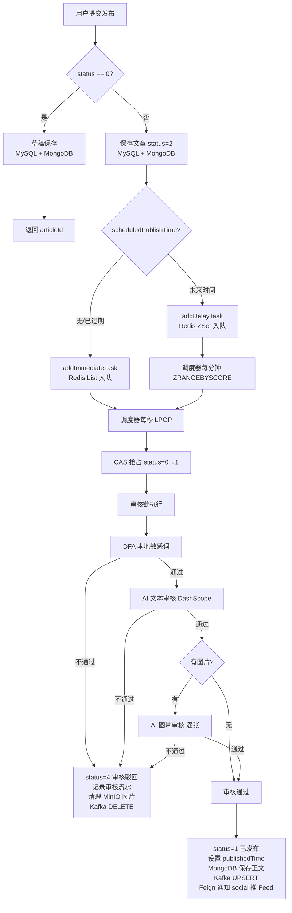
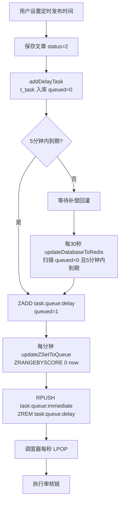
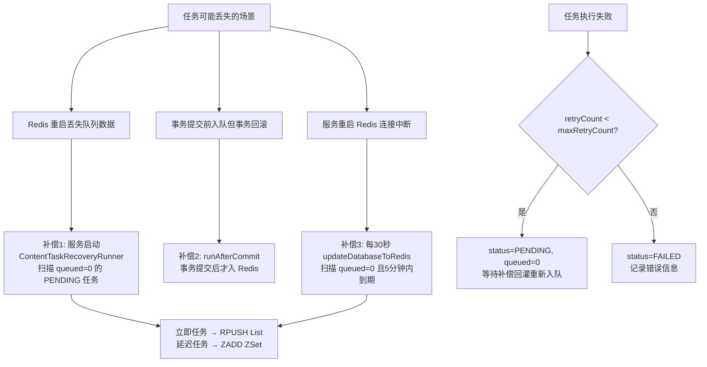
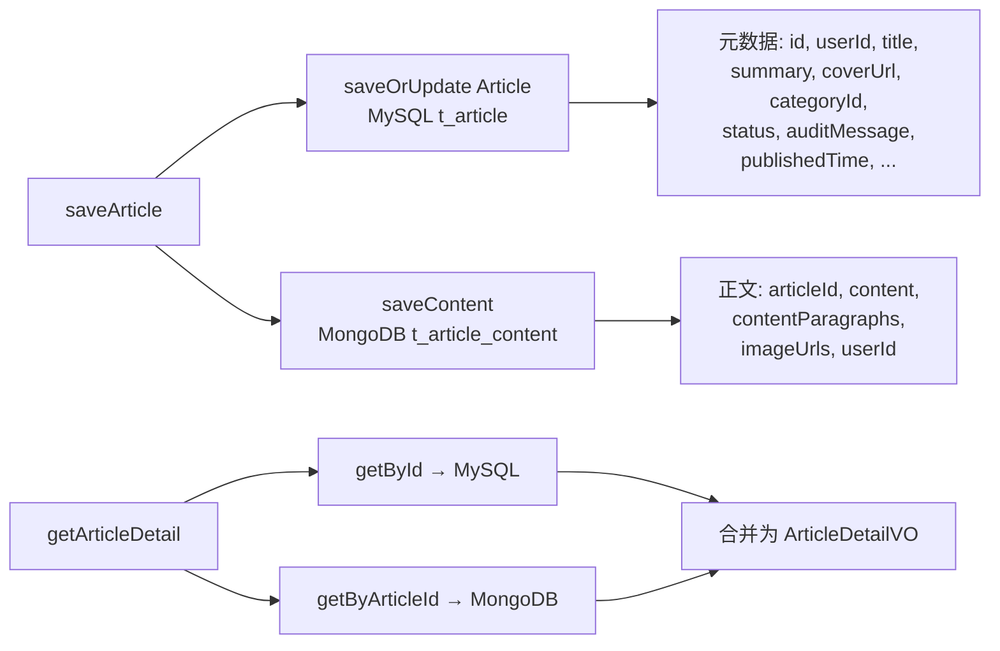

# 内容服务 (content-service) 技术文档

## 1. 服务概述

### 1.1 基本信息

| 属性 | 值 |
|------|------|
| 服务名 | content-service |
| 端口 | 8082 |
| 注册中心 | Nacos (localhost:8848) |
| 基包扫描 | `com.game.community` |
| Mapper扫描 | `com.game.community.content.mapper` |
| Feign扫描 | `com.game.community.feign` |

### 1.2 核心职责

- 文章 CRUD（创建、草稿保存、发布、下架、删除、查询）
- 分类管理（增删改查、启用/禁用）
- 文件上传（图片上传至 MinIO）
- 文章审核链（DFA 本地敏感词 → Kafka → ai-agent-service 统一执行 DeepSeek 审核）
- MongoDB 大文本内容存储（MySQL 存元数据，MongoDB 存正文）
- Kafka 消息同步（发布/下架时同步至搜索服务）
- 任务调度系统（立即执行 + 定时发布 + Redis 队列 + 补偿机制）

### 1.3 技术栈

| 技术 | 版本/说明 |
|------|-----------|
| Spring Boot | 3.x |
| Spring Cloud | Nacos 注册/配置, Sentinel 限流, OpenFeign RPC |
| MyBatis-Plus | 分页、逻辑删除、自动填充 |
| MongoDB | 文章正文存储 |
| Kafka | 搜索同步事件 |
| MinIO | 图片/文件对象存储 |
| Spring Kafka | AI 审核任务削峰、结果回写与业务状态解耦 |
| Redis | 任务队列（List + ZSet）、关注列表缓存 |
| FastJSON2 | 任务参数序列化 |

### 1.4 启动类

```java
@EnableDiscoveryClient
@EnableFeignClients(basePackages = "com.game.community.feign")
@EnableScheduling
@MapperScan("com.game.community.content.mapper")
@SpringBootApplication(scanBasePackages = "com.game.community")
public class ContentServiceApplication {
    public static void main(String[] args) {
        SpringApplication.run(ContentServiceApplication.class, args);
    }
}
```

---

## 2. 数据模型

### 2.1 MySQL 表结构

#### 2.1.1 t_category — 内容分类表

```sql
CREATE TABLE IF NOT EXISTS t_category (
    id BIGINT PRIMARY KEY AUTO_INCREMENT COMMENT '分类ID',
    name VARCHAR(64) NOT NULL COMMENT '分类名称',
    description VARCHAR(255) DEFAULT NULL COMMENT '分类描述',
    status TINYINT NOT NULL DEFAULT 1 COMMENT '状态: 0-禁用, 1-启用',
    sort INT NOT NULL DEFAULT 0 COMMENT '排序值，越大越靠前',
    create_time DATETIME NOT NULL DEFAULT CURRENT_TIMESTAMP COMMENT '创建时间',
    update_time DATETIME NOT NULL DEFAULT CURRENT_TIMESTAMP ON UPDATE CURRENT_TIMESTAMP COMMENT '更新时间',
    deleted TINYINT NOT NULL DEFAULT 0 COMMENT '逻辑删除'
) COMMENT='内容分类表';

CREATE UNIQUE INDEX idx_category_name_deleted ON t_category(name, deleted);
CREATE INDEX idx_category_status_sort ON t_category(status, sort, id);
```

**字段说明：**

| 字段 | 类型 | 说明 |
|------|------|------|
| id | BIGINT AUTO | 主键，自增 |
| name | VARCHAR(64) | 分类名称，与 deleted 组成唯一索引保证未删除分类名唯一 |
| description | VARCHAR(255) | 分类描述，可为空 |
| status | TINYINT | 0=禁用, 1=启用，默认1 |
| sort | INT | 排序权重，越大越靠前，默认0 |
| deleted | TINYINT | 逻辑删除标记，0=正常, 1=已删除 |

**实体类：**

```java
@Data
@TableName("t_category")
public class Category implements Serializable {
    @TableId(type = IdType.AUTO)
    private Long id;
    private String name;
    private String description;
    private Integer status;       // 0-禁用, 1-启用
    private Integer sort;         // 排序值
    @TableField(fill = FieldFill.INSERT)
    private LocalDateTime createTime;
    @TableField(fill = FieldFill.INSERT_UPDATE)
    private LocalDateTime updateTime;
    @TableLogic
    private Integer deleted;
}
```

#### 2.1.2 t_article — 文章骨架表

```sql
CREATE TABLE IF NOT EXISTS t_article (
    id BIGINT PRIMARY KEY AUTO_INCREMENT COMMENT '文章ID',
    user_id BIGINT NOT NULL COMMENT '作者用户ID',
    title VARCHAR(80) NOT NULL COMMENT '标题',
    summary VARCHAR(200) DEFAULT NULL COMMENT '摘要',
    cover_url VARCHAR(1024) DEFAULT NULL COMMENT '封面图URL',
    category_id BIGINT NOT NULL COMMENT '分类ID',
    status TINYINT NOT NULL DEFAULT 0 COMMENT '状态: 0-草稿, 1-已发布, 2-待审核, 3-已下架, 4-审核驳回',
    audit_message VARCHAR(255) DEFAULT NULL COMMENT '最近一次审核结果或下架原因',
    scheduled_publish_time DATETIME DEFAULT NULL COMMENT '计划发布时间',
    published_time DATETIME DEFAULT NULL COMMENT '实际发布时间',
    create_time DATETIME NOT NULL DEFAULT CURRENT_TIMESTAMP COMMENT '创建时间',
    update_time DATETIME NOT NULL DEFAULT CURRENT_TIMESTAMP ON UPDATE CURRENT_TIMESTAMP COMMENT '更新时间',
    deleted TINYINT NOT NULL DEFAULT 0 COMMENT '逻辑删除'
) COMMENT='文章骨架表，正文存 MongoDB';

CREATE INDEX idx_article_user_status_time ON t_article(user_id, status, update_time, id);
CREATE INDEX idx_article_category_publish ON t_article(category_id, status, published_time, id);
CREATE INDEX idx_article_status_publish ON t_article(status, published_time, id);
```

**状态流转：**

```
0(草稿) ──发布──→ 2(待审核) ──审核通过──→ 1(已发布) ──下架──→ 3(已下架)
                      │                        ↑
                      └──审核驳回──→ 4(审核驳回)──重新提交──→ 2(待审核)
```

| 状态值 | 含义 | 说明 |
|--------|------|------|
| 0 | 草稿 | 用户保存草稿，不进入审核 |
| 1 | 已发布 | 审核通过，对外可见 |
| 2 | 待审核 | 用户提交发布，等待审核链执行 |
| 3 | 已下架 | 管理员下架或用户主动下架 |
| 4 | 审核驳回 | 审核链任一环节不通过 |

**实体类：**

```java
@Data
@TableName("t_article")
public class Article implements Serializable {
    @TableId(type = IdType.AUTO)
    private Long id;
    private Long userId;
    private String title;
    private String summary;
    private String coverUrl;
    private Long categoryId;
    private Integer status;              // 0-草稿, 1-已发布, 2-待审核, 3-已下架, 4-审核驳回
    private String auditMessage;         // 最近审核消息
    private LocalDateTime scheduledPublishTime;
    private LocalDateTime publishedTime;
    @TableField(fill = FieldFill.INSERT)
    private LocalDateTime createTime;
    @TableField(fill = FieldFill.INSERT_UPDATE)
    private LocalDateTime updateTime;
    @TableLogic
    private Integer deleted;
}
```

#### 2.1.3 t_article_audit — 文章审核流水表

```sql
CREATE TABLE IF NOT EXISTS t_article_audit (
    id BIGINT PRIMARY KEY AUTO_INCREMENT COMMENT '审核流水ID',
    article_id BIGINT NOT NULL COMMENT '文章ID',
    audit_stage TINYINT NOT NULL COMMENT '审核阶段: 1-DFA, 2-AI文本, 3-AI图片',
    status TINYINT NOT NULL COMMENT '审核状态: 1-通过, 3-驳回',
    suggestion VARCHAR(16) DEFAULT NULL COMMENT 'pass/block',
    reason VARCHAR(255) DEFAULT NULL COMMENT '审核原因',
    audit_time DATETIME NOT NULL DEFAULT CURRENT_TIMESTAMP COMMENT '审核完成时间',
    create_time DATETIME NOT NULL DEFAULT CURRENT_TIMESTAMP COMMENT '创建时间',
    update_time DATETIME NOT NULL DEFAULT CURRENT_TIMESTAMP ON UPDATE CURRENT_TIMESTAMP COMMENT '更新时间'
) COMMENT='文章审核流水表';

CREATE INDEX idx_article_audit_article_time ON t_article_audit(article_id, audit_time, id);
```

**审核阶段常量（ContentConstants.AuditStage）：**

| 阶段值 | 含义 | 对应常量 |
|--------|------|----------|
| 1 | DFA 本地敏感词审核 | `AuditStage.LOCAL_TEXT` |
| 2 | AI 文本审核（ai-agent-service / DeepSeek） | `AuditStage.AI_TEXT` |
| 3 | AI 图片审核（ai-agent-service / DeepSeek） | `AuditStage.AI_IMAGE` |

**审核状态常量（ContentConstants.AuditStatus）：**

| 状态值 | 含义 | 对应常量 |
|--------|------|----------|
| 0 | 待审核 | `AuditStatus.PENDING` |
| 1 | 通过 | `AuditStatus.PASS` |
| 2 | 待人工审核 | `AuditStatus.REVIEW` |
| 3 | 违规/驳回 | `AuditStatus.BLOCK` |

**实体类：**

```java
@Data
@TableName("t_article_audit")
public class ArticleAudit implements Serializable {
    @TableId(type = IdType.AUTO)
    private Long id;
    private Long articleId;
    private Integer auditStage;     // 1-DFA, 2-AI文本, 3-AI图片
    private Integer status;         // 0-待审核, 1-通过, 2-疑似, 3-违规
    private String suggestion;      // pass, review, block
    private String reason;          // 违规原因
    private LocalDateTime auditTime;
    @TableField(fill = FieldFill.INSERT)
    private LocalDateTime createTime;
    @TableField(fill = FieldFill.INSERT_UPDATE)
    private LocalDateTime updateTime;
}
```

#### 2.1.4 t_task — 内容任务表

```sql
CREATE TABLE IF NOT EXISTS t_task (
    id BIGINT PRIMARY KEY AUTO_INCREMENT COMMENT '任务ID',
    type TINYINT NOT NULL COMMENT '任务类型: 1-文章审核发布',
    param JSON NOT NULL COMMENT '任务参数JSON',
    business_id BIGINT NOT NULL COMMENT '关联业务ID',
    execute_time DATETIME DEFAULT NULL COMMENT '执行时间，为空表示立即执行',
    status TINYINT NOT NULL DEFAULT 0 COMMENT '任务状态: 0-待执行, 1-执行中, 2-已完成, 3-失败, 4-已取消',
    retry_count INT NOT NULL DEFAULT 0 COMMENT '重试次数',
    max_retry_count INT NOT NULL DEFAULT 3 COMMENT '最大重试次数',
    error_msg VARCHAR(255) DEFAULT NULL COMMENT '最后一次错误信息',
    queued TINYINT NOT NULL DEFAULT 0 COMMENT '是否已入 Redis 队列: 0-否, 1-是',
    create_time DATETIME NOT NULL DEFAULT CURRENT_TIMESTAMP COMMENT '创建时间',
    update_time DATETIME NOT NULL DEFAULT CURRENT_TIMESTAMP ON UPDATE CURRENT_TIMESTAMP COMMENT '更新时间',
    deleted TINYINT NOT NULL DEFAULT 0 COMMENT '逻辑删除'
) COMMENT='内容任务表';

CREATE INDEX idx_task_status_queue_execute ON t_task(status, queued, execute_time, id);
CREATE INDEX idx_task_business_type ON t_task(business_id, type, status);
```

**任务状态流转（ContentConstants.TaskStatus）：**

```
0(待执行) ──claim──→ 1(执行中) ──成功──→ 2(已完成)
                       │
                       └──失败──→ 3(失败) [retryCount < maxRetryCount 时回退到 0(待执行)]
0(待执行) ──取消──→ 4(已取消)
```

| 状态值 | 含义 | 对应常量 |
|--------|------|----------|
| 0 | 待执行 | `TaskStatus.PENDING` |
| 1 | 执行中 | `TaskStatus.RUNNING` |
| 2 | 已完成 | `TaskStatus.COMPLETED` |
| 3 | 失败 | `TaskStatus.FAILED` |
| 4 | 已取消 | `TaskStatus.CANCELLED` |

**任务类型（ContentConstants.TaskType）：**

| 类型值 | 含义 | 对应常量 |
|--------|------|----------|
| 1 | 文章审核发布 | `TaskType.ARTICLE_PUBLISH` |

**queued 字段说明：** 标识任务是否已入 Redis 队列。0=尚未入队，1=已入队。用于服务重启后补偿回灌——只回灌 `queued=0` 的待执行任务。

**实体类：**

```java
@Data
@TableName("t_task")
public class Task implements Serializable {
    @TableId(type = IdType.AUTO)
    private Long id;
    private Integer type;            // 任务类型
    private String param;            // JSON格式参数
    private Long businessId;         // 关联业务ID
    private LocalDateTime executeTime; // 执行时间，null=立即
    private Integer status;          // 0-待执行, 1-执行中, 2-已完成, 3-失败, 4-已取消
    private Integer retryCount;
    private Integer maxRetryCount;
    private String errorMsg;
    private Integer queued;          // 0-未入Redis, 1-已入Redis
    @TableField(fill = FieldFill.INSERT)
    private LocalDateTime createTime;
    @TableField(fill = FieldFill.INSERT_UPDATE)
    private LocalDateTime updateTime;
    @TableLogic
    private Integer deleted;
}
```

#### 2.1.5 t_task_log — 任务执行日志表

```sql
CREATE TABLE IF NOT EXISTS t_task_log (
    id BIGINT PRIMARY KEY AUTO_INCREMENT COMMENT '任务日志ID',
    task_id BIGINT NOT NULL COMMENT '任务ID',
    type TINYINT NOT NULL COMMENT '任务类型',
    business_id BIGINT NOT NULL COMMENT '关联业务ID',
    status TINYINT NOT NULL COMMENT '执行结果: 0-成功, 1-失败',
    result_msg VARCHAR(255) DEFAULT NULL COMMENT '执行结果摘要',
    cost_time BIGINT DEFAULT NULL COMMENT '耗时毫秒',
    exception_msg VARCHAR(255) DEFAULT NULL COMMENT '异常信息',
    create_time DATETIME NOT NULL DEFAULT CURRENT_TIMESTAMP COMMENT '创建时间'
) COMMENT='任务执行日志表';

CREATE INDEX idx_task_log_task_time ON t_task_log(task_id, create_time, id);
```

**实体类：**

```java
@Data
@TableName("t_task_log")
public class TaskLog implements Serializable {
    @TableId(type = IdType.AUTO)
    private Long id;
    private Long taskId;
    private Integer type;
    private Long businessId;
    private Integer status;          // 0-成功, 1-失败
    private String resultMsg;
    private Long costTime;           // 耗时毫秒
    private String exceptionMsg;
    @TableField(fill = FieldFill.INSERT)
    private LocalDateTime createTime;
}
```

### 2.2 MongoDB 集合

#### 2.2.1 t_article_content — 文章正文集合

```javascript
// 集合结构
{
  _id: ObjectId,
  articleId: NumberLong,       // 唯一索引，关联 t_article.id
  content: String,             // 文章正文纯文本
  contentParagraphs: {         // 结构化段落，保持前端编辑顺序
    "p1": "第一段内容",
    "p2": "第二段内容"
  },
  imageUrls: [String],         // 内容中的图片URL列表
  userId: NumberLong,          // 作者ID
  createTime: ISODate,
  updateTime: ISODate
}
```

**建议索引：**

```javascript
db.t_article_content.createIndex({ articleId: 1 }, { unique: true })
db.t_article_content.createIndex({ userId: 1, updateTime: -1 })
```

**设计理念：** 文章正文可能很长，且包含结构化段落信息，放在 MySQL 中会导致行过大、查询效率下降。将大文本内容存储在 MongoDB 中，MySQL 仅存元数据（标题、摘要、状态等），实现读写分离——列表查询只走 MySQL，详情查询才联合 MongoDB。

**实体类：**

```java
@Document(collection = "t_article_content")
public class ArticleContent {
    @Id
    private String id;

    @Indexed(unique = true)
    private Long articleId;

    private String content;                        // 正文纯文本
    private Map<String, String> contentParagraphs; // 结构化段落
    private List<String> imageUrls;                // 图片URL列表

    @Indexed
    private Long userId;

    private LocalDateTime createTime;
    private LocalDateTime updateTime;
    // getter/setter 省略
}
```

**Repository：**

```java
@Repository
public interface ArticleContentRepository extends MongoRepository<ArticleContent, String> {
    Optional<ArticleContent> findByArticleId(Long articleId);
    void deleteByArticleId(Long articleId);
}
```

### 2.3 Redis 数据结构

#### 2.3.1 任务队列

| Key | 类型 | 说明 |
|-----|------|------|
| `task:queue:immediate` | List | 立即执行任务队列，RPUSH 入队，LPOP 出队 |
| `task:queue:delay` | ZSet | 延迟任务有序集合，score 为 executeTime 的 UTC 秒数 |

**常量定义：**

```java
public static final String TASK_QUEUE_KEY = "task:queue:immediate";
public static final String TASK_ZSET_KEY = "task:queue:delay";
```

**操作流程：**
1. 立即任务：`RPUSH task:queue:immediate <taskId>` → 调度器 `LPOP` 批量获取
2. 延迟任务：`ZADD task:queue:delay <epochSeconds> <taskId>` → 调度器每分钟 `ZRANGEBYSCORE 0 <now>` 取出到期任务，移入 `task:queue:immediate`
3. 取消任务：`LREM task:queue:immediate <taskId>` + `ZREM task:queue:delay <taskId>`

#### 2.3.2 关注列表缓存

| Key | 类型 | 说明 |
|-----|------|------|
| `user:follow:<userId>` | Set | 用户关注列表，值为被关注用户的 ID 字符串 |

**常量定义：**

```java
public static final String FOLLOW_KEY_PREFIX = "user:follow:";
```

**使用场景：** "关注动态"接口 `getFollowArticles()` 从 Redis Set 获取当前用户关注的所有用户 ID，再查询这些用户的已发布文章。

#### 2.3.3 Feed 信箱

| Key | 类型 | 说明 |
|-----|------|------|
| `user:feed:<userId>` | List/ZSet | 用户 Feed 信箱，容量上限 100 |

**常量定义：**

```java
public static final String FEED_KEY_PREFIX = "user:feed:";
public static final int FEED_CAPACITY = 100;
```

---

## 3. 功能模块详解

### 3.1 分类管理

#### 3.1.1 接口列表

| 方法 | 路径 | 权限 | 说明 |
|------|------|------|------|
| GET | `/category/list` | 公开 | 分页查询启用的分类 |
| GET | `/category/listEnabled` | 公开 | 查询所有启用的分类（不分页） |
| GET | `/category/{id}` | 公开 | 根据ID查询分类 |
| GET | `/category/all` | @AdminCheck | 分页查询所有分类（含禁用） |
| POST | `/category` | @AdminCheck | 新增分类 |
| PUT | `/category` | @AdminCheck | 更新分类 |
| DELETE | `/category/{id}` | @AdminCheck | 删除分类 |

#### 3.1.2 核心实现

**新增分类（CategoryServiceImpl.save）：**

```java
@Transactional(rollbackFor = Exception.class)
public boolean save(Category category) {
    if (category.getStatus() == null) {
        category.setStatus(1);  // 默认启用
    }
    if (category.getSort() == null) {
        category.setSort(0);    // 默认排序0
    }
    category.setCreateTime(LocalDateTime.now());
    category.setUpdateTime(LocalDateTime.now());
    return super.save(category);
}
```

**查询启用分类（listEnabledByPage）：**

```java
Page<Category> result = page(new Page<>(page, size), new LambdaQueryWrapper<Category>()
    .eq(Category::getStatus, 1)
    .orderByDesc(Category::getSort)
    .orderByDesc(Category::getId));
```

排序规则：先按 sort 降序，再按 id 降序。

### 3.2 文章草稿保存

#### 3.2.1 接口

| 方法 | 路径 | 权限 | 说明 |
|------|------|------|------|
| POST | `/article` | @LoginCheck | 创建文章（status=0 为草稿） |
| PUT | `/article/{id}` | @LoginCheck | 更新文章 |

请求体为 `ArticleDTO`，当 `status=0` 时走草稿保存逻辑。

#### 3.2.2 ArticleDTO 结构

```java
@Data
public class ArticleDTO implements Serializable {
    private Long id;                                    // 更新时传入
    @NotBlank @Size(max = 80)
    private String title;                               // 标题
    @Size(max = 200)
    private String summary;                             // 摘要
    private String content;                             // 纯文本内容
    private Map<String, String> contentParagraphs;      // 结构化段落 {"p1":"...","p2":"..."}
    private String coverUrl;                            // 封面图URL
    private List<String> imageUrls;                     // 图片URL列表
    @NotNull
    private Long categoryId;                            // 分类ID
    private Integer status;                             // 0-草稿, 2-待审核
    private LocalDateTime scheduledPublishTime;         // 定时发布时间
}
```

#### 3.2.3 草稿保存流程

```java
// ArticleServiceImpl.saveArticle 核心逻辑
boolean draft = Objects.equals(dto.getStatus(), ContentConstants.ArticleStatus.DRAFT);
if (draft) {
    article.setStatus(ContentConstants.ArticleStatus.DRAFT);
    article.setAuditMessage(null);
    article.setPublishedTime(null);
    saveOrUpdate(article);  // MySQL 写入
    articleContentService.saveContent(article.getId(), contentText, contentParagraphs, articleImages, userId);  // MongoDB 写入
    articleSearchSyncProducer.delete(article.getId());  // 从搜索索引移除草稿
    return article.getId();
}
```

**双写流程：**
1. `saveOrUpdate(article)` — 写入/更新 MySQL t_article 表
2. `articleContentService.saveContent(...)` — 写入/更新 MongoDB t_article_content 集合
3. `articleSearchSyncProducer.delete(...)` — 发送 Kafka DELETE 消息，确保草稿不出现在搜索结果

**段落标准化逻辑（normalizeParagraphs）：**

```java
private Map<String, String> normalizeParagraphs(ArticleDTO dto) {
    Map<String, String> result = new LinkedHashMap<>();
    // 优先使用 contentParagraphs
    if (dto.getContentParagraphs() != null && !dto.getContentParagraphs().isEmpty()) {
        dto.getContentParagraphs().forEach((key, value) -> {
            if (StringUtils.hasText(value)) {
                String normalizedKey = StringUtils.hasText(key) ? key.trim() : "p" + (result.size() + 1);
                result.put(normalizedKey, value.trim());
            }
        });
    }
    // 回退：从 content 字符串解析段落
    if (result.isEmpty() && StringUtils.hasText(dto.getContent())) {
        String normalized = dto.getContent().trim();
        if (normalized.startsWith("{{") && normalized.endsWith("}}")) {
            normalized = normalized.substring(2, normalized.length() - 2);
        }
        String[] paragraphs = normalized.split("\\}\\s*,\\s*\\{|\n{2,}");
        for (String paragraph : paragraphs) {
            String clean = paragraph.replace("{", "").replace("}", "").trim();
            if (StringUtils.hasText(clean)) {
                result.put("p" + (result.size() + 1), clean);
            }
        }
    }
    return result;
}
```

**内容校验：**

```java
private static final int MAX_CONTENT_LENGTH = 800;

private void validateContent(String contentText) {
    if (!StringUtils.hasText(contentText)) {
        throw new BusinessException("文章内容不能为空");
    }
    if (contentText.length() > MAX_CONTENT_LENGTH) {
        throw new BusinessException("文章正文不能超过800字");
    }
}
```

**摘要自动生成：** 若用户未提供 summary，则从 content 截取前 120 字符：

```java
private String buildSummary(String content) {
    if (!StringUtils.hasText(content)) return "";
    String normalized = content.trim().replaceAll("\\s+", " ");
    return normalized.length() <= 120 ? normalized : normalized.substring(0, 120);
}
```

### 3.3 文章立即发布

#### 3.3.1 接口

| 方法 | 路径 | 权限 | 说明 |
|------|------|------|------|
| POST | `/article` | @LoginCheck | 创建文章（status=2 为待审核，立即发布） |
| PUT | `/article/{id}` | @LoginCheck | 更新文章并发布 |

当 `ArticleDTO.status != 0` 且 `scheduledPublishTime` 为空或已过期时，走立即发布逻辑。

#### 3.3.2 完整发布流程

```java
// ArticleServiceImpl.saveArticle — 非草稿分支
article.setStatus(ContentConstants.ArticleStatus.PENDING);  // status=2
article.setAuditMessage("审核中");
article.setPublishedTime(null);
saveOrUpdate(article);  // MySQL 写入
articleContentService.saveContent(articleId, contentText, contentParagraphs, articleImages, userId);  // MongoDB 写入

// 构建任务参数
Map<String, Object> taskParam = new HashMap<>();
taskParam.put("articleId", articleId);
taskParam.put("userId", userId);
taskParam.put("title", dto.getTitle());
taskParam.put("summary", article.getSummary());
taskParam.put("content", contentText);
taskParam.put("contentParagraphs", contentParagraphs);
taskParam.put("coverUrl", coverUrl);
taskParam.put("categoryId", dto.getCategoryId());
taskParam.put("imageUrls", articleImages);

// 创建立即执行任务
taskService.addImmediateTask(ContentConstants.TaskType.ARTICLE_PUBLISH, taskParam, articleId);
```

#### 3.3.3 审核链执行（ArticleAsyncServiceImpl.auditAndPublish）

任务调度器从 Redis 队列取出任务后，调用 `executeTaskByType()`，最终执行 `auditAndPublish()`：

```java
@Transactional(rollbackFor = Exception.class)
public void auditAndPublish(Long articleId, Long userId, ArticleDTO articleDTO,
                            String coverUrl, List<String> imageUrls) {
    // 1. 合并审核图片列表（封面 + 正文图片，去重）
    List<String> auditImages = new ArrayList<>();
    if (StringUtils.hasText(coverUrl)) auditImages.add(coverUrl);
    if (imageUrls != null) {
        for (String imageUrl : imageUrls) {
            if (StringUtils.hasText(imageUrl) && !auditImages.contains(imageUrl)) {
                auditImages.add(imageUrl);
            }
        }
    }

    // 2. 执行审核链
    AuditResult result = articleAuditService.auditArticle(
        articleId, articleDTO.getTitle(), articleDTO.getContent(), auditImages);

    // 3. 审核通过
    if (result.isPass()) {
        LocalDateTime publishedTime = LocalDateTime.now();
        Map<String, String> paragraphs = normalizeParagraphs(articleDTO);
        articleContentService.saveContent(articleId, joinParagraphs(paragraphs), paragraphs, imageUrls, userId);
        articleMapper.update(null, new LambdaUpdateWrapper<Article>()
            .eq(Article::getId, articleId)
            .set(Article::getStatus, ContentConstants.ArticleStatus.PUBLISHED)  // status=1
            .set(Article::getAuditMessage, "审核通过")
            .set(Article::getPublishedTime, publishedTime)
            .set(Article::getUpdateTime, publishedTime));
        articleSearchSyncProducer.upsert(articleId);  // Kafka 同步搜索
        notifySocialFeed(userId, articleId, publishedTime);  // Feign 通知社交服务
        return;
    }

    // 4. 审核驳回
    articleMapper.update(null, new LambdaUpdateWrapper<Article>()
        .eq(Article::getId, articleId)
        .set(Article::getStatus, ContentConstants.ArticleStatus.REJECTED)  // status=4
        .set(Article::getAuditMessage, result.getReason())
        .set(Article::getUpdateTime, LocalDateTime.now()));
    articleSearchSyncProducer.delete(articleId);  // 从搜索移除
    cleanupImages(auditImages);  // 清理 MinIO 图片
}
```

**通知社交服务（推模式 Feed）：**

```java
private void notifySocialFeed(Long userId, Long articleId, LocalDateTime publishedTime) {
    try {
        socialFeignClient.publishArticleToFollowers(userId, articleId, publishedTime.toString());
    } catch (RuntimeException e) {
        log.warn("推送文章到粉丝Feed失败: articleId={}, error={}", articleId, e.getMessage());
    }
}
```

**审核驳回后清理图片：**

```java
private void cleanupImages(List<String> imageUrls) {
    for (String imageUrl : imageUrls) {
        if (!StringUtils.hasText(imageUrl)) continue;
        try {
            minIOUtils.deletePublicFileByUrl(imageUrl);
        } catch (Exception e) {
            log.warn("清理文章资源失败: url={}, error={}", imageUrl, e.getMessage());
        }
    }
}
```

### 3.4 定时发布

#### 3.4.1 接口

与立即发布共用 `POST /article` 和 `PUT /article/{id}`，区别在于 `ArticleDTO.scheduledPublishTime` 不为空且在未来。

#### 3.4.2 定时发布流程

```java
// ArticleServiceImpl.saveArticle — 定时发布分支
if (dto.getScheduledPublishTime() != null
    && dto.getScheduledPublishTime().isAfter(LocalDateTime.now())) {
    taskService.addDelayTask(
        ContentConstants.TaskType.ARTICLE_PUBLISH,
        taskParam, articleId, dto.getScheduledPublishTime());
} else {
    taskService.addImmediateTask(
        ContentConstants.TaskType.ARTICLE_PUBLISH,
        taskParam, articleId);
}
```

**定时发布时间校验：**

```java
private void validatePublishTime(LocalDateTime publishTime) {
    if (publishTime != null && publishTime.isBefore(LocalDateTime.now().minusMinutes(1))) {
        throw new BusinessException("定时发布时间不能早于当前时间");
    }
}
```

#### 3.4.3 延迟任务入队（TaskServiceImpl.addDelayTask）

```java
@Transactional(rollbackFor = Exception.class)
public <T> Long addDelayTask(int type, T param, Long businessId, LocalDateTime executeTime) {
    Task task = buildTask(type, param, businessId, executeTime);
    taskMapper.insert(task);  // 先落数据库
    runAfterCommit(() -> {
        // 事务提交后：5分钟内到期的任务入 ZSet
        if (executeTime != null && executeTime.isBefore(LocalDateTime.now().plusMinutes(5))) {
            addToDelayZSet(task.getId(), executeTime);
        }
    });
    return task.getId();
}
```

**addToDelayZSet 实现：**

```java
private void addToDelayZSet(Long taskId, LocalDateTime executeTime) {
    // score = executeTime 的 UTC 秒数
    redisUtils.zAdd(ContentConstants.TASK_ZSET_KEY,
        taskId.toString(), executeTime.toEpochSecond(ZoneOffset.UTC));
    // 标记已入队
    taskMapper.update(null, new LambdaUpdateWrapper<Task>()
        .eq(Task::getId, taskId)
        .eq(Task::getStatus, ContentConstants.TaskStatus.PENDING)
        .set(Task::getQueued, 1)
        .set(Task::getUpdateTime, LocalDateTime.now()));
}
```

#### 3.4.4 调度器触发

`ContentTaskScheduler` 每分钟执行 `updateZSetToQueue()`，将到期的延迟任务从 ZSet 移入 List 队列：

```java
@Scheduled(cron = "0 * * * * ?")
public void updateZSetToQueue() {
    long maxScore = LocalDateTime.now().toEpochSecond(ZoneOffset.UTC);
    Set<String> taskIds = redisUtils.zRangeByScore(ContentConstants.TASK_ZSET_KEY, 0, maxScore);
    for (String taskId : taskIds) {
        redisUtils.zRemove(ContentConstants.TASK_ZSET_KEY, taskId);
        redisUtils.listPushRight(ContentConstants.TASK_QUEUE_KEY, taskId);
    }
}
```

### 3.5 文章下架

#### 3.5.1 接口

| 方法 | 路径 | 权限 | 说明 |
|------|------|------|------|
| PUT | `/article/{id}/unpublish` | @LoginCheck | 用户下架自己的文章 |
| PUT | `/admin/{articleId}/status?status=3` | @AdminCheck | 管理员下架文章 |

#### 3.5.2 实现逻辑

```java
@Transactional(rollbackFor = Exception.class)
public void updateArticleStatus(Long id, Integer status) {
    Article article = getById(id);
    if (article == null) throw new IllegalArgumentException("文章不存在");
    article.setStatus(status);
    article.setUpdateTime(LocalDateTime.now());
    if (Objects.equals(status, ContentConstants.ArticleStatus.OFFLINE)) {
        article.setAuditMessage("管理员下架");
    }
    updateById(article);
    // 状态同步搜索
    if (Objects.equals(status, ContentConstants.ArticleStatus.PUBLISHED)) {
        articleSearchSyncProducer.upsert(id);
    } else {
        articleSearchSyncProducer.delete(id);
    }
}
```

### 3.6 文章删除

#### 3.6.1 接口

| 方法 | 路径 | 权限 | 说明 |
|------|------|------|------|
| DELETE | `/article/{id}` | @LoginCheck | 用户删除自己的文章（软删除） |
| DELETE | `/admin/{articleId}` | @AdminCheck | 管理员删除文章 |

#### 3.6.2 实现逻辑

```java
@Transactional(rollbackFor = Exception.class)
public void deleteArticle(Long id) {
    Article article = getById(id);
    if (article == null) throw new IllegalArgumentException("文章不存在");
    articleContentService.deleteByArticleId(id);  // 删除 MongoDB 内容
    update(new LambdaUpdateWrapper<Article>()
        .eq(Article::getId, id)
        .set(Article::getDeleted, 1)              // 软删除
        .set(Article::getUpdateTime, LocalDateTime.now()));
    articleSearchSyncProducer.delete(id);          // 从搜索移除
}
```

**Controller 层权限校验：**

```java
@LoginCheck
@DeleteMapping("/{id}")
public Result<Void> deleteArticle(@PathVariable("id") Long id) {
    Article article = articleService.getById(id);
    if (article == null || !article.getUserId().equals(UserThreadLocal.getUserId())) {
        return Result.error("文章不存在或无权删除");
    }
    articleService.deleteArticle(id);
    return Result.success(null);
}
```

### 3.7 文章查询

#### 3.7.1 接口列表

| 方法 | 路径 | 权限 | 说明 |
|------|------|------|------|
| GET | `/article/page` | 公开 | 分页查询已发布文章（支持 categoryId、status 过滤） |
| GET | `/article/{id}` | 公开 | 文章详情（MySQL + MongoDB 合并） |
| GET | `/article/{id}/content` | 公开 | 仅获取 MongoDB 正文内容 |
| GET | `/article/my` | @LoginCheck | 当前用户的文章列表 |
| GET | `/article/follow` | @LoginCheck | 关注用户的文章列表（拉模式） |
| GET | `/article/latest` | 公开 | 最新文章（首页刷新） |
| GET | `/article/more` | 公开 | 加载更多文章（游标分页） |
| GET | `/article/listPublished` | 公开 | 所有已发布文章 |
| GET | `/article/listPublishedPage` | 公开 | 已发布文章分页 |
| POST | `/article/listByIds` | 公开 | 批量查询文章 |
| GET | `/article/author/{authorId}/published` | 公开 | 某作者已发布文章 |
| POST | `/article/authors/published` | 公开 | 多作者已发布文章（支持 before 游标） |
| GET | `/article/admin/page` | @AdminCheck | 管理员分页查询（支持 keyword、categoryId、status、authorId） |
| GET | `/article/admin/count` | @AdminCheck | 文章总数统计 |

#### 3.7.2 文章详情（MySQL + MongoDB 合并查询）

```java
public ArticleDetailVO getArticleDetail(Long id) {
    Article article = getById(id);
    if (article == null) throw new IllegalArgumentException("文章不存在");

    ArticleDetailVO vo = new ArticleDetailVO();
    vo.setId(article.getId());
    vo.setUserId(article.getUserId());
    vo.setTitle(article.getTitle());
    vo.setSummary(article.getSummary());
    vo.setCoverUrl(article.getCoverUrl());
    vo.setCategoryId(article.getCategoryId());
    vo.setStatus(article.getStatus());
    vo.setAuditMessage(article.getAuditMessage());
    vo.setScheduledPublishTime(article.getScheduledPublishTime());
    vo.setPublishedTime(article.getPublishedTime());
    vo.setCreateTime(article.getCreateTime());
    vo.setUpdateTime(article.getUpdateTime());

    // 从 MongoDB 获取正文
    var content = articleContentService.getByArticleId(id);
    if (content != null) {
        vo.setContent(content.getContent());
        vo.setContentParagraphs(content.getContentParagraphs());
        vo.setImageUrls(content.getImageUrls());
    }
    return vo;
}
```

**ArticleDetailVO 结构：**

```java
@Data
public class ArticleDetailVO implements Serializable {
    // MySQL 元数据
    private Long id;
    private Long userId;
    private String title;
    private String summary;
    private String coverUrl;
    private Long categoryId;
    private Integer status;
    private String auditMessage;
    private LocalDateTime scheduledPublishTime;
    private LocalDateTime publishedTime;
    private LocalDateTime createTime;
    private LocalDateTime updateTime;
    // MongoDB 内容
    private String content;
    private Map<String, String> contentParagraphs;
    private List<String> imageUrls;
}
```

#### 3.7.3 关注动态（拉模式）

```java
public Page<Article> getFollowArticles(Long userId, Integer page, Integer size) {
    Set<String> followUserIdSet = redisUtils.setMembers(
        ContentConstants.FOLLOW_KEY_PREFIX + userId);
    if (followUserIdSet.isEmpty()) return new Page<>(page, size);
    List<Long> followUserIds = followUserIdSet.stream()
        .map(Long::parseLong).collect(Collectors.toList());
    return page(new Page<>(page, size), new LambdaQueryWrapper<Article>()
        .in(Article::getUserId, followUserIds)
        .eq(Article::getStatus, ContentConstants.ArticleStatus.PUBLISHED)
        .orderByDesc(Article::getPublishedTime)
        .orderByDesc(Article::getId));
}
```

#### 3.7.4 游标分页（加载更多）

```java
public List<Article> getMoreArticles(Long categoryId, Long lastId, Integer size) {
    if (lastId == null) return List.of();
    Article lastArticle = getById(lastId);
    if (lastArticle == null) return List.of();

    LambdaQueryWrapper<Article> wrapper = new LambdaQueryWrapper<>();
    wrapper.eq(Article::getStatus, ContentConstants.ArticleStatus.PUBLISHED);
    if (categoryId != null) wrapper.eq(Article::getCategoryId, categoryId);
    // 游标条件：published_time < last OR (published_time = last AND id < lastId)
    wrapper.and(q -> q.lt(Article::getPublishedTime, lastArticle.getPublishedTime())
        .or()
        .eq(Article::getPublishedTime, lastArticle.getPublishedTime()).lt(Article::getId, lastId));
    wrapper.orderByDesc(Article::getPublishedTime)
        .orderByDesc(Article::getId)
        .last("LIMIT " + Math.max(size, 1));
    return list(wrapper);
}
```

#### 3.7.5 管理员查询

```java
public Page<Article> getArticlePageAdmin(Integer page, Integer size,
        String keyword, Long categoryId, Integer status, Long authorId) {
    LambdaQueryWrapper<Article> wrapper = new LambdaQueryWrapper<>();
    if (StringUtils.hasText(keyword)) {
        wrapper.and(w -> w.like(Article::getTitle, keyword).or().like(Article::getSummary, keyword));
    }
    if (categoryId != null) wrapper.eq(Article::getCategoryId, categoryId);
    if (status != null) wrapper.eq(Article::getStatus, status);
    if (authorId != null) wrapper.eq(Article::getUserId, authorId);
    wrapper.orderByDesc(Article::getUpdateTime).orderByDesc(Article::getId);
    return page(new Page<>(page, size), wrapper);
}
```

### 3.8 文件上传

#### 3.8.1 接口

| 方法 | 路径 | 权限 | 说明 |
|------|------|------|------|
| POST | `/file/upload` | @LoginCheck | 批量上传图片文件 |

#### 3.8.2 实现逻辑

```java
@LoginCheck
@PostMapping("/upload")
public Result<List<String>> upload(@RequestParam("files") List<MultipartFile> files) {
    validateArticleImages(files);
    List<String> urls = new ArrayList<>();
    for (MultipartFile file : files) {
        String url = minIOUtils.uploadPublicFile(file, file.getOriginalFilename(), "content");
        urls.add(url);
    }
    return Result.success(urls);
}
```

**校验规则：**

```java
private static final int MAX_ARTICLE_IMAGE_COUNT = 10;
private static final long MAX_ARTICLE_IMAGE_SIZE = 2L * 1024 * 1024;  // 2MB

private void validateArticleImages(List<MultipartFile> files) {
    if (files == null || files.isEmpty()) throw new BusinessException("请选择要上传的图片");
    if (files.size() > MAX_ARTICLE_IMAGE_COUNT) throw new BusinessException("文章图片最多支持10张");
    for (MultipartFile file : files) {
        if (file == null || file.isEmpty()) throw new BusinessException("图片不能为空");
        if (file.getSize() > MAX_ARTICLE_IMAGE_SIZE) throw new BusinessException("单张图片大小不能超过2MB");
        String contentType = file.getContentType();
        if (!StringUtils.hasText(contentType) || !contentType.startsWith("image/"))
            throw new BusinessException("仅支持上传图片文件");
    }
}
```

**MinIO 上传路径规则：** `{publicFilePrefix}/content/{UUID}.{suffix}`，例如 `user-files/public/content/550e8400-e29b.jpg`

**返回 URL 格式：** `{publicEndpoint}/{publicBucketName}/{objectName}`

### 3.9 任务系统

#### 3.9.1 任务创建

**立即任务（addImmediateTask）：**

```java
@Transactional(rollbackFor = Exception.class)
public <T> Long addImmediateTask(int type, T param, Long businessId) {
    Task task = buildTask(type, param, businessId, null);
    taskMapper.insert(task);  // 先落数据库
    runAfterCommit(() -> enqueueImmediate(task.getId()));  // 事务提交后入 Redis
    return task.getId();
}
```

**延迟任务（addDelayTask）：**

```java
@Transactional(rollbackFor = Exception.class)
public <T> Long addDelayTask(int type, T param, Long businessId, LocalDateTime executeTime) {
    Task task = buildTask(type, param, businessId, executeTime);
    taskMapper.insert(task);
    runAfterCommit(() -> {
        // 仅5分钟内到期的任务立即入 ZSet，其余由 updateDatabaseToRedis 补偿
        if (executeTime != null && executeTime.isBefore(LocalDateTime.now().plusMinutes(5))) {
            addToDelayZSet(task.getId(), executeTime);
        }
    });
    return task.getId();
}
```

**任务构建（buildTask）：**

```java
private Task buildTask(int type, Object param, Long businessId, LocalDateTime executeTime) {
    Task task = new Task();
    task.setType(type);
    task.setParam(JSON.toJSONString(param));
    task.setBusinessId(businessId);
    task.setExecuteTime(executeTime);
    task.setStatus(ContentConstants.TaskStatus.PENDING);  // 0
    task.setQueued(0);      // 未入队
    task.setRetryCount(0);
    task.setMaxRetryCount(3);
    task.setCreateTime(LocalDateTime.now());
    task.setUpdateTime(LocalDateTime.now());
    task.setDeleted(0);
    return task;
}
```

**事务提交后执行（runAfterCommit）：**

```java
private void runAfterCommit(Runnable runnable) {
    if (TransactionSynchronizationManager.isActualTransactionActive()) {
        TransactionSynchronizationManager.registerSynchronization(new TransactionSynchronization() {
            @Override
            public void afterCommit() { runnable.run(); }
        });
        return;
    }
    runnable.run();
}
```

#### 3.9.2 任务补偿

**三层补偿机制：**

1. **服务启动回灌（ContentTaskRecoveryRunner）：**

```java
@Component
@RequiredArgsConstructor
public class ContentTaskRecoveryRunner implements ApplicationRunner {
    private final TaskService taskService;

    @Override
    public void run(ApplicationArguments args) {
        log.info("开始恢复内容待执行任务");
        taskService.recoverPendingTasks();
    }
}
```

2. **定时回灌数据库到 Redis（每30秒）：**

```java
@Scheduled(fixedDelay = 30000)
public void updateDatabaseToRedis() {
    taskService.updateDatabaseToRedis();
}
```

实现逻辑：

```java
public void updateDatabaseToRedis() {
    LocalDateTime threshold = LocalDateTime.now().plusMinutes(5);
    List<Task> pendingTasks = taskMapper.selectList(new LambdaQueryWrapper<Task>()
        .eq(Task::getStatus, ContentConstants.TaskStatus.PENDING)
        .eq(Task::getQueued, 0)  // 只取未入队的
        .and(wrapper -> wrapper.isNull(Task::getExecuteTime)
            .or().le(Task::getExecuteTime, threshold))
        .orderByAsc(Task::getCreateTime)
        .last("LIMIT 500"));

    for (Task task : pendingTasks) {
        if (task.getExecuteTime() == null || !task.getExecuteTime().isAfter(LocalDateTime.now())) {
            enqueueImmediate(task.getId());  // 立即任务入 List
        } else {
            addToDelayZSet(task.getId(), task.getExecuteTime());  // 延迟任务入 ZSet
        }
    }
}
```

3. **ZSet 到期转队列（每分钟）：**

```java
@Scheduled(cron = "0 * * * * ?")
public void updateZSetToQueue() {
    long maxScore = LocalDateTime.now().toEpochSecond(ZoneOffset.UTC);
    Set<String> taskIds = redisUtils.zRangeByScore(ContentConstants.TASK_ZSET_KEY, 0, maxScore);
    for (String taskId : taskIds) {
        redisUtils.zRemove(ContentConstants.TASK_ZSET_KEY, taskId);
        redisUtils.listPushRight(ContentConstants.TASK_QUEUE_KEY, taskId);
    }
}
```

#### 3.9.3 任务执行

**批量获取待执行任务（每秒）：**

```java
@Scheduled(fixedDelay = 1000)
public void executePendingTasks() {
    List<Task> pendingTasks = taskService.getPendingTasks();
    if (!pendingTasks.isEmpty()) {
        taskService.executeTasks(pendingTasks);
    }
}
```

**从 Redis List 批量弹出：**

```java
public List<Task> getPendingTasks() {
    List<Task> tasks = new ArrayList<>();
    for (int i = 0; i < ContentConstants.TASK_POP_BATCH_SIZE; i++) {  // 最多20个
        String taskId = redisUtils.listLeftPop(ContentConstants.TASK_QUEUE_KEY);
        if (taskId == null) break;
        try {
            Task task = taskMapper.selectById(Long.parseLong(taskId));
            if (task != null && task.getStatus() == ContentConstants.TaskStatus.PENDING) {
                tasks.add(task);
            }
        } catch (Exception e) {
            log.warn("读取任务失败: taskId={}, error={}", taskId, e.getMessage());
        }
    }
    return tasks;
}
```

**并发执行：**

```java
public void executeTasks(List<Task> tasks) {
    List<Future<?>> futures = tasks.stream()
        .map(task -> taskExecutor.submit(() -> doExecuteTask(task)))
        .collect(Collectors.toList());
    for (Future<?> future : futures) {
        try { future.get(); } catch (Exception e) { log.error("批量任务执行异常", e); }
    }
}
```

**单任务执行（CAS 抢占 + 重试）：**

```java
@Transactional(rollbackFor = Exception.class)
protected void doExecuteTask(Task task) {
    long startTime = System.currentTimeMillis();
    try {
        // CAS 抢占：只有 status=PENDING 才能更新为 RUNNING
        boolean acquired = taskMapper.update(null, new LambdaUpdateWrapper<Task>()
            .eq(Task::getId, task.getId())
            .eq(Task::getStatus, ContentConstants.TaskStatus.PENDING)
            .set(Task::getStatus, ContentConstants.TaskStatus.RUNNING)
            .set(Task::getUpdateTime, LocalDateTime.now())) == 1;
        if (!acquired) return;  // 被其他线程抢占

        executeTaskByType(task);  // 执行具体业务

        // 成功
        taskMapper.update(null, new LambdaUpdateWrapper<Task>()
            .eq(Task::getId, task.getId())
            .set(Task::getStatus, ContentConstants.TaskStatus.COMPLETED)
            .set(Task::getUpdateTime, LocalDateTime.now()));
        saveTaskLog(task, 0, "success", System.currentTimeMillis() - startTime, null);
    } catch (Exception e) {
        handleTaskFailure(task, e, System.currentTimeMillis() - startTime);
    }
}
```

**失败重试逻辑：**

```java
private void handleTaskFailure(Task task, Exception e, long costTime) {
    Task fresh = taskMapper.selectById(task.getId());
    int retryCount = fresh == null || fresh.getRetryCount() == null
        ? 1 : fresh.getRetryCount() + 1;
    boolean shouldRetry = retryCount < (fresh == null || fresh.getMaxRetryCount() == null
        ? 3 : fresh.getMaxRetryCount());

    LambdaUpdateWrapper<Task> updateWrapper = new LambdaUpdateWrapper<Task>()
        .eq(Task::getId, task.getId())
        .set(Task::getRetryCount, retryCount)
        .set(Task::getErrorMsg, e.getMessage())
        .set(Task::getUpdateTime, LocalDateTime.now());
    if (shouldRetry) {
        updateWrapper.set(Task::getStatus, ContentConstants.TaskStatus.PENDING)
            .set(Task::getQueued, 0);  // 重置入队标记，等待补偿回灌
    } else {
        updateWrapper.set(Task::getStatus, ContentConstants.TaskStatus.FAILED);
    }
    taskMapper.update(null, updateWrapper);
    saveTaskLog(task, 1, "failed", costTime, e.getMessage());

    if (shouldRetry) {
        runAfterCommit(() -> enqueueImmediate(task.getId()));
    }
}
```

**任务类型路由（executeTaskByType）：**

```java
private void executeTaskByType(Task task) {
    Map<String, Object> param = JSON.parseObject(task.getParam(),
        new TypeReference<Map<String, Object>>() {});
    if (task.getType() != ContentConstants.TaskType.ARTICLE_PUBLISH) {
        throw new IllegalArgumentException("不支持的任务类型: " + task.getType());
    }

    // 反序列化 ArticleDTO
    ArticleDTO dto = new ArticleDTO();
    dto.setId(toLong(param.get("articleId")));
    dto.setTitle((String) param.get("title"));
    dto.setSummary((String) param.get("summary"));
    dto.setContent((String) param.get("content"));
    dto.setContentParagraphs(param.get("contentParagraphs") == null
        ? Map.of()
        : JSON.parseObject(JSON.toJSONString(param.get("contentParagraphs")),
            new TypeReference<LinkedHashMap<String, String>>() {}));
    dto.setCoverUrl((String) param.get("coverUrl"));
    dto.setCategoryId(toLong(param.get("categoryId")));
    dto.setImageUrls(param.get("imageUrls") == null
        ? List.of()
        : JSON.parseObject(JSON.toJSONString(param.get("imageUrls")),
            new TypeReference<List<String>>() {}));

    articleAsyncService.auditAndPublish(
        toLong(param.get("articleId")),
        toLong(param.get("userId")),
        dto, dto.getCoverUrl(), dto.getImageUrls());
}
```

**任务取消：**

```java
@Transactional(rollbackFor = Exception.class)
public void cancelTask(Long taskId) {
    Task task = taskMapper.selectById(taskId);
    if (task == null || task.getStatus() != ContentConstants.TaskStatus.PENDING) return;
    task.setStatus(ContentConstants.TaskStatus.CANCELLED);
    task.setUpdateTime(LocalDateTime.now());
    taskMapper.updateById(task);
    redisUtils.listRemove(ContentConstants.TASK_QUEUE_KEY, taskId.toString());
    redisUtils.zRemove(ContentConstants.TASK_ZSET_KEY, taskId.toString());
}
```

### 3.10 审核链详解（当前实现）

> 当前实现已收口到 ai-agent-service：content-service 通过 `AiTaskProducer` 投递 Kafka，结果由 `AiModerationResultListener` 消费并回写文章状态。模型选择、Prompt 和评分阈值由 AI Agent 维护；本节后续旧代码块仅保留为迁移背景，不能作为当前实现依据。当前协议详见 `docs/v2/ai-agent-service.md`。

#### 3.10.1 审核链总览

审核链由 `ArticleAuditServiceImpl.auditArticle()` 实现，按顺序执行三个阶段，任一阶段不通过即短路返回：

```
DFA 本地敏感词 → Kafka AI_TASK(MODERATION) → DeepSeek 文本/图片审核 → Kafka 结果 → 发布或人工审核
```

`ArticleAuditServiceImpl` 只负责组装文章正文和图片引用。`pending://` 图片转换为 MinIO 短时签名 URL，`data:` 图片保留 Base64 兼容路径，公网 `http(s)` 图片直接传 URL，不再由 content-service 下载远程图片。Kafka 投递失败或 AI 任务失败统一进入人工审核，避免同步 HTTP 超时占用发布线程。

#### 3.10.2 DFA 本地敏感词审核

```java
@Component
public class DfaAuditUtils {
    private static final List<String> BLOCK_WORDS = List.of("赌博", "色情", "诈骗", "外挂");

    public boolean pass(String text) {
        if (!StringUtils.hasText(text)) return true;
        return BLOCK_WORDS.stream().noneMatch(text::contains);
    }
}
```

当前实现为简单的关键词包含检测，后续可替换为 DFA 自动机词库加载。

#### 3.10.3 审核链执行代码

```java
@Override
public AuditResult auditArticle(Long articleId, String title, String content, List<String> imageUrls) {
    String fullText = ((title == null ? "" : title) + "\n" + (content == null ? "" : content)).trim();

    // 阶段1: DFA 本地敏感词
    boolean dfaPass = dfaAuditUtils.pass(fullText);
    saveAuditRecord(articleId, ContentConstants.AuditStage.LOCAL_TEXT,
        dfaPass ? ContentConstants.AuditStatus.PASS : ContentConstants.AuditStatus.BLOCK,
        dfaPass ? "pass" : "block",
        dfaPass ? "通过" : "命中本地敏感词");
    if (!dfaPass) return AuditResult.reject("命中本地敏感词");

    // 阶段2: AI 文本审核
    AuditResult textResult = auditClient.auditText(fullText);
    saveAuditRecord(articleId, ContentConstants.AuditStage.AI_TEXT,
        textResult.isPass() ? ContentConstants.AuditStatus.PASS : ContentConstants.AuditStatus.BLOCK,
        textResult.isPass() ? "pass" : "block",
        textResult.getReason());
    if (!textResult.isPass()) return textResult;

    // 阶段3: AI 图片审核（逐张）
    if (imageUrls != null) {
        for (String imageUrl : imageUrls) {
            if (!StringUtils.hasText(imageUrl)) continue;
            AuditResult imageResult = auditImage(imageUrl);
            saveAuditRecord(articleId, ContentConstants.AuditStage.AI_IMAGE,
                imageResult.isPass() ? ContentConstants.AuditStatus.PASS : ContentConstants.AuditStatus.BLOCK,
                imageResult.isPass() ? "pass" : "block",
                imageResult.getReason());
            if (!imageResult.isPass()) return imageResult;
        }
    }

    return AuditResult.pass();
}
```

#### 3.10.4 图片审核策略

```java
private AuditResult auditImage(String imageUrl) {
    try {
        // 优先：从 MinIO 读取图片字节，调用字节审核
        MinIOUtils.FilePayload filePayload = minIOUtils.readFileByUrl(imageUrl);
        return auditClient.auditImage(filePayload.bytes(), filePayload.contentType());
    } catch (Exception e) {
        // 回退：URL 审核
        log.warn("文章图片读取失败，回退为 URL 审核: url={}, error={}", imageUrl, e.getMessage());
        return auditClient.auditImageUrl(imageUrl);
    }
}
```

#### 3.10.5 迁移前的 DashScope 审核客户端（已废弃）

**AuditClient 接口：**

```java
public interface AuditClient {
    AuditResult auditText(String text);
    AuditResult auditImage(byte[] imageBytes, String mimeType);
    AuditResult auditImageUrl(String imageUrl);
}
```

**DashScopeAuditClient 实现：**

文本审核使用 Spring AI ChatClient：

```java
@Override
public AuditResult auditText(String text) {
    if (!StringUtils.hasText(text)) return AuditResult.pass();
    long start = System.nanoTime();
    try {
        ChatResponse response = client().prompt()
            .options(textOptions())
            .system(AUDIT_SYSTEM_PROMPT)
            .user("请审核这段用户资料文本：" + text)
            .call()
            .chatResponse();
        AuditResult result = parseAuditResult(response, durationMs(start));
        logAuditMetrics("文字审核", result);
        return result;
    } catch (Exception e) {
        AuditResult result = unavailableFallback("文字审核", "内容审核服务暂不可用", start, e);
        logAuditMetrics("文字审核", result);
        return result;
    }
}
```

**审核 System Prompt：**

```
你是游戏社区内容安全审核器。你需要审核文本和图片，判断是否包含违法违规、辱骂、色情、政治敏感、广告引流、人身攻击、未成年人不适宜内容。
只能返回 JSON，不要输出 markdown、解释、代码块或其他文本。
通过时返回 {"pass":true,"reason":"通过"}
不通过时返回 {"pass":false,"reason":"具体原因"}
```

**图片审核使用 OpenAI 兼容模式 REST API：**

```java
private AuditResult callCompatibleImageAudit(String imageUrl, long durationMs) {
    JSONObject body = new JSONObject();
    body.put("model", resolveImageModel());
    body.put("response_format", JSONObject.of("type", "json_object"));
    body.put("messages", buildImageMessages(imageUrl));

    JSONObject response = restClient.post()
        .uri(properties.getImageCompatibleEndpoint())
        .header("Authorization", "Bearer " + resolveApiKey())
        .header("Content-Type", "application/json")
        .body(body.toJSONString())
        .retrieve()
        .body(JSONObject.class);

    return parseCompatibleImageResult(response, durationMs);
}
```

**图片审核消息构建：**

```java
private JSONArray buildImageMessages(String imageUrl) {
    JSONArray messages = new JSONArray();
    messages.add(JSONObject.of("role", "system", "content", AUDIT_SYSTEM_PROMPT));
    JSONArray userContent = new JSONArray();
    userContent.add(JSONObject.of("type", "image_url",
        "image_url", JSONObject.of("url", imageUrl)));
    userContent.add(JSONObject.of("type", "text", "text", IMAGE_AUDIT_PROMPT));
    messages.add(JSONObject.of("role", "user", "content", userContent));
    return messages;
}
```

**降级策略（failOpenOnUnavailable）：**

```java
private AuditResult unavailableFallback(String scene, String rejectReason, long startNanos, Exception e) {
    long durationMs = durationMs(startNanos);
    if (properties.isFailOpenOnUnavailable()) {
        log.warn("DashScope{}调用失败，按本地规则放行: {}", scene, e.getMessage());
        return AuditResult.pass(durationMs, null, null, null);
    }
    log.warn("DashScope{}调用失败，按失败处理: {}", scene, e.getMessage());
    return AuditResult.reject(rejectReason, durationMs, null, null, null);
}
```

以下 `audit.dashscope.*` 配置属于旧版同步实现，当前服务不再读取；现行 Provider、超时、熔断和降级配置统一放在 ai-agent-service。

**AuditResult 结构：**

```java
@Data
@NoArgsConstructor
@AllArgsConstructor
public class AuditResult {
    private boolean pass;
    private String reason;
    private Long durationMs;
    private Integer promptTokens;
    private Integer completionTokens;
    private Integer totalTokens;

    public static AuditResult pass() { return new AuditResult(true, "通过"); }
    public static AuditResult reject(String reason) { return new AuditResult(false, reason); }
}
```

#### 3.10.6 审核流水记录

```java
private void saveAuditRecord(Long articleId, int stage, int status, String suggestion, String reason) {
    try {
        ArticleAudit audit = new ArticleAudit();
        audit.setArticleId(articleId);
        audit.setAuditStage(stage);
        audit.setStatus(status);
        audit.setSuggestion(suggestion);
        audit.setReason(reason);
        audit.setAuditTime(LocalDateTime.now());
        audit.setCreateTime(LocalDateTime.now());
        audit.setUpdateTime(LocalDateTime.now());
        articleAuditMapper.insert(audit);
    } catch (Exception e) {
        log.warn("保存文章审核流水失败: articleId={}, stage={}, error={}", articleId, stage, e.getMessage());
    }
}
```

---

## 4. Kafka 事件

### 4.1 ArticleSearchSyncMessage

文章搜索同步消息，用于在文章发布/下架时同步搜索服务索引。

```java
@Data
@NoArgsConstructor
@AllArgsConstructor
public class ArticleSearchSyncMessage implements Serializable {
    public static final String UPSERT = "UPSERT";  // 新增/更新
    public static final String DELETE = "DELETE";  // 删除

    private Long articleId;
    private String action;          // UPSERT 或 DELETE
    private LocalDateTime eventTime;
}
```

### 4.2 Topic 名称

```java
public static final String ARTICLE_SEARCH_SYNC_TOPIC = "article-search-sync";
```

### 4.3 生产者（ArticleSearchSyncProducer）

```java
@Component
@RequiredArgsConstructor
public class ArticleSearchSyncProducer {
    private final KafkaTemplate<String, ArticleSearchSyncMessage> kafkaTemplate;

    public void upsert(Long articleId) { publish(articleId, ArticleSearchSyncMessage.UPSERT); }
    public void delete(Long articleId) { publish(articleId, ArticleSearchSyncMessage.DELETE); }

    private void publish(Long articleId, String action) {
        if (articleId == null) return;
        // 事务提交后再发送，避免事务回滚但消息已发出
        if (TransactionSynchronizationManager.isSynchronizationActive()) {
            TransactionSynchronizationManager.registerSynchronization(new TransactionSynchronization() {
                @Override
                public void afterCommit() { doPublish(articleId, action); }
            });
            return;
        }
        doPublish(articleId, action);
    }

    private void doPublish(Long articleId, String action) {
        ArticleSearchSyncMessage message = new ArticleSearchSyncMessage(articleId, action, LocalDateTime.now());
        kafkaTemplate.send(KafkaTopicConstants.ARTICLE_SEARCH_SYNC_TOPIC,
            String.valueOf(articleId), message)
            .whenComplete((result, ex) -> {
                if (ex != null) log.warn("文章搜索同步消息发送失败: articleId={}, action={}", articleId, action, ex);
                else log.info("文章搜索同步消息发送成功: articleId={}, action={}", articleId, action);
            });
    }
}
```

**关键设计：** 使用 `TransactionSynchronization.afterCommit()` 确保消息在数据库事务提交后才发送，避免事务回滚但 Kafka 消息已发出的数据不一致问题。

### 4.4 消息发送时机

| 场景 | action | 说明 |
|------|--------|------|
| 草稿保存 | DELETE | 草稿不出现在搜索结果 |
| 审核通过发布 | UPSERT | 文章可被搜索 |
| 审核驳回 | DELETE | 从搜索移除 |
| 文章下架 | DELETE | 从搜索移除 |
| 文章删除 | DELETE | 从搜索移除 |
| 管理员上架 | UPSERT | 重新可搜索 |

---

## 5. Feign 依赖

### 5.1 SocialFeignClient

```java
@FeignClient(name = "social-service", contextId = "socialFeignClient", path = "/feign/social")
public interface SocialFeignClient {
    @PostMapping("/feed/publish")
    Result<Void> publishArticleToFollowers(@RequestParam("authorId") Long authorId,
                                           @RequestParam("articleId") Long articleId,
                                           @RequestParam("publishedTime") String publishedTime);
    // ... 其他方法
}
```

**调用场景：** 文章审核通过后，调用 `publishArticleToFollowers` 将文章推入粉丝 Feed 信箱（推模式）。

### 5.2 UserFeignClient

```java
@FeignClient(name = "user-service", contextId = "userFeignClient", path = "/feign/user")
public interface UserFeignClient {
    @GetMapping("/ids")
    Result<List<UserVO>> getUsersByIds(@RequestParam("ids") List<Long> ids);
    @PostMapping("/{userId}/status")
    Result<Void> updateUserStatus(@PathVariable("userId") Long userId,
                                  @RequestParam("status") Integer status);
}
```

**说明：** content-service 当前代码中未直接调用 UserFeignClient，但通过 `@EnableFeignClients` 扫描注册，供未来扩展使用。

---

## 6. 对外接口声明

### 6.1 经过网关的接口

网关前缀为 `/content`，转发到 content-service 时去除前缀。

#### 文章接口（/article）

| 方法 | 路径 | 权限 | 说明 |
|------|------|------|------|
| POST | `/article` | @LoginCheck | 创建文章 |
| PUT | `/article/{id}` | @LoginCheck | 更新文章 |
| DELETE | `/article/{id}` | @LoginCheck | 删除文章 |
| GET | `/article/{id}` | 公开 | 文章详情 |
| GET | `/article/{id}/content` | 公开 | 文章正文 |
| GET | `/article/page` | 公开 | 分页查询 |
| GET | `/article/my` | @LoginCheck | 我的文章 |
| GET | `/article/follow` | @LoginCheck | 关注动态 |
| GET | `/article/latest` | 公开 | 最新文章 |
| GET | `/article/more` | 公开 | 加载更多 |
| PUT | `/article/{id}/publish` | @LoginCheck | 发布文章 |
| PUT | `/article/{id}/unpublish` | @LoginCheck | 下架文章 |
| GET | `/article/listPublished` | 公开 | 已发布列表 |
| GET | `/article/listPublishedPage` | 公开 | 已发布分页 |
| POST | `/article/listByIds` | 公开 | 批量查询 |
| GET | `/article/author/{authorId}/published` | 公开 | 作者文章 |
| POST | `/article/authors/published` | 公开 | 多作者文章 |
| GET | `/article/admin/page` | @AdminCheck | 管理员查询 |
| DELETE | `/article/admin/{articleId}` | @AdminCheck | 管理员删除 |
| PUT | `/article/admin/{articleId}/status` | @AdminCheck | 管理员改状态 |
| GET | `/article/admin/count` | @AdminCheck | 文章统计 |

#### 分类接口（/category）

| 方法 | 路径 | 权限 | 说明 |
|------|------|------|------|
| GET | `/category/list` | 公开 | 启用分类分页 |
| GET | `/category/listEnabled` | 公开 | 启用分类列表 |
| GET | `/category/{id}` | 公开 | 分类详情 |
| GET | `/category/all` | @AdminCheck | 全部分类 |
| POST | `/category` | @AdminCheck | 新增分类 |
| PUT | `/category` | @AdminCheck | 更新分类 |
| DELETE | `/category/{id}` | @AdminCheck | 删除分类 |

#### 文件接口（/file）

| 方法 | 路径 | 权限 | 说明 |
|------|------|------|------|
| POST | `/file/upload` | @LoginCheck | 上传图片 |

### 6.2 不经过网关的接口（Feign 内部调用）

路径前缀：`/feign/content`，直接访问 `http://localhost:8082/feign/content/...`

| 方法 | 路径 | 说明 |
|------|------|------|
| POST | `/feign/content/articles/listByIds` | 批量查询文章 |
| GET | `/feign/content/articles/{articleId}/detail` | 文章详情 |
| POST | `/feign/content/articles/{articleId}/status` | 更新文章状态 |
| GET | `/feign/content/articles/published/page` | 已发布文章分页 |
| GET | `/feign/content/categories/enabled` | 启用分类列表 |
| GET | `/feign/content/categories/{categoryId}` | 分类详情 |
| GET | `/feign/content/articles/author/{authorId}/published` | 作者已发布文章 |
| POST | `/feign/content/articles/authors/published` | 多作者已发布文章 |

---

## 7. 关键流程图

### 7.1 文章发布审核链流程



### 7.2 定时发布任务流程



### 7.3 任务补偿机制



### 7.4 双写 MySQL + MongoDB



---

## 8. 配置说明

### 8.1 bootstrap.yml

```yaml
spring:
  cloud:
    nacos:
      discovery:
        enabled: true
      config:
        enabled: false
    sentinel:
      eager: false
```

### 8.2 application.yml

```yaml
server:
  port: 8082

spring:
  application:
    name: content-service
  datasource:
    driver-class-name: com.mysql.cj.jdbc.Driver
    url: jdbc:mysql://localhost:3307/game_community?useUnicode=true&characterEncoding=UTF-8&serverTimezone=Asia/Shanghai&useSSL=false
    username: root
    password: ${MYSQL_PASSWORD:your-password}
  servlet:
    multipart:
      max-file-size: 2MB
      max-request-size: 20MB
  data:
    mongodb:
      uri: mongodb://localhost:27018/game_community
    redis:
      host: localhost
      port: ${REDIS_PORT:6380}
      database: 0
      timeout: 5000ms
  cloud:
    nacos:
      discovery:
        server-addr: localhost:8848
      config:
        server-addr: localhost:8848
        file-extension: yml

minio:
  endpoint: http://localhost:9000
  public-endpoint: ${MINIO_PUBLIC_ENDPOINT:http://localhost:9000}
  accessKey: minioadmin
  secretKey: minioadmin123
  public-bucket-name: ${MINIO_PUBLIC_BUCKET_NAME:game-community-public}
  private-bucket-name: ${MINIO_PRIVATE_BUCKET_NAME:game-community-private}
  public-file-prefix: ${MINIO_PUBLIC_FILE_PREFIX:user-files/public}
  private-file-prefix: ${MINIO_PRIVATE_FILE_PREFIX:user-files/pending}
  presigned-expire-seconds: ${MINIO_PRESIGNED_EXPIRE_SECONDS:900}

# 审核模型配置已迁移至 ai-agent-service；content-service 只持有 Kafka 连接配置。

mybatis-plus:
  mapper-locations: classpath*:mapper/*.xml
  type-aliases-package: com.game.community.model.entity
  configuration:
    map-underscore-to-camel-case: true
  global-config:
    db-config:
      logic-delete-field: deleted
      logic-delete-value: 1
      logic-not-delete-value: 0
      id-type: auto

logging:
  level:
    com.game.community: debug
```

### 8.3 配置项说明

| 配置项 | 默认值 | 说明 |
|--------|--------|------|
| `server.port` | 8082 | 服务端口 |
| `spring.kafka.bootstrap-servers` | localhost:9093 | AI 任务和文章同步消息的 Kafka 地址 |
| `spring.datasource.url` | localhost:3307/game_community | MySQL 连接 |
| `spring.data.mongodb.uri` | localhost:27018/game_community | MongoDB 连接 |
| `spring.data.redis.host` | localhost | Redis 地址 |
| `spring.data.redis.port` | 6380 | Redis 端口 |
| `spring.servlet.multipart.max-file-size` | 2MB | 单文件上传限制 |
| `spring.servlet.multipart.max-request-size` | 20MB | 总请求大小限制 |
| `minio.endpoint` | http://localhost:9000 | MinIO 内部端点 |
| `minio.public-endpoint` | http://localhost:9000 | MinIO 公共访问端点 |
| `minio.public-bucket-name` | game-community-public | 公共桶名 |
| `minio.private-bucket-name` | game-community-private | 私有桶名 |
| `minio.presigned-expire-seconds` | 900 | 预签名URL过期秒数 |
| `mybatis-plus.global-config.db-config.logic-delete-field` | deleted | 逻辑删除字段 |
| `mybatis-plus.global-config.db-config.id-type` | auto | 主键自增策略 |

### 8.4 线程池配置

```java
@Configuration
public class AsyncConfig {
    @Bean
    public ThreadPoolTaskExecutor taskExecutor() {
        ThreadPoolTaskExecutor executor = new ThreadPoolTaskExecutor();
        executor.setCorePoolSize(ContentConstants.TASK_THREAD_POOL_SIZE);  // 10
        executor.setMaxPoolSize(ContentConstants.TASK_THREAD_POOL_SIZE);   // 10
        executor.setQueueCapacity(500);
        executor.setThreadNamePrefix("content-task-");
        executor.setRejectedExecutionHandler(new ThreadPoolExecutor.CallerRunsPolicy());
        executor.initialize();
        return executor;
    }
}
```

### 8.5 MyBatis-Plus 分页配置

```java
@Configuration
public class MybatisPlusConfig {
    @Bean
    public MybatisPlusInterceptor mybatisPlusInterceptor() {
        MybatisPlusInterceptor interceptor = new MybatisPlusInterceptor();
        interceptor.addInnerInterceptor(new PaginationInnerInterceptor(DbType.MYSQL));
        return interceptor;
    }
}
```

### 8.6 用户上下文传递

**UserFilter（Order=1）：** 从网关注入的 HTTP Header 中提取用户信息，存入 ThreadLocal：

```java
@Order(1)
@Component
public class UserFilter implements Filter {
    @Override
    public void doFilter(ServletRequest request, ServletResponse response, FilterChain chain)
            throws IOException, ServletException {
        HttpServletRequest httpRequest = (HttpServletRequest) request;
        String userIdStr = httpRequest.getHeader("X-User-Id");
        String userTypeStr = httpRequest.getHeader("X-User-Type");
        String gameAccountStr = httpRequest.getHeader("X-Game-Account");
        String sessionId = httpRequest.getHeader("X-Session-Id");

        if (userIdStr != null && !userIdStr.isBlank()) {
            Long userId = Long.parseLong(userIdStr);
            Integer userType = userTypeStr == null || userTypeStr.isBlank() ? 0 : Integer.parseInt(userTypeStr);
            String gameAccount = gameAccountStr == null ? "" : gameAccountStr;
            UserContex userContex = new UserContex(userId, userType, gameAccount, sessionId);
            UserThreadLocal.setUser(userContex);
        }
        try {
            chain.doFilter(request, response);
        } finally {
            UserThreadLocal.removeUser();  // 请求结束清理
        }
    }
}
```

**网关 Header 常量：**

| Header | 说明 |
|--------|------|
| `X-User-Id` | 用户ID |
| `X-User-Type` | 用户类型（0=普通, 1=管理员） |
| `X-Game-Account` | 游戏账号 |
| `X-Session-Id` | 会话ID |

**AuthAspect 切面：**

- `@LoginCheck`：校验 `UserThreadLocal.getUserId() != null`
- `@AdminCheck`：先校验登录，再校验 `UserThreadLocal.getType() == UserConstants.UserType.ADMIN(1)`

### 8.7 常量汇总

| 常量 | 值 | 说明 |
|------|----|------|
| `TASK_QUEUE_KEY` | `task:queue:immediate` | 立即任务 Redis List |
| `TASK_ZSET_KEY` | `task:queue:delay` | 延迟任务 Redis ZSet |
| `FOLLOW_KEY_PREFIX` | `user:follow:` | 关注列表前缀 |
| `FEED_KEY_PREFIX` | `user:feed:` | Feed 信箱前缀 |
| `TASK_POP_BATCH_SIZE` | 20 | 每次从 Redis 弹出任务数 |
| `TASK_THREAD_POOL_SIZE` | 10 | 任务线程池大小 |
| `FEED_CAPACITY` | 100 | Feed 信箱容量 |
| `ARTICLE_SEARCH_SYNC_TOPIC` | `article-search-sync` | Kafka Topic |
| `ArticleStatus.DRAFT` | 0 | 草稿 |
| `ArticleStatus.PUBLISHED` | 1 | 已发布 |
| `ArticleStatus.PENDING` | 2 | 待审核 |
| `ArticleStatus.OFFLINE` | 3 | 已下架 |
| `ArticleStatus.REJECTED` | 4 | 审核驳回 |
| `AuditStage.LOCAL_TEXT` | 1 | DFA 审核 |
| `AuditStage.AI_TEXT` | 2 | AI 文本审核 |
| `AuditStage.AI_IMAGE` | 3 | AI 图片审核 |
| `TaskStatus.PENDING` | 0 | 待执行 |
| `TaskStatus.RUNNING` | 1 | 执行中 |
| `TaskStatus.COMPLETED` | 2 | 已完成 |
| `TaskStatus.FAILED` | 3 | 失败 |
| `TaskStatus.CANCELLED` | 4 | 已取消 |
| `TaskType.ARTICLE_PUBLISH` | 1 | 文章审核发布 |
