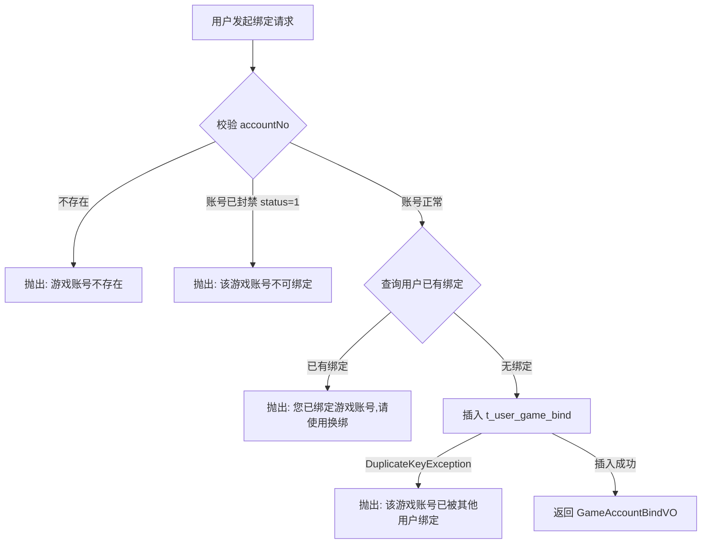
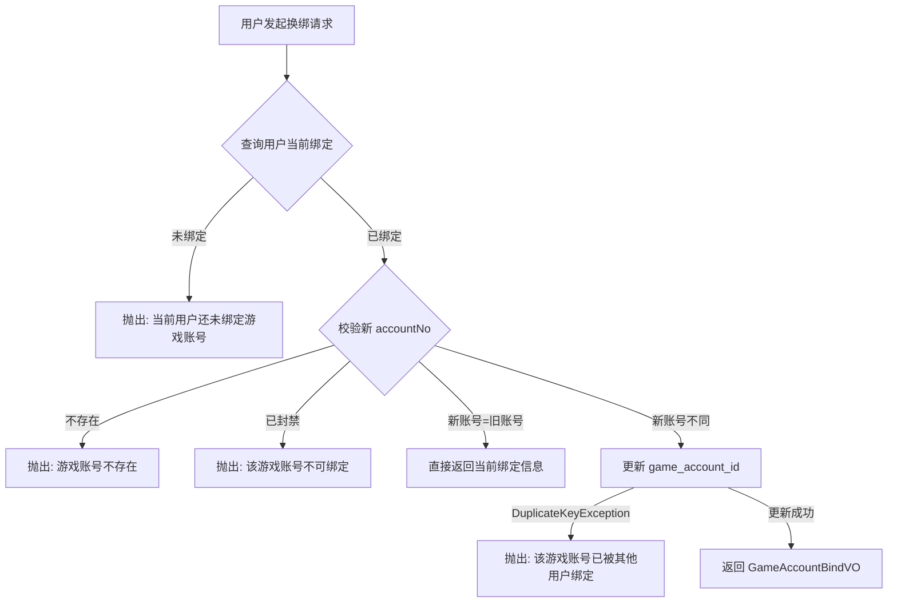
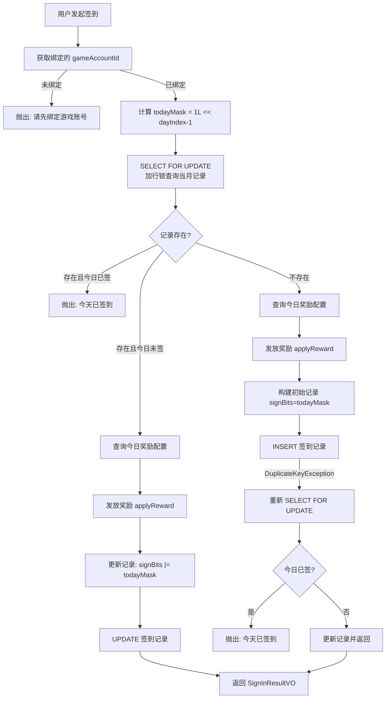
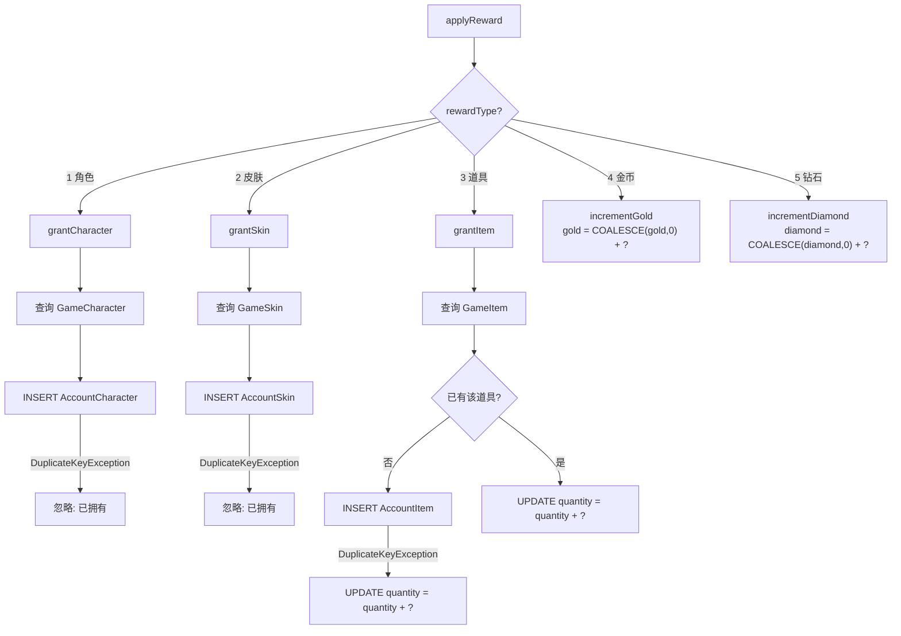
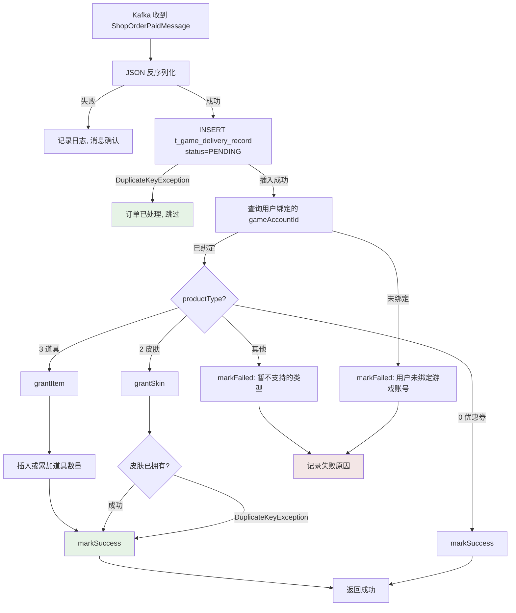

# 游戏账号服务 (game-account-service) 技术文档

## 1. 服务概述

### 1.1 基本信息

| 项目 | 值 |
|------|-----|
| 服务名 | `game-account-service` |
| 端口 | `8083` |
| 服务注册 | Nacos (`localhost:8848`) |
| 基路径 | `/game-account` |
| 数据库 | MySQL (`game_community`) + MongoDB |

### 1.2 核心职责

1. **游戏账号绑定**：社区用户与游戏账号的一对一绑定/换绑/解绑
2. **角色/皮肤/道具资产**：管理用户拥有的角色、皮肤、道具，以及全局资源目录（含拥有标记）
3. **签到系统**：按月签到，位运算记录签到状态，签到即发放奖励
4. **商城发货**：通过 Kafka 监听商城订单支付事件，幂等地将皮肤/道具发放到游戏账号
5. **管理接口**：角色、皮肤、道具元数据的 CRUD，以及 MongoDB 详情文档的 upsert 管理

### 1.3 技术栈

| 类别 | 技术 |
|------|------|
| 语言 | Java 17+ |
| 框架 | Spring Boot 3.x + Spring Cloud |
| 注册中心 | Nacos |
| ORM (MySQL) | MyBatis-Plus |
| ORM (MongoDB) | Spring Data MongoDB |
| 消息队列 | Apache Kafka |
| 远程调用 | OpenFeign |
| 网关 | Spring Cloud Gateway（透传用户身份 Header） |
| 构建 | Maven |

### 1.4 应用入口

```java
@EnableAsync
@MapperScan("com.game.community.game.mapper")
@EnableFeignClients(basePackages = "com.game.community.feign")
@SpringBootApplication
public class GameAccountServiceApplication {
    public static void main(String[] args) {
        SpringApplication.run(GameAccountServiceApplication.class, args);
    }
}
```

### 1.5 配置文件 (bootstrap.yml)

```yaml
spring:
  application:
    name: game-account-service
  cloud:
    nacos:
      discovery:
        enabled: ${NACOS_DISCOVERY_ENABLED:true}
        server-addr: localhost:8848
      config:
        enabled: ${NACOS_CONFIG_ENABLED:false}
        server-addr: localhost:8848
```

---

## 2. 数据模型

### 2.1 MySQL 表结构 (11 张表)

#### 2.1.1 t_game_account — 游戏账号表

存储游戏账号的基础信息，由外部系统导入或管理。

```sql
CREATE TABLE IF NOT EXISTS t_game_account (
    id BIGINT PRIMARY KEY AUTO_INCREMENT COMMENT '主键',
    account_no VARCHAR(64) NOT NULL COMMENT '对外展示的游戏账号号',
    name VARCHAR(64) NOT NULL COMMENT '游戏昵称',
    level INT NOT NULL DEFAULT 1 COMMENT '等级',
    gold BIGINT NOT NULL DEFAULT 0 COMMENT '金币',
    diamond BIGINT NOT NULL DEFAULT 0 COMMENT '钻石',
    current_season_rank VARCHAR(64) NOT NULL DEFAULT '' COMMENT '当前赛季段位',
    history_season_rank VARCHAR(64) NOT NULL DEFAULT '' COMMENT '历史最高段位',
    status TINYINT NOT NULL DEFAULT 0 COMMENT '状态: 0正常, 1封禁',
    version INT NOT NULL DEFAULT 0 COMMENT '乐观锁版本',
    create_time DATETIME NOT NULL DEFAULT CURRENT_TIMESTAMP,
    update_time DATETIME NOT NULL DEFAULT CURRENT_TIMESTAMP ON UPDATE CURRENT_TIMESTAMP,
    UNIQUE KEY uk_game_account_no (account_no)
) COMMENT='游戏账号表';
```

**实体类：** `GameAccount.java`
```java
@Data
@TableName("t_game_account")
public class GameAccount implements Serializable {
    @TableId(type = IdType.AUTO)
    private Long id;
    private String accountNo;
    private String name;
    private Integer level;
    private Long gold;
    private Long diamond;
    private String currentSeasonRank;
    private String historySeasonRank;
    private Integer status;       // 0正常, 1封禁
    private Integer version;
    private LocalDateTime createTime;
    private LocalDateTime updateTime;
}
```

---

#### 2.1.2 t_user_game_bind — 用户与游戏账号绑定表

实现社区用户与游戏账号的一对一绑定，通过两个唯一索引保证双向唯一。

```sql
CREATE TABLE IF NOT EXISTS t_user_game_bind (
    id BIGINT PRIMARY KEY AUTO_INCREMENT COMMENT '主键',
    user_id BIGINT NOT NULL COMMENT '社区用户ID',
    game_account_id BIGINT NOT NULL COMMENT '游戏账号ID',
    bind_time DATETIME NOT NULL DEFAULT CURRENT_TIMESTAMP COMMENT '绑定时间',
    create_time DATETIME NOT NULL DEFAULT CURRENT_TIMESTAMP,
    update_time DATETIME NOT NULL DEFAULT CURRENT_TIMESTAMP ON UPDATE CURRENT_TIMESTAMP,
    UNIQUE KEY uk_user_game_bind_user (user_id),        -- 一个用户只能绑定一个游戏账号
    UNIQUE KEY uk_user_game_bind_account (game_account_id), -- 一个游戏账号只能被一个用户绑定
    INDEX idx_game_bind_account (game_account_id)
) COMMENT='用户与游戏账号绑定表';
```

**实体类：** `UserGameBind.java`
```java
@Data
@TableName("t_user_game_bind")
public class UserGameBind implements Serializable {
    @TableId(type = IdType.AUTO)
    private Long id;
    private Long userId;
    private Long gameAccountId;
    private LocalDateTime bindTime;
    private LocalDateTime createTime;
    private LocalDateTime updateTime;
}
```

---

#### 2.1.3 t_game_character — 角色元数据表

定义全局可用的角色资源，是资源目录的核心数据。

```sql
CREATE TABLE IF NOT EXISTS t_game_character (
    id BIGINT PRIMARY KEY AUTO_INCREMENT COMMENT '主键',
    character_code VARCHAR(64) NOT NULL COMMENT '角色编码',
    name VARCHAR(64) NOT NULL COMMENT '角色名称',
    title VARCHAR(128) NOT NULL DEFAULT '' COMMENT '角色称号',
    icon VARCHAR(512) NOT NULL DEFAULT '' COMMENT '角色图标',
    rarity TINYINT NOT NULL DEFAULT 1 COMMENT '稀有度',
    element_type TINYINT NOT NULL DEFAULT 0 COMMENT '元素类型',
    character_type TINYINT NOT NULL DEFAULT 0 COMMENT '角色类型',
    status TINYINT NOT NULL DEFAULT 1 COMMENT '状态: 0禁用, 1启用',
    sort_order INT NOT NULL DEFAULT 0 COMMENT '排序值',
    version INT NOT NULL DEFAULT 0 COMMENT '乐观锁版本',
    create_time DATETIME NOT NULL DEFAULT CURRENT_TIMESTAMP,
    update_time DATETIME NOT NULL DEFAULT CURRENT_TIMESTAMP ON UPDATE CURRENT_TIMESTAMP,
    UNIQUE KEY uk_game_character_code (character_code),
    INDEX idx_game_character_status_sort (status, sort_order)
) COMMENT='角色元数据表';
```

**实体类：** `GameCharacter.java`
```java
@Data
@TableName("t_game_character")
public class GameCharacter implements Serializable {
    @TableId(type = IdType.AUTO)
    private Long id;
    private String characterCode;
    private String name;
    private String title;
    private String icon;
    private Integer rarity;
    private Integer elementType;
    private Integer characterType;
    private Integer status;       // 0禁用, 1启用
    private Integer sortOrder;
    private Integer version;
    private LocalDateTime createTime;
    private LocalDateTime updateTime;
}
```

---

#### 2.1.4 t_game_skin — 皮肤元数据表

```sql
CREATE TABLE IF NOT EXISTS t_game_skin (
    id BIGINT PRIMARY KEY AUTO_INCREMENT COMMENT '主键',
    skin_code VARCHAR(64) NOT NULL COMMENT '皮肤编码',
    character_id BIGINT NULL COMMENT '所属角色ID',
    character_code VARCHAR(64) NOT NULL DEFAULT '' COMMENT '所属角色编码',
    name VARCHAR(64) NOT NULL COMMENT '皮肤名称',
    icon VARCHAR(512) NOT NULL DEFAULT '' COMMENT '皮肤图标',
    rarity TINYINT NOT NULL DEFAULT 1 COMMENT '稀有度',
    status TINYINT NOT NULL DEFAULT 1 COMMENT '状态: 0禁用, 1启用',
    sort_order INT NOT NULL DEFAULT 0 COMMENT '排序值',
    version INT NOT NULL DEFAULT 0 COMMENT '乐观锁版本',
    create_time DATETIME NOT NULL DEFAULT CURRENT_TIMESTAMP,
    update_time DATETIME NOT NULL DEFAULT CURRENT_TIMESTAMP ON UPDATE CURRENT_TIMESTAMP,
    UNIQUE KEY uk_game_skin_code (skin_code),
    INDEX idx_game_skin_character (character_code),
    INDEX idx_game_skin_status_sort (status, sort_order)
) COMMENT='皮肤元数据表';
```

**实体类：** `GameSkin.java`
```java
@Data
@TableName("t_game_skin")
public class GameSkin implements Serializable {
    @TableId(type = IdType.AUTO)
    private Long id;
    private String skinCode;
    private Long characterId;
    private String characterCode;
    private String name;
    private String icon;
    private Integer rarity;
    private Integer status;
    private Integer sortOrder;
    private Integer version;
    private LocalDateTime createTime;
    private LocalDateTime updateTime;
}
```

---

#### 2.1.5 t_game_item — 道具元数据表

```sql
CREATE TABLE IF NOT EXISTS t_game_item (
    id BIGINT PRIMARY KEY AUTO_INCREMENT COMMENT '主键',
    item_code VARCHAR(64) NOT NULL COMMENT '道具编码',
    name VARCHAR(64) NOT NULL COMMENT '道具名称',
    item_type TINYINT NOT NULL DEFAULT 0 COMMENT '道具类型',
    rarity TINYINT NOT NULL DEFAULT 1 COMMENT '稀有度',
    icon VARCHAR(512) NOT NULL DEFAULT '' COMMENT '道具图标',
    max_stack_count INT NOT NULL DEFAULT 9999 COMMENT '最大堆叠数',
    status TINYINT NOT NULL DEFAULT 1 COMMENT '状态: 0禁用, 1启用',
    sort_order INT NOT NULL DEFAULT 0 COMMENT '排序值',
    version INT NOT NULL DEFAULT 0 COMMENT '乐观锁版本',
    create_time DATETIME NOT NULL DEFAULT CURRENT_TIMESTAMP,
    update_time DATETIME NOT NULL DEFAULT CURRENT_TIMESTAMP ON UPDATE CURRENT_TIMESTAMP,
    UNIQUE KEY uk_game_item_code (item_code),
    INDEX idx_game_item_status_sort (status, sort_order)
) COMMENT='道具元数据表';
```

**实体类：** `GameItem.java`
```java
@Data
@TableName("t_game_item")
public class GameItem implements Serializable {
    @TableId(type = IdType.AUTO)
    private Long id;
    private String itemCode;
    private String name;
    private Integer itemType;
    private Integer rarity;
    private String icon;
    private Integer maxStackCount;
    private Integer status;
    private Integer sortOrder;
    private Integer version;
    private LocalDateTime createTime;
    private LocalDateTime updateTime;
}
```

---

#### 2.1.6 t_account_character — 账号拥有角色表

记录某游戏账号拥有的角色，唯一索引保证同一账号不会重复获得同一角色。

```sql
CREATE TABLE IF NOT EXISTS t_account_character (
    id BIGINT PRIMARY KEY AUTO_INCREMENT COMMENT '主键',
    game_account_id BIGINT NOT NULL COMMENT '游戏账号ID',
    character_id BIGINT NOT NULL COMMENT '角色ID',
    character_code VARCHAR(64) NOT NULL COMMENT '角色编码',
    level INT NOT NULL DEFAULT 1 COMMENT '角色等级',
    exp INT NOT NULL DEFAULT 0 COMMENT '角色经验',
    breakthrough_level INT NOT NULL DEFAULT 0 COMMENT '突破等级',
    obtain_time DATETIME NOT NULL DEFAULT CURRENT_TIMESTAMP COMMENT '获取时间',
    status TINYINT NOT NULL DEFAULT 1 COMMENT '状态: 0禁用, 1启用',
    version INT NOT NULL DEFAULT 0 COMMENT '乐观锁版本',
    create_time DATETIME NOT NULL DEFAULT CURRENT_TIMESTAMP,
    update_time DATETIME NOT NULL DEFAULT CURRENT_TIMESTAMP ON UPDATE CURRENT_TIMESTAMP,
    UNIQUE KEY uk_account_character (game_account_id, character_code),
    INDEX idx_account_character_account (game_account_id)
) COMMENT='账号拥有角色表';
```

**实体类：** `AccountCharacter.java`
```java
@Data
@TableName("t_account_character")
public class AccountCharacter implements Serializable {
    @TableId(type = IdType.AUTO)
    private Long id;
    private Long gameAccountId;
    private Long characterId;
    private String characterCode;
    private Integer level;
    private Integer exp;
    private Integer breakthroughLevel;
    private LocalDateTime obtainTime;
    private Integer status;
    private Integer version;
    private LocalDateTime createTime;
    private LocalDateTime updateTime;
}
```

---

#### 2.1.7 t_account_skin — 账号拥有皮肤表

```sql
CREATE TABLE IF NOT EXISTS t_account_skin (
    id BIGINT PRIMARY KEY AUTO_INCREMENT COMMENT '主键',
    game_account_id BIGINT NOT NULL COMMENT '游戏账号ID',
    skin_id BIGINT NOT NULL COMMENT '皮肤ID',
    character_id BIGINT NULL COMMENT '所属角色ID',
    skin_code VARCHAR(64) NOT NULL COMMENT '皮肤编码',
    character_code VARCHAR(64) NOT NULL DEFAULT '' COMMENT '所属角色编码',
    equip_status TINYINT NOT NULL DEFAULT 0 COMMENT '装备状态: 0未装备, 1已装备',
    obtain_time DATETIME NOT NULL DEFAULT CURRENT_TIMESTAMP COMMENT '获取时间',
    status TINYINT NOT NULL DEFAULT 1 COMMENT '状态: 0禁用, 1启用',
    version INT NOT NULL DEFAULT 0 COMMENT '乐观锁版本',
    create_time DATETIME NOT NULL DEFAULT CURRENT_TIMESTAMP,
    update_time DATETIME NOT NULL DEFAULT CURRENT_TIMESTAMP ON UPDATE CURRENT_TIMESTAMP,
    UNIQUE KEY uk_account_skin (game_account_id, skin_code),
    INDEX idx_account_skin_account (game_account_id)
) COMMENT='账号拥有皮肤表';
```

**实体类：** `AccountSkin.java`
```java
@Data
@TableName("t_account_skin")
public class AccountSkin implements Serializable {
    @TableId(type = IdType.AUTO)
    private Long id;
    private Long gameAccountId;
    private Long skinId;
    private Long characterId;
    private String skinCode;
    private String characterCode;
    private Integer equipStatus;  // 0未装备, 1已装备
    private LocalDateTime obtainTime;
    private Integer status;
    private Integer version;
    private LocalDateTime createTime;
    private LocalDateTime updateTime;
}
```

---

#### 2.1.8 t_account_item — 账号拥有道具表

道具支持堆叠，同一账号同一道具只有一条记录，通过 `quantity` 字段累计数量。

```sql
CREATE TABLE IF NOT EXISTS t_account_item (
    id BIGINT PRIMARY KEY AUTO_INCREMENT COMMENT '主键',
    game_account_id BIGINT NOT NULL COMMENT '游戏账号ID',
    item_id BIGINT NOT NULL COMMENT '道具ID',
    item_code VARCHAR(64) NOT NULL COMMENT '道具编码',
    quantity INT NOT NULL DEFAULT 0 COMMENT '当前数量',
    last_obtain_time DATETIME NOT NULL DEFAULT CURRENT_TIMESTAMP COMMENT '最后一次获得时间',
    status TINYINT NOT NULL DEFAULT 1 COMMENT '状态: 0禁用, 1启用',
    version INT NOT NULL DEFAULT 0 COMMENT '乐观锁版本',
    create_time DATETIME NOT NULL DEFAULT CURRENT_TIMESTAMP,
    update_time DATETIME NOT NULL DEFAULT CURRENT_TIMESTAMP ON UPDATE CURRENT_TIMESTAMP,
    UNIQUE KEY uk_account_item (game_account_id, item_code),
    INDEX idx_account_item_account (game_account_id)
) COMMENT='账号拥有道具表';
```

**实体类：** `AccountItem.java`
```java
@Data
@TableName("t_account_item")
public class AccountItem implements Serializable {
    @TableId(type = IdType.AUTO)
    private Long id;
    private Long gameAccountId;
    private Long itemId;
    private String itemCode;
    private Integer quantity;
    private LocalDateTime lastObtainTime;
    private Integer status;
    private Integer version;
    private LocalDateTime createTime;
    private LocalDateTime updateTime;
}
```

---

#### 2.1.9 t_sign_in_reward — 签到奖励配置表

按天序号配置签到奖励，每天仅能有一种奖励。

```sql
CREATE TABLE IF NOT EXISTS t_sign_in_reward (
    id BIGINT PRIMARY KEY AUTO_INCREMENT COMMENT '主键',
    day_index INT NOT NULL COMMENT '签到天数序号',
    reward_type TINYINT NOT NULL COMMENT '奖励类型: 1角色, 2皮肤, 3道具, 4金币, 5钻石',
    business_code VARCHAR(64) NOT NULL DEFAULT '' COMMENT '奖励业务编码',
    reward_code VARCHAR(64) NOT NULL DEFAULT '' COMMENT '奖励资源编码',
    quantity INT NOT NULL DEFAULT 1 COMMENT '奖励数量',
    reward_name VARCHAR(128) NOT NULL DEFAULT '' COMMENT '奖励展示名称',
    status TINYINT NOT NULL DEFAULT 1 COMMENT '状态: 0禁用, 1启用',
    create_time DATETIME NOT NULL DEFAULT CURRENT_TIMESTAMP,
    update_time DATETIME NOT NULL DEFAULT CURRENT_TIMESTAMP ON UPDATE CURRENT_TIMESTAMP,
    UNIQUE KEY uk_sign_in_reward_day (day_index)
) COMMENT='签到奖励配置表';
```

**reward_type 枚举值：**

| 值 | 含义 | 发放逻辑 |
|----|------|----------|
| 1 | 角色 | 插入 `t_account_character`，忽略 DuplicateKey |
| 2 | 皮肤 | 插入 `t_account_skin`，忽略 DuplicateKey |
| 3 | 道具 | 插入或累加 `t_account_item` 的 `quantity` |
| 4 | 金币 | `UPDATE t_game_account SET gold = COALESCE(gold, 0) + ?` |
| 5 | 钻石 | `UPDATE t_game_account SET diamond = COALESCE(diamond, 0) + ?` |

**实体类：** `SignInReward.java`
```java
@Data
@TableName("t_sign_in_reward")
public class SignInReward implements Serializable {
    @TableId(type = IdType.AUTO)
    private Long id;
    private Integer dayIndex;
    private Integer rewardType;
    private String businessCode;
    private String rewardCode;
    private Integer quantity;
    private String rewardName;
    private Integer status;
    private LocalDateTime createTime;
    private LocalDateTime updateTime;
}
```

---

#### 2.1.10 t_sign_in_record — 月度签到状态表

每个游戏账号每月一条记录，通过 `sign_bits` 位掩码记录每日签到状态。

```sql
CREATE TABLE IF NOT EXISTS t_sign_in_record (
    id BIGINT PRIMARY KEY AUTO_INCREMENT COMMENT '主键',
    game_account_id BIGINT NOT NULL COMMENT '游戏账号ID',
    month_key CHAR(7) NOT NULL COMMENT '月份, 例如 2026-05',
    sign_bits BIGINT NOT NULL DEFAULT 0 COMMENT '按位记录每日签到状态',
    sign_count INT NOT NULL DEFAULT 0 COMMENT '当月签到次数',
    consecutive_days INT NOT NULL DEFAULT 0 COMMENT '连续签到天数',
    last_sign_in_date DATETIME NULL COMMENT '最近一次签到时间',
    create_time DATETIME NOT NULL DEFAULT CURRENT_TIMESTAMP,
    update_time DATETIME NOT NULL DEFAULT CURRENT_TIMESTAMP ON UPDATE CURRENT_TIMESTAMP,
    UNIQUE KEY uk_sign_in_record_month (game_account_id, month_key)
) COMMENT='月度签到状态表';
```

**sign_bits 位运算说明：**

- `BIGINT` 共 64 位，足够覆盖一个月最多 31 天
- 第 N 天对应 bit `(N-1)`，即 `1L << (dayIndex - 1)`
- 签到：`signBits = signBits | (1L << (dayIndex - 1))`
- 判断某天是否已签：`(signBits & (1L << (dayIndex - 1))) != 0`
- 提取已签到天列表：遍历 bit 0~30，若 `(signBits & (1L << i)) != 0` 则天号为 `i + 1`

**实体类：** `SignInRecord.java`
```java
@Data
@TableName("t_sign_in_record")
public class SignInRecord implements Serializable {
    @TableId(type = IdType.AUTO)
    private Long id;
    private Long gameAccountId;
    @TableField("month_key")
    private String yearMonth;     // 格式: "2026-05"
    private Long signBits;
    private Integer signCount;
    private Integer consecutiveDays;
    private LocalDateTime lastSignInDate;
    private LocalDateTime createTime;
    private LocalDateTime updateTime;
}
```

---

#### 2.1.11 t_game_delivery_record — 游戏资源发货幂等表

记录商城订单发货状态，`order_no` 唯一索引保证幂等。

```sql
CREATE TABLE IF NOT EXISTS t_game_delivery_record (
    id BIGINT PRIMARY KEY AUTO_INCREMENT COMMENT '主键',
    order_no VARCHAR(64) NOT NULL COMMENT '商城订单号',
    user_id BIGINT NOT NULL COMMENT '社区用户ID',
    game_account_id BIGINT NULL COMMENT '发货时解析到的游戏账号ID',
    product_type INT NOT NULL COMMENT '商品类型',
    business_code VARCHAR(64) NOT NULL DEFAULT '' COMMENT '业务编码',
    business_id BIGINT NULL COMMENT '业务ID',
    quantity INT NOT NULL DEFAULT 1 COMMENT '发放数量',
    status TINYINT NOT NULL DEFAULT 0 COMMENT '状态: 0待处理, 1成功, 2失败',
    fail_reason VARCHAR(255) NOT NULL DEFAULT '' COMMENT '失败原因',
    create_time DATETIME NOT NULL DEFAULT CURRENT_TIMESTAMP,
    update_time DATETIME NOT NULL DEFAULT CURRENT_TIMESTAMP ON UPDATE CURRENT_TIMESTAMP,
    UNIQUE KEY uk_game_delivery_order (order_no),
    INDEX idx_game_delivery_user_status (user_id, status),
    INDEX idx_game_delivery_account_status (game_account_id, status)
) COMMENT='游戏资源发货幂等表';
```

**status 枚举值：**

| 值 | 含义 |
|----|------|
| 0 | 待处理 |
| 1 | 成功 |
| 2 | 失败 |

**product_type 与 ShopConstants 的映射：**

| product_type | 常量 | 含义 | 发货行为 |
|-------------|------|------|----------|
| 0 | `PRODUCT_TYPE_COUPON` | 优惠券 | 仅标记成功，无资源发放 |
| 2 | `PRODUCT_TYPE_SKIN` | 皮肤 | 插入 `t_account_skin` |
| 3 | `PRODUCT_TYPE_ITEM` | 道具 | 插入或累加 `t_account_item` |

**实体类：** `GameDeliveryRecord.java`
```java
@Data
@TableName("t_game_delivery_record")
public class GameDeliveryRecord implements Serializable {
    @TableId(type = IdType.AUTO)
    private Long id;
    private String orderNo;
    private Long userId;
    private Long gameAccountId;
    private Integer productType;
    private String businessCode;
    private Long businessId;
    private Integer quantity;
    private Integer status;
    private String failReason;
    private LocalDateTime createTime;
    private LocalDateTime updateTime;
}
```

---

### 2.2 MongoDB 集合 (3 个)

MongoDB 用于存储资源的大文本详情，与 MySQL 元数据通过 `code` 字段关联。

#### 2.2.1 t_character_detail — 角色详情

```java
@Document(collection = "t_character_detail")
public class CharacterDetail {
    @Id
    private String id;
    @Indexed(unique = true)
    private String characterCode;   // 关联 t_game_character.character_code
    private String story;           // 角色故事
    private String background;      // 角色背景
    private List<String> skills;    // 技能列表
    private List<String> tags;      // 标签列表
    private LocalDateTime createTime;
    private LocalDateTime updateTime;
}
```

#### 2.2.2 t_skin_detail — 皮肤详情

```java
@Document(collection = "t_skin_detail")
public class SkinDetail {
    @Id
    private String id;
    @Indexed(unique = true)
    private String skinCode;        // 关联 t_game_skin.skin_code
    private String description;     // 皮肤描述
    private String theme;           // 皮肤主题
    private List<String> previewImages; // 预览图列表
    private List<String> tags;      // 标签列表
    private LocalDateTime createTime;
    private LocalDateTime updateTime;
}
```

#### 2.2.3 t_item_detail — 道具详情

```java
@Document(collection = "t_item_detail")
public class ItemDetail {
    @Id
    private String id;
    @Indexed(unique = true)
    private String itemCode;        // 关联 t_game_item.item_code
    private String description;     // 道具描述
    private String usageTips;       // 使用提示
    private List<String> sources;   // 获取来源
    private List<String> tags;      // 标签列表
    private LocalDateTime createTime;
    private LocalDateTime updateTime;
}
```

#### 2.2.4 MongoDB Repository

三个 Repository 均继承 `MongoRepository`，并按 `code` 字段提供查询方法：

```java
public interface CharacterDetailRepository extends MongoRepository<CharacterDetail, String> {
    Optional<CharacterDetail> findByCharacterCode(String characterCode);
}

public interface SkinDetailRepository extends MongoRepository<SkinDetail, String> {
    Optional<SkinDetail> findBySkinCode(String skinCode);
}

public interface ItemDetailRepository extends MongoRepository<ItemDetail, String> {
    Optional<ItemDetail> findByItemCode(String itemCode);
}
```

---

## 3. 功能模块详解

### 3.1 绑定系统

#### 3.1.1 接口列表

| 方法 | 路径 | 说明 | 认证 |
|------|------|------|------|
| POST | `/game-account/bind` | 绑定游戏账号 | @LoginCheck |
| PUT | `/game-account/rebind` | 换绑游戏账号 | @LoginCheck |
| DELETE | `/game-account/unbind` | 解绑游戏账号 | @LoginCheck |
| GET | `/game-account/me` | 查询当前绑定信息 | @LoginCheck |

#### 3.1.2 请求/响应模型

**请求 DTO：**
```java
@Data
public class GameAccountBindDTO implements Serializable {
    @NotBlank(message = "游戏账号号不能为空")
    private String accountNo;
}
```

**绑定成功响应 VO：**
```java
@Data
public class GameAccountBindVO implements Serializable {
    private Long bindId;
    private Long gameAccountId;
    private String accountNo;
    private String name;
    private LocalDateTime bindTime;
    private LocalDateTime createTime;
}
```

**当前账号信息响应 VO：**
```java
@Data
public class GameAccountProfileVO implements Serializable {
    private Long gameAccountId;
    private Boolean bound;           // 是否已绑定
    private String accountNo;
    private String name;
    private Integer level;
    private Long gold;
    private Long diamond;
    private String currentSeasonRank;
    private String historySeasonRank;
    private Integer status;
    private LocalDateTime updateTime;
}
```

#### 3.1.3 绑定流程 (bind)

```java
@Transactional(rollbackFor = Exception.class)
public GameAccountBindVO bind(Long userId, GameAccountBindDTO dto) {
    // 1. 校验游戏账号存在且状态正常 (status != 1 即未封禁)
    GameAccount account = requireActiveAccount(dto.getAccountNo());
    // 2. 检查当前用户是否已绑定
    UserGameBind existingBind = findByUserId(userId);
    if (existingBind != null) {
        throw new BusinessException("您已绑定游戏账号，请使用换绑");
    }
    // 3. 插入绑定记录
    UserGameBind bind = new UserGameBind();
    bind.setUserId(userId);
    bind.setGameAccountId(account.getId());
    bind.setBindTime(LocalDateTime.now());
    try {
        userGameBindMapper.insert(bind);
    } catch (DuplicateKeyException e) {
        // 4. 唯一索引冲突 = 该游戏账号已被其他用户绑定
        throw new BusinessException("该游戏账号已被其他用户绑定");
    }
    return toBindVO(bind, account);
}
```

**并发安全：** 依赖 `uk_user_game_bind_user` 和 `uk_user_game_bind_account` 两个唯一索引，`DuplicateKeyException` 捕获后转化为业务异常。

#### 3.1.4 换绑流程 (rebind)

```java
@Transactional(rollbackFor = Exception.class)
public GameAccountBindVO rebind(Long userId, GameAccountBindDTO dto) {
    // 1. 查询当前绑定（必须已绑定才能换绑）
    UserGameBind existingBind = findByUserId(userId);
    if (existingBind == null) {
        throw new BusinessException("当前用户还未绑定游戏账号");
    }
    // 2. 校验新游戏账号
    GameAccount account = requireActiveAccount(dto.getAccountNo());
    if (account.getId().equals(existingBind.getGameAccountId())) {
        return toBindVO(existingBind, account); // 同一个账号直接返回
    }
    // 3. 更新绑定
    existingBind.setGameAccountId(account.getId());
    existingBind.setBindTime(LocalDateTime.now());
    try {
        userGameBindMapper.updateById(existingBind);
    } catch (DuplicateKeyException e) {
        throw new BusinessException("该游戏账号已被其他用户绑定");
    }
    return toBindVO(existingBind, account);
}
```

#### 3.1.5 解绑流程 (unbind)

```java
@Transactional(rollbackFor = Exception.class)
public void unbind(Long userId) {
    UserGameBind existingBind = findByUserId(userId);
    if (existingBind == null) {
        throw new BusinessException("当前用户还未绑定游戏账号");
    }
    userGameBindMapper.deleteById(existingBind.getId());
}
```

#### 3.1.6 查询当前绑定 (current)

- 未绑定时返回 `bound = false`，其余字段为 null
- 已绑定时返回完整 `GameAccountProfileVO`

---

### 3.2 账号资产

#### 3.2.1 接口列表

| 方法 | 路径 | 说明 | 认证 |
|------|------|------|------|
| GET | `/game-account/assets/characters` | 我的角色列表 | @LoginCheck |
| GET | `/game-account/assets/skins` | 我的皮肤列表 | @LoginCheck |
| GET | `/game-account/assets/items` | 我的道具列表 | @LoginCheck |

#### 3.2.2 响应模型

**OwnedCharacterVO：**
```java
@Data
public class OwnedCharacterVO implements Serializable {
    private Long characterId;
    private String characterCode;
    private String name;
    private String icon;
    private Integer rarity;
    private Integer level;
    private Integer status;
    private LocalDateTime obtainTime;
}
```

**OwnedSkinVO：**
```java
@Data
public class OwnedSkinVO implements Serializable {
    private Long skinId;
    private String skinCode;
    private Long characterId;
    private String characterCode;
    private String name;
    private String icon;
    private Integer rarity;
    private Integer equipStatus;
    private Integer status;
    private LocalDateTime obtainTime;
}
```

**OwnedItemVO：**
```java
@Data
public class OwnedItemVO implements Serializable {
    private Long itemId;
    private String itemCode;
    private String name;
    private String icon;
    private Integer itemType;
    private Integer rarity;
    private Integer quantity;
    private Integer status;
    private LocalDateTime lastObtainTime;
}
```

#### 3.2.3 查询逻辑

三者的查询模式相同：

1. 通过 `userId` 查 `t_user_game_bind` 获取 `gameAccountId`（未绑定则抛异常）
2. 分页查询 `t_account_character/skin/item`，条件为 `game_account_id = ? AND status = 1`
3. 道具额外加 `quantity > 0` 条件
4. 按 `obtain_time DESC, id DESC` 排序
5. 批量查询 `t_game_character/skin/item` 元数据补全名称/图标等信息
6. 组装 VO 返回

**请求参数：**

| 参数 | 默认值 | 说明 |
|------|--------|------|
| page | 1 | 页码 |
| size | 10 | 每页条数 |

---

### 3.3 资源目录

#### 3.3.1 接口列表

| 方法 | 路径 | 说明 | 认证 |
|------|------|------|------|
| GET | `/game-account/resources/characters` | 角色图鉴（含拥有标记） | @LoginCheck |
| GET | `/game-account/resources/skins` | 皮肤图鉴（含拥有标记） | @LoginCheck |
| GET | `/game-account/resources/items` | 道具图鉴（含拥有标记） | @LoginCheck |
| GET | `/game-account/resources/characters/{characterCode}/detail` | 角色详情（MongoDB） | @LoginCheck |
| GET | `/game-account/resources/skins/{skinCode}/detail` | 皮肤详情（MongoDB） | @LoginCheck |
| GET | `/game-account/resources/items/{itemCode}/detail` | 道具详情（MongoDB） | @LoginCheck |

#### 3.3.2 响应模型

**CharacterResourceVO（图鉴项）：**
```java
@Data
public class CharacterResourceVO implements Serializable {
    private Long characterId;
    private String characterCode;
    private String name;
    private String title;
    private String icon;
    private Integer rarity;
    private Integer elementType;
    private Integer characterType;
    private Integer status;
    private Boolean owned;            // 当前用户是否已拥有
}
```

**SkinResourceVO（图鉴项）：**
```java
@Data
public class SkinResourceVO implements Serializable {
    private Long skinId;
    private String skinCode;
    private Long characterId;
    private String characterCode;
    private String name;
    private String icon;
    private Integer rarity;
    private Integer status;
    private Boolean owned;
    private Integer equipStatus;      // 已拥有时显示装备状态
}
```

**ItemResourceVO（图鉴项）：**
```java
@Data
public class ItemResourceVO implements Serializable {
    private Long itemId;
    private String itemCode;
    private String name;
    private Integer itemType;
    private Integer rarity;
    private String icon;
    private Integer maxStackCount;
    private Integer status;
    private Boolean owned;
    private Integer quantity;         // 已拥有时显示拥有数量
}
```

#### 3.3.3 查询逻辑

资源目录的核心特点是**同时展示全局资源列表和当前用户的拥有状态**：

1. 通过 `userId` 查 `t_user_game_bind` 获取 `gameAccountId`（未绑定时 `gameAccountId = null`，owned 全为 false）
2. 分页查询 `t_game_character/skin/item`（status = 1），支持关键字搜索和条件筛选
3. 批量查询当前用户在 `t_account_character/skin/item` 中的拥有记录
4. 组装 VO，标记 `owned` 标志和额外信息（皮肤装备状态、道具数量）

**角色图鉴查询参数：**

| 参数 | 默认值 | 说明 |
|------|--------|------|
| page | 1 | 页码 |
| size | 10 | 每页条数 |
| keyword | null | 模糊搜索名称/编码/称号 |
| rarity | null | 按稀有度筛选 |

**皮肤图鉴查询参数：**

| 参数 | 默认值 | 说明 |
|------|--------|------|
| page | 1 | 页码 |
| size | 10 | 每页条数 |
| keyword | null | 模糊搜索名称/编码 |
| characterId | null | 按所属角色筛选 |
| rarity | null | 按稀有度筛选 |

**道具图鉴查询参数：**

| 参数 | 默认值 | 说明 |
|------|--------|------|
| page | 1 | 页码 |
| size | 10 | 每页条数 |
| keyword | null | 模糊搜索名称/编码 |
| itemType | null | 按道具类型筛选 |

**详情接口**：直接通过 MongoDB Repository 的 `findByXxxCode` 查询，返回 `CharacterDetail`/`SkinDetail`/`ItemDetail` 对象。

---

### 3.4 签到系统

#### 3.4.1 接口列表

| 方法 | 路径 | 说明 | 认证 |
|------|------|------|------|
| POST | `/game-account/sign-in` | 执行签到 | @LoginCheck |
| GET | `/game-account/sign-in/status` | 当月签到状态 | @LoginCheck |
| GET | `/game-account/sign-in/rewards` | 签到奖励配置 | @LoginCheck |

#### 3.4.2 签到执行流程 (signIn)

签到是最复杂的业务流程，核心在于**行锁 + 位运算 + 事务内发放奖励**。

```java
@Transactional(rollbackFor = Exception.class)
public SignInResultVO signIn(Long userId) {
    // 1. 获取绑定的游戏账号ID
    Long gameAccountId = requireBoundGameAccountId(userId);

    // 2. 计算今天的日期参数
    LocalDate today = LocalDate.now();
    String yearMonth = YearMonth.from(today).toString();  // "2026-06"
    int dayIndex = today.getDayOfMonth();                   // 1~31
    long todayMask = 1L << (dayIndex - 1);                 // 位掩码

    // 3. 加行锁查询当月记录 (SELECT ... FOR UPDATE)
    SignInRecord record = lockCurrentMonthRecord(gameAccountId, yearMonth);

    // 4. 检查今天是否已签到
    if (record != null && (safeSignBits(record) & todayMask) != 0) {
        throw new BusinessException("今天已签到");
    }

    // 5. 查询今日奖励配置
    SignInReward reward = requireReward(dayIndex);

    // 6. 发放奖励（在事务内）
    applyReward(gameAccountId, reward);

    // 7. 更新/插入签到记录
    SignInRecord finalRecord;
    if (record == null) {
        // 首次签到：构建初始记录
        finalRecord = buildInitialRecord(gameAccountId, yearMonth, todayMask, today);
        try {
            signInRecordMapper.insert(finalRecord);
        } catch (DuplicateKeyException e) {
            // 并发插入冲突：重新加锁查询
            finalRecord = lockCurrentMonthRecord(gameAccountId, yearMonth);
            if (finalRecord == null || (safeSignBits(finalRecord) & todayMask) != 0) {
                throw new BusinessException("今天已签到");
            }
            mutateExistingRecord(finalRecord, todayMask, today);
            signInRecordMapper.updateById(finalRecord);
        }
    } else {
        // 已有记录：更新位掩码
        mutateExistingRecord(record, todayMask, today);
        signInRecordMapper.updateById(record);
        finalRecord = record;
    }

    return toResultVO(finalRecord, reward, today);
}
```

**行锁查询关键代码：**
```java
private SignInRecord lockCurrentMonthRecord(Long gameAccountId, String yearMonth) {
    return signInRecordMapper.selectOne(new LambdaQueryWrapper<SignInRecord>()
            .eq(SignInRecord::getGameAccountId, gameAccountId)
            .eq(SignInRecord::getYearMonth, yearMonth)
            .last("limit 1 for update"));  // SELECT FOR UPDATE 行锁
}
```

**位运算更新关键代码：**
```java
private void mutateExistingRecord(SignInRecord record, long todayMask, LocalDate today) {
    long currentBits = safeSignBits(record);
    record.setSignBits(currentBits | todayMask);           // OR 运算设置当日位
    record.setSignCount(defaultZero(record.getSignCount()) + 1);
    record.setConsecutiveDays(
        calculateConsecutiveDays(record.getLastSignInDate(),
                                 defaultZero(record.getConsecutiveDays()), today));
    record.setLastSignInDate(today.atStartOfDay());
    record.setUpdateTime(LocalDateTime.now());
}
```

**连续签到计算：**
```java
private int calculateConsecutiveDays(LocalDateTime lastSignInDate,
                                      int previousConsecutiveDays, LocalDate today) {
    if (lastSignInDate == null) {
        return 1;
    }
    LocalDate lastDate = lastSignInDate.toLocalDate();
    if (lastDate.plusDays(1).equals(today)) {
        return previousConsecutiveDays + 1;  // 昨天签过 → 连续+1
    }
    return 1;  // 非连续 → 重新计数
}
```

#### 3.4.3 奖励发放 (applyReward)

```java
private void applyReward(Long gameAccountId, SignInReward reward) {
    switch (reward.getRewardType()) {
        case REWARD_CHARACTER -> grantCharacter(gameAccountId, reward.getRewardCode());
        case REWARD_SKIN -> grantSkin(gameAccountId, reward.getRewardCode());
        case REWARD_ITEM -> grantItem(gameAccountId, reward.getRewardCode(),
                                       defaultQuantity(reward.getQuantity()));
        case REWARD_GOLD -> incrementGold(gameAccountId, defaultQuantity(reward.getQuantity()));
        case REWARD_DIAMOND -> incrementDiamond(gameAccountId, defaultQuantity(reward.getQuantity()));
        default -> throw new BusinessException("未知的签到奖励类型");
    }
}
```

**角色/皮肤发放：** 插入 `t_account_character`/`t_account_skin`，捕获 `DuplicateKeyException` 忽略（已拥有则跳过）。

**道具发放（可堆叠）：**
```java
private void grantItem(Long gameAccountId, String itemCode, int quantity) {
    // 1. 查询道具元数据
    GameItem item = gameItemMapper.selectOne(...);
    // 2. 查询是否已有该道具
    AccountItem existing = accountItemMapper.selectOne(
        new LambdaQueryWrapper<AccountItem>()
            .eq(AccountItem::getGameAccountId, gameAccountId)
            .eq(AccountItem::getItemId, item.getId())
            .last("limit 1"));
    if (existing == null) {
        // 3a. 不存在：插入新记录
        AccountItem record = new AccountItem();
        record.setQuantity(quantity);
        try {
            accountItemMapper.insert(record);
            return;
        } catch (DuplicateKeyException ignored) {
            // 并发插入冲突，走更新逻辑
        }
    }
    // 3b. 已存在：累加数量
    accountItemMapper.update(null, new LambdaUpdateWrapper<AccountItem>()
        .eq(AccountItem::getGameAccountId, gameAccountId)
        .eq(AccountItem::getItemId, item.getId())
        .setSql("quantity = quantity + " + quantity)   // 原子累加
        .set(AccountItem::getLastObtainTime, LocalDateTime.now())
        .set(AccountItem::getUpdateTime, LocalDateTime.now())
        .set(AccountItem::getStatus, ENABLED_STATUS));
}
```

**金币/钻石发放：**
```java
private void incrementGold(Long gameAccountId, int quantity) {
    requireGameAccount(gameAccountId);
    gameAccountMapper.update(null, new UpdateWrapper<GameAccount>()
        .eq("id", gameAccountId)
        .setSql("gold = COALESCE(gold, 0) + " + quantity)
        .set("update_time", LocalDateTime.now()));
}
```

#### 3.4.4 签到状态查询 (getStatus)

```java
public SignInStatusVO getStatus(Long userId) {
    Long gameAccountId = requireBoundGameAccountId(userId);
    LocalDate today = LocalDate.now();
    String yearMonth = YearMonth.from(today).toString();
    // 无锁查询
    SignInRecord record = signInRecordMapper.selectOne(
        new LambdaQueryWrapper<SignInRecord>()
            .eq(SignInRecord::getGameAccountId, gameAccountId)
            .eq(SignInRecord::getYearMonth, yearMonth)
            .last("limit 1"));

    SignInStatusVO vo = new SignInStatusVO();
    vo.setYearMonth(yearMonth);
    if (record == null) {
        vo.setSignedToday(false);
        vo.setSignCount(0);
        vo.setConsecutiveDays(0);
        vo.setSignBits(0L);
        vo.setSignedDays(List.of());
        return vo;
    }
    long bits = safeSignBits(record);
    vo.setSignedToday((bits & (1L << (today.getDayOfMonth() - 1))) != 0);
    vo.setSignCount(defaultZero(record.getSignCount()));
    vo.setConsecutiveDays(defaultZero(record.getConsecutiveDays()));
    vo.setSignBits(bits);
    vo.setLastSignInDate(record.getLastSignInDate());
    vo.setSignedDays(toSignedDays(bits, today.lengthOfMonth()));
    return vo;
}
```

**已签到天数提取：**
```java
private List<Integer> toSignedDays(long signBits, int daysOfMonth) {
    List<Integer> signedDays = new ArrayList<>();
    for (int i = 0; i < daysOfMonth; i++) {
        if ((signBits & (1L << i)) != 0) {
            signedDays.add(i + 1);
        }
    }
    return signedDays;
}
```

**SignInStatusVO 结构：**
```java
@Data
public class SignInStatusVO implements Serializable {
    private String yearMonth;           // "2026-06"
    private Boolean signedToday;        // 今天是否已签
    private Integer signCount;          // 当月签到总次数
    private Integer consecutiveDays;    // 连续签到天数
    private Long signBits;              // 位掩码原始值
    private LocalDateTime lastSignInDate;
    private List<Integer> signedDays;   // 已签到的日期列表 [1, 3, 5]
}
```

**SignInResultVO 结构：**
```java
@Data
public class SignInResultVO implements Serializable {
    private Boolean signed;             // 固定 true
    private String yearMonth;
    private Integer dayIndex;           // 签到的日期序号
    private Integer signCount;
    private Integer consecutiveDays;
    private String rewardName;          // 奖励展示名称
    private Integer rewardType;
    private String rewardCode;
    private Integer quantity;
    private LocalDateTime signTime;
}
```

---

### 3.5 商城发货 (Kafka Consumer)

#### 3.5.1 Kafka 消费者

```java
@Slf4j
@Component
@RequiredArgsConstructor
public class OrderPaidListener {

    private final ObjectMapper objectMapper;
    private final GameDeliveryService gameDeliveryService;

    @KafkaListener(topics = "shop-order-paid-events", groupId = "game-account-consumer-group")
    public void handleOrderPaid(String payload) {
        try {
            ShopOrderPaidMessage message = objectMapper.readValue(payload, ShopOrderPaidMessage.class);
            gameDeliveryService.deliver(message);
        } catch (JsonProcessingException e) {
            log.error("解析商城支付成功消息失败: payload={}", payload, e);
        } catch (RuntimeException e) {
            log.error("处理商城支付成功消息失败: payload={}", payload, e);
            throw e;  // 重新抛出，触发 Kafka 重试
        }
    }
}
```

**ShopOrderPaidMessage 结构：**
```java
@Data
public class ShopOrderPaidMessage implements Serializable {
    private String orderNo;
    private Long userId;
    private Long itemId;
    private Integer productType;    // 0优惠券, 2皮肤, 3道具
    private Integer price;
    private Long couponId;
    private String businessCode;    // 资源编码 (skin_code / item_code)
    private Integer quantity;
}
```

#### 3.5.2 发货流程 (GameDeliveryServiceImpl.deliver)

```java
@Transactional(rollbackFor = Exception.class)
public void deliver(ShopOrderPaidMessage message) {
    // 1. 创建幂等记录（order_no 唯一索引）
    GameDeliveryRecord record = createPendingRecord(message);
    if (record == null) {
        return;  // 重复消息，跳过
    }

    try {
        // 2. 解析用户绑定的游戏账号
        UserGameBind bind = userGameBindMapper.selectOne(
            new LambdaQueryWrapper<UserGameBind>()
                .eq(UserGameBind::getUserId, message.getUserId())
                .last("limit 1"));
        if (bind == null || bind.getGameAccountId() == null) {
            markFailed(record, "用户未绑定游戏账号");
            return;
        }
        record.setGameAccountId(bind.getGameAccountId());

        // 3. 校验商品类型
        if (message.getProductType() == null) {
            markFailed(record, "商品类型不能为空");
            return;
        }

        // 4. 按类型发货
        switch (message.getProductType()) {
            case ShopConstants.PRODUCT_TYPE_COUPON -> markSuccess(record);  // 优惠券无需发货
            case ShopConstants.PRODUCT_TYPE_SKIN -> {
                grantSkin(bind.getGameAccountId(), message.getBusinessCode());
                markSuccess(record);
            }
            case ShopConstants.PRODUCT_TYPE_ITEM -> {
                grantItem(bind.getGameAccountId(), message.getBusinessCode(),
                          defaultQuantity(message.getQuantity()));
                markSuccess(record);
            }
            default -> markFailed(record, "暂不支持的商品类型");
        }
    } catch (BusinessException e) {
        markFailed(record, e.getMessage());
    } catch (DuplicateKeyException e) {
        markSuccess(record);  // 资源已拥有，视为成功
    } catch (RuntimeException e) {
        markFailed(record, "发货异常");
        throw e;  // 触发事务回滚 + Kafka 重试
    }
}
```

#### 3.5.3 幂等记录创建

```java
private GameDeliveryRecord createPendingRecord(ShopOrderPaidMessage message) {
    GameDeliveryRecord record = new GameDeliveryRecord();
    record.setOrderNo(message.getOrderNo());
    record.setUserId(message.getUserId());
    record.setProductType(message.getProductType());
    record.setBusinessCode(message.getBusinessCode());
    record.setQuantity(defaultQuantity(message.getQuantity()));
    record.setStatus(STATUS_PENDING);    // 0
    record.setFailReason("");
    record.setCreateTime(LocalDateTime.now());
    record.setUpdateTime(LocalDateTime.now());
    try {
        gameDeliveryRecordMapper.insert(record);
        return record;
    } catch (DuplicateKeyException e) {
        // order_no 唯一索引冲突 = 订单已处理
        log.info("订单已发货或已在处理中，跳过重复消息: orderNo={}", message.getOrderNo());
        return null;
    }
}
```

#### 3.5.4 皮肤发货 (grantSkin)

```java
private void grantSkin(Long gameAccountId, String skinCode) {
    // 1. 查询皮肤元数据
    GameSkin skin = gameSkinMapper.selectOne(
        new LambdaQueryWrapper<GameSkin>()
            .eq(GameSkin::getSkinCode, skinCode)
            .eq(GameSkin::getStatus, ENABLED_STATUS)
            .last("limit 1"));
    if (skin == null) {
        throw new BusinessException("发货皮肤不存在");
    }
    // 2. 插入拥有记录
    AccountSkin record = new AccountSkin();
    record.setGameAccountId(gameAccountId);
    record.setSkinId(skin.getId());
    record.setCharacterId(skin.getCharacterId());
    record.setSkinCode(skin.getSkinCode());
    record.setCharacterCode(skin.getCharacterCode());
    record.setEquipStatus(0);
    record.setObtainTime(LocalDateTime.now());
    record.setStatus(ENABLED_STATUS);
    record.setVersion(0);
    record.setCreateTime(LocalDateTime.now());
    record.setUpdateTime(LocalDateTime.now());
    accountSkinMapper.insert(record);
}
```

#### 3.5.5 道具发货 (grantItem)

与签到系统中 `grantItem` 逻辑相同：先查是否已有，无则插入，有则 `quantity = quantity + ?` 原子累加。

---

### 3.6 管理接口

#### 3.6.1 接口列表

| 方法 | 路径 | 说明 | 认证 |
|------|------|------|------|
| GET | `/game-account/admin/characters` | 角色分页列表 | @AdminCheck |
| POST | `/game-account/admin/characters` | 创建角色 | @AdminCheck |
| PUT | `/game-account/admin/characters` | 更新角色 | @AdminCheck |
| DELETE | `/game-account/admin/characters/{id}` | 禁用角色 | @AdminCheck |
| POST | `/game-account/admin/characters/detail` | 保存角色详情(MongoDB) | @AdminCheck |
| GET | `/game-account/admin/skins` | 皮肤分页列表 | @AdminCheck |
| POST | `/game-account/admin/skins` | 创建皮肤 | @AdminCheck |
| PUT | `/game-account/admin/skins` | 更新皮肤 | @AdminCheck |
| DELETE | `/game-account/admin/skins/{id}` | 禁用皮肤 | @AdminCheck |
| POST | `/game-account/admin/skins/detail` | 保存皮肤详情(MongoDB) | @AdminCheck |
| GET | `/game-account/admin/items` | 道具分页列表 | @AdminCheck |
| POST | `/game-account/admin/items` | 创建道具 | @AdminCheck |
| PUT | `/game-account/admin/items` | 更新道具 | @AdminCheck |
| DELETE | `/game-account/admin/items/{id}` | 禁用道具 | @AdminCheck |
| POST | `/game-account/admin/items/detail` | 保存道具详情(MongoDB) | @AdminCheck |
| GET | `/game-account/admin/sign-in-rewards` | 签到奖励列表 | @AdminCheck |
| POST | `/game-account/admin/sign-in-rewards` | 创建签到奖励 | @AdminCheck |
| PUT | `/game-account/admin/sign-in-rewards` | 更新签到奖励 | @AdminCheck |
| DELETE | `/game-account/admin/sign-in-rewards/{id}` | 删除签到奖励 | @AdminCheck |

**注意：** 详情查询接口（`/resources/characters/{characterCode}/detail` 等）仅需 `@LoginCheck`，不需要管理员权限。

#### 3.6.2 管理查询参数

**角色分页：**

| 参数 | 默认值 | 说明 |
|------|--------|------|
| page | 1 | 页码 |
| size | 10 | 每页条数 |
| keyword | null | 模糊搜索名称/编码/称号 |
| rarity | null | 按稀有度筛选 |
| status | null | 按状态筛选 |

**皮肤分页：**

| 参数 | 默认值 | 说明 |
|------|--------|------|
| page | 1 | 页码 |
| size | 10 | 每页条数 |
| keyword | null | 模糊搜索名称/编码 |
| characterId | null | 按所属角色筛选 |
| rarity | null | 按稀有度筛选 |
| status | null | 按状态筛选 |

**道具分页：**

| 参数 | 默认值 | 说明 |
|------|--------|------|
| page | 1 | 页码 |
| size | 10 | 每页条数 |
| keyword | null | 模糊搜索名称/编码 |
| itemType | null | 按道具类型筛选 |
| status | null | 按状态筛选 |

#### 3.6.3 创建/更新校验

每个资源的创建和更新都会执行业务校验：

- **角色：** `characterCode` 和 `name` 必填，`characterCode` 不可重复
- **皮肤：** `skinCode` 和 `name` 必填，`skinCode` 不可重复，`characterId` 必须指向存在的角色
- **道具：** `itemCode` 和 `name` 必填，`itemCode` 不可重复
- **签到奖励：** `dayIndex` 必须 > 0，同一 `dayIndex` 不可重复

#### 3.6.4 禁用逻辑 (disable)

删除接口实际执行的是**逻辑禁用**（`status = 0`），而非物理删除：

```java
@Transactional(rollbackFor = Exception.class)
public void disableCharacter(Long id) {
    GameCharacter character = requireCharacter(id);
    if (character.getStatus() != null && character.getStatus() == DISABLED_STATUS) {
        return;  // 已禁用，幂等返回
    }
    character.setStatus(DISABLED_STATUS);
    character.setUpdateTime(LocalDateTime.now());
    gameCharacterMapper.updateById(character);
}
```

#### 3.6.5 MongoDB 详情 Upsert

保存详情时采用 upsert 模式：先按 code 查询，存在则覆盖，不存在则新建。

```java
private void upsertCharacterDetail(CharacterDetail detail) {
    CharacterDetail existing = characterDetailRepository
        .findByCharacterCode(detail.getCharacterCode()).orElse(null);
    LocalDateTime now = LocalDateTime.now();
    if (existing != null) {
        detail.setId(existing.getId());              // 保留 MongoDB _id
        detail.setCreateTime(existing.getCreateTime());
    } else {
        detail.setCreateTime(now);
    }
    detail.setUpdateTime(now);
    characterDetailRepository.save(detail);
}
```

保存前会校验 MySQL 中对应的 `characterCode` / `skinCode` / `itemCode` 必须存在。

---

## 4. Kafka 事件

### 4.1 消费的事件

| Topic | Group ID | 生产者 | 消息类型 | 说明 |
|-------|----------|--------|----------|------|
| `shop-order-paid-events` | `game-account-consumer-group` | shop-service | `ShopOrderPaidMessage` | 商城订单支付成功后触发发货 |

### 4.2 消费行为

- JSON 反序列化失败：记录错误日志，不抛异常（消息被确认，不重试）
- 业务处理失败 (`RuntimeException`)：记录错误日志并重新抛出，触发 Kafka 重试机制
- 重复消息：通过 `t_game_delivery_record.order_no` 唯一索引保证幂等，重复消息直接跳过

---

## 5. 并发设计

### 5.1 绑定安全

**策略：唯一索引 + DuplicateKeyException 捕获**

- `t_user_game_bind` 的 `uk_user_game_bind_user(user_id)` 保证一个用户只能绑定一个游戏账号
- `t_user_game_bind` 的 `uk_user_game_bind_account(game_account_id)` 保证一个游戏账号只能被一个用户绑定
- `bind()` 和 `rebind()` 均捕获 `DuplicateKeyException` 转化为业务异常

### 5.2 发货幂等

**策略：唯一索引 + 插入时 DuplicateKeyException**

- `t_game_delivery_record` 的 `uk_game_delivery_order(order_no)` 保证同一订单只发货一次
- `createPendingRecord()` 插入失败时返回 `null`，外层直接跳过
- 资源发放时的 `DuplicateKeyException`（如皮肤已拥有）也视为成功

### 5.3 已拥有角色/皮肤的唯一性

**策略：唯一索引 + DuplicateKeyException 忽略**

- `t_account_character` 的 `uk_account_character(game_account_id, character_code)`
- `t_account_skin` 的 `uk_account_skin(game_account_id, skin_code)`
- 签到/发货时若角色/皮肤已拥有，捕获异常后忽略（不重复插入）

### 5.4 可堆叠道具的并发累加

**策略：INSERT ON DuplicateKey → UPDATE quantity = quantity + ?**

```java
// 先尝试插入
try {
    accountItemMapper.insert(record);
    return;
} catch (DuplicateKeyException ignored) {
    // 并发插入冲突，走更新逻辑
}
// 原子累加
accountItemMapper.update(null, new LambdaUpdateWrapper<AccountItem>()
    .eq(AccountItem::getGameAccountId, gameAccountId)
    .eq(AccountItem::getItemId, item.getId())
    .setSql("quantity = quantity + " + quantity)
    .set(AccountItem::getLastObtainTime, LocalDateTime.now())
    .set(AccountItem::getUpdateTime, LocalDateTime.now())
    .set(AccountItem::getStatus, ENABLED_STATUS));
```

- `t_account_item` 的 `uk_account_item(game_account_id, item_code)` 保证同一账号同一道具只有一条记录
- `setSql("quantity = quantity + ?")` 在数据库层面原子操作，避免超卖/少加

### 5.5 签到并发控制

**策略：SELECT FOR UPDATE 行锁 + 位运算**

```java
// 加行锁
SignInRecord record = signInRecordMapper.selectOne(
    new LambdaQueryWrapper<SignInRecord>()
        .eq(SignInRecord::getGameAccountId, gameAccountId)
        .eq(SignInRecord::getYearMonth, yearMonth)
        .last("limit 1 for update"));

// 检查今日是否已签
if (record != null && (safeSignBits(record) & todayMask) != 0) {
    throw new BusinessException("今天已签到");
}
```

- 同一游戏账号同月的签到请求串行化
- 首次签到时可能并发 INSERT，通过 `uk_sign_in_record_month(game_account_id, month_key)` 唯一索引捕获，重新加锁查询
- 整个签到流程（查询→校验→发奖→更新记录）在同一事务内完成

### 5.6 并发安全总结

| 场景 | 并发策略 | 关键机制 |
|------|----------|----------|
| 绑定/换绑 | 唯一索引 + 异常捕获 | `uk_user_game_bind_user`, `uk_user_game_bind_account` |
| 发货幂等 | 唯一索引 + 异常捕获 | `uk_game_delivery_order` |
| 角色/皮肤拥有 | 唯一索引 + 忽略重复 | `uk_account_character`, `uk_account_skin` |
| 道具堆叠 | 唯一索引 + 原子累加 | `uk_account_item` + `quantity = quantity + ?` |
| 签到 | 行锁 + 位运算 | `SELECT FOR UPDATE` + `signBits \|= todayMask` |
| 金币/钻石增加 | 原子更新 | `gold = COALESCE(gold, 0) + ?` |

---

## 6. 对外接口声明

### 6.1 经过网关 (前缀: /game-account)

网关通过 Nacos 路由到 `game-account-service`，并在请求头中注入用户身份信息。

**网关透传 Header：**

| Header | 常量 | 说明 |
|--------|------|------|
| `X-User-Id` | `GatewayConstants.USER_ID_HEADER` | 用户ID |
| `X-User-Type` | `GatewayConstants.USER_TYPE_HEADER` | 用户类型 (0普通, 1管理员) |
| `X-Game-Account` | `GatewayConstants.GAME_ACCOUNT_HEADER` | 游戏账号 |
| `X-Session-Id` | `GatewayConstants.SESSION_ID_HEADER` | 会话ID |

#### 6.1.1 绑定接口

| 方法 | 路径 | 说明 | 认证 | 请求体 | 响应 |
|------|------|------|------|--------|------|
| POST | `/game-account/bind` | 绑定游戏账号 | @LoginCheck | `GameAccountBindDTO` | `Result<GameAccountBindVO>` |
| PUT | `/game-account/rebind` | 换绑游戏账号 | @LoginCheck | `GameAccountBindDTO` | `Result<GameAccountBindVO>` |
| DELETE | `/game-account/unbind` | 解绑游戏账号 | @LoginCheck | - | `Result<Void>` |
| GET | `/game-account/me` | 当前绑定信息 | @LoginCheck | - | `Result<GameAccountProfileVO>` |

#### 6.1.2 资产接口

| 方法 | 路径 | 说明 | 认证 | 参数 | 响应 |
|------|------|------|------|------|------|
| GET | `/game-account/assets/characters` | 我的角色 | @LoginCheck | page, size | `Result<PageResult<OwnedCharacterVO>>` |
| GET | `/game-account/assets/skins` | 我的皮肤 | @LoginCheck | page, size | `Result<PageResult<OwnedSkinVO>>` |
| GET | `/game-account/assets/items` | 我的道具 | @LoginCheck | page, size | `Result<PageResult<OwnedItemVO>>` |

#### 6.1.3 资源目录接口

| 方法 | 路径 | 说明 | 认证 | 参数 | 响应 |
|------|------|------|------|------|------|
| GET | `/game-account/resources/characters` | 角色图鉴 | @LoginCheck | page, size, keyword, rarity | `Result<PageResult<CharacterResourceVO>>` |
| GET | `/game-account/resources/skins` | 皮肤图鉴 | @LoginCheck | page, size, keyword, characterId, rarity | `Result<PageResult<SkinResourceVO>>` |
| GET | `/game-account/resources/items` | 道具图鉴 | @LoginCheck | page, size, keyword, itemType | `Result<PageResult<ItemResourceVO>>` |
| GET | `/game-account/resources/characters/{characterCode}/detail` | 角色详情 | @LoginCheck | path: characterCode | `Result<CharacterDetail>` |
| GET | `/game-account/resources/skins/{skinCode}/detail` | 皮肤详情 | @LoginCheck | path: skinCode | `Result<SkinDetail>` |
| GET | `/game-account/resources/items/{itemCode}/detail` | 道具详情 | @LoginCheck | path: itemCode | `Result<ItemDetail>` |

#### 6.1.4 签到接口

| 方法 | 路径 | 说明 | 认证 | 响应 |
|------|------|------|------|------|
| POST | `/game-account/sign-in` | 执行签到 | @LoginCheck | `Result<SignInResultVO>` |
| GET | `/game-account/sign-in/status` | 签到状态 | @LoginCheck | `Result<SignInStatusVO>` |
| GET | `/game-account/sign-in/rewards` | 奖励配置 | @LoginCheck | `Result<List<SignInReward>>` |

#### 6.1.5 管理接口

| 方法 | 路径 | 说明 | 认证 | 请求体/参数 | 响应 |
|------|------|------|------|-------------|------|
| GET | `/game-account/admin/characters` | 角色分页 | @AdminCheck | page, size, keyword, rarity, status | `Result<PageResult<GameCharacter>>` |
| POST | `/game-account/admin/characters` | 创建角色 | @AdminCheck | `GameCharacter` | `Result<Void>` |
| PUT | `/game-account/admin/characters` | 更新角色 | @AdminCheck | `GameCharacter` | `Result<Void>` |
| DELETE | `/game-account/admin/characters/{id}` | 禁用角色 | @AdminCheck | path: id | `Result<Void>` |
| POST | `/game-account/admin/characters/detail` | 角色详情 | @AdminCheck | `CharacterDetail` | `Result<Void>` |
| GET | `/game-account/admin/skins` | 皮肤分页 | @AdminCheck | page, size, keyword, characterId, rarity, status | `Result<PageResult<GameSkin>>` |
| POST | `/game-account/admin/skins` | 创建皮肤 | @AdminCheck | `GameSkin` | `Result<Void>` |
| PUT | `/game-account/admin/skins` | 更新皮肤 | @AdminCheck | `GameSkin` | `Result<Void>` |
| DELETE | `/game-account/admin/skins/{id}` | 禁用皮肤 | @AdminCheck | path: id | `Result<Void>` |
| POST | `/game-account/admin/skins/detail` | 皮肤详情 | @AdminCheck | `SkinDetail` | `Result<Void>` |
| GET | `/game-account/admin/items` | 道具分页 | @AdminCheck | page, size, keyword, itemType, status | `Result<PageResult<GameItem>>` |
| POST | `/game-account/admin/items` | 创建道具 | @AdminCheck | `GameItem` | `Result<Void>` |
| PUT | `/game-account/admin/items` | 更新道具 | @AdminCheck | `GameItem` | `Result<Void>` |
| DELETE | `/game-account/admin/items/{id}` | 禁用道具 | @AdminCheck | path: id | `Result<Void>` |
| POST | `/game-account/admin/items/detail` | 道具详情 | @AdminCheck | `ItemDetail` | `Result<Void>` |
| GET | `/game-account/admin/sign-in-rewards` | 奖励列表 | @AdminCheck | - | `Result<List<SignInReward>>` |
| POST | `/game-account/admin/sign-in-rewards` | 创建奖励 | @AdminCheck | `SignInReward` | `Result<Void>` |
| PUT | `/game-account/admin/sign-in-rewards` | 更新奖励 | @AdminCheck | `SignInReward` | `Result<Void>` |
| DELETE | `/game-account/admin/sign-in-rewards/{id}` | 删除奖励 | @AdminCheck | path: id | `Result<Void>` |

### 6.2 不经过网关

本服务无直接暴露的不经过网关的接口。所有请求均通过网关路由，身份信息由网关注入 Header。

---

## 7. 关键流程图

### 7.1 绑定流程



### 7.2 换绑流程



### 7.3 签到流程 (行锁)



### 7.4 奖励发放流程



### 7.5 Kafka 发货流程 (幂等)



---

## 8. 配置说明

### 8.1 应用配置

| 配置项 | 值 | 说明 |
|--------|-----|------|
| `spring.application.name` | `game-account-service` | 服务名，Nacos 注册名 |
| `spring.cloud.nacos.discovery.enabled` | `${NACOS_DISCOVERY_ENABLED:true}` | 是否启用服务注册 |
| `spring.cloud.nacos.discovery.server-addr` | `localhost:8848` | Nacos 地址 |
| `spring.cloud.nacos.config.enabled` | `${NACOS_CONFIG_ENABLED:false}` | 是否启用配置中心 |

### 8.2 MyBatis-Plus 配置

```java
@Configuration
public class MybatisPlusConfig {
    @Bean
    public MybatisPlusInterceptor mybatisPlusInterceptor() {
        MybatisPlusInterceptor interceptor = new MybatisPlusInterceptor();
        interceptor.addInnerInterceptor(new PaginationInnerInterceptor(DbType.MYSQL));
        return interceptor;
    }
}
```

启用 MySQL 分页插件，所有 `Page` 查询自动添加 `LIMIT` 分页。

### 8.3 用户身份过滤器

```java
@Order(1)
@Component
public class UserFilter implements Filter {
    @Override
    public void doFilter(ServletRequest request, ServletResponse response, FilterChain chain) {
        HttpServletRequest httpRequest = (HttpServletRequest) request;
        String userIdStr = httpRequest.getHeader("X-User-Id");
        String userTypeStr = httpRequest.getHeader("X-User-Type");
        String gameAccount = httpRequest.getHeader("X-Game-Account");
        String sessionId = httpRequest.getHeader("X-Session-Id");
        if (userIdStr != null && !userIdStr.isBlank()) {
            Long userId = Long.parseLong(userIdStr);
            Integer userType = userTypeStr == null || userTypeStr.isBlank() ? 0 : Integer.parseInt(userTypeStr);
            UserThreadLocal.setUser(
                new UserContex(userId, userType, gameAccount == null ? "" : gameAccount, sessionId));
        }
        try {
            chain.doFilter(request, response);
        } finally {
            UserThreadLocal.removeUser();  // 防止内存泄漏
        }
    }
}
```

- 过滤器优先级 `@Order(1)`，最先执行
- 从网关注入的 HTTP Header 中解析用户身份
- 存入 `UserThreadLocal`，供后续业务代码使用
- 请求结束后清理 ThreadLocal

### 8.4 权限校验切面

```java
@Slf4j
@Aspect
@Component
public class AuthAspect {

    @Around("@annotation(com.game.community.common.annotation.LoginCheck)")
    public Object aroundLoginCheck(ProceedingJoinPoint joinPoint) throws Throwable {
        if (UserThreadLocal.getUserId() == null) {
            return Result.error("请先登录");
        }
        return joinPoint.proceed();
    }

    @Around("@annotation(com.game.community.common.annotation.AdminCheck)")
    public Object aroundAdminCheck(ProceedingJoinPoint joinPoint) throws Throwable {
        Long userId = UserThreadLocal.getUserId();
        Integer type = UserThreadLocal.getType();
        if (userId == null) {
            return Result.error("请先登录");
        }
        if (type == null || type != UserConstants.UserType.ADMIN) {  // type != 1
            log.warn("游戏账号服务管理员校验失败: userId={}, type={}", userId, type);
            return Result.error("无权限，需要管理员权限");
        }
        return joinPoint.proceed();
    }
}
```

- `@LoginCheck`：校验 `userId != null`
- `@AdminCheck`：校验 `userId != null` 且 `type == 1`

### 8.5 Mapper 列表

所有 Mapper 均继承 `BaseMapper`，无自定义 SQL：

| Mapper | 实体 | 表 |
|--------|------|-----|
| `GameAccountMapper` | `GameAccount` | `t_game_account` |
| `UserGameBindMapper` | `UserGameBind` | `t_user_game_bind` |
| `GameCharacterMapper` | `GameCharacter` | `t_game_character` |
| `GameSkinMapper` | `GameSkin` | `t_game_skin` |
| `GameItemMapper` | `GameItem` | `t_game_item` |
| `AccountCharacterMapper` | `AccountCharacter` | `t_account_character` |
| `AccountSkinMapper` | `AccountSkin` | `t_account_skin` |
| `AccountItemMapper` | `AccountItem` | `t_account_item` |
| `SignInRecordMapper` | `SignInRecord` | `t_sign_in_record` |
| `SignInRewardMapper` | `SignInReward` | `t_sign_in_reward` |
| `GameDeliveryRecordMapper` | `GameDeliveryRecord` | `t_game_delivery_record` |

### 8.6 初始数据

SQL 脚本提供了以下初始数据：

**游戏账号 (4 条)：**

| account_no | name | level | gold | diamond | current_season_rank |
|-----------|------|-------|------|---------|-------------------|
| GA10001 | 星野 | 28 | 12000 | 1800 | 钻石 III |
| GA10002 | 暮光 | 34 | 22600 | 2600 | 星耀 II |
| GA10003 | 雾切 | 18 | 7600 | 920 | 铂金 I |
| GA10004 | 霜刃 | 41 | 30800 | 5200 | 王者 18 星 |

**角色 (3 条)：**

| character_code | name | title | rarity | element_type | character_type |
|---------------|------|-------|--------|-------------|---------------|
| char_blade | 刃行者 | 裂风先锋 | 3 | 1 | 1 |
| char_oracle | 星谕 | 月海观测者 | 4 | 2 | 2 |
| char_vanguard | 玄垒 | 黑曜壁垒 | 2 | 3 | 3 |

**皮肤 (3 条)：**

| skin_code | character_code | name | rarity |
|-----------|---------------|------|--------|
| skin_blade_night | char_blade | 夜巡刃影 | 3 |
| skin_oracle_tide | char_oracle | 潮声星梦 | 4 |
| skin_vanguard_core | char_vanguard | 熔核壁垒 | 2 |

**道具 (3 条)：**

| item_code | name | item_type | rarity | max_stack_count |
|-----------|------|-----------|--------|----------------|
| item_gold_pack | 金币补给箱 | 1 | 1 | 9999 |
| item_rename_card | 改名凭证 | 2 | 2 | 99 |
| item_skin_ticket | 皮肤体验券 | 3 | 3 | 999 |

**签到奖励 (7 天)：**

| day_index | reward_type | reward_code | quantity | reward_name |
|-----------|------------|-------------|----------|-------------|
| 1 | 4 (金币) | gold | 100 | 金币 x100 |
| 2 | 4 (金币) | gold | 200 | 金币 x200 |
| 3 | 3 (道具) | item_skin_ticket | 1 | 皮肤体验券 x1 |
| 4 | 5 (钻石) | diamond | 20 | 钻石 x20 |
| 5 | 4 (金币) | gold | 500 | 金币 x500 |
| 6 | 3 (道具) | item_rename_card | 1 | 改名凭证 x1 |
| 7 | 2 (皮肤) | skin_blade_night | 1 | 夜巡刃影 x1 |

---

## 9. 服务间依赖

### 9.1 上游依赖

| 依赖 | 说明 |
|------|------|
| Spring Cloud Gateway | 网关路由 + 用户身份注入 |
| Nacos | 服务注册与发现 |
| MySQL | 主数据存储 |
| MongoDB | 资源详情存储 |
| Kafka | 监听商城订单支付事件 |

### 9.2 下游被依赖

| 消费方 | 说明 |
|--------|------|
| shop-service | 通过 Kafka Topic `shop-order-paid-events` 触发本服务发货 |
| API Gateway | 所有前端请求通过网关路由到本服务 |

### 9.3 Feign 客户端

本服务启用了 `@EnableFeignClients(basePackages = "com.game.community.feign")`，但当前代码中未直接调用其他服务的 Feign 接口。预留用于未来扩展。

---

## 10. 代码包结构

```
com.game.community.game
├── GameAccountServiceApplication.java   # 应用入口
├── aspect/
│   └── AuthAspect.java                  # @LoginCheck / @AdminCheck 切面
├── config/
│   └── MybatisPlusConfig.java           # 分页插件配置
├── controller/
│   ├── GameAccountController.java       # 绑定/换绑/解绑/当前信息
│   ├── GameAssetController.java         # 资产查询/资源目录
│   ├── GameResourceAdminController.java # 管理端 CRUD
│   └── GameSignInController.java        # 签到
├── filter/
│   └── UserFilter.java                  # 用户身份解析过滤器
├── listener/
│   └── OrderPaidListener.java           # Kafka 商城订单监听
├── mapper/
│   ├── AccountCharacterMapper.java
│   ├── AccountItemMapper.java
│   ├── AccountSkinMapper.java
│   ├── GameAccountMapper.java
│   ├── GameCharacterMapper.java
│   ├── GameDeliveryRecordMapper.java
│   ├── GameItemMapper.java
│   ├── GameSkinMapper.java
│   ├── SignInRecordMapper.java
│   ├── SignInRewardMapper.java
│   └── UserGameBindMapper.java
├── mongo/
│   ├── CharacterDetailRepository.java
│   ├── ItemDetailRepository.java
│   └── SkinDetailRepository.java
└── service/
    ├── GameAccountBindingService.java
    ├── GameAssetService.java
    ├── GameDeliveryService.java
    ├── GameResourceAdminService.java
    ├── GameSignInService.java
    └── impl/
        ├── GameAccountBindingServiceImpl.java
        ├── GameAssetServiceImpl.java
        ├── GameDeliveryServiceImpl.java
        ├── GameResourceAdminServiceImpl.java
        └── GameSignInServiceImpl.java
```

**共享模型模块 (model)：**

```
com.game.community.model
├── entity/gameaccount/
│   ├── AccountCharacter.java
│   ├── AccountItem.java
│   ├── AccountSkin.java
│   ├── GameAccount.java
│   ├── GameCharacter.java
│   ├── GameDeliveryRecord.java
│   ├── GameItem.java
│   ├── GameSkin.java
│   ├── SignInRecord.java
│   ├── SignInReward.java
│   └── UserGameBind.java
├── dto/gameaccount/
│   └── GameAccountBindDTO.java
├── vo/gameaccount/
│   ├── CharacterResourceVO.java
│   ├── GameAccountAssetsVO.java
│   ├── GameAccountBindVO.java
│   ├── GameAccountProfileVO.java
│   ├── ItemResourceVO.java
│   ├── OwnedCharacterVO.java
│   ├── OwnedItemVO.java
│   ├── OwnedSkinVO.java
│   ├── SignInResultVO.java
│   ├── SignInStatusVO.java
│   └── SkinResourceVO.java
├── mongo/
│   ├── CharacterDetail.java
│   ├── ItemDetail.java
│   └── SkinDetail.java
├── message/
│   └── ShopOrderPaidMessage.java
└── ThreadLocal/
    └── UserContex.java
```
