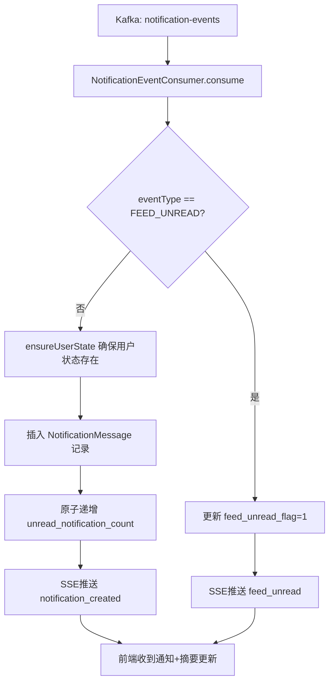
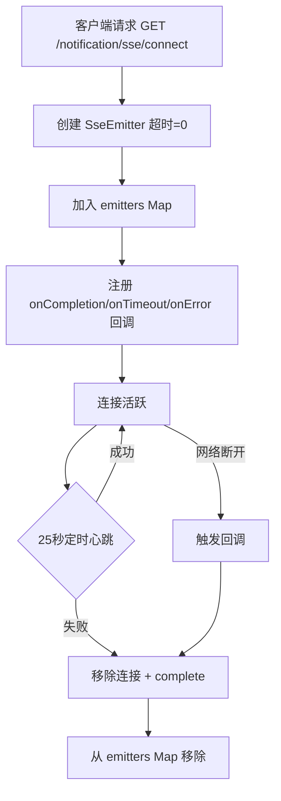
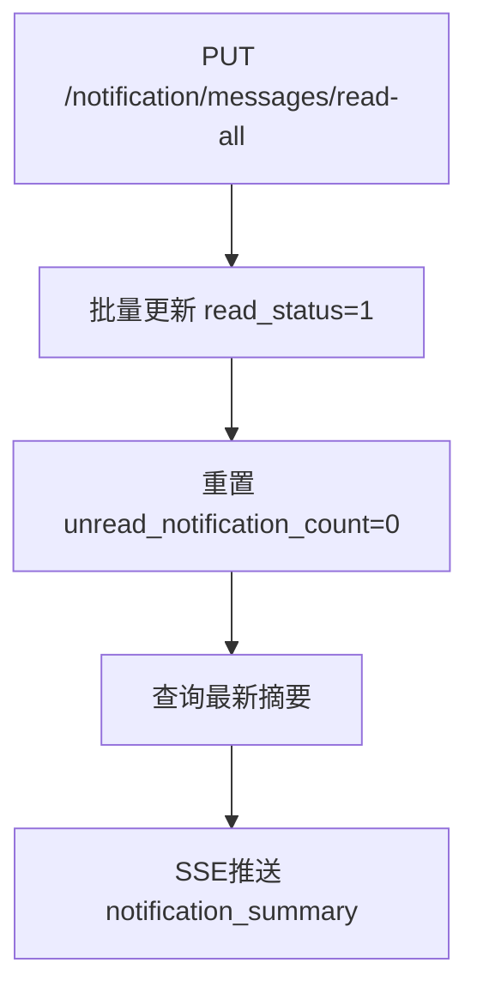

# 通知服务 (notification-service) 技术文档

## 1. 服务概述

通知服务是游戏社区平台的站内通知核心微服务，负责接收来自各业务服务（社交服务、审核服务等）的通知事件，持久化通知记录，维护用户通知状态，并通过 SSE (Server-Sent Events) 实时推送通知到在线用户。

**核心能力**：
- 消费 Kafka 通知事件，创建通知记录并更新未读计数
- SSE 长连接实时推送（通知到达、摘要更新、Feed 红点、心跳）
- 通知消息分页查询、全部已读标记、Feed 红点清除
- 用户通知状态（未读数、Feed 红点）自动初始化与并发安全
- 点赞/收藏在 Kafka Streams 短窗口内按“接收人+内容目标”聚合，评论、关注、系统通知实时落库
- 弹幕可靠事件由独立消费组转换为视频作者的弹幕互动通知；举报通知保留举报与弹幕定位信息

**技术栈**：Spring Boot 3 + MyBatis-Plus + MySQL + Redis + Kafka + SSE + Nacos + Sentinel

**服务端口**：8092

---

## 2. 数据模型

### 2.1 MySQL 表

#### t_notification_message（站内通知消息表）

| 字段 | 类型 | 说明 |
|------|------|------|
| id | BIGINT AUTO_INCREMENT | 主键 |
| user_id | BIGINT NOT NULL | 通知接收人 |
| event_type | TINYINT NOT NULL | 通知事件类型（见常量定义） |
| actor_user_id | BIGINT DEFAULT NULL | 触发人用户ID |
| actor_username | VARCHAR(64) DEFAULT '' | 触发人用户名 |
| actor_avatar | VARCHAR(512) DEFAULT '' | 触发人头像 |
| article_id | BIGINT DEFAULT NULL | 关联文章ID |
| comment_id | BIGINT DEFAULT NULL | 关联评论ID |
| reply_id | BIGINT DEFAULT NULL | 关联回复ID |
| danmaku_id | BIGINT DEFAULT NULL | 关联弹幕ID |
| video_public_id | VARCHAR(128) DEFAULT NULL | 视频帖子公开ID |
| report_id | BIGINT DEFAULT NULL | 关联举报ID |
| target_user_id | BIGINT DEFAULT NULL | 跳转目标用户ID |
| preview_text | VARCHAR(255) DEFAULT '' | 通知简要文案 |
| result_text | VARCHAR(255) DEFAULT '' | 结果文案 |
| route_type | TINYINT DEFAULT 0 | 跳转意图（0=无 1=文章 2=评论 3=回复 4=用户 5=弹幕） |
| read_status | TINYINT DEFAULT 0 | 已读状态（0未读 1已读） |
| read_time | DATETIME DEFAULT NULL | 已读时间 |
| create_time | DATETIME DEFAULT CURRENT_TIMESTAMP | 创建时间 |

**索引**：
- `idx_notification_user_read_time (user_id, read_status, create_time DESC)` — 支持按用户+已读状态分页查询
- `idx_notification_user_time (user_id, create_time DESC)` — 支持按用户时间倒序查询

#### t_notification_user_state（通知用户状态表）

| 字段 | 类型 | 说明 |
|------|------|------|
| id | BIGINT AUTO_INCREMENT | 主键 |
| user_id | BIGINT NOT NULL | 用户ID（唯一） |
| unread_notification_count | BIGINT DEFAULT 0 | 普通通知未读数 |
| feed_unread_flag | TINYINT DEFAULT 0 | Feed未读红点（0否 1是） |
| last_feed_event_time | DATETIME DEFAULT NULL | 最近一次Feed事件时间 |
| last_feed_read_time | DATETIME DEFAULT NULL | 最近一次Feed清除时间 |
| update_time | DATETIME ON UPDATE CURRENT_TIMESTAMP | 更新时间 |

**索引**：
- `uk_notification_state_user (user_id)` UNIQUE — 每用户仅一条状态记录

### 2.2 事件类型常量（NotificationConstants.EventType）

| 常量 | 值 | 说明 |
|------|------|------|
| ARTICLE_LIKE | 1 | 文章点赞 |
| ARTICLE_COMMENT | 2 | 文章评论 |
| COMMENT_REPLY | 3 | 评论回复 |
| COMMENT_LIKE | 4 | 评论点赞 |
| REPLY_LIKE | 5 | 回复点赞 |
| FOLLOW | 6 | 关注 |
| REPORT_SUBMITTED | 7 | 举报提交 |
| REPORT_RESULT | 8 | 举报结果 |
| PENALTY_RESULT | 9 | 处罚结果 |
| FEED_UNREAD | 10 | Feed未读红点 |
| PROFILE_AUDIT_PASSED | 11 | 资料审核通过 |
| PROFILE_AUDIT_REJECTED | 12 | 资料审核不通过 |
| PROFILE_AUDIT_HUMAN_REVIEW | 13 | 资料进入人工复核 |
| ARTICLE_FAVORITE | 14 | 文章收藏 |
| ARTICLE_AUDIT_REJECTED | 15 | 帖子审核不通过 |
| ARTICLE_AUDIT_PASSED | 16 | 帖子审核通过 |
| ARTICLE_AUDIT_HUMAN_REVIEW | 17 | 帖子进入人工审核 |
| DANMAKU_COMMENT | 18 | 视频弹幕互动 |

### 2.4 分类与聚合

- `like_favorite`：文章点赞、评论点赞、回复点赞、文章收藏；聚合窗口默认 1 秒，可通过 `notification.kafka.window-seconds` 调整。
- `comment`：文章评论、评论回复、弹幕互动。
- `system`：资料/帖子审核结果、举报提交、举报结果、被举报处理结果。
- 聚合键为 `recipientUserId:articleId:commentId:replyId`，因此同一内容目标的点赞与收藏可以合并，不同评论/回复不会串通知。

### 2.3 SSE 事件类型常量（NotificationConstants.SseEventType）

| 常量 | 值 | 说明 |
|------|------|------|
| NOTIFICATION_CREATED | "notification_created" | 新通知到达 |
| NOTIFICATION_SUMMARY | "notification_summary" | 摘要更新（已读数变化） |
| FEED_UNREAD | "feed_unread" | Feed红点变化 |
| HEARTBEAT | "heartbeat" | 心跳保活 |

---

## 3. 功能模块详解

### 3.1 Kafka 通知事件消费

**消费者类**：`NotificationEventConsumer`

监听 `notification-events` Topic，消费 `NotificationEventMessage` 消息。

```java
@Slf4j
@Component
@RequiredArgsConstructor
public class NotificationEventConsumer {

    private final NotificationService notificationService;

    @KafkaListener(topics = KafkaTopicConstants.NOTIFICATION_EVENT_TOPIC, groupId = "notification-service-group")
    public void consume(NotificationEventMessage event) {
        if (event == null || event.getRecipientUserId() == null || event.getEventType() == null) {
            log.warn("忽略无效通知事件: {}", event);
            return;
        }
        notificationService.consumeNotificationEvent(event);
    }
}
```

**消费逻辑**（`NotificationServiceImpl.consumeNotificationEvent`）：

1. 确保接收用户的状态记录存在（`ensureUserState`）
2. 如果 `eventType == FEED_UNREAD(10)`，仅更新 `feed_unread_flag=1` 和 `last_feed_event_time`，然后通过 SSE 推送 `feed_unread` 事件
3. 否则：
   - 创建 `NotificationMessage` 记录，设置 `read_status=0`（未读）
   - 通过 SQL 原子递增 `unread_notification_count`（`setSql("unread_notification_count = unread_notification_count + 1")`）
   - 通过 SSE 推送 `notification_created` 事件（包含消息体和摘要）

**ensureUserState 机制**：首次消费某用户的通知时，自动创建 `NotificationUserState` 记录。使用 `DuplicateKeyException` 捕获并发创建冲突，由唯一索引兜底。

```java
private void ensureUserState(Long userId) {
    if (userId == null) return;
    if (notificationUserStateMapper.selectCount(
            new LambdaQueryWrapper<NotificationUserState>().eq(NotificationUserState::getUserId, userId)) > 0) {
        return;
    }
    NotificationUserState state = new NotificationUserState();
    state.setUserId(userId);
    state.setUnreadNotificationCount(0L);
    state.setFeedUnreadFlag(0);
    try {
        notificationUserStateMapper.insert(state);
    } catch (DuplicateKeyException ignored) {
        // 并发创建时由唯一索引兜底
    }
}
```

### 3.2 SSE 实时推送

**服务类**：`SseServiceImpl`

使用 Spring 的 `SseEmitter` 实现服务端推送。核心数据结构为 `ConcurrentHashMap<Long, Set<SseEmitter>>`，按用户ID维护多个 SSE 连接（支持同一用户多端在线）。

**连接建立**：

```java
@Override
public SseEmitter connect(Long userId) {
    SseEmitter emitter = new SseEmitter(0L); // 0 = 永不超时
    emitters.computeIfAbsent(userId, key -> ConcurrentHashMap.newKeySet()).add(emitter);
    emitter.onCompletion(() -> removeEmitter(userId, emitter));
    emitter.onTimeout(() -> removeEmitter(userId, emitter));
    emitter.onError(error -> removeEmitter(userId, emitter));
    return emitter;
}
```

**推送逻辑**：

- `sendNotification`：推送 `notification_created` 事件，携带 `NotificationSseEventVO`（含 summary + message）
- `sendSummary`：推送 `notification_summary` 事件，仅携带 summary
- `sendFeedUnread`：推送 `feed_unread` 事件，仅携带 summary
- 发送失败时自动移除连接并调用 `emitter.complete()`

**心跳保活**：每 25 秒向所有在线连接发送 `heartbeat` 事件

```java
@Scheduled(fixedDelay = 25000L)
public void heartbeat() {
    NotificationSseEventVO payload = new NotificationSseEventVO(
            NotificationConstants.SseEventType.HEARTBEAT, null, null);
    for (Long userId : emitters.keySet()) {
        send(userId, NotificationConstants.SseEventType.HEARTBEAT, payload);
    }
}
```

**SSE 事件数据结构**（`NotificationSseEventVO`）：

```java
@Data
@AllArgsConstructor
public class NotificationSseEventVO implements Serializable {
    private String eventType;           // 事件类型标识
    private NotificationSummaryVO summary; // 通知摘要（未读数+Feed红点）
    private NotificationMessageVO message; // 通知消息体（仅 notification_created 有值）
}
```

### 3.3 通知查询与已读操作

**获取通知摘要**（`getSummary`）：
- 查询 `t_notification_user_state`，返回 `NotificationSummaryVO(unreadNotificationCount, feedUnread)`

**分页查询通知列表**（`listMessages`）：
- 按 `user_id` 过滤，可选按 `event_type` 过滤
- 按 `create_time DESC, id DESC` 排序
- 默认每页 20 条，最大 100 条

**全部标记已读**（`markAllAsRead`）：
- 批量更新 `read_status=1, read_time=now`（仅未读记录）
- 重置 `unread_notification_count=0`
- 通过 SSE 推送 `notification_summary` 事件

**标记Feed已读**（`markFeedRead`）：
- 设置 `feed_unread_flag=0, last_feed_read_time=now`
- 通过 SSE 推送 `notification_summary` 事件

---

## 4. Kafka 事件

### 4.1 消费者

| Topic | Group ID | 消息类型 | 说明 |
|-------|----------|----------|------|
| `notification-events` | `notification-service-group` | `NotificationEventMessage` | 接收各业务服务发出的通知事件 |
| `danmaku-events` | `notification-service-danmaku-group` | `DanmakuEvent` | 转换为视频作者的弹幕互动通知 |

**NotificationEventMessage 结构**：

```java
public class NotificationEventMessage implements Serializable {
    private Integer eventType;         // 事件类型（1-18）
    private Long recipientUserId;      // 接收人
    private Long actorUserId;          // 触发人
    private String actorUsername;      // 触发人用户名
    private String actorAvatar;        // 触发人头像
    private Long articleId;            // 关联文章
    private Long commentId;            // 关联评论
    private Long replyId;              // 关联回复
    private Long danmakuId;            // 关联弹幕
    private String videoPublicId;      // 视频帖子公开ID
    private Long reportId;             // 关联举报
    private Long targetUserId;         // 跳转目标用户
    private Integer routeType;         // 跳转意图
    private String previewText;        // 简要文案
    private String resultText;         // 结果文案
    private LocalDateTime occurredAt;  // 事件时间
}
```

### 4.2 生产者

本服务不生产 Kafka 事件，仅消费。

---

## 5. 对外接口声明

### 5.1 经过网关的接口

| 方法 | 路径 | 权限 | 说明 |
|------|------|------|------|
| GET | `/notification/summary` | @LoginCheck | 获取通知摘要（未读数+Feed红点） |
| GET | `/notification/messages` | @LoginCheck | 分页查询通知列表 |
| PUT | `/notification/messages/read-all` | @LoginCheck | 全部标记已读 |
| PUT | `/notification/feed/read` | @LoginCheck | 标记Feed已读 |
| GET | `/notification/sse/connect` | @LoginCheck | SSE连接（TEXT_EVENT_STREAM） |

**请求参数说明**：

- `GET /notification/messages`：
  - `page` (Long, 默认1) — 页码
  - `size` (Long, 默认20) — 每页条数
  - `eventType` (Integer, 可选) — 按事件类型过滤

### 5.2 不经过网关的接口

无。所有接口均需经过网关透传用户上下文。

### 5.3 用户上下文获取

通过 `UserFilter`（@Order(1)）从 HTTP 请求头提取网关注入的用户信息：

```java
String userIdStr = httpRequest.getHeader("X-User-Id");
String userTypeStr = httpRequest.getHeader("X-User-Type");
String gameAccount = httpRequest.getHeader("X-Game-Account");
String sessionId = httpRequest.getHeader("X-Session-Id");
```

存入 `UserThreadLocal`，在 `finally` 块中清除。

---

## 6. 关键流程图

### 6.1 通知事件消费与推送流程



### 6.2 SSE 连接生命周期



### 6.3 全部已读流程



---

## 7. 配置说明

### 7.1 bootstrap.yml 完整配置

```yaml
server:
  port: 8092

spring:
  application:
    name: notification-service
  ai:
    dashscope:
      api-key: ${DASHSCOPE_API_KEY:${DASHSCOPE_API_KEY:your-api-key-here}}
      chat:
        options:
          model: ${DASHSCOPE_CHAT_MODEL:qwen-plus}
  cloud:
    nacos:
      discovery:
        enabled: ${NACOS_DISCOVERY_ENABLED:true}
        server-addr: localhost:8848
      config:
        enabled: ${NACOS_CONFIG_ENABLED:false}
        server-addr: localhost:8848
    sentinel:
      eager: true
  datasource:
    driver-class-name: com.mysql.cj.jdbc.Driver
    url: jdbc:mysql://localhost:3307/game_community?useUnicode=true&characterEncoding=UTF-8&serverTimezone=Asia/Shanghai
    username: root
    password: ${MYSQL_PASSWORD:your-password}
  data:
    redis:
      host: localhost
      port: ${REDIS_PORT:6380}
  kafka:
    bootstrap-servers: ${KAFKA_BOOTSTRAP_SERVERS:localhost:9093}
    consumer:
      group-id: notification-service-group
      auto-offset-reset: earliest
      key-deserializer: org.apache.kafka.common.serialization.StringDeserializer
      value-deserializer: org.springframework.kafka.support.serializer.JsonDeserializer
      properties:
        spring.json.trusted.packages: com.game.community.model.message

mybatis-plus:
  mapper-locations: classpath*:mapper/*.xml
  type-aliases-package: com.game.community.model.entity
  configuration:
    map-underscore-to-camel-case: true
    log-impl: org.apache.ibatis.logging.stdout.StdOutImpl
  global-config:
    db-config:
      id-type: auto

management:
  endpoints:
    web:
      exposure:
        include: '*'
  endpoint:
    health:
      show-details: always
```

### 7.2 关键配置项说明

| 配置项 | 默认值 | 说明 |
|--------|--------|------|
| `server.port` | 8092 | 服务端口 |
| `spring.kafka.consumer.group-id` | notification-service-group | Kafka 消费组 |
| `spring.kafka.consumer.auto-offset-reset` | earliest | 从最早消息开始消费 |
| `spring.data.redis.port` | 6380 | Redis 端口（非默认6379） |
| `spring.datasource.url` | localhost:3307 | MySQL 端口（非默认3306） |

### 7.3 关键内部参数

| 参数 | 值 | 说明 |
|------|------|------|
| SSE 超时 | 0（永不超时） | SseEmitter 构造参数 |
| 心跳间隔 | 25000ms | @Scheduled(fixedDelay=25000L) |
| 默认分页大小 | 20 | listMessages 默认 size |
| 最大分页大小 | 100 | listMessages 上限 |

### 7.4 启动类注解

```java
@EnableScheduling          // 启用定时任务（SSE心跳）
@EnableDiscoveryClient     // Nacos 服务注册
@MapperScan("com.game.community.notification.mapper")
@SpringBootApplication(scanBasePackages = "com.game.community")
```

### 7.5 SQL 建表语句

```sql
USE game_community;

CREATE TABLE IF NOT EXISTS t_notification_message (
    id BIGINT NOT NULL AUTO_INCREMENT COMMENT '主键',
    user_id BIGINT NOT NULL COMMENT '通知接收人',
    event_type TINYINT NOT NULL COMMENT '通知事件类型',
    actor_user_id BIGINT DEFAULT NULL COMMENT '触发人用户ID',
    actor_username VARCHAR(64) NOT NULL DEFAULT '' COMMENT '触发人用户名',
    actor_avatar VARCHAR(512) NOT NULL DEFAULT '' COMMENT '触发人头像',
    article_id BIGINT DEFAULT NULL COMMENT '文章ID',
    comment_id BIGINT DEFAULT NULL COMMENT '评论ID',
    reply_id BIGINT DEFAULT NULL COMMENT '回复ID',
    danmaku_id BIGINT DEFAULT NULL COMMENT '弹幕ID',
    video_public_id VARCHAR(128) DEFAULT NULL COMMENT '视频帖子公开ID',
    report_id BIGINT DEFAULT NULL COMMENT '举报ID',
    target_user_id BIGINT DEFAULT NULL COMMENT '跳转目标用户ID',
    preview_text VARCHAR(255) NOT NULL DEFAULT '' COMMENT '通知简要文案',
    result_text VARCHAR(255) NOT NULL DEFAULT '' COMMENT '结果文案',
    route_type TINYINT NOT NULL DEFAULT 0 COMMENT '跳转意图',
    read_status TINYINT NOT NULL DEFAULT 0 COMMENT '已读状态 0未读 1已读',
    read_time DATETIME DEFAULT NULL COMMENT '已读时间',
    create_time DATETIME NOT NULL DEFAULT CURRENT_TIMESTAMP COMMENT '创建时间',
    PRIMARY KEY (id),
    KEY idx_notification_user_read_time (user_id, read_status, create_time DESC),
    KEY idx_notification_user_time (user_id, create_time DESC)
) ENGINE=InnoDB DEFAULT CHARSET=utf8mb4 COLLATE=utf8mb4_unicode_ci COMMENT='站内通知消息表';

CREATE TABLE IF NOT EXISTS t_notification_user_state (
    id BIGINT NOT NULL AUTO_INCREMENT COMMENT '主键',
    user_id BIGINT NOT NULL COMMENT '用户ID',
    unread_notification_count BIGINT NOT NULL DEFAULT 0 COMMENT '普通通知未读数',
    feed_unread_flag TINYINT NOT NULL DEFAULT 0 COMMENT 'feed未读红点 0否 1是',
    last_feed_event_time DATETIME DEFAULT NULL COMMENT '最近一次feed事件时间',
    last_feed_read_time DATETIME DEFAULT NULL COMMENT '最近一次feed清除时间',
    update_time DATETIME NOT NULL DEFAULT CURRENT_TIMESTAMP ON UPDATE CURRENT_TIMESTAMP COMMENT '更新时间',
    PRIMARY KEY (id),
    UNIQUE KEY uk_notification_state_user (user_id)
) ENGINE=InnoDB DEFAULT CHARSET=utf8mb4 COLLATE=utf8mb4_unicode_ci COMMENT='通知用户状态表';
```
