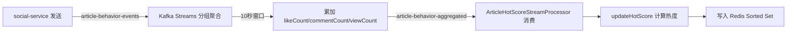
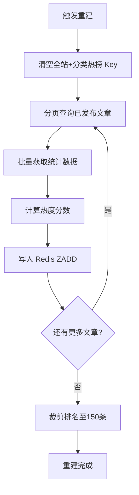
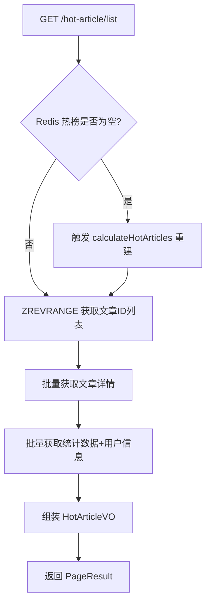

# 推荐服务 (recommend-service) 技术文档

> 当前实现基线请先阅读 [`recommend-service-current.md`](./recommend-service-current.md)。本文保留历史设计记录，其中部分 Kafka Streams、SSE 和旧版热榜代码示例已不再适用。

## 1. 服务概述

推荐服务负责游戏社区平台的文章热榜计算与推荐。通过 Kafka Streams 实时聚合文章行为数据（点赞、评论、浏览），结合 XXL-JOB 定时任务定期重建热榜，将热度分数写入 Redis Sorted Set，对外提供热榜文章分页查询接口。

**核心能力**：
- Kafka Streams 窗口聚合文章行为数据（点赞/评论/浏览增量）
- 消费聚合后的行为事件，实时刷新单篇文章热度分数
- XXL-JOB 定时调度全量热榜重建
- 启动时自动预热热榜缓存
- Redis Sorted Set 存储热榜排名，支持全站和分类两个维度
- 通过 Feign 调用 content-service、social-service、user-service 获取文章详情、统计数据、用户信息

**技术栈**：Spring Boot 3 + Kafka Streams + Kafka Consumer + Redis + XXL-JOB + OpenFeign + Nacos + Sentinel

**服务端口**：8086

**特殊说明**：本服务不使用 MySQL，排除了 DataSource 自动配置（`exclude = DataSourceAutoConfiguration.class`）。

---

## 2. 数据模型

### 2.1 Redis 数据结构

#### 全站热榜 Sorted Set

- **Key**：`recommend:hot:article:rank`
- **Member**：文章ID（String）
- **Score**：热度分数（double）
- **排序**：Score 降序
- **容量限制**：最多保留 150 条（`HOT_RANK_SIZE = 150`）

#### 分类热榜 Sorted Set

- **Key**：`recommend:hot:article:category:{categoryId}`
- **Member**：文章ID（String）
- **Score**：热度分数（double）
- **容量限制**：同上 150 条

### 2.2 热度分数计算公式

```java
score = likeCount * 3.0      // 点赞权重
      + commentCount * 5.0   // 评论权重
      + commentLikeCount * 1.0
      + replyCount * 2.0
      + replyLikeCount * 0.5
      + viewCount * 1.0      // 浏览权重
```

**权重常量**（`RecommendConstants`）：

| 常量 | 值 | 说明 |
|------|------|------|
| LIKE_WEIGHT | 3.0 | 点赞权重 |
| COMMENT_WEIGHT | 5.0 | 评论权重 |
| COMMENT_LIKE_WEIGHT | 1.0 | 评论点赞权重 |
| REPLY_WEIGHT | 2.0 | 回复权重 |
| REPLY_LIKE_WEIGHT | 0.5 | 回复点赞权重 |
| VIEW_WEIGHT | 1.0 | 浏览权重 |
| HOT_RANK_SIZE | 150 | 热榜最大容量 |

---

## 3. 功能模块详解

### 3.1 Kafka Streams 窗口聚合

**配置类**：`KafkaStreamConfig`

从 `article-behavior-events` Topic 读取原始行为消息，按文章ID分组，在时间窗口内聚合行为增量，输出到 `article-behavior-aggregated` Topic。

```java
@Bean
public KStream<String, ArticleBehaviorMessage> articleBehaviorStream(StreamsBuilder builder) {
    JsonSerde<ArticleBehaviorMessage> messageSerde = new JsonSerde<>(ArticleBehaviorMessage.class);
    KStream<String, ArticleBehaviorMessage> aggregatedStream = builder
        .stream(KafkaTopicConstants.ARTICLE_BEHAVIOR_TOPIC, Consumed.with(Serdes.String(), messageSerde))
        .filter((key, value) -> value != null && value.getArticleId() != null)
        .groupBy((key, value) -> value.getArticleId().toString(), Grouped.with(Serdes.String(), messageSerde))
        .windowedBy(TimeWindows.ofSizeAndGrace(Duration.ofSeconds(windowSeconds), Duration.ofSeconds(2)))
        .aggregate(
            () -> new ArticleBehaviorMessage(0L, 0L, 0L, 0L),
            (articleId, next, aggregate) -> new ArticleBehaviorMessage(
                next.getArticleId(),
                safeLong(aggregate.getLikeCount()) + safeLong(next.getLikeCount()),
                safeLong(aggregate.getCommentCount()) + safeLong(next.getCommentCount()),
                safeLong(aggregate.getViewCount()) + safeLong(next.getViewCount())
            ),
            Materialized.with(Serdes.String(), messageSerde)
        )
        .toStream()
        .map((windowedKey, value) -> KeyValue.pair(windowedKey.key(), value))
        .peek((articleId, value) -> {
            if (value != null) value.setArticleId(Long.valueOf(articleId));
        });
    aggregatedStream.to(KafkaTopicConstants.ARTICLE_BEHAVIOR_AGGREGATED_TOPIC,
        Produced.with(Serdes.String(), messageSerde));
    return aggregatedStream;
}
```

**窗口参数**：
- 窗口大小：`recommend.kafka.window-seconds`（默认 10 秒）
- 宽限期（Grace Period）：2 秒
- 处理保证：`at_least_once`

### 3.2 聚合事件消费与热度更新

**消费者类**：`ArticleHotScoreStreamProcessor`

监听 `article-behavior-aggregated` Topic，收到聚合消息后刷新单篇文章热度。

```java
@KafkaListener(topics = KafkaTopicConstants.ARTICLE_BEHAVIOR_AGGREGATED_TOPIC,
               groupId = "recommend-service-hot-score")
public void handleAggregatedMessage(ArticleBehaviorMessage message) {
    if (message == null || message.getArticleId() == null || message.getArticleId() <= 0) return;
    log.info("收到文章行为聚合事件，刷新热度: articleId={}, likeDelta={}, commentDelta={}, viewDelta={}",
            message.getArticleId(), message.getLikeCount(), message.getCommentCount(), message.getViewCount());
    hotArticleService.updateHotScore(message.getArticleId());
}
```

**单篇文章热度更新流程**（`updateHotScore`）：
1. 通过 Feign 调用 `contentFeignClient.listArticlesByIds` 获取文章详情
2. 若文章不存在或非已发布状态，从热榜移除
3. 若文章已发布，获取统计数据，计算热度分数
4. 写入 Redis Sorted Set（全站 + 对应分类）
5. 裁剪排名（超过 150 条时移除低分项）

### 3.3 全量热榜重建

**触发方式**：
- 启动预热：`HotArticleWarmupRunner`（`@EventListener(ApplicationReadyEvent.class)`）
- 定时调度：`HotArticleJobHandler`（`@XxlJob("hotArticleCalculateJobHandler")`）
- 懒加载：查询时若热榜为空，自动触发重建（`ensureRankReady`）

**重建流程**（`calculateHotArticles`）：

```java
@Override
public void calculateHotArticles() {
    log.info("开始重建文章热榜");
    redisUtils.del(RecommendConstants.HOT_ARTICLE_RANK_KEY);
    for (Category category : enabledCategories()) {
        redisUtils.del(categoryKey(category.getId()));
    }
    long page = 1L;
    while (true) {
        PageResult<Article> result = unwrap(contentFeignClient.listPublishedArticlesPage((int) page, REBUILD_PAGE_SIZE));
        List<Article> articles = result == null ? List.of() : safeList(result.getData());
        if (articles.isEmpty()) break;
        writeScores(articles);
        if (articles.size() < REBUILD_PAGE_SIZE) break;
        page++;
    }
    log.info("文章热榜重建完成");
}
```

1. 清空全站和所有分类的热榜 Key
2. 分页遍历所有已发布文章（每页 100 条）
3. 对每批文章计算热度分数并写入 Redis
4. 裁剪排名至 150 条

### 3.4 热榜查询

**全站热榜**（`listHotArticles`）：
1. 确保热榜已加载（空则触发重建）
2. 从 Redis `ZREVRANGE` 获取指定页的文章ID
3. 批量获取文章详情、统计数据、用户信息、分类名称
4. 按 Redis 排名顺序组装 `HotArticleVO`
5. 返回分页结果

**分类热榜**（`listCategoryHotArticles`）：
- 逻辑同上，使用分类 Key `recommend:hot:article:category:{categoryId}`

### 3.5 XXL-JOB 集成

**配置类**：`XxlJobConfig`

```yaml
xxl:
  job:
    admin-addresses: ${XXL_JOB_ADMIN_ADDRESSES:http://localhost:8088/xxl-job-admin}
    access-token: ${XXL_JOB_ACCESS_TOKEN:default_token}
    appname: recommend-service
    port: 9996
    log-path: logs/xxl-job/recommend-service
    log-retention-days: 30
```

**任务处理器**：

```java
@XxlJob("hotArticleCalculateJobHandler")
public void hotArticleCalculateJobHandler() {
    log.info("XXL-JOB 触发每日热榜重建");
    hotArticleService.calculateHotArticles();
}
```

---

## 4. Kafka 事件

### 4.1 消费者

| Topic | Group ID | 消息类型 | 说明 |
|-------|----------|----------|------|
| `article-behavior-aggregated` | `recommend-service-hot-score` | `ArticleBehaviorMessage` | 消费聚合后的文章行为事件，更新热度 |

**ArticleBehaviorMessage 结构**：

```java
public class ArticleBehaviorMessage implements Serializable {
    private Long articleId;
    private Long likeCount;      // 点赞增量（聚合后为窗口内累计）
    private Long commentCount;   // 评论增量
    private Long viewCount;      // 浏览增量
}
```

### 4.2 生产者（Kafka Streams 输出）

| 输出 Topic | 消息类型 | 说明 |
|------------|----------|------|
| `article-behavior-aggregated` | `ArticleBehaviorMessage` | Kafka Streams 窗口聚合后输出 |

### 4.3 Kafka Streams 处理拓扑

| 输入 Topic | 处理 | 输出 Topic |
|------------|------|------------|
| `article-behavior-events` | 按 articleId 分组 → 10秒窗口聚合 → 累加 like/comment/view | `article-behavior-aggregated` |

**Streams 配置**：
- `application-id`：`recommend-service-hot-score-stream`
- `processing.guarantee`：`at_least_once`

---

## 5. 对外接口声明

### 5.1 经过网关的接口

| 方法 | 路径 | 权限 | 说明 |
|------|------|------|------|
| GET | `/hot-article/list` | @LoginCheck | 全站热榜分页 |
| GET | `/hot-article/category/{categoryId}` | @LoginCheck | 分类热榜分页 |

**请求参数**：

- `GET /hot-article/list`：
  - `page` (Long, 默认1) — 页码
  - `size` (Long, 默认12) — 每页条数（最大50）

- `GET /hot-article/category/{categoryId}`：
  - `categoryId` (Long, 路径参数) — 分类ID
  - `page` / `size` 同上

**响应结构**：`PageResult<HotArticleVO>`

```java
public class HotArticleVO implements Serializable {
    private Long id;
    private Long userId;
    private String title;
    private String summary;
    private String coverUrl;
    private Long categoryId;
    private String categoryName;
    private String authorName;
    private String authorAvatar;
    private Long likeCount;
    private Long commentCount;
    private Long commentLikeCount;
    private Long replyCount;
    private Long replyLikeCount;
    private Long viewCount;
    private Boolean liked;        // 当前用户是否已点赞
    private Double hotScore;      // 热度分数
    private LocalDateTime publishedTime;
    private LocalDateTime createTime;
    private LocalDateTime updateTime;
}
```

### 5.2 不经过网关的接口

无。

---

## 6. 关键流程图

### 6.1 Kafka Streams 窗口聚合流程



### 6.2 热榜重建流程



### 6.3 热榜查询流程



---

## 7. 配置说明

### 7.1 bootstrap.yml 完整配置

```yaml
server:
  port: 8086

spring:
  application:
    name: recommend-service
  ai:
    dashscope:
      api-key: ${DASHSCOPE_API_KEY:${DASHSCOPE_API_KEY:your-api-key-here}}
  cloud:
    nacos:
      discovery:
        enabled: ${NACOS_DISCOVERY_ENABLED:true}
        server-addr: localhost:8848
      config:
        enabled: ${NACOS_CONFIG_ENABLED:false}
        server-addr: localhost:8848
    sentinel:
      eager: true
  data:
    redis:
      host: localhost
      port: ${REDIS_PORT:6380}
  kafka:
    bootstrap-servers: ${KAFKA_BOOTSTRAP_SERVERS:localhost:9093}
    consumer:
      auto-offset-reset: latest
      key-deserializer: org.apache.kafka.common.serialization.StringDeserializer
      value-deserializer: org.springframework.kafka.support.serializer.JsonDeserializer
      properties:
        spring.json.trusted.packages: com.game.community.model.message
    producer:
      key-serializer: org.apache.kafka.common.serialization.StringSerializer
      value-serializer: org.springframework.kafka.support.serializer.JsonSerializer
    streams:
      application-id: recommend-service-hot-score-stream
      properties:
        processing.guarantee: at_least_once
        default.key.serde: org.apache.kafka.common.serialization.Serdes$StringSerde
        default.value.serde: org.springframework.kafka.support.serializer.JsonSerde

xxl:
  job:
    admin-addresses: ${XXL_JOB_ADMIN_ADDRESSES:http://localhost:8088/xxl-job-admin}
    access-token: ${XXL_JOB_ACCESS_TOKEN:default_token}
    appname: recommend-service
    port: 9996
    log-path: logs/xxl-job/recommend-service
    log-retention-days: 30

recommend:
  kafka:
    window-seconds: ${RECOMMEND_KAFKA_WINDOW_SECONDS:10}

management:
  endpoints:
    web:
      exposure:
        include: '*'
```

### 7.2 关键配置项说明

| 配置项 | 默认值 | 说明 |
|--------|--------|------|
| `server.port` | 8086 | 服务端口 |
| `spring.kafka.consumer.auto-offset-reset` | latest | 消费者从最新消息开始 |
| `spring.kafka.streams.application-id` | recommend-service-hot-score-stream | Kafka Streams 应用ID |
| `recommend.kafka.window-seconds` | 10 | 窗口聚合时间（秒） |
| `xxl.job.admin-addresses` | http://localhost:8088/xxl-job-admin | XXL-JOB 调度中心地址 |
| `xxl.job.port` | 9996 | XXL-JOB 执行器端口 |

### 7.3 Feign 依赖

| Feign Client | 目标服务 | 调用方法 | 用途 |
|---------------|----------|----------|------|
| ContentFeignClient | content-service | `listPublishedArticlesPage` | 分页获取已发布文章 |
| ContentFeignClient | content-service | `listArticlesByIds` | 按ID批量获取文章 |
| ContentFeignClient | content-service | `listEnabledCategories` | 获取启用的分类列表 |
| SocialFeignClient | social-service | `getStats` | 获取文章统计数据 |
| UserFeignClient | user-service | `getUsersByIds` | 批量获取用户信息 |

### 7.4 启动类注解

```java
@EnableKafka
@EnableKafkaStreams
@EnableFeignClients(basePackages = "com.game.community.feign")
@EnableDiscoveryClient
@SpringBootApplication(exclude = DataSourceAutoConfiguration.class)  // 无MySQL
```

### 7.5 内部关键参数

| 参数 | 值 | 说明 |
|------|------|------|
| REBUILD_PAGE_SIZE | 100 | 重建时每页获取文章数 |
| HOT_RANK_SIZE | 150 | 热榜最大保留条数 |
| 默认分页大小 | 12 | listHotArticles 默认 size |
| 最大分页大小 | 50 | listHotArticles 上限 |
