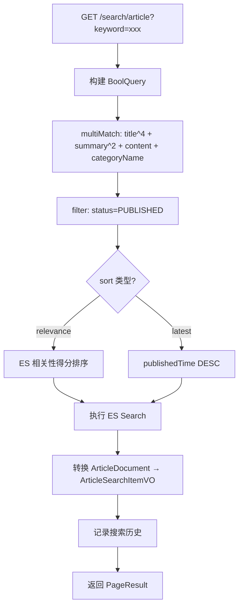
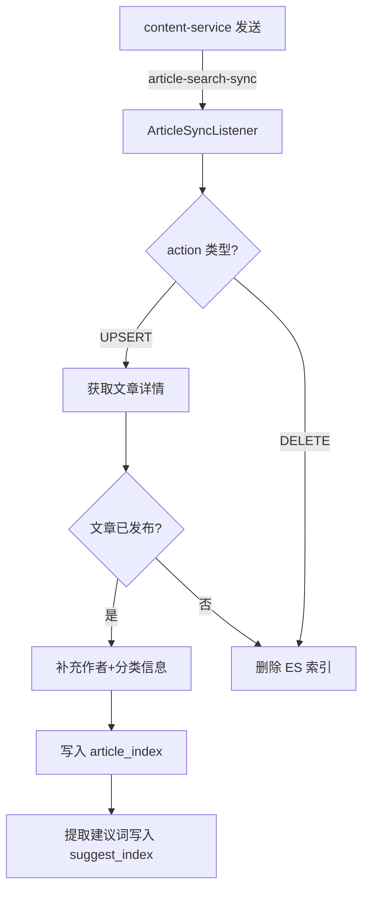
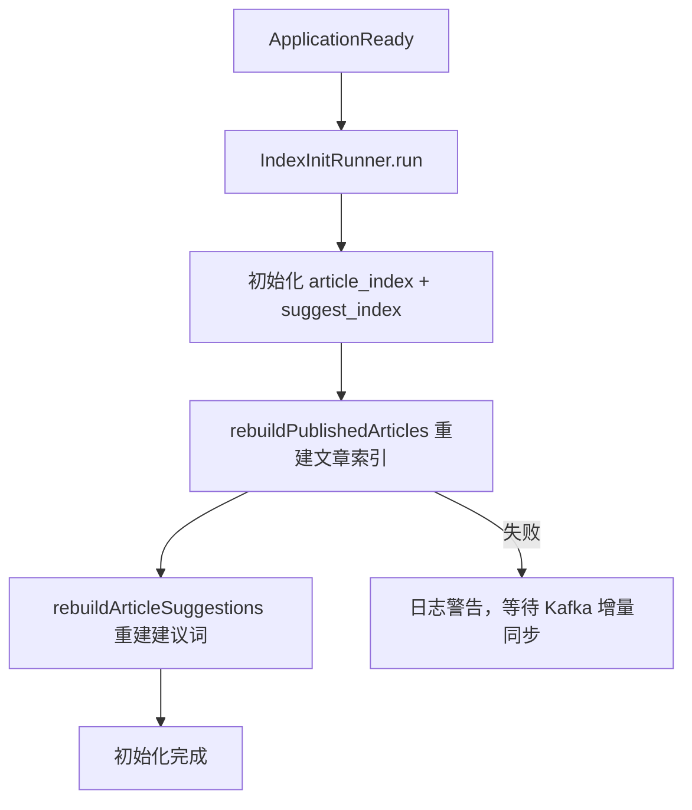
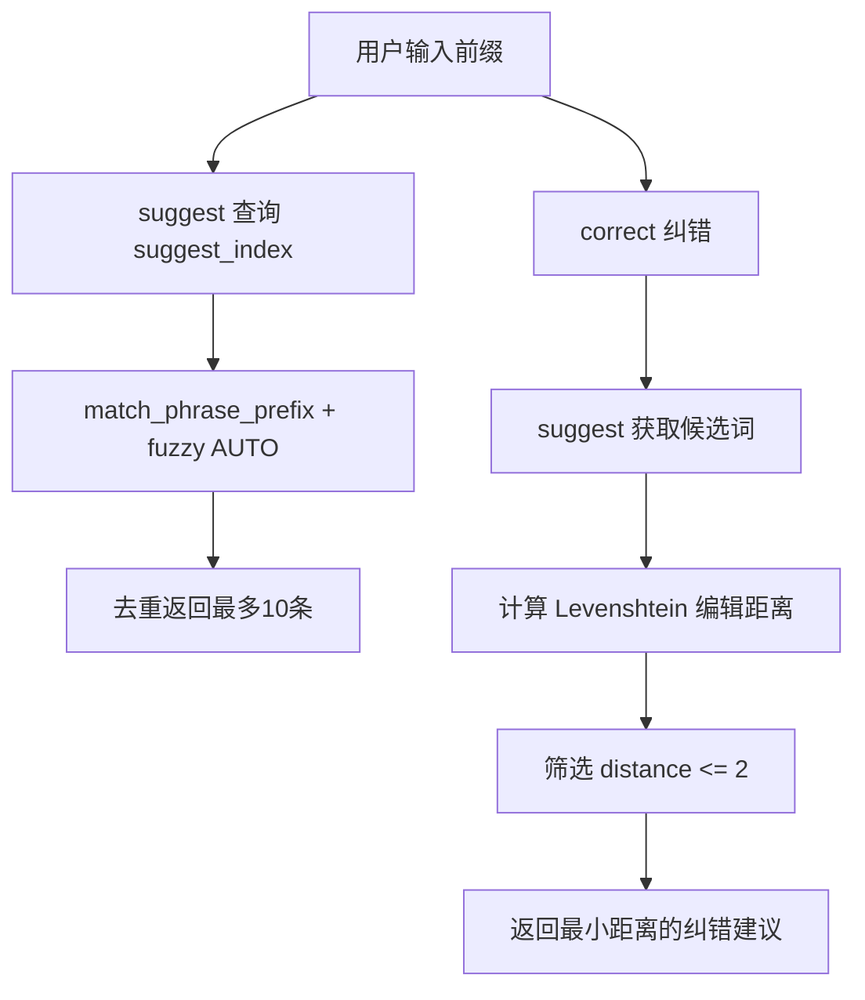

# 搜索服务 (search-service) 技术文档

## 1. 服务概述

搜索服务负责游戏社区平台的全文搜索与搜索建议功能。基于 Elasticsearch 构建文章搜索索引和建议词索引，通过 Kafka 消费文章同步事件实现增量索引更新，启动时自动初始化 ES 索引并重建已发布文章索引。同时提供用户搜索历史管理功能。

**核心能力**：
- Elasticsearch 全文搜索（IK 中文分词，多字段加权匹配）
- 帖子词法、语义和混合搜索；语义召回由配置开关控制，失败自动回退词法搜索
- 搜索建议（前缀匹配 + 模糊匹配）
- 搜索纠错（Levenshtein 编辑距离算法）
- Kafka 增量同步文章索引（新增/更新/删除）
- 启动时自动初始化 ES 索引 + 重建全量索引
- 用户搜索历史管理（MySQL 存储，最多 10 条）
- 建议词管理（批量添加、XLS 导入、分页查询、删除）
- 管理员手动触发索引重建

**技术栈**：Spring Boot 3 + Elasticsearch Java Client 8 + Kafka + MySQL + MyBatis-Plus + OpenFeign + Nacos + Sentinel + Apache POI

**服务端口**：8087

---

## 2. 数据模型

### 2.1 MySQL 表

#### t_search_history（用户搜索历史表）

| 字段 | 类型 | 说明 |
|------|------|------|
| id | BIGINT AUTO_INCREMENT | 搜索历史ID |
| user_id | BIGINT NOT NULL | 用户ID |
| keyword | VARCHAR(128) NOT NULL | 搜索关键词 |
| create_time | DATETIME DEFAULT CURRENT_TIMESTAMP | 首次搜索时间 |
| update_time | DATETIME ON UPDATE CURRENT_TIMESTAMP | 最近搜索时间 |

**索引**：
- `uk_search_history_user_keyword (user_id, keyword)` UNIQUE — 同一用户同一关键词仅一条记录
- `idx_search_history_user_time (user_id, update_time, id)` — 按时间倒序查询

建议词由 `t_suggest_term` 和 `t_suggest_term_source` 两张表组成：主表保存词的聚合属性，关联表保存多个帖子/分类/AI 来源，避免删除一个帖子时误删其他帖子仍在使用的词。业务列均为 `NOT NULL`；非帖子来源使用 `source_article_id = 0`，未触发时间使用纪元时间。

关键索引：`uk_suggest_term (term)`、`idx_suggest_status_weight_id (status, weight, id)`、`uk_suggest_term_source (term_id, source_type, source_article_id)`、`idx_suggest_source_article_type (source_article_id, source_type, term_id)`。

### 2.2 Elasticsearch 索引

#### article_index（文章搜索索引）

| 字段 | 类型 | 分词器 | 说明 |
|------|------|--------|------|
| id | long | — | 文章ID |
| userId | long | — | 作者ID |
| username | keyword | — | 作者用户名 |
| avatar | keyword | — | 作者头像URL |
| title | text | ik_max_word / ik_smart | 文章标题（搜索权重 ×4） |
| summary | text | ik_max_word / ik_smart | 文章摘要（搜索权重 ×2） |
| content | text | ik_max_word / ik_smart | 文章正文 |
| coverUrl | keyword | — | 封面URL |
| categoryId | long | — | 分类ID |
| categoryName | keyword | — | 分类名称（搜索权重 ×1） |
| status | integer | — | 文章状态 |
| publishedTime | date | — | 发布时间 |
| createTime | date | — | 创建时间 |
| updateTime | date | — | 更新时间 |

**索引设置**：分片数和副本数由 `search.index.*` 配置，生产默认文章 3 分片 1 副本。

#### suggest_index（搜索建议索引）

| 字段 | 类型 | 分词器 | 说明 |
|------|------|--------|------|
| id | long | — | 建议词ID（CRC32 生成） |
| suggest | text + keyword 子字段 | ik_max_word / ik_smart | 建议词全文 + 精确匹配 |
| suggestNgram | text | ik_max_word / ik_smart | 建议词（模糊匹配用） |

**索引设置**：分片数和副本数由 `search.index.*` 配置。

---

## 3. 功能模块详解

### 3.1 ES 索引初始化

**初始化类**：`InitElasticsearchIndex`

在服务启动时通过 `IndexInitRunner`（`CommandLineRunner`）调用，自动创建不存在的索引。

```java
@Slf4j
@Component
@RequiredArgsConstructor
public class IndexInitRunner implements CommandLineRunner {

    private final InitElasticsearchIndex initElasticsearchIndex;
    private final ArticleSyncService articleSyncService;

    @Override
    public void run(String... args) {
        log.info("开始初始化搜索索引");
        initElasticsearchIndex.initIndex();
        log.info("搜索索引初始化完成");
        try {
            log.info("开始重建已发布文章搜索索引");
            articleSyncService.rebuildPublishedArticles();
            log.info("已发布文章搜索索引重建完成");
            log.info("开始重建搜索建议词索引");
            articleSyncService.rebuildArticleSuggestions();
            log.info("搜索建议词索引重建完成");
        } catch (Exception e) {
            log.warn("已发布文章搜索索引重建失败，将等待 Kafka 增量同步或手动重建: {}", e.getMessage(), e);
        }
    }
}
```

**article_index 创建代码**：

```java
elasticsearchClient.indices().create(CreateIndexRequest.of(c -> c
    .index(ARTICLE_INDEX)
    .settings(s -> s.numberOfShards("1").numberOfReplicas("0"))
    .mappings(m -> m
        .properties("id", p -> p.long_(l -> l))
        .properties("userId", p -> p.long_(l -> l))
        .properties("username", p -> p.keyword(k -> k))
        .properties("avatar", p -> p.keyword(k -> k))
        .properties("title", p -> p.text(t -> t.analyzer("ik_max_word").searchAnalyzer("ik_smart")))
        .properties("summary", p -> p.text(t -> t.analyzer("ik_max_word").searchAnalyzer("ik_smart")))
        .properties("content", p -> p.text(t -> t.analyzer("ik_max_word").searchAnalyzer("ik_smart")))
        .properties("coverUrl", p -> p.keyword(k -> k))
        .properties("categoryId", p -> p.long_(l -> l))
        .properties("categoryName", p -> p.keyword(k -> k))
        .properties("status", p -> p.integer(i -> i))
        .properties("publishedTime", p -> p.date(d -> d))
        .properties("createTime", p -> p.date(d -> d))
        .properties("updateTime", p -> p.date(d -> d))
    )));
```

### 3.2 文章搜索

**服务类**：`ArticleSearchServiceImpl`

**搜索逻辑**：

1. 构建布尔查询：
   - 词法模式：`multiMatch` 搜索 `title^10, summary^7, content^3, gameTags.name^5, categoryNames/categoryName`（标题权重最高）
   - 无关键词时：`matchAll`
2. 必须过滤条件：`status = PUBLISHED(1)`
3. 可选过滤条件：`categoryId`
4. 排序策略：
   - 有关键词 + sort=relevance（默认）：按 ES 相关性得分
   - sort=latest 或无关键词：按 `publishedTime DESC, id DESC`
5. 分页：默认每页 10 条，最大 50 条；页码有上限，避免超大 offset 拖垮 ES

6. 语义模式调用 embedding 服务后使用 `embedding` dense_vector 的 kNN 召回；混合模式分别执行词法和向量召回后合并两路结果，保留语义独有召回。请求参数 `mode=lexical|semantic|hybrid`，并受 `search.ai.semantic-enabled` / `search.ai.hybrid-enabled` 控制。

```java
BoolQuery.Builder boolQuery = new BoolQuery.Builder();
if (StringUtils.hasText(keyword)) {
    boolQuery.must(Query.of(q -> q.multiMatch(m -> m
        .query(keyword)
        .fields("title^4", "summary^2", "content", "categoryName")
    )));
} else {
    boolQuery.must(Query.of(q -> q.matchAll(m -> m)));
}
boolQuery.filter(Query.of(q -> q.term(t -> t.field("status").value(ContentConstants.ArticleStatus.PUBLISHED))));
if (categoryId != null) {
    boolQuery.filter(Query.of(q -> q.term(t -> t.field("categoryId").value(categoryId))));
}
```

### 3.3 Kafka 增量同步

**消费者类**：`ArticleSyncListener`

监听 `article-search-sync` Topic，消费 `ArticleSearchSyncMessage` 消息。

```java
@KafkaListener(topics = KafkaTopicConstants.ARTICLE_SEARCH_SYNC_TOPIC, groupId = "search-service-sync")
public void onMessage(ArticleSearchSyncMessage message) {
    if (message == null || message.getArticleId() == null) return;
    if (ArticleSearchSyncMessage.DELETE.equals(message.getAction())) {
        articleSyncService.deleteArticle(message.getArticleId());
        return;
    }
    articleSyncService.syncArticle(message.getArticleId());
}
```

**ArticleSearchSyncMessage 结构**：

```java
public class ArticleSearchSyncMessage implements Serializable {
    public static final String UPSERT = "UPSERT";
    public static final String DELETE = "DELETE";
    private Long articleId;
    private String action;          // "UPSERT" 或 "DELETE"
    private LocalDateTime eventTime;
}
```

**同步逻辑**（`syncArticle`）：

1. 通过 Feign 获取文章详情
2. 若文章不存在或非已发布状态，删除 ES 索引
3. 若文章已发布：
   - 调用 `userFeignClient` 获取作者信息（username、avatar）
   - 调用 `contentFeignClient` 获取分类名称
   - 组装 `ArticleDocument` 并写入 ES
   - 从文章标题/摘要/分类名提取建议词，写入 `suggest_index`，来源写入 `t_suggest_term_source`

### 3.4 全量索引重建

**rebuildPublishedArticles**：

1. 分页遍历所有已发布文章（每页 100 条）
2. 对每篇文章调用 `syncArticle` 同步到 ES

**rebuildArticleSuggestions**：

1. 收集所有启用的分类名称
2. 分页遍历已发布文章，收集标题和摘要
3. 去重后批量写入 `suggest_index`

### 3.5 搜索建议

**服务类**：`SuggestServiceImpl`

**suggest 方法**：

```java
SearchRequest request = SearchRequest.of(s -> s
    .index(InitElasticsearchIndex.SUGGEST_INDEX)
    .query(q -> q.bool(b -> b
        .should(Query.of(sq -> sq.matchPhrasePrefix(m -> m.field("suggest").query(prefix.trim()))))
        .should(Query.of(sq -> sq.match(m -> m.field("suggestNgram").query(prefix.trim()).fuzziness("AUTO"))))
        .minimumShouldMatch("1")
    ))
    .size(10)
);
```

- 使用 `match_phrase_prefix` 实现前缀匹配
- 使用 `fuzziness("AUTO")` 实现模糊匹配
- 结果去重（按 suggest 文本）
- 最多返回 10 条

**correct 方法**（搜索纠错）：

1. 调用 `suggest` 获取候选建议词
2. 计算关键词与每个候选词的 Levenshtein 编辑距离
3. 筛选编辑距离 <= 2 的候选词
4. 返回编辑距离最小的纠错建议

```java
private int levenshteinDistance(String s1, String s2) {
    int[][] dp = new int[s1.length() + 1][s2.length() + 1];
    for (int i = 0; i <= s1.length(); i++) dp[i][0] = i;
    for (int j = 0; j <= s2.length(); j++) dp[0][j] = j;
    for (int i = 1; i <= s1.length(); i++) {
        for (int j = 1; j <= s2.length(); j++) {
            dp[i][j] = s1.charAt(i - 1) == s2.charAt(j - 1)
                ? dp[i - 1][j - 1]
                : 1 + Math.min(Math.min(dp[i - 1][j], dp[i][j - 1]), dp[i - 1][j - 1]);
        }
    }
    return dp[s1.length()][s2.length()];
}
```

### 3.6 搜索历史管理

**服务类**：`SearchRecordServiceImpl`

**添加搜索记录**（`addRecord`）：
1. 关键词规范化（trim）
2. 若已存在相同用户+关键词的记录，更新 `update_time`（最近搜索时间）
3. 若不存在，插入新记录
4. 裁剪旧记录：仅保留最近 10 条（`MAX_RECORD_COUNT = 10`）

**获取搜索记录**（`getRecords`）：
- 按 `update_time DESC, id DESC` 排序
- 最多返回 10 条

**删除/清空**：
- 单条删除：按 `id + userId` 条件删除
- 清空：删除该用户所有搜索记录

### 3.7 建议词 XLS 导入

**loadSuggestionsFromXls**：

1. 使用 Apache POI 读取 XLS/XLSX 文件
2. 读取第一个 Sheet，跳过首行（标题行）
3. 提取每行第一列作为建议词
4. 批量写入 ES `suggest_index`

---

## 4. Kafka 事件

### 4.1 消费者

| Topic | Group ID | 消息类型 | 说明 |
|-------|----------|----------|------|
| `article-search-sync` | `search-service-sync` | `ArticleSearchSyncMessage` | 文章索引同步事件（新增/更新/删除） |

### 4.2 生产者

本服务不生产 Kafka 事件，仅消费。

---

## 5. 对外接口声明

### 5.1 经过网关的接口

#### 搜索服务（SearchController）

| 方法 | 路径 | 权限 | 说明 |
|------|------|------|------|
| GET | `/search/article` | @LoginCheck | 文章全文搜索 |
| GET | `/search/suggest` | @LoginCheck | 搜索建议（前缀匹配） |
| GET | `/search/correct` | @LoginCheck | 搜索纠错 |
| GET | `/search/suggest/list` | @AdminCheck | 分页获取建议词列表 |
| POST | `/search/suggest/batch` | @AdminCheck | 批量添加建议词 |
| DELETE | `/search/suggest/{id}` | @AdminCheck | 删除建议词 |
| POST | `/search/suggest/loadFromXls` | @AdminCheck | 从 XLS 文件导入建议词 |
| POST | `/search/article/rebuild` | @AdminCheck | 重建已发布文章索引 |

#### 搜索记录管理（SearchRecordController）

| 方法 | 路径 | 权限 | 说明 |
|------|------|------|------|
| POST | `/search/record` | @LoginCheck | 添加搜索记录 |
| GET | `/search/record/list` | @LoginCheck | 获取搜索记录列表 |
| DELETE | `/search/record/{id}` | @LoginCheck | 删除单条搜索记录 |
| DELETE | `/search/record/clear` | @LoginCheck | 清空搜索记录 |

### 5.2 不经过网关的接口

无。

### 5.3 请求参数详情

**GET /search/article**：

| 参数 | 类型 | 默认值 | 说明 |
|------|------|--------|------|
| keyword | String | — | 搜索关键词 |
| categoryId | Long | — | 按分类过滤 |
| sort | String | "relevance" | 排序方式（relevance / latest） |
| page | Integer | 1 | 页码 |
| size | Integer | 10 | 每页条数（最大50） |
| mode | String | 配置决定 | `lexical` 词法、`semantic` 语义、`hybrid` 混合；语义模式需开启 `search.ai.semantic-enabled` |

**GET /search/suggest**：

| 参数 | 类型 | 必填 | 说明 |
|------|------|------|------|
| prefix | String | 是 | 搜索前缀 |

**GET /search/correct**：

| 参数 | 类型 | 必填 | 说明 |
|------|------|------|------|
| keyword | String | 是 | 待纠错关键词 |

---

## 6. 关键流程图

### 6.1 文章搜索流程



### 6.2 Kafka 增量同步流程



### 6.3 启动初始化流程



### 6.4 搜索建议与纠错流程



---

## 7. 配置说明

### 7.1 bootstrap.yml 完整配置

```yaml
server:
  port: 8087

spring:
  application:
    name: search-service
  ai:
    dashscope:
      api-key: ${DASHSCOPE_API_KEY:${DASHSCOPE_API_KEY:your-api-key-here}}
      chat:
        options:
          model: ${DASHSCOPE_CHAT_MODEL:qwen-plus}
  cloud:
    nacos:
      discovery:
        enabled: ${NACOS_DISCOVERY_ENABLED:true}
        server-addr: localhost:8848
      config:
        enabled: ${NACOS_CONFIG_ENABLED:false}
        server-addr: localhost:8848
    sentinel:
      eager: true
  datasource:
    driver-class-name: com.mysql.cj.jdbc.Driver
    url: jdbc:mysql://localhost:3307/game_community?useUnicode=true&characterEncoding=UTF-8&serverTimezone=Asia/Shanghai
    username: root
    password: ${MYSQL_PASSWORD:your-password}
  elasticsearch:
    uris: ${ELASTICSEARCH_URIS:http://localhost:9201}
  kafka:
    bootstrap-servers: ${KAFKA_BOOTSTRAP_SERVERS:localhost:9093}
    consumer:
      group-id: search-service-sync
      auto-offset-reset: earliest
      key-deserializer: org.apache.kafka.common.serialization.StringDeserializer
      value-deserializer: org.springframework.kafka.support.serializer.JsonDeserializer
      properties:
        spring.json.trusted.packages: com.game.community.model.message
        isolation.level: read_committed
      enable-auto-commit: false
      max-poll-records: 100
    producer:
      key-serializer: org.apache.kafka.common.serialization.StringSerializer
      value-serializer: org.springframework.kafka.support.serializer.JsonSerializer

mybatis-plus:
  mapper-locations: classpath*:mapper/*.xml
  type-aliases-package: com.game.community.model.entity
  configuration:
    map-underscore-to-camel-case: true
    log-impl: org.apache.ibatis.logging.stdout.StdOutImpl
  global-config:
    db-config:
      id-type: auto

springdoc:
  api-docs:
    enabled: true
    path: /v3/api-docs
  swagger-ui:
    enabled: true
    path: /swagger-ui.html

management:
  endpoints:
    web:
      exposure:
        include: '*'

search:
  ai:
    enabled: ${SEARCH_AI_ENABLED:false}
    semantic-enabled: ${SEARCH_SEMANTIC_ENABLED:false}
    hybrid-enabled: ${SEARCH_HYBRID_ENABLED:false}
    connect-timeout-ms: ${SEARCH_AI_CONNECT_TIMEOUT_MS:500}
    read-timeout-ms: ${SEARCH_AI_READ_TIMEOUT_MS:1500}
  index:
    article-shards: ${SEARCH_ARTICLE_SHARDS:3}
    article-replicas: ${SEARCH_ARTICLE_REPLICAS:1}
    suggest-shards: ${SEARCH_SUGGEST_SHARDS:1}
    suggest-replicas: ${SEARCH_SUGGEST_REPLICAS:1}
    game-shards: ${SEARCH_GAME_SHARDS:2}
    game-replicas: ${SEARCH_GAME_REPLICAS:1}
```

### 7.2 关键配置项说明

| 配置项 | 默认值 | 说明 |
|--------|--------|------|
| `server.port` | 8087 | 服务端口 |
| `spring.elasticsearch.uris` | http://localhost:9201 | ES 连接地址（非默认9200） |
| `spring.kafka.consumer.group-id` | search-service-sync | Kafka 消费组 |
| `spring.kafka.consumer.auto-offset-reset` | earliest | 从最早消息开始消费 |
| `search.ai.semantic-enabled` | false | 是否允许语义向量召回 |
| `search.ai.hybrid-enabled` | false | 未指定 mode 时是否默认混合检索 |
| `search.index.*` | 见配置 | ES 分片/副本容量参数 |

### 7.3 Feign 依赖

| Feign Client | 目标服务 | 调用方法 | 用途 |
|---------------|----------|----------|------|
| ContentFeignClient | content-service | `getArticleDetail` | 获取文章详情（含正文） |
| ContentFeignClient | content-service | `listPublishedArticlesPage` | 分页获取已发布文章 |
| ContentFeignClient | content-service | `listEnabledCategories` | 获取启用的分类列表 |
| ContentFeignClient | content-service | `getCategoryById` | 获取分类名称 |
| UserFeignClient | user-service | `getUsersByIds` | 获取作者信息 |

### 7.4 启动类注解

```java
@EnableDiscoveryClient
@EnableFeignClients(basePackages = "com.game.community.feign")
@SpringBootApplication(scanBasePackages = "com.game.community.search")
```

### 7.5 内部关键参数

| 参数 | 值 | 说明 |
|------|------|------|
| REBUILD_PAGE_SIZE | 100 | 重建时每页获取文章数 |
| MAX_RECORD_COUNT | 10 | 搜索历史最大保留条数 |
| 默认搜索分页 | 10 | 文章搜索默认 size |
| 最大搜索分页 | 50 | 文章搜索 size 上限 |
| 建议词返回上限 | 10 | suggest 最多返回条数 |
| 纠错编辑距离阈值 | 2 | Levenshtein 距离上限 |

### 7.6 SQL 建表语句

```sql
CREATE TABLE IF NOT EXISTS t_search_history (
    id BIGINT PRIMARY KEY AUTO_INCREMENT COMMENT '搜索历史ID',
    user_id BIGINT NOT NULL COMMENT '用户ID',
    keyword VARCHAR(128) NOT NULL COMMENT '搜索关键词',
    create_time DATETIME NOT NULL DEFAULT CURRENT_TIMESTAMP COMMENT '首次搜索时间',
    update_time DATETIME NOT NULL DEFAULT CURRENT_TIMESTAMP ON UPDATE CURRENT_TIMESTAMP COMMENT '最近搜索时间',
    UNIQUE KEY uk_search_history_user_keyword (user_id, keyword),
    KEY idx_search_history_user_time (user_id, update_time, id)
) COMMENT='用户搜索历史表';
```
