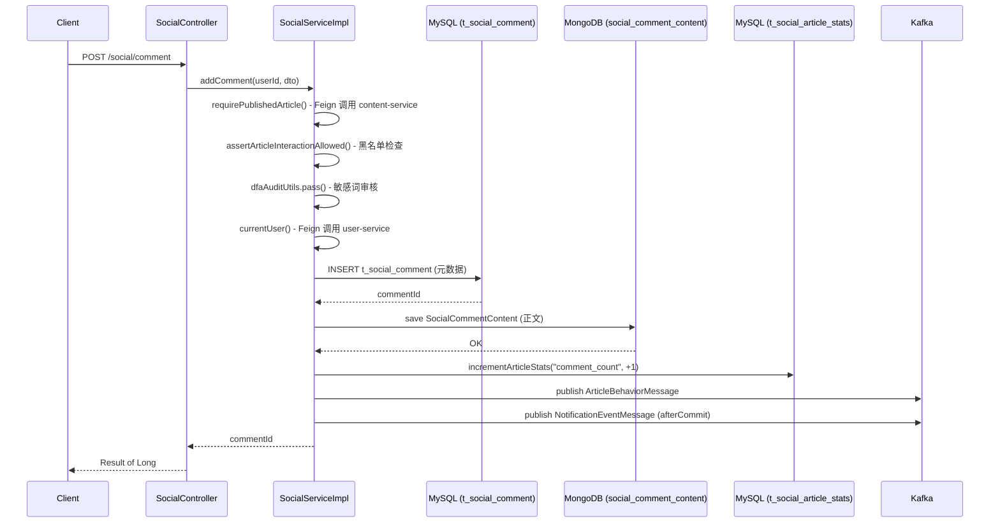
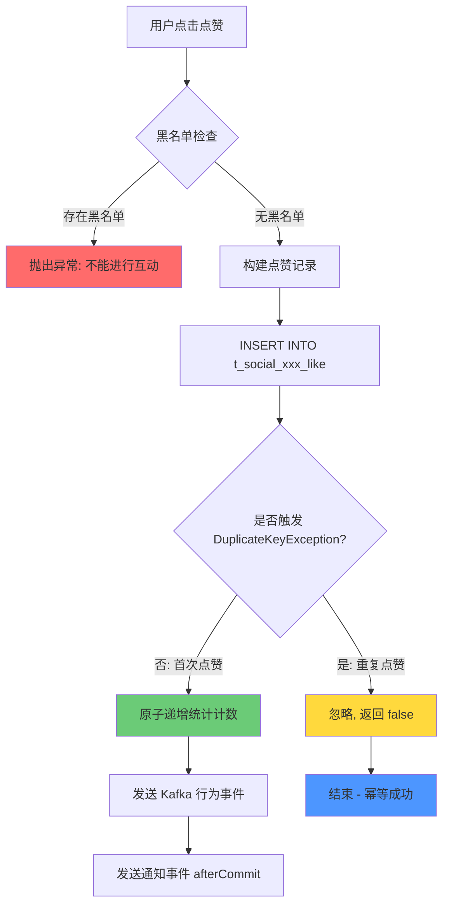
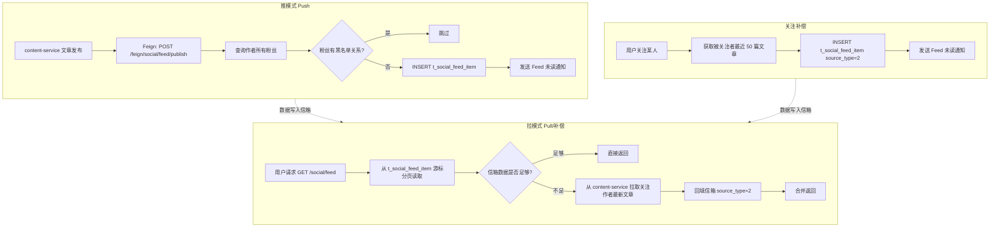
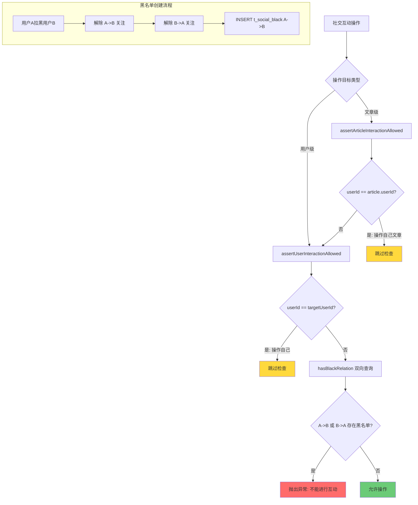
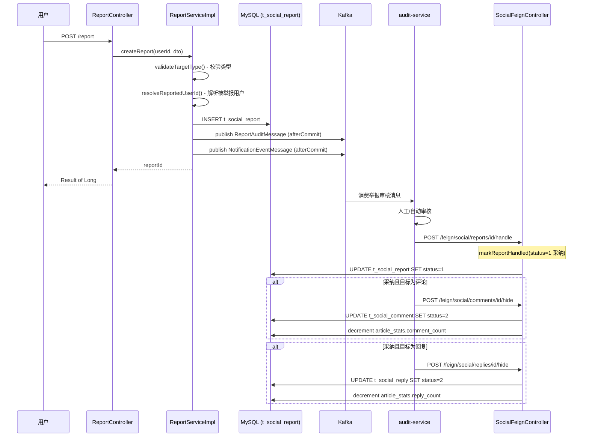

# 社交服务 (social-service) 技术文档

## 1. 服务概述

### 1.1 基本信息

| 属性 | 值 |
|------|-----|
| 服务名 | `social-service` |
| 端口 | `8084` |
| 注册中心 | Nacos (`localhost:8848`) |
| 数据库 | MySQL (`localhost:3307/game_community`) |
| MongoDB | `localhost:27018/game_community_social` |
| Redis | `localhost:6380` |
| Kafka | `localhost:9093` |
| 服务间调用 | OpenFeign (user-service, content-service) |

### 1.2 核心职责

社交服务承担游戏社区平台的所有社交互动功能：

1. **评论系统** — 文章评论的添加、删除、分页查询，采用 MySQL + MongoDB 双写架构
2. **回复系统** — 评论下的回复管理，支持楼中楼回复
3. **点赞系统** — 文章/评论/回复的点赞与取消，幂等设计
4. **浏览历史** — 用户浏览文章的 UV 记录
5. **关注与黑名单** — 用户关注、粉丝、拉黑及互关检测
6. **Feed 流** — 基于推拉结合模式的关注者内容推送
7. **举报系统** — 内容举报与审核处理
8. **文章社交统计** — 文章的点赞/评论/回复/浏览计数聚合

### 1.3 技术栈

| 类别 | 技术 |
|------|------|
| 框架 | Spring Boot 3.x + Spring Cloud |
| 服务发现 | Nacos Discovery |
| 流量控制 | Sentinel |
| ORM | MyBatis-Plus (含乐观锁、分页、逻辑删除) |
| 文档数据库 | Spring Data MongoDB |
| 消息队列 | Spring Kafka |
| 远程调用 | Spring Cloud OpenFeign |
| 敏感词过滤 | 本地 DFA 算法 (DfaAuditUtils) |
| 数据库连接池 | HikariCP (Spring Boot 默认) |

---

## 2. 数据模型

### 2.1 MySQL 表结构 (11 张表)

#### 2.1.1 t_social_article_stats — 文章社交统计表

存储每篇文章的社交互动计数，采用唯一索引 `article_id` 保证一行一文。所有计数字段的更新均通过 `GREATEST(0, column - delta)` 防止负数。

```sql
CREATE TABLE IF NOT EXISTS t_social_article_stats (
    id BIGINT PRIMARY KEY AUTO_INCREMENT COMMENT '统计ID',
    article_id BIGINT NOT NULL COMMENT '文章ID',
    like_count BIGINT NOT NULL DEFAULT 0 COMMENT '点赞数',
    comment_count BIGINT NOT NULL DEFAULT 0 COMMENT '评论数',
    comment_like_count BIGINT NOT NULL DEFAULT 0 COMMENT '评论点赞数',
    reply_count BIGINT NOT NULL DEFAULT 0 COMMENT '回复数',
    reply_like_count BIGINT NOT NULL DEFAULT 0 COMMENT '回复点赞数',
    view_count BIGINT NOT NULL DEFAULT 0 COMMENT '浏览数',
    version INT NOT NULL DEFAULT 0 COMMENT '乐观锁版本',
    create_time DATETIME NOT NULL DEFAULT CURRENT_TIMESTAMP COMMENT '创建时间',
    update_time DATETIME NOT NULL DEFAULT CURRENT_TIMESTAMP ON UPDATE CURRENT_TIMESTAMP COMMENT '更新时间',
    UNIQUE KEY uk_social_article_stats_article (article_id)
) COMMENT='文章社交统计表';
```

**设计要点**：
- `version` 字段配合 MyBatis-Plus 的 `@Version` 实现乐观锁，防止并发更新丢失
- `comment_like_count` 和 `reply_like_count` 单独计数，与主文章的 `like_count` 独立
- 统计行采用懒创建：首次访问时 `ensureArticleStats()` 检查是否存在，不存在则插入，`DuplicateKeyException` 兜底并发创建

#### 2.1.2 t_social_comment — 评论元数据表

评论的结构化元数据存 MySQL，正文内容存 MongoDB（双写架构）。评论不存 `content` 列。

```sql
CREATE TABLE IF NOT EXISTS t_social_comment (
    id BIGINT PRIMARY KEY AUTO_INCREMENT COMMENT '评论ID',
    article_id BIGINT NOT NULL COMMENT '文章ID',
    user_id BIGINT NOT NULL COMMENT '评论用户ID',
    username VARCHAR(64) NOT NULL COMMENT '用户昵称快照',
    avatar VARCHAR(1024) DEFAULT NULL COMMENT '用户头像快照',
    like_count BIGINT NOT NULL DEFAULT 0 COMMENT '点赞数',
    reply_count BIGINT NOT NULL DEFAULT 0 COMMENT '回复数',
    status TINYINT NOT NULL DEFAULT 1 COMMENT '状态: 1-正常, 2-隐藏, 3-已删除',
    version INT NOT NULL DEFAULT 0 COMMENT '乐观锁版本',
    create_time DATETIME NOT NULL DEFAULT CURRENT_TIMESTAMP COMMENT '创建时间',
    update_time DATETIME NOT NULL DEFAULT CURRENT_TIMESTAMP ON UPDATE CURRENT_TIMESTAMP COMMENT '更新时间',
    deleted TINYINT NOT NULL DEFAULT 0 COMMENT '逻辑删除',
    KEY idx_social_comment_article_time (article_id, status, create_time, id),
    KEY idx_social_comment_user_time (user_id, create_time, id)
) COMMENT='评论元数据表，正文存 MongoDB';
```

**设计要点**：
- `username` / `avatar` 为快照字段，写入时从用户服务获取并冗余，避免列表查询时 N+1 远程调用
- `status` 三态设计：`1-正常`、`2-隐藏(审核)`、`3-已删除(用户)`
- `deleted` 为 MyBatis-Plus 逻辑删除标记，删除评论时同时设置 `status=3` 和 `deleted=1`
- 联合索引 `(article_id, status, create_time, id)` 覆盖文章评论列表查询

#### 2.1.3 t_social_reply — 评论回复表

回复内容直接存储在 MySQL 的 `content` 字段（VARCHAR 1000），不使用 MongoDB 双写，因为回复内容相对较短。

```sql
CREATE TABLE IF NOT EXISTS t_social_reply (
    id BIGINT PRIMARY KEY AUTO_INCREMENT COMMENT '回复ID',
    comment_id BIGINT NOT NULL COMMENT '评论ID',
    article_id BIGINT NOT NULL COMMENT '文章ID',
    user_id BIGINT NOT NULL COMMENT '回复用户ID',
    username VARCHAR(64) NOT NULL COMMENT '用户昵称快照',
    avatar VARCHAR(1024) DEFAULT NULL COMMENT '用户头像快照',
    reply_to_user_id BIGINT DEFAULT NULL COMMENT '被回复用户ID',
    reply_to_username VARCHAR(64) DEFAULT NULL COMMENT '被回复用户昵称快照',
    content VARCHAR(1000) NOT NULL COMMENT '回复内容',
    like_count BIGINT NOT NULL DEFAULT 0 COMMENT '点赞数',
    status TINYINT NOT NULL DEFAULT 1 COMMENT '状态: 1-正常, 2-隐藏, 3-已删除',
    version INT NOT NULL DEFAULT 0 COMMENT '乐观锁版本',
    create_time DATETIME NOT NULL DEFAULT CURRENT_TIMESTAMP COMMENT '创建时间',
    update_time DATETIME NOT NULL DEFAULT CURRENT_TIMESTAMP ON UPDATE CURRENT_TIMESTAMP COMMENT '更新时间',
    deleted TINYINT NOT NULL DEFAULT 0 COMMENT '逻辑删除',
    KEY idx_social_reply_comment_time (comment_id, status, create_time, id),
    KEY idx_social_reply_user_time (user_id, create_time, id)
) COMMENT='评论回复表';
```

**设计要点**：
- `reply_to_user_id` / `reply_to_username` 支持楼中楼回复，为 null 时表示直接回复评论
- `article_id` 冗余存储，方便直接关联文章统计和黑名单检查
- 回复按 `create_time ASC` 排列（时间正序），评论按 `create_time DESC` 排列（时间倒序）

#### 2.1.4 t_social_article_like — 文章点赞表

```sql
CREATE TABLE IF NOT EXISTS t_social_article_like (
    id BIGINT PRIMARY KEY AUTO_INCREMENT COMMENT '点赞ID',
    article_id BIGINT NOT NULL COMMENT '文章ID',
    user_id BIGINT NOT NULL COMMENT '用户ID',
    create_time DATETIME NOT NULL DEFAULT CURRENT_TIMESTAMP COMMENT '创建时间',
    UNIQUE KEY uk_social_article_like_user_article (user_id, article_id),
    KEY idx_social_article_like_article (article_id, create_time, id)
) COMMENT='文章点赞表';
```

**设计要点**：
- 唯一索引 `(user_id, article_id)` 保证一个用户对一篇文章只能点赞一次
- 点赞幂等：插入时捕获 `DuplicateKeyException`，重复点赞不报错
- 取消点赞：DELETE 操作，若删除行数 > 0 才扣减统计计数
- 索引 `(article_id, create_time, id)` 支持按文章查点赞列表

#### 2.1.5 t_social_comment_like — 评论点赞表

```sql
CREATE TABLE IF NOT EXISTS t_social_comment_like (
    id BIGINT PRIMARY KEY AUTO_INCREMENT COMMENT '点赞ID',
    comment_id BIGINT NOT NULL COMMENT '评论ID',
    user_id BIGINT NOT NULL COMMENT '用户ID',
    create_time DATETIME NOT NULL DEFAULT CURRENT_TIMESTAMP COMMENT '创建时间',
    UNIQUE KEY uk_social_comment_like_user_comment (user_id, comment_id),
    KEY idx_social_comment_like_comment (comment_id, create_time, id)
) COMMENT='评论点赞表';
```

**设计要点**：与文章点赞表同构，唯一索引 `(user_id, comment_id)` 保证幂等。

#### 2.1.6 t_social_reply_like — 回复点赞表

```sql
CREATE TABLE IF NOT EXISTS t_social_reply_like (
    id BIGINT PRIMARY KEY AUTO_INCREMENT COMMENT '点赞ID',
    reply_id BIGINT NOT NULL COMMENT '回复ID',
    user_id BIGINT NOT NULL COMMENT '用户ID',
    create_time DATETIME NOT NULL DEFAULT CURRENT_TIMESTAMP COMMENT '创建时间',
    UNIQUE KEY uk_social_reply_like_user_reply (user_id, reply_id),
    KEY idx_social_reply_like_reply (reply_id, create_time, id)
) COMMENT='回复点赞表';
```

**设计要点**：同上，唯一索引 `(user_id, reply_id)` 保证幂等。

#### 2.1.7 t_social_browse_history — 浏览历史表

```sql
CREATE TABLE IF NOT EXISTS t_social_browse_history (
    id BIGINT PRIMARY KEY AUTO_INCREMENT COMMENT '浏览记录ID',
    user_id BIGINT NOT NULL COMMENT '用户ID',
    article_id BIGINT NOT NULL COMMENT '文章ID',
    create_time DATETIME NOT NULL DEFAULT CURRENT_TIMESTAMP COMMENT '首次浏览时间',
    update_time DATETIME NOT NULL DEFAULT CURRENT_TIMESTAMP ON UPDATE CURRENT_TIMESTAMP COMMENT '最近浏览时间',
    UNIQUE KEY uk_social_browse_user_article (user_id, article_id),
    KEY idx_social_browse_user_time (user_id, update_time, id)
) COMMENT='文章浏览历史表';
```

**设计要点**：
- 唯一索引 `(user_id, article_id)` 实现 UV 模型：同一用户重复浏览同一文章不新增记录
- 首次浏览通过 `insertIgnoreDuplicate` 插入（捕获 `DuplicateKeyException`），成功则 `view_count + 1`
- 重复浏览则仅更新 `update_time`，不增加浏览计数
- `create_time` 记录首次浏览时间，`update_time` 记录最近浏览时间

#### 2.1.8 t_social_feed_item — 用户 Feed 信箱表

```sql
CREATE TABLE IF NOT EXISTS t_social_feed_item (
    id BIGINT PRIMARY KEY AUTO_INCREMENT COMMENT 'Feed记录ID',
    user_id BIGINT NOT NULL COMMENT '收件用户ID',
    author_id BIGINT NOT NULL COMMENT '作者用户ID',
    article_id BIGINT NOT NULL COMMENT '文章ID',
    published_time DATETIME NOT NULL COMMENT '文章发布时间',
    source_type TINYINT NOT NULL DEFAULT 1 COMMENT '来源: 1-发布推送, 2-关注补偿',
    create_time DATETIME NOT NULL DEFAULT CURRENT_TIMESTAMP COMMENT '入信箱时间',
    UNIQUE KEY uk_social_feed_user_article (user_id, article_id),
    KEY idx_social_feed_user_time (user_id, published_time, article_id),
    KEY idx_social_feed_author_time (author_id, published_time, article_id)
) COMMENT='用户Feed信箱表';
```

**设计要点**：
- 采用推模式 (Push Model)：作者发文时，向所有粉丝的信箱中插入记录
- 唯一索引 `(user_id, article_id)` 保证信箱不重复
- `source_type` 区分来源：`1-发布推送`（作者发文时推送）、`2-关注补偿`（新关注时回填）
- `published_time` 为文章发布时间（非入信箱时间），用于游标分页排序
- 索引 `(user_id, published_time, article_id)` 覆盖 Feed 读取查询

#### 2.1.9 t_social_follow — 用户关注关系表

```sql
CREATE TABLE IF NOT EXISTS t_social_follow (
    id BIGINT PRIMARY KEY AUTO_INCREMENT COMMENT '关注ID',
    user_id BIGINT NOT NULL COMMENT '用户ID',
    follow_user_id BIGINT NOT NULL COMMENT '被关注用户ID',
    create_time DATETIME NOT NULL DEFAULT CURRENT_TIMESTAMP COMMENT '创建时间',
    UNIQUE KEY uk_social_follow_pair (user_id, follow_user_id),
    KEY idx_social_follow_target (follow_user_id, create_time, id)
) COMMENT='用户关注关系表';
```

**设计要点**：
- 唯一索引 `(user_id, follow_user_id)` 保证不重复关注
- 关注幂等：插入时捕获 `DuplicateKeyException`
- 索引 `(follow_user_id, create_time, id)` 支持查粉丝列表
- 关注关系单向：A 关注 B 只有一行记录，互关需要两行

#### 2.1.10 t_social_black — 用户黑名单表

```sql
CREATE TABLE IF NOT EXISTS t_social_black (
    id BIGINT PRIMARY KEY AUTO_INCREMENT COMMENT '拉黑ID',
    user_id BIGINT NOT NULL COMMENT '用户ID',
    black_user_id BIGINT NOT NULL COMMENT '被拉黑用户ID',
    create_time DATETIME NOT NULL DEFAULT CURRENT_TIMESTAMP COMMENT '创建时间',
    UNIQUE KEY uk_social_black_pair (user_id, black_user_id),
    KEY idx_social_black_target (black_user_id, create_time, id)
) COMMENT='用户黑名单表';
```

**设计要点**：
- 唯一索引 `(user_id, black_user_id)` 保证不重复拉黑
- 拉黑幂等：捕获 `DuplicateKeyException`
- 黑名单检查为双向：`hasBlackRelation(A, B)` 检查 A->B 或 B->A 任一方向存在即视为有黑名单关系
- 拉黑时自动解除双向关注关系

#### 2.1.11 t_social_report — 社交举报表

```sql
CREATE TABLE IF NOT EXISTS t_social_report (
    id BIGINT PRIMARY KEY AUTO_INCREMENT COMMENT '举报ID',
    target_type TINYINT NOT NULL COMMENT '目标类型: 1-文章, 2-评论, 3-回复, 4-用户',
    target_id BIGINT NOT NULL COMMENT '目标ID',
    reporter_id BIGINT NOT NULL COMMENT '举报用户ID',
    reason VARCHAR(255) NOT NULL COMMENT '举报原因',
    status TINYINT NOT NULL DEFAULT 0 COMMENT '状态: 0-待处理, 1-已采纳, 2-已驳回, 3-处理中',
    handler_id BIGINT DEFAULT NULL COMMENT '处理人ID',
    handle_remark VARCHAR(255) DEFAULT NULL COMMENT '处理说明',
    handle_time DATETIME DEFAULT NULL COMMENT '处理时间',
    version INT NOT NULL DEFAULT 0 COMMENT '乐观锁版本',
    create_time DATETIME NOT NULL DEFAULT CURRENT_TIMESTAMP COMMENT '创建时间',
    update_time DATETIME NOT NULL DEFAULT CURRENT_TIMESTAMP ON UPDATE CURRENT_TIMESTAMP COMMENT '更新时间',
    KEY idx_social_report_status_time (status, create_time, id),
    KEY idx_social_report_target (target_type, target_id),
    KEY idx_social_report_reporter (reporter_id, create_time, id)
) COMMENT='社交举报表';
```

**设计要点**：
- `target_type` 支持四种举报目标：文章(1)、评论(2)、回复(3)、用户(4)
- `reportedUserId` 在创建举报时自动解析填充，避免后续处理时再次查找
- 唯一性保证通过 `(reporter_id, target_type, target_id)` 在代码层面（DuplicateKeyException）防止重复举报
- `version` 乐观锁防止并发处理冲突
- 状态流转：`0-待处理` -> `1-已采纳` / `2-已驳回`，也可经过 `3-处理中` 中间态

> **注意**：DDL 中 `t_social_report` 缺少 `reported_user_id` 列和 `(reporter_id, target_type, target_id)` 唯一索引，但实体类 `SocialReport` 包含 `reportedUserId` 字段，代码中使用 `DuplicateKeyException` 捕获重复举报。实际部署时需补充：
> ```sql
> ALTER TABLE t_social_report ADD COLUMN reported_user_id BIGINT DEFAULT NULL COMMENT '被举报用户ID' AFTER reporter_id;
> ALTER TABLE t_social_report ADD UNIQUE KEY uk_social_report_dedup (reporter_id, target_type, target_id);
> ```

### 2.2 MongoDB 集合

#### social_comment_content — 评论正文集合

评论正文存储在 MongoDB，与 MySQL 中的评论元数据形成双写架构。大文本存 MongoDB 的原因：
1. 评论内容可能较长（最大 2000 字），MySQL VARCHAR 不适合
2. MongoDB 天然支持灵活的文本内容扩展（如后续添加 Markdown、@提及等）
3. 读取评论列表时，先从 MySQL 获取元数据分页，再从 MongoDB 批量获取正文

```javascript
// 集合文档结构
{
  _id: ObjectId,               // MongoDB 主键
  commentId: NumberLong,       // 评论ID（唯一索引，关联 MySQL t_social_comment.id）
  articleId: NumberLong,       // 文章ID（冗余，支持按文章批量查询）
  userId: NumberLong,          // 评论用户ID
  content: String,             // 评论正文内容
  createTime: ISODate,         // 创建时间
  updateTime: ISODate          // 更新时间
}

// 建议索引
db.social_comment_content.createIndex({ commentId: 1 }, { unique: true })
db.social_comment_content.createIndex({ articleId: 1, createTime: -1 })
```

**Java 实体**：

```java
@Data
@Document(collection = "social_comment_content")
public class SocialCommentContent implements Serializable {
    @Id
    private String id;

    @Indexed(unique = true)
    private Long commentId;

    private Long articleId;
    private Long userId;
    private String content;
    private LocalDateTime createTime;
    private LocalDateTime updateTime;
}
```

**Repository 接口**：

```java
public interface SocialCommentContentRepository extends MongoRepository<SocialCommentContent, String> {
    Optional<SocialCommentContent> findByCommentId(Long commentId);
    List<SocialCommentContent> findByCommentIdIn(Collection<Long> commentIds);
    void deleteByCommentId(Long commentId);
}
```

---

## 3. 功能模块详解

### 3.1 评论系统

#### 3.1.1 添加评论 — POST /social/comment

**请求体** (`AddCommentDTO`)：

| 字段 | 类型 | 校验 | 说明 |
|------|------|------|------|
| articleId | Long | @NotNull | 文章ID |
| content | String | @NotBlank, @Size(max=2000) | 评论内容 |

**完整流程**：

```java
@Override
@Transactional(rollbackFor = Exception.class)
public Long addComment(Long userId, AddCommentDTO dto) {
    // 1. 验证文章存在性
    Article article = requirePublishedArticle(dto.getArticleId());
    // 2. 黑名单检查（用户与文章作者之间是否存在黑名单关系）
    assertArticleInteractionAllowed(userId, article);
    // 3. DFA 敏感词审核
    if (!dfaAuditUtils.pass(dto.getContent())) {
        throw new BusinessException("评论包含敏感内容");
    }
    // 4. 获取用户信息快照
    UserVO user = currentUser(userId);
    // 5. 构建评论元数据 -> 写入 MySQL
    SocialComment comment = new SocialComment();
    comment.setArticleId(article.getId());
    comment.setUserId(userId);
    comment.setUsername(user == null ? "玩家" + userId : user.getUsername());
    comment.setAvatar(user == null ? null : user.getAvatar());
    comment.setLikeCount(0L);
    comment.setReplyCount(0L);
    comment.setStatus(SocialConstants.CommentStatus.NORMAL);
    comment.setVersion(0);
    commentMapper.insert(comment);

    // 6. 构建评论正文 -> 写入 MongoDB（双写第二步）
    SocialCommentContent content = new SocialCommentContent();
    content.setCommentId(comment.getId());
    content.setArticleId(article.getId());
    content.setUserId(userId);
    content.setContent(dto.getContent().trim());
    content.setCreateTime(LocalDateTime.now());
    content.setUpdateTime(LocalDateTime.now());
    commentContentRepository.save(content);

    // 7. 原子递增文章统计 comment_count
    incrementArticleStats(article.getId(), "comment_count", 1);
    // 8. 发送 Kafka 行为事件到推荐服务
    articleBehaviorProducer.publish(article.getId(), 0L, 1L, 0L);
    // 9. 非自评时发送通知事件
    if (!Objects.equals(userId, article.getUserId())) {
        notificationEventProducer.publishArticleComment(
            article.getUserId(), user, article.getId(), comment.getId(), content.getContent());
    }
    return comment.getId();
}
```

**双写策略说明**：
- **MySQL 先写，MongoDB 后写，无分布式事务**
- MySQL 写入在 `@Transactional` 内，失败则整体回滚
- MongoDB 写入紧跟 MySQL 之后，若 MongoDB 写入失败，MySQL 事务也会回滚（因为 `commentContentRepository.save()` 抛出异常会触发 `@Transactional` 回滚）
- 删除评论时先软删除 MySQL 记录，再删除 MongoDB 文档

#### 3.1.2 删除评论 — DELETE /social/comment/{commentId}

**完整流程**：

```java
@Override
@Transactional(rollbackFor = Exception.class)
public void deleteComment(Long userId, Long commentId) {
    SocialComment comment = requireComment(commentId);
    // 1. 权限校验：仅评论作者可删除
    if (!Objects.equals(comment.getUserId(), userId)) {
        throw new BusinessException("无权删除该评论");
    }
    // 2. 软删除：status->3(DELETED), deleted->1
    int updated = commentMapper.update(null, new LambdaUpdateWrapper<SocialComment>()
            .eq(SocialComment::getId, commentId)
            .eq(SocialComment::getUserId, userId)
            .eq(SocialComment::getStatus, SocialConstants.CommentStatus.NORMAL)
            .set(SocialComment::getStatus, SocialConstants.CommentStatus.DELETED)
            .set(SocialComment::getDeleted, 1));
    if (updated > 0) {
        // 3. 删除 MongoDB 正文
        commentContentRepository.deleteByCommentId(commentId);
        // 4. 递减文章统计
        incrementArticleStats(comment.getArticleId(), "comment_count", -1);
        // 5. 发送行为事件
        articleBehaviorProducer.publish(comment.getArticleId(), 0L, -1L, 0L);
    }
}
```

**设计要点**：
- 使用 `eq(status, NORMAL)` 条件保证只删除正常状态的评论，隐藏状态的评论不能被用户删除
- `updated > 0` 判断确保实际执行了更新才扣减计数
- 软删除后 MongoDB 正文也被删除（硬删除），因为已软删除的评论不再展示

#### 3.1.3 评论列表 — GET /social/comment/list/{articleId}

**请求参数**：

| 参数 | 类型 | 默认值 | 说明 |
|------|------|--------|------|
| articleId | Long | (路径参数) | 文章ID |
| page | Long | 1 | 页码 |
| size | Long | 20 | 每页条数 (最大100) |

**查询流程**：

1. 从 MySQL 分页查询评论元数据（`status=NORMAL`, 按 `create_time DESC`）
2. 提取评论 ID 列表，从 MongoDB 批量获取正文 (`findByCommentIdIn`)
3. 查询当前用户对这批评论的点赞状态 (`likedCommentIds`)
4. 组装 `CommentVO` 返回

```java
@Override
public PageResult<CommentVO> listComments(Long userId, CommentPageDTO dto) {
    Page<SocialComment> result = commentMapper.selectPage(new Page<>(page, size),
            new LambdaQueryWrapper<SocialComment>()
                .eq(SocialComment::getArticleId, dto.getArticleId())
                .eq(SocialComment::getStatus, SocialConstants.CommentStatus.NORMAL)
                .orderByDesc(SocialComment::getCreateTime));
    // 批量获取 MongoDB 正文
    List<Long> commentIds = result.getRecords().stream().map(SocialComment::getId).toList();
    Map<Long, String> contentMap = commentContentRepository.findByCommentIdIn(commentIds).stream()
            .collect(Collectors.toMap(SocialCommentContent::getCommentId, SocialCommentContent::getContent));
    // 批量获取点赞状态
    Set<Long> likedIds = likedCommentIds(userId, commentIds);
    // 组装 VO
    List<CommentVO> records = result.getRecords().stream()
            .map(item -> toCommentVO(item, contentMap.get(item.getId()), likedIds.contains(item.getId())))
            .toList();
    return PageResult.of(records, page, size, result.getTotal());
}
```

#### 3.1.4 评论详情 — GET /social/comment/{commentId}

供 Feign 内部调用，获取单条评论详情，包含从 MongoDB 读取的正文。

### 3.2 回复系统

#### 3.2.1 添加回复 — POST /social/reply

**请求体** (`AddReplyDTO`)：

| 字段 | 类型 | 校验 | 说明 |
|------|------|------|------|
| commentId | Long | @NotNull | 评论ID |
| replyToUserId | Long | 可选 | 被回复用户ID（null表示直接回复评论） |
| content | String | @NotBlank, @Size(max=1000) | 回复内容 |

**完整流程**：

```java
@Override
@Transactional(rollbackFor = Exception.class)
public Long addReply(Long userId, AddReplyDTO dto) {
    // 1. 验证评论存在
    SocialComment comment = requireComment(dto.getCommentId());
    // 2. 验证文章存在
    Article article = requirePublishedArticle(comment.getArticleId());
    // 3. 黑名单检查：与文章作者 + 评论作者
    assertArticleInteractionAllowed(userId, article);
    assertUserInteractionAllowed(userId, comment.getUserId());
    // 4. DFA 敏感词审核
    if (!dfaAuditUtils.pass(dto.getContent())) {
        throw new BusinessException("回复包含敏感内容");
    }
    // 5. 黑名单检查：与被回复用户
    if (dto.getReplyToUserId() != null) {
        assertUserInteractionAllowed(userId, dto.getReplyToUserId());
    }
    // 6. 获取用户信息快照
    UserVO user = currentUser(userId);
    UserVO replyToUser = dto.getReplyToUserId() == null ? null
            : userMap(List.of(dto.getReplyToUserId())).get(dto.getReplyToUserId());
    // 7. 构建回复 -> 写入 MySQL（content 直接存 VARCHAR(1000)）
    SocialReply reply = new SocialReply();
    reply.setCommentId(comment.getId());
    reply.setArticleId(comment.getArticleId());
    reply.setUserId(userId);
    reply.setUsername(user == null ? "玩家" + userId : user.getUsername());
    reply.setAvatar(user == null ? null : user.getAvatar());
    reply.setReplyToUserId(dto.getReplyToUserId());
    reply.setReplyToUsername(replyToUser == null ? null : replyToUser.getUsername());
    reply.setContent(dto.getContent().trim());
    reply.setLikeCount(0L);
    reply.setStatus(SocialConstants.ReplyStatus.NORMAL);
    reply.setVersion(0);
    replyMapper.insert(reply);
    // 8. 递增评论的 reply_count + 文章统计的 reply_count
    incrementComment(comment.getId(), "reply_count", 1);
    incrementArticleStats(comment.getArticleId(), "reply_count", 1);
    articleBehaviorProducer.publish(comment.getArticleId(), 0L, 0L, 0L);
    // 9. 通知：文章作者 + 被回复用户/评论作者
    Set<Long> recipients = new LinkedHashSet<>();
    if (!Objects.equals(userId, article.getUserId())) {
        recipients.add(article.getUserId());
    }
    if (dto.getReplyToUserId() != null && !Objects.equals(userId, dto.getReplyToUserId())) {
        recipients.add(dto.getReplyToUserId());
    } else if (!Objects.equals(userId, comment.getUserId())) {
        recipients.add(comment.getUserId());
    }
    for (Long recipientId : recipients) {
        notificationEventProducer.publishCommentReply(
            recipientId, user, comment.getArticleId(), comment.getId(), reply.getId(), reply.getContent());
    }
    return reply.getId();
}
```

**通知接收人逻辑**：
- 文章作者（如果回复者不是作者本人）
- 如果指定了 `replyToUserId`：被回复用户（如果回复者不是被回复用户本人）
- 如果未指定 `replyToUserId`：评论作者（如果回复者不是评论作者本人）
- 使用 `LinkedHashSet` 去重，保证同一用户不重复收到通知

#### 3.2.2 删除回复 — DELETE /social/reply/{replyId}

与删除评论逻辑一致：权限校验 -> 软删除 -> 递减计数 -> 发送行为事件。

#### 3.2.3 回复列表 — GET /social/reply/list/{commentId}

与评论列表逻辑一致，区别在于：
- 回复按 `create_time ASC`（时间正序）
- 回复内容直接从 MySQL 的 `content` 字段读取，无需查 MongoDB
- 同样批量查询当前用户的点赞状态

### 3.3 点赞系统

点赞系统对三种目标（文章、评论、回复）采用完全一致的模式，核心设计为**唯一索引 + 原子计数器 + DuplicateKeyException 幂等**。

#### 3.3.1 文章点赞 — POST /social/like/article/{articleId}

```java
@Override
@Transactional(rollbackFor = Exception.class)
public void likeArticle(Long userId, Long articleId) {
    Article article = requirePublishedArticle(articleId);
    assertArticleInteractionAllowed(userId, article);  // 黑名单检查
    SocialArticleLike like = new SocialArticleLike();
    like.setArticleId(articleId);
    like.setUserId(userId);
    // 唯一索引保证幂等：重复点赞不报错
    if (insertIgnoreDuplicate(() -> articleLikeMapper.insert(like))) {
        incrementArticleStats(articleId, "like_count", 1);  // 原子递增
        articleBehaviorProducer.publish(articleId, 1L, 0L, 0L);
        // 通知文章作者
        if (!Objects.equals(userId, article.getUserId())) {
            notificationEventProducer.publishArticleLike(article.getUserId(), currentUser(userId), articleId);
        }
    }
}
```

#### 3.3.2 文章取消点赞 — DELETE /social/like/article/{articleId}

```java
@Override
@Transactional(rollbackFor = Exception.class)
public void unlikeArticle(Long userId, Long articleId) {
    int deleted = articleLikeMapper.delete(new LambdaQueryWrapper<SocialArticleLike>()
            .eq(SocialArticleLike::getArticleId, articleId)
            .eq(SocialArticleLike::getUserId, userId));
    if (deleted > 0) {  // 仅当实际删除了记录才扣减计数
        incrementArticleStats(articleId, "like_count", -1);
        articleBehaviorProducer.publish(articleId, -1L, 0L, 0L);
    }
}
```

#### 3.3.3 评论点赞 — POST /social/like/comment/{commentId}

与文章点赞模式一致，额外增加：
- `assertUserInteractionAllowed(userId, comment.getUserId())` — 黑名单检查
- 同时递增评论的 `like_count` 和文章统计的 `comment_like_count`
- 通知接收人包括评论作者和文章作者（去重后）

```java
if (insertIgnoreDuplicate(() -> commentLikeMapper.insert(like))) {
    incrementComment(commentId, "like_count", 1);
    incrementArticleStats(comment.getArticleId(), "comment_like_count", 1);
    // ... 通知逻辑
}
```

#### 3.3.4 回复点赞 — POST /social/like/reply/{replyId}

与评论点赞模式一致，额外增加：
- 对 `reply.getReplyToUserId()` 也做黑名单检查
- 递增回复的 `like_count` 和文章统计的 `reply_like_count`

#### 3.3.5 点赞状态检查

| 接口 | 说明 |
|------|------|
| GET /social/like/article/check/{articleId} | 检查当前用户是否已点赞文章 |
| GET /social/like/comment/check/{commentId} | 检查当前用户是否已点赞评论 |
| GET /social/like/reply/check/{replyId} | 检查当前用户是否已点赞回复 |

实现方式：查询对应点赞表的 `selectCount`，`userId` 为 null 时直接返回 false。

```java
public boolean hasLikedArticle(Long userId, Long articleId) {
    return userId != null && articleLikeMapper.selectCount(
        new LambdaQueryWrapper<SocialArticleLike>()
            .eq(SocialArticleLike::getArticleId, articleId)
            .eq(SocialArticleLike::getUserId, userId)) > 0;
}
```

#### 3.3.6 原子计数器更新机制

所有计数更新通过 `incrementArticleStats` / `incrementComment` / `incrementReply` 三个私有方法实现，使用 SQL 表达式保证原子性和非负性：

```java
private void incrementArticleStats(Long articleId, String column, int delta) {
    ensureArticleStats(articleId);  // 懒创建统计行
    // 正数: column = column + delta
    // 负数: column = GREATEST(0, column - |delta|)  防止负数
    String expression = delta >= 0
            ? column + " = " + column + " + " + delta
            : column + " = GREATEST(0, " + column + " - " + Math.abs(delta) + ")";
    articleStatsMapper.update(null, new LambdaUpdateWrapper<SocialArticleStats>()
            .eq(SocialArticleStats::getArticleId, articleId)
            .setSql(expression)
            .set(SocialArticleStats::getUpdateTime, LocalDateTime.now()));
}
```

**幂等保证机制** (`insertIgnoreDuplicate`)：

```java
private boolean insertIgnoreDuplicate(InsertAction action) {
    try {
        return action.insert() > 0;
    } catch (DuplicateKeyException ignored) {
        return false;  // 重复操作不报错，返回 false 表示未实际插入
    }
}

@FunctionalInterface
private interface InsertAction {
    int insert();
}
```

### 3.4 浏览历史

#### 3.4.1 记录浏览 — GET /social/article/{articleId} (viewArticle)

浏览记录采用 UV 模型：同一用户对同一文章只记录一次浏览（计入 view_count），重复浏览仅更新时间。

```java
@Override
@Transactional(rollbackFor = Exception.class)
public Article viewArticle(Long userId, Long articleId) {
    Article article = requirePublishedArticle(articleId);
    ensureArticleStats(articleId);
    SocialBrowseHistory history = new SocialBrowseHistory();
    history.setUserId(userId);
    history.setArticleId(articleId);
    if (insertIgnoreDuplicate(() -> browseHistoryMapper.insert(history))) {
        // 首次浏览：view_count + 1
        incrementArticleStats(articleId, "view_count", 1);
        articleBehaviorProducer.publish(articleId, 0L, 0L, 1L);
    } else {
        // 重复浏览：仅更新 update_time
        browseHistoryMapper.update(null, new LambdaUpdateWrapper<SocialBrowseHistory>()
                .eq(SocialBrowseHistory::getUserId, userId)
                .eq(SocialBrowseHistory::getArticleId, articleId)
                .set(SocialBrowseHistory::getUpdateTime, LocalDateTime.now()));
    }
    return article;
}
```

**UV 模型原理**：`t_social_browse_history` 表的唯一索引 `(user_id, article_id)` 保证一行一用户一文。插入时若触发 `DuplicateKeyException`，说明已浏览过，仅更新 `update_time`。

#### 3.4.2 浏览历史列表 — GET /social/browse/history

分页查询当前用户的浏览历史，按 `update_time DESC` 排序。每条记录通过 `remoteClient.getArticle()` 获取文章详情。

**返回体** (`BrowseHistoryVO`)：

| 字段 | 类型 | 说明 |
|------|------|------|
| articleId | Long | 文章ID |
| article | Article | 文章详情（从 content-service 获取） |
| browseTime | LocalDateTime | 最近浏览时间 |

#### 3.4.3 点赞文章列表 — GET /social/like/article/list

分页查询当前用户点赞过的文章，按 `create_time DESC` 排序。每条点赞记录通过 `remoteClient.getArticle()` 获取文章详情。

### 3.5 关注与黑名单

#### 3.5.1 关注 — POST /social/follow/{targetUserId}

```java
@Override
@Transactional(rollbackFor = Exception.class)
public void follow(Long userId, Long targetUserId) {
    validateTarget(userId, targetUserId);  // 校验目标用户存在、不能关注自己
    if (hasBlackRelation(userId, targetUserId)) {
        throw new BusinessException("你与该用户存在黑名单关系，不能关注");
    }
    SocialFollow follow = new SocialFollow();
    follow.setUserId(userId);
    follow.setFollowUserId(targetUserId);
    try {
        followMapper.insert(follow);          // 唯一索引保证幂等
        compensateFeedOnFollow(userId, targetUserId);  // 关注补偿：回填最近文章到 Feed
        notificationEventProducer.publishFollow(targetUserId, currentUser(userId));
    } catch (DuplicateKeyException ignored) {
        // 重复关注保持幂等
    }
}
```

**关注补偿 (Feed Backfill)**：

```java
private void compensateFeedOnFollow(Long userId, Long targetUserId) {
    // 从 content-service 获取被关注用户最近 50 篇文章
    List<Article> articles = remoteClient.listPublishedByAuthor(targetUserId, 50);
    for (Article article : articles) {
        SocialFeedItem item = new SocialFeedItem();
        item.setUserId(userId);
        item.setAuthorId(targetUserId);
        item.setArticleId(article.getId());
        item.setPublishedTime(article.getPublishedTime());
        item.setSourceType(SocialConstants.FeedSourceType.FOLLOW_COMPENSATION);  // 来源: 关注补偿
        try {
            feedItemMapper.insert(item);  // 唯一索引保证信箱不重复
            notificationEventProducer.publishFeedUnread(userId, article.getPublishedTime());
        } catch (DuplicateKeyException ignored) {
            // 关注补偿可重复执行，唯一索引保证信箱不重复
        }
    }
}
```

#### 3.5.2 取消关注 — DELETE /social/follow/{targetUserId}

直接删除关注记录，不检查是否存在。

#### 3.5.3 拉黑 — POST /social/follow/black/{targetUserId}

```java
@Override
@Transactional(rollbackFor = Exception.class)
public void black(Long userId, Long targetUserId) {
    validateTarget(userId, targetUserId);
    // 1. 解除 A->B 的关注
    unfollow(userId, targetUserId);
    // 2. 解除 B->A 的关注
    followMapper.delete(new LambdaQueryWrapper<SocialFollow>()
            .eq(SocialFollow::getUserId, targetUserId)
            .eq(SocialFollow::getFollowUserId, userId));
    // 3. 插入黑名单（幂等）
    SocialBlack black = new SocialBlack();
    black.setUserId(userId);
    black.setBlackUserId(targetUserId);
    try {
        blackMapper.insert(black);
    } catch (DuplicateKeyException ignored) {
        // 重复拉黑保持幂等
    }
}
```

**设计要点**：
- 拉黑时**双向解除关注**：A 拉黑 B，则 A->B 和 B->A 的关注关系全部删除
- 黑名单为单向关系：A 拉黑 B，不等于 B 拉黑 A
- 但**黑名单检查为双向**：`hasBlackRelation(A, B)` 检查 A->B 或 B->A 任一方向存在即视为有黑名单关系

#### 3.5.4 取消拉黑 — DELETE /social/follow/black/{targetUserId}

删除单向黑名单记录。

#### 3.5.5 黑名单拦截机制

所有社交互动（评论、回复、点赞）写入前均检查黑名单：

```java
private void assertArticleInteractionAllowed(Long userId, Article article) {
    if (userId == null || article == null || Objects.equals(userId, article.getUserId())) {
        return;  // 对自己的文章操作不检查黑名单
    }
    assertUserInteractionAllowed(userId, article.getUserId());
}

private void assertUserInteractionAllowed(Long userId, Long targetUserId) {
    if (userId == null || targetUserId == null || Objects.equals(userId, targetUserId)) {
        return;
    }
    if (hasBlackRelation(userId, targetUserId)) {
        throw new BusinessException("你与该用户存在黑名单关系，不能进行互动");
    }
}
```

`hasBlackRelation` 双向查询：

```java
private boolean hasBlackRelation(Long leftUserId, Long rightUserId) {
    if (leftUserId == null || rightUserId == null || Objects.equals(leftUserId, rightUserId)) {
        return false;
    }
    return blackMapper.selectCount(new LambdaQueryWrapper<SocialBlack>()
            .and(wrapper -> wrapper
                    .eq(SocialBlack::getUserId, leftUserId)
                    .eq(SocialBlack::getBlackUserId, rightUserId))
            .or(wrapper -> wrapper
                    .eq(SocialBlack::getUserId, rightUserId)
                    .eq(SocialBlack::getBlackUserId, leftUserId))) > 0;
}
```

#### 3.5.6 关注/粉丝/黑名单列表

| 接口 | 说明 | 查询条件 |
|------|------|----------|
| GET /social/follow/list | 关注列表 | `user_id = ?` |
| GET /social/follow/fans | 粉丝列表 | `follow_user_id = ?` |
| GET /social/follow/black/list | 黑名单列表 | `user_id = ?` |

所有列表均通过 `remoteClient.listUsersByIds()` 批量获取用户信息，组装 `FollowUserVO` 返回。

#### 3.5.7 关注状态与计数

| 接口 | 说明 |
|------|------|
| GET /social/follow/check/{targetUserId} | 是否已关注 |
| GET /social/follow/black/check/{targetUserId} | 是否已拉黑 |
| GET /social/follow/count/{userId} | 返回 `{ "following": N, "fans": M }` |

### 3.6 Feed 流

#### 3.6.1 推送 — 服务间接口 POST /feign/social/feed/publish（需 X-Internal-Token）

由 content-service 在文章发布后调用，向作者所有粉丝推送 Feed。

```java
@Override
@Transactional(rollbackFor = Exception.class)
public void publishArticleToFollowers(Long authorId, Long articleId, LocalDateTime publishedTime) {
    if (authorId == null || articleId == null || publishedTime == null) {
        return;
    }
    // 1. 查询作者的所有粉丝
    List<SocialFollow> followers = followMapper.selectList(new LambdaQueryWrapper<SocialFollow>()
            .eq(SocialFollow::getFollowUserId, authorId));
    // 2. 逐个粉丝推送
    for (SocialFollow follower : followers) {
        // 跳过有黑名单关系的粉丝
        if (hasBlackRelation(follower.getUserId(), authorId)) {
            continue;
        }
        // 插入 Feed 信箱（幂等）
        if (insertFeedItem(follower.getUserId(), authorId, articleId, publishedTime,
                SocialConstants.FeedSourceType.PUBLISH_PUSH)) {
            notificationEventProducer.publishFeedUnread(follower.getUserId(), publishedTime);
        }
    }
}
```

#### 3.6.2 Feed 读取 — GET /social/feed

采用**游标分页**，基于 `published_time` + `article_id` 实现无偏分页。

| 参数 | 类型 | 默认值 | 说明 |
|------|------|--------|------|
| before | String (ISO DateTime) | null | 游标：返回此时间之前的文章 |
| size | Long | 20 | 每页条数 (最大100) |

```java
@Override
public PageResult<Article> listFeed(Long userId, LocalDateTime before, Long size) {
    long pageSize = normalizeSize(size);
    LocalDateTime cursor = before == null ? LocalDateTime.now().plusSeconds(1) : before;

    // 1. 从 Feed 信箱读取
    List<SocialFeedItem> feedItems = feedItemMapper.selectList(new LambdaQueryWrapper<SocialFeedItem>()
            .eq(SocialFeedItem::getUserId, userId)
            .lt(SocialFeedItem::getPublishedTime, cursor)
            .orderByDesc(SocialFeedItem::getPublishedTime)
            .orderByDesc(SocialFeedItem::getArticleId)
            .last("LIMIT " + pageSize));

    List<Long> articleIds = new ArrayList<>(feedItems.stream().map(SocialFeedItem::getArticleId).toList());

    // 2. Feed 信箱不够时，从 content-service 拉取补偿
    LocalDateTime fallbackCursor = feedItems.isEmpty()
            ? cursor
            : feedItems.get(feedItems.size() - 1).getPublishedTime();
    if (articleIds.size() < pageSize) {
        List<Long> authorIds = followMapper.selectList(new LambdaQueryWrapper<SocialFollow>()
                        .eq(SocialFollow::getUserId, userId))
                .stream().map(SocialFollow::getFollowUserId).toList();
        List<Article> fallback = remoteClient.listPublishedByAuthorsBefore(
                authorIds, fallbackCursor, (int) (pageSize - articleIds.size()));
        for (Article article : fallback) {
            insertFeedItem(userId, article.getUserId(), article.getId(),
                    article.getPublishedTime(), SocialConstants.FeedSourceType.FOLLOW_COMPENSATION);
            articleIds.add(article.getId());
        }
    }

    // 3. 批量获取文章详情
    if (articleIds.isEmpty()) {
        return PageResult.of(List.of(), 1L, pageSize, 0L);
    }
    Map<Long, Article> articleMap = remoteClient.listArticlesByIds(articleIds).stream()
            .collect(Collectors.toMap(Article::getId, Function.identity(), (a, b) -> a));
    List<Article> records = articleIds.stream()
            .distinct()
            .map(articleMap::get)
            .filter(Objects::nonNull)
            .toList();
    return PageResult.of(records, 1L, pageSize, (long) records.size());
}
```

**推拉结合模式**：
1. **推模式**：作者发文时，主动向所有粉丝的信箱 (`t_social_feed_item`) 插入记录
2. **拉模式 (补偿)**：当信箱数据不足时，从 content-service 拉取关注作者的最新文章，并回填信箱
3. **关注补偿**：新关注用户时，回填该用户最近 50 篇文章到信箱

### 3.7 举报系统

#### 3.7.1 创建举报 — POST /report

**请求体** (`CreateReportDTO`)：

| 字段 | 类型 | 校验 | 说明 |
|------|------|------|------|
| targetType | Integer | @NotNull | 目标类型: 1-文章, 2-评论, 3-回复, 4-用户 |
| targetId | String | @NotBlank | 目标标识：文章传 publicId，用户传 accountId，评论/回复传数字 ID；服务端解析后使用内部 Long ID |
| reason | String | @NotBlank, @Size(max=255) | 举报原因 |

**完整流程**：

```java
@Override
@Transactional(rollbackFor = Exception.class)
public Long createReport(Long userId, CreateReportDTO dto) {
    // 1. 校验目标类型合法性
    validateTargetType(dto.getTargetType());
    // 2. 按目标类型将 publicId/accountId/数字 ID 解析为内部 Long ID
    Long targetId = resolveInternalTargetId(dto.getTargetType(), dto.getTargetId());
    Long reportedUserId = resolveReportedUserId(userId, dto.getTargetType(), targetId);
    // 3. 不能举报自己
    if (reportedUserId != null && reportedUserId.equals(userId)) {
        throw new BusinessException("不能举报自己发布的内容");
    }
    // 4. 构建举报记录
    SocialReport report = new SocialReport();
    report.setTargetType(dto.getTargetType());
    report.setTargetId(targetId);
    report.setReporterId(userId);
    report.setReportedUserId(reportedUserId);
    report.setReason(dto.getReason().trim());
    report.setStatus(SocialConstants.ReportStatus.PENDING);
    report.setVersion(0);
    try {
        reportMapper.insert(report);
    } catch (DuplicateKeyException e) {
        throw new BusinessException("你已经举报过该目标，请等待审核结果");
    }
    // 5. 发送举报审核消息到 Kafka
    reportAuditProducer.publish(report.getId(), report.getTargetType(), report.getTargetId(),
            report.getReporterId(), report.getReportedUserId(), report.getReason());
    // 6. 发送举报提交通知
    notificationEventProducer.publishReportSubmitted(
            userId, report.getTargetType().longValue(), articleId, commentId, replyId, targetUserId, report.getReason());
    return report.getId();
}
```

**解析被举报用户** (`resolveReportedUserId`)：

| targetType | 查询方式 | 返回 |
|------------|----------|------|
| 1 (文章) | `contentFeignClient.getArticleByPublicId(targetId)` | `article.getUserId()` |
| 2 (评论) | `commentMapper.selectById(targetId)` | `comment.getUserId()` |
| 3 (回复) | `replyMapper.selectById(targetId)` | `reply.getUserId()` |
| 4 (用户) | `userFeignClient.getUserByAccountId(targetId)` | 用户内部 userId |

#### 3.7.2 处理举报 — PUT /report/{reportId}

**权限**：`@AdminCheck` — 仅管理员可处理

**请求体** (`HandleReportDTO`)：

| 字段 | 类型 | 校验 | 说明 |
|------|------|------|------|
| status | Integer | @NotNull | 处理状态: 1-已采纳, 2-已驳回 |
| handleRemark | String | @Size(max=255) | 处理说明 |

```java
@Override
@Transactional(rollbackFor = Exception.class)
public void markReportHandled(Long handlerId, Long reportId, Integer status, String handleRemark) {
    validateHandleStatus(status);  // status 必须为 1(已采纳) 或 2(已驳回)
    int updated = reportMapper.update(null, new LambdaUpdateWrapper<SocialReport>()
            .eq(SocialReport::getId, reportId)
            .in(SocialReport::getStatus, SocialConstants.ReportStatus.PENDING,
                    SocialConstants.ReportStatus.PROCESSING)  // 只能从待处理/处理中状态流转
            .set(SocialReport::getStatus, status)
            .set(SocialReport::getHandlerId, handlerId)
            .set(SocialReport::getHandleRemark, handleRemark)
            .set(SocialReport::getHandleTime, LocalDateTime.now())
            .set(SocialReport::getUpdateTime, LocalDateTime.now()));
    if (updated == 0) {
        throw new BusinessException("举报不存在或已处理");
    }
}
```

#### 3.7.3 举报分页 — GET /report/page

**权限**：`@AdminCheck` — 仅管理员可查看

| 参数 | 类型 | 默认值 | 说明 |
|------|------|--------|------|
| page | Long | 1 | 页码 |
| size | Long | 20 | 每页条数 |
| status | Integer | 可选 | 筛选状态 |
| targetType | Integer | 可选 | 筛选目标类型 |

#### 3.7.4 隐藏评论/回复 — Feign 内部接口

供 audit-service 调用，审核通过后隐藏评论或回复：

| 接口 | 说明 |
|------|------|
| POST /feign/social/comments/{commentId}/hide | 隐藏评论 (status->2) |
| POST /feign/social/replies/{replyId}/hide | 隐藏回复 (status->2) |

隐藏操作同时递减文章统计的 `comment_count` / `reply_count`。

### 3.8 文章社交统计

#### 3.8.1 获取单篇文章统计 — GET /social/article/count/{articleId}

```java
@Override
public ArticleStatsVO getArticleStats(Long userId, Long articleId) {
    return toStatsVO(getOrNewStats(articleId), hasLikedArticle(userId, articleId));
}
```

**返回体** (`ArticleStatsVO`)：

| 字段 | 类型 | 说明 |
|------|------|------|
| articleId | Long | 文章ID |
| likeCount | Long | 点赞数 |
| commentCount | Long | 评论数 |
| commentLikeCount | Long | 评论点赞数 |
| replyCount | Long | 回复数 |
| replyLikeCount | Long | 回复点赞数 |
| viewCount | Long | 浏览数 |
| liked | Boolean | 当前用户是否已点赞 |

#### 3.8.2 批量获取文章统计 — GET /social/article/counts

| 参数 | 类型 | 说明 |
|------|------|------|
| articleIds | List\<Long\> | 文章ID列表 (query param) |

```java
@Override
public List<ArticleStatsVO> getArticleStatsBatch(Long userId, List<Long> articleIds) {
    List<Long> distinctIds = new ArrayList<>(new LinkedHashSet<>(articleIds));  // 去重保序
    Map<Long, SocialArticleStats> statsMap = articleStatsMapper.selectList(...)
            .stream().collect(Collectors.toMap(SocialArticleStats::getArticleId, Function.identity()));
    Set<Long> likedIds = articleLikeMapper.selectList(...)
            .stream().map(SocialArticleLike::getArticleId).collect(Collectors.toSet());
    return distinctIds.stream()
            .map(id -> toStatsVO(statsMap.getOrDefault(id, newStats(id)), likedIds.contains(id)))
            .toList();
}
```

---

## 4. Kafka 事件

### 4.1 ArticleBehaviorMessage — 文章行为事件

**Topic**: `article-behavior-events`

**消息体**：

```java
public class ArticleBehaviorMessage implements Serializable {
    private Long articleId;      // 文章ID
    private Long likeCount;      // 点赞增量 (可为负数)
    private Long commentCount;   // 评论增量
    private Long viewCount;      // 浏览增量
}
```

**发送方**: `ArticleBehaviorProducer`

```java
public void publish(Long articleId, long likeDelta, long commentDelta, long viewDelta) {
    ArticleBehaviorMessage message = new ArticleBehaviorMessage(articleId, likeDelta, commentDelta, viewDelta);
    kafkaTemplate.send(KafkaTopicConstants.ARTICLE_BEHAVIOR_TOPIC, articleId.toString(), message)
            .whenComplete((result, error) -> {
                if (error != null) {
                    log.warn("发送文章行为事件失败: articleId={}, error={}", articleId, error.getMessage());
                }
            });
}
```

**消费方**: recommend-service（推荐服务），用于行为数据聚合和推荐算法

**发送时机**：

| 操作 | likeDelta | commentDelta | viewDelta |
|------|-----------|--------------|-----------|
| 添加评论 | 0 | +1 | 0 |
| 删除评论 | 0 | -1 | 0 |
| 文章点赞 | +1 | 0 | 0 |
| 取消文章点赞 | -1 | 0 | 0 |
| 评论/回复点赞 | 0 | 0 | 0 |
| 添加回复 | 0 | 0 | 0 |
| 删除回复 | 0 | 0 | 0 |
| 浏览文章 | 0 | 0 | +1 |

> **注意**：评论点赞和回复点赞的 `likeDelta` 为 0，因为它们不计入文章的 `like_count`，而是分别计入 `comment_like_count` 和 `reply_like_count`。回复的 `commentDelta` 也为 0，因为回复不计入文章的 `comment_count`。

### 4.2 NotificationEventMessage — 通知事件

**Topic**: `notification-events`

**消息体**：

```java
public class NotificationEventMessage implements Serializable {
    private Integer eventType;         // 事件类型
    private Long recipientUserId;      // 接收用户ID
    private Long actorUserId;          // 操作用户ID
    private String actorUsername;      // 操作用户昵称
    private String actorAvatar;        // 操作用户头像
    private Long articleId;            // 关联文章ID
    private Long commentId;            // 关联评论ID
    private Long replyId;              // 关联回复ID
    private Long reportId;             // 关联举报ID
    private Long targetUserId;         // 关联目标用户ID
    private Integer routeType;         // 跳转路由类型
    private String previewText;        // 预览文本
    private String resultText;         // 结果文本
    private LocalDateTime occurredAt;  // 发生时间
}
```

**事件类型** (`NotificationConstants.EventType`)：

| 值 | 常量 | 说明 | 预览文本模板 |
|----|------|------|-------------|
| 1 | ARTICLE_LIKE | 文章点赞 | `{username} 点赞了你的帖子` |
| 2 | ARTICLE_COMMENT | 文章评论 | `{username} 评论了你的帖子` |
| 3 | COMMENT_REPLY | 评论回复 | `{username} 回复了你` |
| 4 | COMMENT_LIKE | 评论点赞 | `{username} 点赞了你的评论` |
| 5 | REPLY_LIKE | 回复点赞 | `{username} 点赞了你的回复` |
| 6 | FOLLOW | 关注 | `{username} 关注了你` |
| 7 | REPORT_SUBMITTED | 举报提交 | `举报已提交，管理员会尽快处理` |
| 10 | FEED_UNREAD | Feed 未读 | (空) |

**路由类型** (`NotificationConstants.RouteType`)：

| 值 | 常量 | 说明 |
|----|------|------|
| 0 | NONE | 无跳转 |
| 1 | ARTICLE | 跳转文章详情 |
| 2 | COMMENT | 跳转评论 |
| 3 | REPLY | 跳转回复 |
| 4 | USER | 跳转用户主页 |

**发送方**: `NotificationEventProducer`

**关键设计 — 事务提交后发送**：

```java
private void publish(NotificationEventMessage event) {
    if (event == null || event.getRecipientUserId() == null || event.getEventType() == null) {
        return;
    }
    if (TransactionSynchronizationManager.isSynchronizationActive()) {
        // 在事务中：注册 afterCommit 回调，事务提交后才发送
        TransactionSynchronizationManager.registerSynchronization(new TransactionSynchronization() {
            @Override
            public void afterCommit() {
                doPublish(event);
            }
        });
        return;
    }
    // 不在事务中：直接发送
    doPublish(event);
}
```

**消费方**: notification-service（通知服务）

### 4.3 ReportAuditMessage — 举报审核事件

**Topic**: `report-audit-events`

**消息体**：

```java
public class ReportAuditMessage implements Serializable {
    private Long reportId;           // 举报ID
    private Integer targetType;      // 目标类型
    private Long targetId;           // 目标ID
    private Long reporterId;         // 举报人ID
    private Long reportedUserId;     // 被举报用户ID
    private String reason;           // 举报原因
    private LocalDateTime eventTime; // 事件时间
}
```

**发送方**: `ReportAuditProducer`

同样使用 `TransactionSynchronization.afterCommit()` 保证事务提交后发送。

**消费方**: audit-service（审核服务），审核服务处理后通过 Feign 回调社交服务的 `markReportHandled` 和 `hideCommentByAudit` / `hideReplyByAudit`

---

## 5. Feign 依赖

### 5.1 ContentFeignClient (content-service)

通过 `SocialRemoteClient` 封装调用，提供服务：

| 方法 | Feign 接口 | 说明 |
|------|-----------|------|
| `getArticle(articleId)` | `listArticlesByIds(List.of(articleId))` | 获取单篇文章 |
| `listArticlesByIds(ids)` | `listArticlesByIds(ids)` | 批量获取文章 |
| `listPublishedByAuthor(authorId, size)` | `listPublishedByAuthor(authorId, size)` | 获取作者已发布文章 |
| `listPublishedByAuthorsBefore(authorIds, before, size)` | `listPublishedByAuthors(authorIds, before, size)` | 获取多个作者在指定时间前的文章 |

**SocialRemoteClient 统一解包**：

```java
private <T> T unwrap(Result<T> result, String defaultMessage) {
    if (result == null) return null;
    if (result.getCode() == null || result.getCode() != 200) {
        throw new BusinessException(result.getMessage() == null ? defaultMessage : result.getMessage());
    }
    return result.getData();
}
```

### 5.2 UserFeignClient (user-service)

| 方法 | Feign 接口 | 说明 |
|------|-----------|------|
| `listUsersByIds(ids)` | `getUsersByIds(ids)` | 批量获取用户信息 |
| `updateUserStatus(userId, status)` | `updateUserStatus(userId, status)` | 更新用户状态 (未直接使用) |

---

## 6. 对外接口声明

### 6.1 经过网关的接口

#### SocialController — 前缀 `/social`

| 方法 | 路径 | 权限 | 说明 |
|------|------|------|------|
| POST | `/social/comment` | @LoginCheck | 添加评论 |
| DELETE | `/social/comment/{commentId}` | @LoginCheck | 删除评论 |
| GET | `/social/comment/list/{articleId}` | 公开 | 评论列表 |
| GET | `/social/comment/{commentId}` | 公开 | 评论详情 |
| POST | `/social/reply` | @LoginCheck | 添加回复 |
| DELETE | `/social/reply/{replyId}` | @LoginCheck | 删除回复 |
| GET | `/social/reply/list/{commentId}` | 公开 | 回复列表 |
| GET | `/social/reply/{replyId}` | 公开 | 回复详情 |
| POST | `/social/like/article/{articleId}` | @LoginCheck | 文章点赞 |
| DELETE | `/social/like/article/{articleId}` | @LoginCheck | 取消文章点赞 |
| POST | `/social/like/comment/{commentId}` | @LoginCheck | 评论点赞 |
| DELETE | `/social/like/comment/{commentId}` | @LoginCheck | 取消评论点赞 |
| POST | `/social/like/reply/{replyId}` | @LoginCheck | 回复点赞 |
| DELETE | `/social/like/reply/{replyId}` | @LoginCheck | 取消回复点赞 |
| GET | `/social/like/article/check/{articleId}` | 公开 | 检查文章点赞状态 |
| GET | `/social/like/comment/check/{commentId}` | 公开 | 检查评论点赞状态 |
| GET | `/social/like/reply/check/{replyId}` | 公开 | 检查回复点赞状态 |
| GET | `/social/article/{articleId}` | @LoginCheck | 浏览文章(记录历史) |
| GET | `/social/article/count/{articleId}` | 公开 | 获取文章统计 |
| GET | `/social/article/counts` | 公开 | 批量获取文章统计 |
| GET | `/social/browse/history` | @LoginCheck | 浏览历史 |
| GET | `/social/like/article/list` | @LoginCheck | 点赞文章列表 |
| GET | `/social/feed` | @LoginCheck | Feed 流 |
| POST | `/feign/social/feed/publish` | 服务间（需 X-Internal-Token） | 推送文章到粉丝 Feed |

#### FollowController — 前缀 `/social/follow`

| 方法 | 路径 | 权限 | 说明 |
|------|------|------|------|
| POST | `/social/follow/{targetUserId}` | @LoginCheck | 关注 |
| DELETE | `/social/follow/{targetUserId}` | @LoginCheck | 取消关注 |
| POST | `/social/follow/black/{targetUserId}` | @LoginCheck | 拉黑 |
| DELETE | `/social/follow/black/{targetUserId}` | @LoginCheck | 取消拉黑 |
| GET | `/social/follow/list` | @LoginCheck | 关注列表 |
| GET | `/social/follow/fans` | @LoginCheck | 粉丝列表 |
| GET | `/social/follow/black/list` | @LoginCheck | 黑名单列表 |
| GET | `/social/follow/check/{targetUserId}` | @LoginCheck | 检查关注状态 |
| GET | `/social/follow/black/check/{targetUserId}` | @LoginCheck | 检查黑名单状态 |
| GET | `/social/follow/count/{userId}` | @LoginCheck | 关注/粉丝计数 |

#### ReportController — 前缀 `/report`

| 方法 | 路径 | 权限 | 说明 |
|------|------|------|------|
| POST | `/report` | @LoginCheck | 创建举报 |
| PUT | `/report/{reportId}` | @AdminCheck | 处理举报 |
| GET | `/report/page` | @AdminCheck | 举报分页列表 |

### 6.2 不经过网关的接口 (Feign 内部调用)

#### SocialFeignController — 前缀 `/feign/social`

| 方法 | 路径 | 说明 | 调用方 |
|------|------|------|--------|
| GET | `/feign/social/article/stats` | 批量获取文章统计 | content-service |
| POST | `/feign/social/feed/publish` | 推送文章到粉丝 Feed | content-service |
| GET | `/feign/social/comments/{commentId}` | 获取评论详情 | audit-service |
| GET | `/feign/social/replies/{replyId}` | 获取回复详情 | audit-service |
| POST | `/feign/social/comments/{commentId}/hide` | 隐藏评论(审核) | audit-service |
| POST | `/feign/social/replies/{replyId}/hide` | 隐藏回复(审核) | audit-service |
| POST | `/feign/social/reports/{reportId}/handle` | 标记举报已处理 | audit-service |

---

## 7. 关键流程图

### 7.1 评论双写流程



### 7.2 点赞幂等流程



### 7.3 Feed 推拉结合流程



### 7.4 黑名单强制执行流程



### 7.5 举报流程



---

## 8. 配置说明

### 8.1 bootstrap.yml 完整配置

```yaml
spring:
  application:
    name: social-service
  ai:
    dashscope:
      api-key: ${DASHSCOPE_API_KEY:your-api-key-here}
      chat:
        options:
          model: ${DASHSCOPE_CHAT_MODEL:qwen-plus}
  cloud:
    nacos:
      discovery:
        enabled: ${NACOS_DISCOVERY_ENABLED:true}
        server-addr: localhost:8848
      config:
        enabled: ${NACOS_CONFIG_ENABLED:true}
        server-addr: localhost:8848
    sentinel:
      eager: true
  datasource:
    driver-class-name: com.mysql.cj.jdbc.Driver
    url: jdbc:mysql://localhost:3307/game_community?useUnicode=true&characterEncoding=UTF-8&serverTimezone=Asia/Shanghai
    username: root
    password: ${MYSQL_PASSWORD:your-password}
  data:
    mongodb:
      uri: mongodb://localhost:27018/game_community_social
    redis:
      host: localhost
      port: ${REDIS_PORT:6380}
  kafka:
    bootstrap-servers: ${KAFKA_BOOTSTRAP_SERVERS:localhost:9093}
    producer:
      key-serializer: org.apache.kafka.common.serialization.StringSerializer
      value-serializer: org.springframework.kafka.support.serializer.JsonSerializer

server:
  port: 8084

mybatis-plus:
  mapper-locations: classpath*:mapper/*.xml
  type-aliases-package: com.game.community.model.entity
  configuration:
    map-underscore-to-camel-case: true
    log-impl: org.apache.ibatis.logging.stdout.StdOutImpl
  global-config:
    db-config:
      logic-delete-field: deleted
      logic-delete-value: 1
      logic-not-delete-value: 0
      id-type: auto

management:
  endpoints:
    web:
      exposure:
        include: '*'
  endpoint:
    health:
      show-details: always
```

### 8.2 MyBatis-Plus 配置

**分页 + 乐观锁拦截器**：

```java
@Configuration
public class MybatisPlusConfig {
    @Bean
    public MybatisPlusInterceptor mybatisPlusInterceptor() {
        MybatisPlusInterceptor interceptor = new MybatisPlusInterceptor();
        interceptor.addInnerInterceptor(new OptimisticLockerInnerInterceptor());
        interceptor.addInnerInterceptor(new PaginationInnerInterceptor(DbType.MYSQL));
        return interceptor;
    }
}
```

**自动填充处理器**：

```java
@Component
public class MybatisMetaObjectHandler implements MetaObjectHandler {
    @Override
    public void insertFill(MetaObject metaObject) {
        LocalDateTime now = LocalDateTime.now();
        strictInsertFill(metaObject, "createTime", LocalDateTime.class, now);
        strictInsertFill(metaObject, "updateTime", LocalDateTime.class, now);
    }

    @Override
    public void updateFill(MetaObject metaObject) {
        strictUpdateFill(metaObject, "updateTime", LocalDateTime.class, LocalDateTime.now());
    }
}
```

### 8.3 用户上下文传递

网关通过 HTTP Header 透传用户上下文，`UserFilter` 解析并存入 `UserThreadLocal`：

```java
@Order(1)
@Component
public class UserFilter implements Filter {
    @Override
    public void doFilter(ServletRequest request, ServletResponse response, FilterChain chain)
            throws IOException, ServletException {
        HttpServletRequest httpRequest = (HttpServletRequest) request;
        String userIdStr = httpRequest.getHeader("X-User-Id");
        String userTypeStr = httpRequest.getHeader("X-User-Type");
        String gameAccount = httpRequest.getHeader("X-Game-Account");
        String sessionId = httpRequest.getHeader("X-Session-Id");
        if (userIdStr != null && !userIdStr.isBlank()) {
            Long userId = Long.parseLong(userIdStr);
            Integer userType = userTypeStr == null || userTypeStr.isBlank() ? 0 : Integer.parseInt(userTypeStr);
            UserThreadLocal.setUser(new UserContex(userId, userType, gameAccount, sessionId));
        }
        try {
            chain.doFilter(request, response);
        } finally {
            UserThreadLocal.removeUser();  // 防止线程池复用导致用户信息泄漏
        }
    }
}
```

**网关透传 Header**：

| Header | 常量 | 说明 |
|--------|------|------|
| `X-User-Id` | `GatewayConstants.USER_ID_HEADER` | 用户ID |
| `X-User-Type` | `GatewayConstants.USER_TYPE_HEADER` | 用户类型 (0-普通, 1-管理员) |
| `X-Game-Account` | `GatewayConstants.GAME_ACCOUNT_HEADER` | 游戏账号 |
| `X-Session-Id` | `GatewayConstants.SESSION_ID_HEADER` | 会话ID |

### 8.4 权限校验切面

```java
@Slf4j
@Aspect
@Component
public class AuthAspect {
    // @LoginCheck - 校验 UserThreadLocal.getUserId() 不为 null
    @Around("@annotation(com.game.community.common.annotation.LoginCheck)")
    public Object aroundLoginCheck(ProceedingJoinPoint joinPoint) throws Throwable {
        if (UserThreadLocal.getUserId() == null) {
            return Result.error("请先登录");
        }
        return joinPoint.proceed();
    }

    // @AdminCheck - 校验登录 + 用户类型为管理员 (type == 1)
    @Around("@annotation(com.game.community.common.annotation.AdminCheck)")
    public Object aroundAdminCheck(ProceedingJoinPoint joinPoint) throws Throwable {
        Long userId = UserThreadLocal.getUserId();
        Integer type = UserThreadLocal.getType();
        if (userId == null) {
            return Result.error("请先登录");
        }
        if (type == null || type != UserConstants.UserType.ADMIN) {
            log.warn("社交服务管理员校验失败: userId={}, type={}", userId, type);
            return Result.error("无权限，需要管理员权限");
        }
        return joinPoint.proceed();
    }
}
```

### 8.5 敏感词过滤

使用本地 DFA 算法进行轻量级敏感词审核：

```java
@Component
public class DfaAuditUtils {
    private static final List<String> BLOCK_WORDS = List.of("赌博", "色情", "诈骗", "外挂");

    public boolean pass(String text) {
        if (!StringUtils.hasText(text)) {
            return true;
        }
        return BLOCK_WORDS.stream().noneMatch(text::contains);
    }
}
```

> **扩展说明**：当前为硬编码词库，后续可替换为数据库/文件加载的完整 DFA 词库。

### 8.6 常量定义

#### SocialConstants — 社交服务状态常量

| 类 | 常量 | 值 | 说明 |
|----|------|-----|------|
| CommentStatus | NORMAL | 1 | 评论正常 |
| CommentStatus | HIDDEN | 2 | 评论隐藏(审核) |
| CommentStatus | DELETED | 3 | 评论已删除 |
| ReplyStatus | NORMAL | 1 | 回复正常 |
| ReplyStatus | HIDDEN | 2 | 回复隐藏(审核) |
| ReplyStatus | DELETED | 3 | 回复已删除 |
| ReportTargetType | ARTICLE | 1 | 举报文章 |
| ReportTargetType | COMMENT | 2 | 举报评论 |
| ReportTargetType | REPLY | 3 | 举报回复 |
| ReportTargetType | USER | 4 | 举报用户 |
| ReportStatus | PENDING | 0 | 待处理 |
| ReportStatus | ACCEPTED | 1 | 已采纳 |
| ReportStatus | REJECTED | 2 | 已驳回 |
| ReportStatus | PROCESSING | 3 | 处理中 |
| FeedSourceType | PUBLISH_PUSH | 1 | 发布推送 |
| FeedSourceType | FOLLOW_COMPENSATION | 2 | 关注补偿 |

#### KafkaTopicConstants — Kafka Topic 常量

| 常量 | 值 | 说明 |
|------|-----|------|
| ARTICLE_BEHAVIOR_TOPIC | `article-behavior-events` | 文章行为事件 |
| REPORT_AUDIT_TOPIC | `report-audit-events` | 举报审核事件 |
| NOTIFICATION_EVENT_TOPIC | `notification-events` | 通知事件 |

### 8.7 关键环境变量

| 变量 | 默认值 | 说明 |
|------|--------|------|
| `NACOS_DISCOVERY_ENABLED` | `true` | 是否启用 Nacos 服务发现 |
| `NACOS_CONFIG_ENABLED` | `true` | 是否启用 Nacos 配置中心 |
| `REDIS_PORT` | `6380` | Redis 端口 |
| `KAFKA_BOOTSTRAP_SERVERS` | `localhost:9093` | Kafka Bootstrap Servers |
| `DASHSCOPE_CHAT_MODEL` | `qwen-plus` | 通义千问模型 (预留) |
