# 用户服务 (user-service) 技术文档

> **2026-08 更新**：本节与仓库根目录 `sql/user.sql` 对齐（邮箱注册、号池 accountId、分表职责）。下文旧版「手机号注册」等章节仅作历史参考，以本节与 SQL 为准。

## 1. 服务概述

| 属性 | 值 |
|---|---|
| 服务端口 | 8081 |
| 服务名 | user-service |
| 网关路由 | `lb://user-service`，Path=/user/** |
| 数据库 | MySQL 8.x，`sql/user.sql` |
| 认证 | 邮箱 + 密码；双 Token（access JWT + refresh HttpOnly Cookie） |
| 对外用户标识 | **accountId**（号池分配，≥10000） |
| 内部用户标识 | **userId**（`t_user.id`，仅 JWT / Feign / 业务 FK） |

**核心职责**：
- 邮箱验证码注册 / 登录 / 找回密码 / 登出 / 刷新 Token
- 用户资料 CRUD、头像与字段审核
- 账户生命周期（封禁、注销冷静期）
- 对外只暴露 `accountId`；`userId` 不进入公开 VO

## 2. 数据模型（与 `sql/user.sql` 一致）

### 2.1 表职责

| 表 | 职责 |
|---|---|
| `t_user` | 已通过资料；`account_id` **NOT NULL**；`email` 登录凭证 |
| `t_user_account` | 状态/封禁/注销；`ban_until`/`cancel_at` 允许 NULL |
| `t_user_auth` | BCrypt 密码；`last_password_change` 注册时写入 |
| `t_user_profile_audit` | 字段审核 pending |
| `t_account_id_pool` | 对外 ID 号池（CAS 占用） |
| `t_user_audit_task` | 审核任务流水 |
| `t_user_operation_log` | 操作审计 |

### 2.2 对外 ID 与批量查询

| 接口 | 路径 | ids 含义 | 返回 VO |
|---|---|---|---|
| 公开批量名片 | `GET /user/ids?ids=` | **accountId** | `UserCardVO`（无 userId） |
| Feign 内部批量 | `GET /feign/user/ids?ids=` | **userId** | `UserCardInternalVO`（含 userId） |
| Feign 按 accountId | `GET /feign/user/by-account/{accountId}` | - | `UserCardInternalVO` |

公开 VO：`UserPublicVO`、`UserCardVO` **不含** `userId`。登录态 `LoginUserVO` / `UserMeVO` 仍含 `userId`（来自 JWT）。

### 2.3 空值规范（P1）

- `t_user.account_id`：注册事务内号池分配后 **NOT NULL**
- `t_user_auth.last_password_change`：注册时设为 `create_time`
- `ban_until`、`lock_until`：保留 NULL 表示「未封禁 / 未锁定」

---

## 历史文档（手机号方案，已废弃）

## 1. 服务概述

用户服务是游戏社区平台的核心基础微服务，负责用户注册、登录、JWT 认证鉴权、用户资料管理、头像与资料审核等全部用户域功能。

| 属性 | 值 |
|---|---|
| 服务端口 | 8081 |
| 服务名 | user-service |
| 基础包名 | `com.game.community.user` |
| 注册中心 | Nacos (localhost:8848) |
| 网关路由 | `lb://user-service`，匹配 Path=/user/** |
| 数据库 | MySQL 8.x (localhost:3307/game_community) |
| 缓存 | Redis (localhost:6380, database 0) |
| 对象存储 | MinIO (localhost:9000) — 公开桶 + 私有桶双桶模式 |
| AI 审核 | Spring AI Alibaba DashScope (qwen-plus 文本, qwen3-vl-plus 图片) |
| ORM | MyBatis-Plus 3.x (乐观锁 + 逻辑删除 + 分页) |
| 认证方案 | 双 Token：access_token (30min JWT) + refresh_token (7day JWT, HttpOnly Cookie) |
| 会话存储 | Redis (sessionId → UserSessionVO JSON, userId → activeSessionId) |

**技术栈**：Spring Boot 3.x + Spring Cloud + MyBatis-Plus + Redis + MinIO + Spring AI DashScope + Nacos

**核心职责**：
- 手机号 + 验证码注册
- 账号 ID + 密码登录
- JWT 双 Token 签发 / 刷新 / 吊销
- 用户资料 CRUD（含乐观锁 CAS 更新）
- 用户资料 & 头像异步审核（DFA 本地敏感词 + DashScope AI 审核）
- 头像上传（私有桶）→ 审核 → 发布（公开桶）双桶流转
- 账号状态管理（正常/禁用/注销）
- 密码修改（加盐 MD5，修改后强制下线）

---

## 2. 数据模型

### 2.1 MySQL 表结构

#### 2.1.1 t_user — 用户主表

```sql
CREATE TABLE IF NOT EXISTS t_user (
  id BIGINT PRIMARY KEY AUTO_INCREMENT COMMENT '用户ID',
  account_id BIGINT DEFAULT NULL COMMENT '对外账号ID',
  username VARCHAR(32) NOT NULL COMMENT '昵称',
  avatar VARCHAR(512) DEFAULT NULL COMMENT '头像URL',
  signature VARCHAR(120) DEFAULT NULL COMMENT '个性签名',
  phone VARCHAR(20) NOT NULL COMMENT '手机号',
  status TINYINT NOT NULL DEFAULT 0 COMMENT '0正常 1禁用/注销',
  type TINYINT NOT NULL DEFAULT 0 COMMENT '0普通用户 1管理员',
  game_account VARCHAR(64) DEFAULT NULL COMMENT '游戏账号',
  audit_status TINYINT NOT NULL DEFAULT 0 COMMENT '0无需审核/审核完成 1审核中',
  last_login_time DATETIME DEFAULT NULL COMMENT '最后登录时间',
  version INT NOT NULL DEFAULT 0 COMMENT '用户资料乐观锁版本号',
  create_time DATETIME NOT NULL DEFAULT CURRENT_TIMESTAMP COMMENT '创建时间',
  update_time DATETIME NOT NULL DEFAULT CURRENT_TIMESTAMP ON UPDATE CURRENT_TIMESTAMP COMMENT '更新时间',
  deleted TINYINT NOT NULL DEFAULT 0 COMMENT '逻辑删除',
  UNIQUE KEY uk_account_id (account_id),
  UNIQUE KEY uk_phone_deleted (phone, deleted),
  KEY idx_username (username),
  KEY idx_status_type (status, type),
  KEY idx_game_account (game_account)
) ENGINE=InnoDB DEFAULT CHARSET=utf8mb4 COMMENT='用户表';
```

**字段说明**：

| 字段 | 类型 | 说明 |
|---|---|---|
| id | BIGINT AUTO | 内部主键，自增，仅内部关联使用 |
| account_id | BIGINT | 对外展示和登录用的账号号，由 `id + 9999` 派生，最小值 10000。与内部 id 分离的设计原因：避免暴露系统内部自增序列（可推算用户量），同时让用户拥有一个 "看起来像账号" 的数字标识 |
| username | VARCHAR(32) | 用户昵称，2-32 字符，需过审核 |
| avatar | VARCHAR(512) | 头像 URL，指向公开桶的公开访问地址 |
| signature | VARCHAR(120) | 个性签名，需过审核 |
| phone | VARCHAR(20) | 手机号，格式 `1[3-9]\d{9}`，联合唯一索引 `uk_phone_deleted` 实现软删除后可重新注册 |
| status | TINYINT | 0=正常, 1=禁用/注销 |
| type | TINYINT | 0=普通用户, 1=管理员 |
| game_account | VARCHAR(64) | 游戏账号（可选绑定） |
| audit_status | TINYINT | 0=无需审核/审核完成, 1=审核中。用于防止审核期间重复提交 |
| version | INT | MyBatis-Plus 乐观锁版本号，每次 CAS 更新 +1 |
| deleted | TINYINT | 逻辑删除标记，0=未删除, 1=已删除 |

**索引设计**：
- `uk_account_id`：accountId 唯一索引，登录时通过 accountId 查用户
- `uk_phone_deleted`：phone + deleted 联合唯一索引。deleted 参与唯一约束意味着：软删除的记录 (phone, 1) 不会与正常记录 (phone, 0) 冲突，因此同一手机号注销后可重新注册
- `idx_username`：昵称前缀模糊搜索
- `idx_status_type`：按状态+类型筛选用户
- `idx_game_account`：游戏账号查询

**accountId 派生逻辑**：

```java
private long deriveAccountId(Long userId) {
    long accountId = userId + 9_999L;
    if (accountId < UserConstants.ACCOUNT_ID_MIN || accountId > UserConstants.ACCOUNT_ID_MAX) {
        throw new BusinessException("账号ID号段已用尽");
    }
    return accountId;
}
// ACCOUNT_ID_MIN = 10_000L
// ACCOUNT_ID_MAX = 99_999_999L
```

用户插入后获得自增 id，然后回填 `account_id = id + 9999`，确保 account_id 从 10000 起步。

#### 2.1.2 t_user_auth — 用户认证表

```sql
CREATE TABLE IF NOT EXISTS t_user_auth (
  id BIGINT PRIMARY KEY AUTO_INCREMENT COMMENT '认证记录ID',
  user_id BIGINT NOT NULL COMMENT '用户主键ID',
  password VARCHAR(64) NOT NULL COMMENT '加盐密码',
  salt VARCHAR(32) NOT NULL COMMENT '密码盐值',
  version INT NOT NULL DEFAULT 0 COMMENT '认证数据乐观锁版本号',
  create_time DATETIME NOT NULL DEFAULT CURRENT_TIMESTAMP COMMENT '创建时间',
  update_time DATETIME NOT NULL DEFAULT CURRENT_TIMESTAMP ON UPDATE CURRENT_TIMESTAMP COMMENT '更新时间',
  deleted TINYINT NOT NULL DEFAULT 0 COMMENT '逻辑删除',
  UNIQUE KEY uk_user_auth_user_deleted (user_id, deleted)
) ENGINE=InnoDB DEFAULT CHARSET=utf8mb4 COMMENT='用户认证表';
```

**设计说明**：
- 密码与用户主表分离存储，降低敏感信息泄露面。t_user 表不包含 password/salt 字段
- `uk_user_auth_user_deleted` 联合唯一索引：每个未删除用户只有一条认证记录
- `version` 字段用于密码修改时的乐观锁，防止并发修改

#### 2.1.3 t_user_audit_task — 审核任务表

```sql
CREATE TABLE IF NOT EXISTS t_user_audit_task (
  id BIGINT PRIMARY KEY AUTO_INCREMENT COMMENT '审核任务ID',
  user_id BIGINT NOT NULL COMMENT '用户ID',
  task_type VARCHAR(32) NOT NULL COMMENT '任务类型: PROFILE/AVATAR',
  status VARCHAR(32) NOT NULL COMMENT '任务状态: PENDING/PROCESSING/PASSED/REJECTED/FAILED',
  payload TEXT NOT NULL COMMENT '审核负载JSON',
  error_message VARCHAR(255) DEFAULT NULL COMMENT '失败原因',
  create_time DATETIME NOT NULL DEFAULT CURRENT_TIMESTAMP COMMENT '创建时间',
  update_time DATETIME NOT NULL DEFAULT CURRENT_TIMESTAMP ON UPDATE CURRENT_TIMESTAMP COMMENT '更新时间',
  deleted TINYINT NOT NULL DEFAULT 0 COMMENT '逻辑删除',
  KEY idx_user_task_status (user_id, task_type, status),
  KEY idx_create_time (create_time)
) ENGINE=InnoDB DEFAULT CHARSET=utf8mb4 COMMENT='用户审核任务表';
```

**任务类型 (task_type)**：

| 值 | 说明 |
|---|---|
| PROFILE | 用户资料审核（昵称/签名/手机号/游戏账号变更） |
| AVATAR | 头像审核（新头像上传） |

**任务状态流转 (status)**：

```
PENDING → PROCESSING → PASSED    (审核通过)
                      → REJECTED  (审核拒绝)
                      → FAILED    (审核异常/回写失败)
```

- PENDING：任务刚创建，等待被异步线程领取
- PROCESSING：已被领取，正在执行审核（DFA + AI）
- PASSED：审核通过，结果已回写到 t_user
- REJECTED：审核不通过（敏感词/不合规内容），已清除审核中状态
- FAILED：审核异常（如用户已失效、回写 CAS 失败），已清除审核中状态

**payload JSON 结构**：

PROFILE 类型的 payload：

```json
{
  "userVersion": 3,
  "username": "新昵称",
  "signature": "新签名",
  "phone": "13800138000",
  "gameAccount": "game123"
}
```

AVATAR 类型的 payload：

```json
{
  "userVersion": 5,
  "oldAvatarUrl": "http://localhost:9000/game-community-public/user-files/public/xxx.jpg",
  "pendingObjectName": "user-files/pending/uuid.jpg"
}
```

`userVersion` 用于审核完成后 CAS 回写时校验版本号，确保审核期间用户没有其他并发修改。

### 2.2 Redis 数据结构

#### 2.2.1 会话数据

**Session 键**：`user:session:{sessionId}` → UserSessionVO JSON

```json
{
  "userId": 1,
  "type": 0,
  "gameAccount": "game123",
  "refreshTokenHash": "sha256hex...",
  "status": "ONLINE",
  "loginTime": "2026-06-22T10:00:00",
  "lastRefreshTime": "2026-06-22T10:30:00"
}
```

TTL = `REFRESH_TOKEN_EXPIRE_TIME` = 7 * 24 * 60 * 60 = 604800 秒

**活跃会话指针**：`user:active-session:{userId}` → sessionId

每个用户同时只持有一个活跃会话。新登录时旧会话自动失效（单设备登录策略）。

TTL 与 session 一致（604800 秒）。

#### 2.2.2 验证码

**键**：`sms:code:{phone}` → 6位数字验证码

TTL = `CODE_EXPIRE` = 300 秒（5 分钟）

#### 2.2.3 分布式锁

| 键模式 | 用途 | TTL |
|---|---|---|
| `user:register:lock:{phone}` | 注册防重复提交 | 10 秒 |
| `user:login:lock:{userId}` | 登录防并发 | 5 秒 |
| `user:refresh:lock:{sessionId}` | Token 刷新防并发 | 5 秒 |

以上均通过 `RedisUtils.setIfAbsent()` 实现简易分布式锁。

#### 2.2.4 Refresh Token 轮换

refresh_token 每次刷新时重新生成，其 SHA-256 哈希存入 Redis session。刷新时校验：

```java
if (!hashToken(refreshToken).equals(session.getRefreshTokenHash())) {
    invalidateSession(sessionId, userId);
    throw new BusinessException("refresh token已失效");
}
```

一旦检测到哈希不匹配，立即销毁整个会话，防止 token 重放攻击。

**Token 哈希算法**：

```java
private String hashToken(String token) {
    MessageDigest digest = MessageDigest.getInstance("SHA-256");
    byte[] bytes = digest.digest((token + Constants.REFRESH_JWT_SECRET).getBytes(StandardCharsets.UTF_8));
    StringBuilder builder = new StringBuilder();
    for (byte current : bytes) {
        builder.append(String.format("%02x", current));
    }
    return builder.toString();
}
```

以 `token + REFRESH_JWT_SECRET` 作为输入做 SHA-256，增加盐值防止彩虹表攻击。

### 2.3 MinIO 存储

#### 2.3.1 双桶架构

| 桶名 | 访问权限 | 用途 |
|---|---|---|
| `game-community-private` | 私有（需 presigned URL） | 存放待审核头像 |
| `game-community-public` | 公开读（匿名可访问） | 存放审核通过的头像 |

公开桶设置了如下 S3 策略，允许匿名 GET：

```json
{
  "Version": "2012-10-17",
  "Statement": [
    {
      "Effect": "Allow",
      "Principal": {"AWS": ["*"]},
      "Action": ["s3:GetObject"],
      "Resource": ["arn:aws:s3:::game-community-public/*"]
    }
  ]
}
```

#### 2.3.2 对象命名规则

| 类型 | 对象路径 | 示例 |
|---|---|---|
| 待审核头像 | `{privateFilePrefix}/{UUID}.{ext}` | `user-files/pending/a1b2c3d4.jpg` |
| 审核通过头像 | `{publicFilePrefix}/{UUID}.{ext}` | `user-files/public/a1b2c3d4.jpg` |

- `privateFilePrefix` 默认值：`user-files/pending`
- `publicFilePrefix` 默认值：`user-files/public`
- 文件名使用 UUID 避免冲突，保留原始文件扩展名

#### 2.3.3 Presigned URL 预览

待审核头像通过 presigned URL 生成临时访问链接供预览，默认有效期 900 秒（15 分钟）：

```java
public String generatePrivateAvatarUrl(String objectName) {
    return client().getPresignedObjectUrl(GetPresignedObjectUrlArgs.builder()
            .method(Method.GET)
            .bucket(properties.getPrivateBucketName())
            .object(objectName)
            .expiry(properties.getPresignedExpireSeconds())  // 默认 900 秒
            .build());
}
```

#### 2.3.4 头像发布流程

审核通过后，将文件从私有桶复制到公开桶，返回公开访问 URL：

```java
public String publishPrivateAvatar(String pendingObjectName) {
    String publicObjectName = buildPublicObjectName(pendingObjectName);
    client.copyObject(CopyObjectArgs.builder()
            .bucket(properties.getPublicBucketName())
            .object(publicObjectName)
            .source(CopySource.builder()
                    .bucket(properties.getPrivateBucketName())
                    .object(pendingObjectName)
                    .build())
            .build());
    return buildPublicUrl(publicObjectName);
}
```

公开 URL 格式：`{publicEndpoint}/{publicBucketName}/{objectName}`

---

## 3. 功能模块详解

### 3.1 注册流程

**API**：`POST /user/register/phone`

**请求体 (RegisterDTO)**：

```java
public class RegisterDTO {
    @NotBlank(message = "昵称不能为空")
    @Size(min = 2, max = 32, message = "昵称长度必须在2到32个字符之间")
    private String username;

    @NotBlank(message = "密码不能为空")
    @Size(min = 6, max = 32, message = "密码长度必须在6到32个字符之间")
    private String password;

    @NotBlank(message = "手机号不能为空")
    @Pattern(regexp = "^1[3-9]\\d{9}$", message = "手机号格式不正确")
    private String phone;

    @NotBlank(message = "验证码不能为空")
    @Pattern(regexp = "^\\d{6}$", message = "验证码必须是6位数字")
    private String code;

    @Size(max = 64, message = "游戏账号长度不能超过64个字符")
    private String gameAccount;
}
```

**完整流程**：

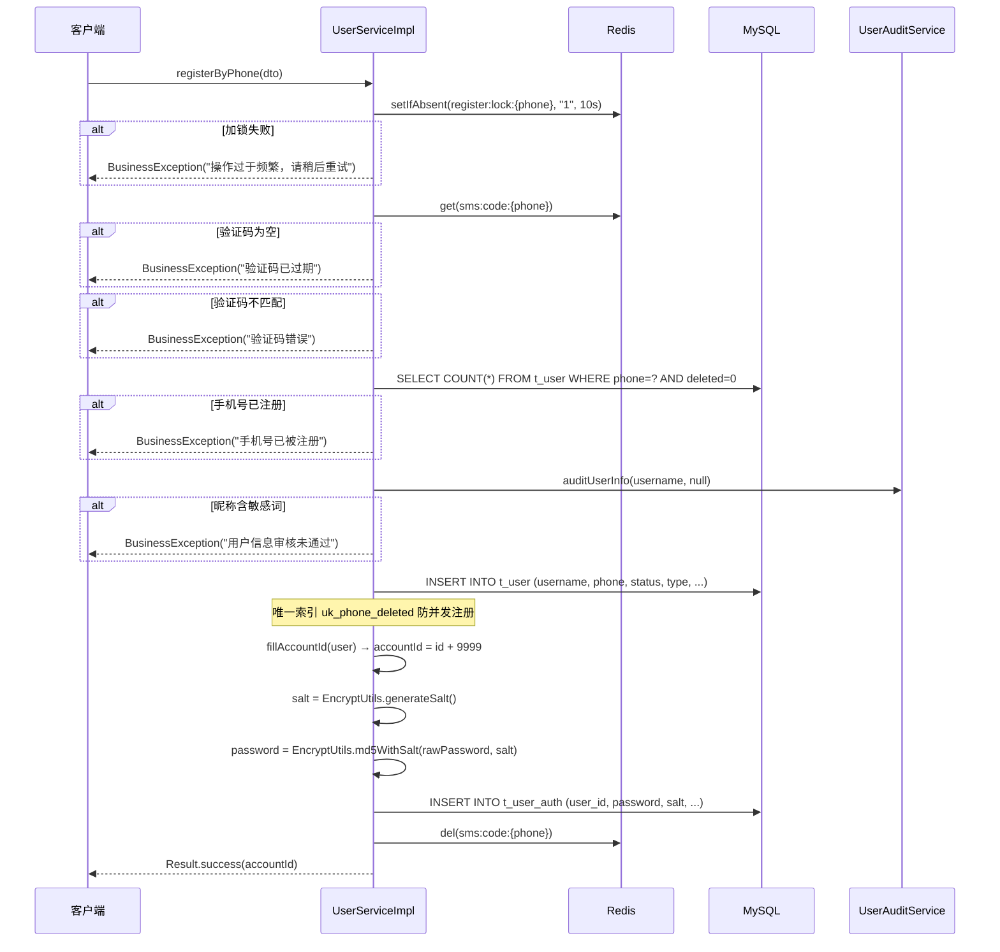

**密码加密逻辑**：

```java
// 生成 16 字节随机盐
String salt = EncryptUtils.generateSalt();
// 32 字符十六进制字符串

// MD5 加盐加密
String encoded = EncryptUtils.md5WithSalt(rawPassword, salt);
// 等价于: MD5(rawPassword + salt)

// EncryptUtils 核心代码
public static String generateSalt() {
    byte[] bytes = new byte[16];
    RANDOM.nextBytes(bytes);
    return HexFormat.of().formatHex(bytes);  // 32字符十六进制
}

public static String md5WithSalt(String rawPassword, String salt) {
    return DigestUtils.md5DigestAsHex(
        (rawPassword + salt).getBytes(StandardCharsets.UTF_8)
    );
}

public static boolean md5Check(String rawPassword, String encodedPassword, String salt) {
    return md5WithSalt(rawPassword, salt).equals(encodedPassword);
}
```

**注册防重复机制**：
1. Redis 分布式锁 `user:register:lock:{phone}`（10 秒 TTL）
2. 数据库唯一索引 `uk_phone_deleted(phone, deleted)` 兜底，`DuplicateKeyException` 捕获后转为友好提示

### 3.2 登录流程

**API**：`POST /user/login/account`

**请求体 (AccountLoginDTO)**：

```java
public class AccountLoginDTO {
    @NotNull(message = "账号ID不能为空")
    private Long accountId;

    @NotBlank(message = "密码不能为空")
    private String password;

    private Integer type;  // 可选，指定登录身份类型
}
```

**完整流程**：

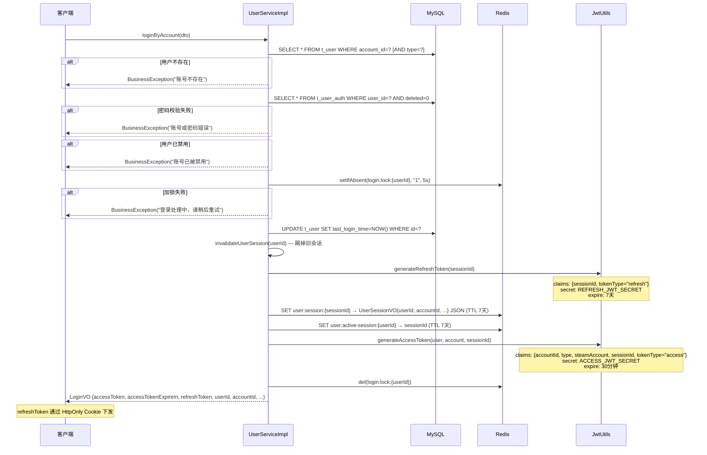

**JWT 生成代码**：

Access Token：

```java
private String generateAccessToken(User user, UserAccount account, String sessionId) {
    Map<String, Object> claims = new HashMap<>();
    claims.put("accountId", user.getAccountId());
    claims.put("type", account.getType().getCode());
    claims.put("steamAccount", UserStrings.orEmpty(user.getSteamAccount()));
    claims.put("sessionId", sessionId);
    claims.put("tokenType", TOKEN_TYPE_ACCESS);
    return JwtUtils.generateToken(Constants.ACCESS_JWT_SECRET, claims,
            Constants.ACCESS_TOKEN_EXPIRE_TIME * 1000);
    // ACCESS_TOKEN_EXPIRE_TIME = 30 * 60L = 1800秒
}
```

Refresh Token：

```java
private String generateRefreshToken(String sessionId) {
    Map<String, Object> claims = new HashMap<>();
    claims.put("sessionId", sessionId);
    claims.put("tokenType", TOKEN_TYPE_REFRESH);
    return JwtUtils.generateToken(Constants.REFRESH_JWT_SECRET, claims,
            Constants.REFRESH_TOKEN_EXPIRE_TIME * 1000);
    // REFRESH_TOKEN_EXPIRE_TIME = 7 * 24 * 60 * 60L = 604800秒
}
```

**JwtUtils 核心代码**：

```java
public static String generateToken(String secret, Map<String, Object> claims, long expireMillis) {
    Date now = new Date();
    Date expireAt = new Date(now.getTime() + expireMillis);
    return Jwts.builder()
            .setClaims(claims)
            .setIssuedAt(now)
            .setExpiration(expireAt)
            .signWith(getSecretKey(secret))
            .compact();
}

public static Claims parseToken(String secret, String token) {
    return Jwts.parserBuilder()
            .setSigningKey(getSecretKey(secret))
            .build()
            .parseClaimsJws(token)
            .getBody();
}

private static SecretKey getSecretKey(String secret) {
    byte[] bytes = secret.getBytes(StandardCharsets.UTF_8);
    if (bytes.length < 32) {
        byte[] padded = new byte[32];
        System.arraycopy(bytes, 0, padded, 0, bytes.length);
        bytes = padded;
    }
    return Keys.hmacShaKeyFor(bytes);
}
```

**Refresh Token Cookie 设置**：

```java
private void writeRefreshTokenCookie(HttpServletRequest request, HttpServletResponse response,
                                     String refreshToken, long maxAgeSeconds) {
    ResponseCookie cookie = ResponseCookie.from(Constants.REFRESH_TOKEN_COOKIE_NAME, refreshToken)
            .httpOnly(true)
            .secure(request.isSecure())
            .sameSite("Lax")
            .path(Constants.REFRESH_TOKEN_COOKIE_PATH)  // "/"
            .maxAge(maxAgeSeconds)
            .build();
    response.addHeader(HttpHeaders.SET_COOKIE, cookie.toString());
}
```

Cookie 配置：HttpOnly（防 XSS）、SameSite=Lax（防 CSRF）、Secure（跟随请求协议）。

### 3.3 Token 刷新

**API**：`POST /user/token/refresh`

从 HttpOnly Cookie 中提取 refresh_token，无需请求体。

**完整流程**：

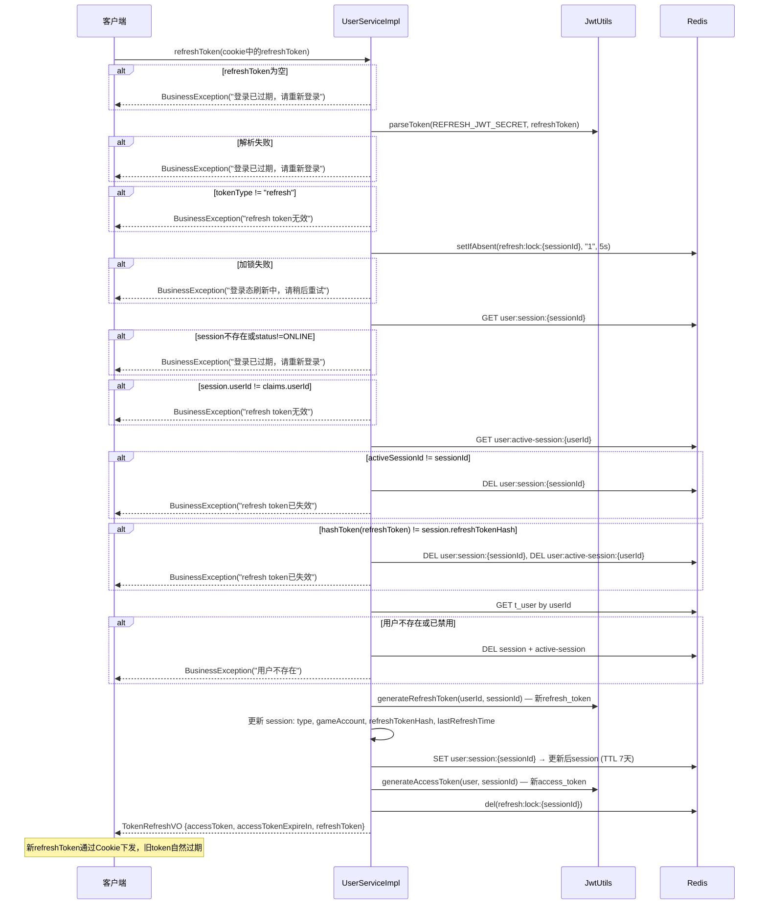

**关键安全机制**：
1. **Refresh Token 轮换**：每次刷新生成新的 refresh_token，旧 token 哈希失效
2. **会话绑定校验**：验证 sessionId 与 active session 指针一致
3. **哈希校验**：refresh_token 的 SHA-256 哈希必须与 Redis 中存储的一致，防止 token 重放
4. **分布式锁**：`user:refresh:lock:{sessionId}` 防并发刷新
5. **异常即销毁**：任何校验不通过，立即销毁整个会话

### 3.4 验证码

**API**：`POST /user/sendCode`

**请求体 (SendCodeDTO)**：

```java
public class SendCodeDTO {
    @NotBlank(message = "手机号不能为空")
    @Pattern(regexp = "^1[3-9]\\d{9}$", message = "手机号格式不正确")
    private String phone;
}
```

**逻辑**：

```java
public String sendCode(String phone) {
    String code = String.format("%06d", new Random().nextInt(1000000));
    redisUtils.setEx(RedisConstants.CODE_PREFIX + phone, code, UserConstants.CODE_EXPIRE);
    // CODE_EXPIRE = 300秒 = 5分钟
    return code;
}
```

生成 6 位随机数字验证码，存入 Redis，TTL 5 分钟。当前实现直接返回验证码（开发环境），生产环境应接入短信服务。

### 3.5 用户资料

#### 3.5.1 查询当前用户

**API**：`GET /user/me`（需 @LoginCheck）

```java
@LoginCheck
@GetMapping("/me")
public Result<UserVO> getCurrentUser() {
    return Result.success(userService.getCurrentUser(UserThreadLocal.getUserId()));
}
```

返回当前登录用户的完整信息，包含 `pendingAvatarUrl`（待审核头像的临时预览地址，仅本人可见）。

**UserVO 结构**：

```java
public class UserVO {
    private Long id;
    private Long accountId;
    private String username;
    private String avatar;           // 审核通过的头像 URL
    private String pendingAvatarUrl; // 待审核头像预览 URL（仅本人可见）
    private String signature;
    private String phone;            // 仅本人或管理员可见
    private Integer status;
    private Integer type;
    private String gameAccount;
    private Integer auditStatus;     // 0=无需审核, 1=审核中
    private Integer version;
    private Integer followCount;     // 当前硬编码为 0
    private Integer fansCount;       // 当前硬编码为 0
}
```

#### 3.5.2 更新资料

**API**：`PUT /user/info`（需 @LoginCheck）

**请求体 (UpdateUserInfoDTO)**：

```java
public class UpdateUserInfoDTO {
    @NotNull(message = "资料版本号不能为空")
    private Integer version;         // 乐观锁版本号

    @Size(min = 2, max = 32, message = "昵称长度必须在2到32个字符之间")
    private String username;         // 可选, null 表示不修改

    @Size(max = 120, message = "个性签名不能超过120个字符")
    private String signature;        // 可选

    @Pattern(regexp = "^$|^1[3-9]\\d{9}$", message = "手机号格式不正确")
    private String phone;            // 可选, 空字符串表示不修改

    @Size(max = 64, message = "游戏账号长度不能超过64个字符")
    private String gameAccount;      // 可选
}
```

**核心逻辑**：

```java
@Transactional(rollbackFor = Exception.class)
public void updateUserInfo(Long userId, UpdateUserInfoDTO dto) {
    // 1. 查询当前用户
    User user = getById(userId);
    // 2. 版本号校验（乐观锁前置检查）
    if (!Objects.equals(dto.getVersion(), user.getVersion())) {
        throw new BusinessException("资料已更新，请刷新页面后重试");
    }
    // 3. 检查是否审核中
    if (AuditStatus.AUDITING == defaultAuditStatus(user.getAuditStatus())) {
        throw new BusinessException("用户资料审核中，请稍后再试");
    }
    // 4. 手机号唯一性校验
    if (phone != null) {
        long count = count(new LambdaQueryWrapper<User>()
                .eq(User::getPhone, phone)
                .ne(User::getId, userId));
        if (count > 0) throw new BusinessException("手机号已被其他用户使用");
    }
    // 5. 构建审核负载（仅包含变更字段）
    ProfileAuditPayload payload = buildProfileAuditPayload(user, dto, phone);
    if (payload == null) return;  // 无变更，直接返回
    // 6. CAS 获取审核状态：audit_status 从 0→1
    if (!acquireAuditStatus(user)) {
        throw new BusinessException("用户资料审核中，请稍后再试");
    }
    // 7. 创建审核任务 & 事务提交后异步执行审核
    try {
        payload.setUserVersion(user.getVersion() + 1);
        Long taskId = createAuditTask(userId, AuditTaskType.PROFILE, payload);
        runAfterCommit(() -> userProfileAuditTaskService.auditProfileAsync(taskId));
    } catch (RuntimeException e) {
        clearAuditStatus(userId, user.getVersion() + 1);
        throw e;
    }
}
```

**CAS 获取审核状态**：

```java
private boolean acquireAuditStatus(User user) {
    return userMapper.update(null, new LambdaUpdateWrapper<User>()
            .eq(User::getId, user.getId())
            .eq(User::getVersion, user.getVersion())
            .eq(User::getAuditStatus, UserConstants.AuditStatus.NONE)  // 0
            .set(User::getAuditStatus, UserConstants.AuditStatus.AUDITING)  // →1
            .set(User::getVersion, user.getVersion() + 1)
            .set(User::getUpdateTime, LocalDateTime.now())) > 0;
}
```

三个条件同时满足才能更新成功：id 匹配 + version 匹配 + audit_status=0。这保证了不会出现并发提交审核的情况。

**事务提交后触发异步审核**：

```java
private void runAfterCommit(Runnable action) {
    if (!TransactionSynchronizationManager.isSynchronizationActive()) {
        action.run();
        return;
    }
    TransactionSynchronizationManager.registerSynchronization(new TransactionSynchronization() {
        @Override
        public void afterCommit() {
            action.run();
        }
    });
}
```

使用 Spring `TransactionSynchronization.afterCommit()` 确保审核任务行已持久化后再触发异步审核，避免审核线程查不到任务数据。

### 3.6 资料审核链

> 当前实现已收口到 ai-agent-service：`AuditTaskExecutor` 通过 `AiAgentFeignClient` 获取 `ModerationResultVO`，按 0–3 拒绝、4–6 人工、7–10 通过推进资料状态。下面出现的本地 `AuditClient` / DFA 代码是迁移前背景，当前协议详见 `docs/v2/ai-agent-service.md` §8。

**完整流程**：

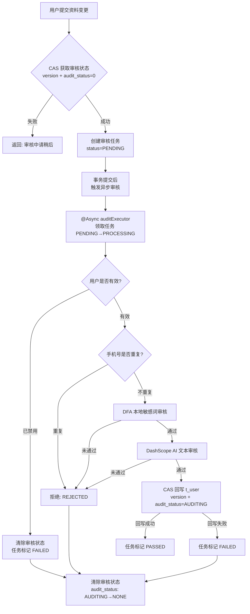

**异步审核执行器 (UserProfileAuditTaskServiceImpl)**：

```java
@Async("auditExecutor")
@Override
public void auditProfileAsync(Long taskId) {
    UserAuditTask task = userAuditTaskMapper.selectById(taskId);
    if (task == null || !AuditTaskStatus.PENDING.equals(task.getStatus())) {
        return;  // 任务不存在或已被领取
    }
    if (!claimTask(taskId)) {
        return;  // CAS 领取失败，已被其他线程处理
    }
    try {
        ProfileAuditPayload payload = objectMapper.readValue(task.getPayload(), ProfileAuditPayload.class);
        // 1. 校验用户是否有效
        User currentUser = userMapper.selectById(task.getUserId());
        if (currentUser == null || UserStatus.DISABLED == currentUser.getStatus()) {
            failTask(taskId, task.getUserId(), "用户已失效，无法回写审核结果", ...);
            return;
        }
        // 2. 手机号重复校验（二次校验，防止审核期间被其他用户占用）
        if (StringUtils.hasText(payload.getPhone())) {
            Long duplicatePhoneCount = userMapper.selectCount(...);
            if (duplicatePhoneCount != null && duplicatePhoneCount > 0) {
                rejectTask(taskId, task.getUserId(), "手机号已被其他用户使用");
                return;
            }
        }
        // 3. 执行审核
        boolean passed = userAuditService.auditUserInfo(payload.getUsername(), payload.getSignature());
        if (!passed) {
            rejectTask(taskId, task.getUserId(), "用户资料审核未通过");
            return;
        }
        // 4. CAS 回写审核结果
        LambdaUpdateWrapper<User> userUpdate = new LambdaUpdateWrapper<User>()
                .eq(User::getId, task.getUserId())
                .eq(User::getVersion, payload.getUserVersion())
                .eq(User::getAuditStatus, AuditStatus.AUDITING)
                .set(User::getAuditStatus, AuditStatus.NONE)
                .set(User::getVersion, payload.getUserVersion() + 1)
                .set(User::getUpdateTime, LocalDateTime.now());
        // 仅设置变更字段
        if (payload.getUsername() != null) userUpdate.set(User::getUsername, payload.getUsername());
        if (payload.getSignature() != null) userUpdate.set(User::getSignature, payload.getSignature());
        if (payload.getPhone() != null) userUpdate.set(User::getPhone, payload.getPhone());
        if (payload.getGameAccount() != null) userUpdate.set(User::getGameAccount, payload.getGameAccount());
        int updated = userMapper.update(null, userUpdate);
        if (updated <= 0) {
            failTask(...);  // CAS 失败
            return;
        }
        // 5. 任务标记通过
        userAuditTaskMapper.update(null, ...set status=PASSED...);
    } catch (Exception e) {
        failTask(taskId, task.getUserId(), "用户资料审核异常", e);
    }
}
```

**任务领取 (claimTask)**：

```java
private boolean claimTask(Long taskId) {
    return userAuditTaskMapper.update(null, new LambdaUpdateWrapper<UserAuditTask>()
            .eq(UserAuditTask::getId, taskId)
            .eq(UserAuditTask::getStatus, AuditTaskStatus.PENDING)
            .set(UserAuditTask::getStatus, AuditTaskStatus.PROCESSING)
            .set(UserAuditTask::getUpdateTime, LocalDateTime.now())) > 0;
}
```

CAS 领取保证同一任务只被一个线程处理。

**两级审核逻辑 (UserAuditServiceImpl)**：

```java
// 文本审核：DFA 本地敏感词 → DashScope AI
private boolean auditText(String text, String fieldName) {
    if (!StringUtils.hasText(text)) return true;
    // 第一级：DFA 本地敏感词
    if (!dfaAuditUtils.pass(text)) {
        log.warn("{}本地审核未通过: {}", fieldName, text);
        return false;
    }
    // 第二级：DashScope AI 审核
    AuditResult result = auditClient.auditText(text);
    if (!result.isPass()) {
        log.warn("{}AI审核未通过: {}", fieldName, result.getReason());
        return false;
    }
    return true;
}
```

**DFA 本地敏感词列表**：

```java
@Component
public class DfaAuditUtils {
    private static final List<String> BLOCK_WORDS = List.of("赌博", "色情", "诈骗", "外挂");

    public boolean pass(String text) {
        if (!StringUtils.hasText(text)) return true;
        return BLOCK_WORDS.stream().noneMatch(text::contains);
    }
}
```

当前为硬编码轻量实现，`pass()` 方法使用 `String.contains()` 做简单匹配，后续可替换为 DFA 自动机词库加载。

**DashScope AI 审核提示词**：

```
你是游戏社区内容安全审核器。你需要审核文本和图片，判断是否包含违法违规、辱骂、色情、
政治敏感、广告引流、人身攻击、未成年人不适宜内容。
只能返回 JSON，不要输出 markdown、解释、代码块或其他文本。
通过时返回 {"pass":true,"reason":"通过"}
不通过时返回 {"pass":false,"reason":"具体原因"}
```

**DashScope 配置**：

```yaml
audit:
  dashscope:
    text-model: qwen-plus           # 文本审核模型
    image-model: qwen3-vl-plus      # 图片审核模型
    fail-open-on-unavailable: false  # AI服务不可用时是否放行（默认不放行）
    temperature: 0.1                 # 低温度保证审核稳定性
```

### 3.7 头像审核链

**API**：`POST /user/avatar`（需 @LoginCheck，multipart/form-data）

**请求参数**：`avatar` (MultipartFile)

**校验规则**：
- 文件不能为空
- 大小不超过 2MB
- 仅支持 image/jpeg、image/png、image/webp

**完整流程**：

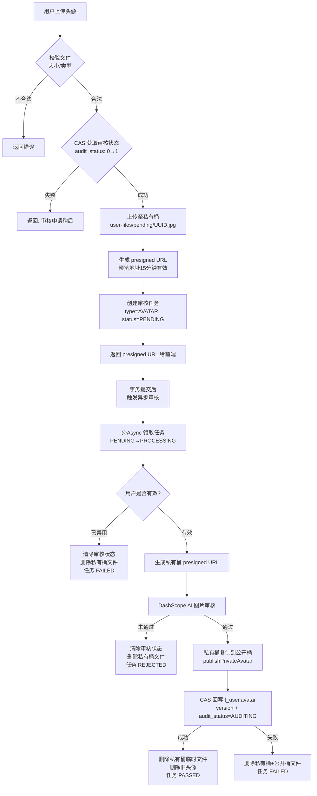

**头像上传核心代码**：

```java
public String uploadAvatar(Long userId, MultipartFile avatarFile) {
    User user = getById(userId);
    // 前置校验...
    validateAvatar(avatarFile);
    // CAS 获取审核状态
    if (!acquireAuditStatus(user)) {
        throw new BusinessException("用户资料审核中，请稍后再试");
    }
    try {
        // 上传至私有桶
        String pendingObjectName = minIOUtils.uploadPrivateAvatar(avatarFile, avatarFile.getOriginalFilename());
        // 生成预览 URL
        String previewUrl = minIOUtils.generatePrivateAvatarUrl(pendingObjectName);
        // 创建审核任务
        AvatarAuditPayload payload = new AvatarAuditPayload();
        payload.setUserVersion(user.getVersion() + 1);
        payload.setOldAvatarUrl(user.getAvatar());
        payload.setPendingObjectName(pendingObjectName);
        Long taskId = createAuditTask(userId, AuditTaskType.AVATAR, payload);
        // 事务提交后异步审核
        runAfterCommit(() -> avatarAuditTaskService.auditAvatarAsync(taskId));
        return previewUrl;
    } catch (RuntimeException e) {
        clearAuditStatus(userId, user.getVersion() + 1);
        throw e;
    }
}
```

**头像审核核心代码 (AvatarAuditTaskServiceImpl)**：

```java
@Async("auditExecutor")
@Override
public void auditAvatarAsync(Long taskId) {
    // 领取任务...
    try {
        AvatarAuditPayload payload = objectMapper.readValue(task.getPayload(), AvatarAuditPayload.class);
        // 1. 校验用户有效性
        User currentUser = userMapper.selectById(task.getUserId());
        if (currentUser == null || UserStatus.DISABLED == currentUser.getStatus()) {
            clearAuditStatus(task.getUserId(), payload.getUserVersion());
            completeTask(taskId, AuditTaskStatus.FAILED, "用户已失效，无法回写头像");
            minIOUtils.deletePrivateAvatar(payload.getPendingObjectName());
            return;
        }
        // 2. 生成临时访问 URL 并审核
        String auditAvatarUrl = minIOUtils.generatePrivateAvatarUrl(payload.getPendingObjectName());
        boolean passed = userAuditService.auditAvatarUrl(auditAvatarUrl);
        if (passed) {
            // 3. 审核通过：复制到公开桶
            String publicAvatarUrl = minIOUtils.publishPrivateAvatar(payload.getPendingObjectName());
            // 4. CAS 回写
            int updated = userMapper.update(null, new LambdaUpdateWrapper<User>()
                    .eq(User::getId, task.getUserId())
                    .eq(User::getVersion, payload.getUserVersion())
                    .eq(User::getAuditStatus, AuditStatus.AUDITING)
                    .set(User::getAvatar, publicAvatarUrl)
                    .set(User::getAuditStatus, AuditStatus.NONE)
                    .set(User::getVersion, payload.getUserVersion() + 1)
                    .set(User::getUpdateTime, LocalDateTime.now()));
            if (updated <= 0) {
                // CAS 失败：清理公开桶和私有桶
                minIOUtils.deletePrivateAvatar(payload.getPendingObjectName());
                minIOUtils.deletePublicAvatarByUrl(publicAvatarUrl);
                completeTask(taskId, AuditTaskStatus.FAILED, "头像审核结果回写失败");
                return;
            }
            // 5. 清理私有桶临时文件 + 旧头像
            minIOUtils.deletePrivateAvatar(payload.getPendingObjectName());
            deleteQuietly(payload.getOldAvatarUrl(), "旧头像");
            completeTask(taskId, AuditTaskStatus.PASSED, null);
        } else {
            // 审核不通过：清除审核状态 + 删除私有桶文件
            clearAuditStatus(task.getUserId(), payload.getUserVersion());
            minIOUtils.deletePrivateAvatar(payload.getPendingObjectName());
            completeTask(taskId, AuditTaskStatus.REJECTED, "头像审核未通过");
        }
    } catch (Exception e) {
        clearAuditStatus(task.getUserId(), readUserVersion(taskId));
        completeTask(taskId, AuditTaskStatus.FAILED, abbreviate("头像审核异常: " + e.getMessage()));
    }
}
```

**头像审核 AI 调用逻辑 (UserAuditServiceImpl)**：

```java
public boolean auditAvatarUrl(String avatarUrl) {
    AuditResult result;
    try {
        // 优先：下载图片二进制后发送给 AI 审核
        MinIOUtils.FilePayload filePayload = minIOUtils.readFileByUrl(avatarUrl);
        result = auditClient.auditImage(filePayload.bytes(), filePayload.contentType());
    } catch (Exception e) {
        // 降级：直接传 URL 给 AI 审核
        log.warn("头像图片读取失败，回退为 URL 审核: url={}, error={}", avatarUrl, e.getMessage());
        result = auditClient.auditImageUrl(avatarUrl);
    }
    return result.isPass();
}
```

图片审核优先使用二进制上传方式（更可靠），失败时降级为 URL 方式。

**图片审核 DashScope 调用**：

图片审核通过 DashScope OpenAI 兼容模式接口调用，URL 为 `https://dashscope.aliyuncs.com/compatible-mode/v1/chat/completions`，使用 `qwen3-vl-plus` 视觉模型，请求体包含 image_url 类型的 content 块。

### 3.8 密码修改

**API**：`PUT /user/password`（需 @LoginCheck）

**请求体 (ChangePasswordDTO)**：

```java
public class ChangePasswordDTO {
    @NotBlank(message = "原密码不能为空")
    private String oldPassword;

    @NotBlank(message = "新密码不能为空")
    @Size(min = 6, max = 32, message = "新密码长度必须在6到32个字符之间")
    private String newPassword;
}
```

**流程**：

1. 查询用户和认证记录
2. 校验旧密码：`EncryptUtils.md5Check(oldPassword, storedPassword, salt)`
3. 新旧密码不能相同
4. 生成新盐，更新 t_user_auth（CAS version）
5. 使该用户所有会话失效（强制下线）
6. 清除客户端 refresh_token Cookie

```java
@Transactional(rollbackFor = Exception.class)
public void changePassword(Long userId, ChangePasswordDTO dto) {
    User user = getById(userId);
    UserAuth userAuth = getUserAuth(userId);
    if (userAuth == null || !EncryptUtils.md5Check(dto.getOldPassword(), userAuth.getPassword(), userAuth.getSalt())) {
        throw new BusinessException("原密码错误");
    }
    if (dto.getOldPassword().equals(dto.getNewPassword())) {
        throw new BusinessException("新密码不能与原密码相同");
    }
    String newSalt = EncryptUtils.generateSalt();
    boolean updated = userAuthMapper.update(null, new LambdaUpdateWrapper<UserAuth>()
            .eq(UserAuth::getUserId, userId)
            .eq(UserAuth::getVersion, userAuth.getVersion())
            .set(UserAuth::getSalt, newSalt)
            .set(UserAuth::getPassword, EncryptUtils.md5WithSalt(dto.getNewPassword(), newSalt))
            .set(UserAuth::getVersion, userAuth.getVersion() + 1)
            .set(UserAuth::getUpdateTime, LocalDateTime.now())) > 0;
    if (!updated) {
        throw new BusinessException("密码已被更新，请刷新后重试");
    }
    invalidateUserSession(userId);  // 强制下线
}
```

### 3.9 公开资料查询

**API**：`GET /user/{accountId}`（需 @LoginCheck）

通过 accountId 查询用户公开资料。手机号脱敏逻辑：
- 本人可见手机号
- 管理员可见手机号
- 其他用户手机号置为 null

```java
public UserVO getUserVOByAccountId(Long accountId) {
    User user = getByAccountId(accountId);
    UserVO vo = convertToVO(user);
    Long currentUserId = UserThreadLocal.getUserId();
    Integer currentUserType = UserThreadLocal.getType();
    boolean canViewPhone = user.getId().equals(currentUserId)
            || (currentUserType != null && currentUserType == UserType.ADMIN);
    if (!canViewPhone) {
        vo.setPhone(null);
    }
    if (user.getId().equals(currentUserId)) {
        vo.setPendingAvatarUrl(resolvePendingAvatarUrl(user.getId()));
    }
    return vo;
}
```

**简单用户信息查询**：

**API**：`GET /user/simple/{accountId}`（需 @LoginCheck）

返回 UserSimpleVO（不含手机号、状态、审核状态等敏感信息）。

```java
public class UserSimpleVO {
    private Long id;
    private Long accountId;
    private String username;
    private String avatar;
    private String signature;
    private String gameAccount;
}
```

**批量查询**：

**API**：`GET /user/ids?ids=1,2,3`（需 @LoginCheck）

**用户搜索分页**：

**API**：`GET /user/simple/search?page=1&size=10&username=关键词`（需 @LoginCheck）

### 3.10 账号管理

#### 切换用户状态

**API**：`PUT /user/status`（需 @LoginCheck）

> 注意：当前 Controller 层标注的是 @LoginCheck 而非 @AdminCheck，实际权限由前端/网关层控制。Feign 接口也有此功能供其他服务调用。

**请求体 (UserStatusDTO)**：

```java
public class UserStatusDTO {
    @NotNull(message = "状态不能为空")
    private Integer status;  // 0=正常, 1=禁用
}
```

禁用时额外操作：
1. 清除审核状态（audit_status → NONE）
2. 销毁所有会话（强制下线）

```java
@Transactional(rollbackFor = Exception.class)
public void switchUserStatus(Long userId, Integer status) {
    User user = getById(userId);
    // 校验...
    if (status.equals(user.getStatus())) return;  // 无变化
    LambdaUpdateWrapper<User> statusUpdate = new LambdaUpdateWrapper<User>()
            .eq(User::getId, userId)
            .eq(User::getVersion, user.getVersion())
            .set(User::getStatus, status)
            .set(User::getVersion, user.getVersion() + 1)
            .set(User::getUpdateTime, LocalDateTime.now());
    if (status == UserStatus.DISABLED) {
        statusUpdate.set(User::getAuditStatus, AuditStatus.NONE);
    }
    int updated = userMapper.update(null, statusUpdate);
    if (updated <= 0) {
        throw new BusinessException("用户状态已变更，请刷新后重试");
    }
    if (status == UserStatus.DISABLED) {
        invalidateUserSession(userId);
    }
}
```

#### 注销账号

**API**：`POST /user/cancel`（需 @LoginCheck）

等价于将用户状态设为 DISABLED（1），逻辑删除在 deleted 字段控制。

```java
public void cancelAccount(Long userId) {
    switchUserStatus(userId, UserConstants.UserStatus.DISABLED);
}
```

#### 登出

**API**：`POST /user/logout`（需 @LoginCheck）

销毁当前会话 + 清除 Cookie：

```java
@LoginCheck
@PostMapping("/logout")
public Result<Void> logout(HttpServletRequest request, HttpServletResponse response) {
    userService.logout(UserThreadLocal.getUserId(), UserThreadLocal.getSessionId());
    clearRefreshTokenCookie(request, response);
    UserThreadLocal.removeUser();
    return Result.success(null);
}
```

### 3.11 审核任务恢复

审核任务持久化到 `t_user_audit_task` 后由线程池异步执行。为支持多实例和实例故障恢复，每个实例周期扫描 PENDING 与超时 PROCESSING 任务；提交执行前通过数据库状态 CAS（Compare-And-Set，按期望状态更新）抢占任务，因此同一任务即使被多个实例扫描，也只有一个实例能进入处理流程：

```java
@Scheduled(initialDelayString = "${audit.recovery.initial-delay-ms:10000}",
        fixedDelayString = "${audit.recovery.fixed-delay-ms:30000}")
public void recover() {
    resetStaleTasks();       // 超时 PROCESSING -> PENDING
    enqueuePendingTasks();   // 分批提交；执行器内部用 PENDING -> PROCESSING CAS 抢占
}
```

恢复器按主键游标分批读取，避免启动或定时任务一次性加载整张任务表；`PROCESSING` 超过配置阈值后会回到 `PENDING`，由任一健康实例重新接管。线程池队列满时任务会进入失败处理并记录原因，避免无界堆积拖垮实例。

---

## 4. 认证鉴权体系

### 4.1 网关层面 — JwtGlobalFilter

网关全局过滤器对所有非白名单路径进行 JWT 校验，校验流程：

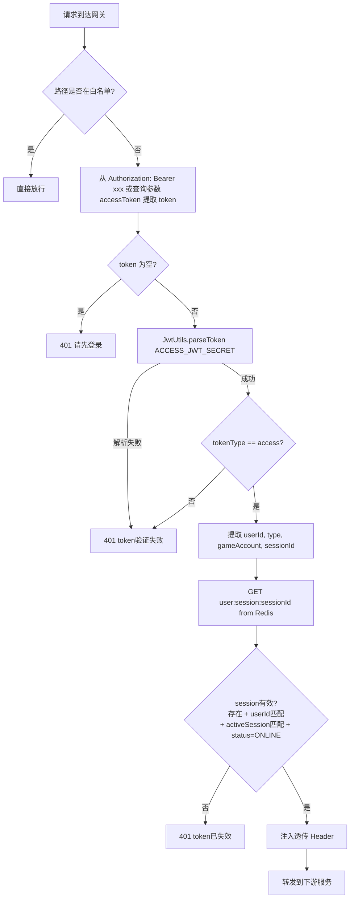

**白名单路径**：

```java
private static final List<String> WHITE_PATHS = List.of(
    "/user/sendCode",
    "/user/register",
    "/user/login",
    "/user/token/refresh"
);
```

> 注意：白名单匹配使用 `path::startsWith`，即 `/user/register/phone` 也会被 `/user/register` 前缀匹配到而放行。

**网关注入的透传 Header**：

| Header | 值 | 说明 |
|---|---|---|
| X-User-Id | userId | 用户内部 ID |
| X-User-Type | type | 用户类型 (0/1) |
| X-Game-Account | gameAccount | 游戏账号 |
| X-Session-Id | sessionId | 会话 ID |

注入前先移除这些 Header（防止伪造），再写入网关认证后的值。

### 4.2 服务层面 — UserFilter + AuthAspect

#### UserFilter

在 user-service 内部，`UserFilter` 从网关注入的 Header 中读取用户信息，设置到 ThreadLocal：

```java
@Slf4j
@Order(1)
@Component
public class UserFilter implements Filter {
    @Override
    public void doFilter(ServletRequest request, ServletResponse response, FilterChain chain)
            throws IOException, ServletException {
        HttpServletRequest httpRequest = (HttpServletRequest) request;
        String userIdStr = httpRequest.getHeader(GatewayConstants.USER_ID_HEADER);    // X-User-Id
        String userTypeStr = httpRequest.getHeader(GatewayConstants.USER_TYPE_HEADER); // X-User-Type
        String gameAccount = httpRequest.getHeader(GatewayConstants.GAME_ACCOUNT_HEADER); // X-Game-Account
        String sessionId = httpRequest.getHeader(GatewayConstants.SESSION_ID_HEADER);  // X-Session-Id

        if (userIdStr != null && !userIdStr.isBlank()) {
            Long userId = Long.parseLong(userIdStr);
            Integer userType = userTypeStr == null || userTypeStr.isBlank()
                    ? 0 : Integer.parseInt(userTypeStr);
            UserThreadLocal.setUser(new UserContex(userId, userType,
                    gameAccount == null ? "" : gameAccount, sessionId));
        }
        try {
            chain.doFilter(request, response);
        } finally {
            UserThreadLocal.removeUser();  // 防止线程池复用导致的上下文泄漏
        }
    }
}
```

#### AuthAspect

AOP 切面拦截自定义注解，实现登录校验和管理员权限校验：

```java
@Slf4j
@Aspect
@Component
public class AuthAspect {
    @Around("@annotation(com.game.community.common.annotation.LoginCheck)")
    public Object aroundLoginCheck(ProceedingJoinPoint joinPoint) throws Throwable {
        Long userId = UserThreadLocal.getUserId();
        if (userId == null) {
            return Result.error("请先登录");
        }
        return joinPoint.proceed();
    }

    @Around("@annotation(com.game.community.common.annotation.AdminCheck)")
    public Object aroundAdminCheck(ProceedingJoinPoint joinPoint) throws Throwable {
        Long userId = UserThreadLocal.getUserId();
        if (userId == null) {
            return Result.error("请先登录");
        }
        Integer type = UserThreadLocal.getType();
        if (type == null || type != UserConstants.UserType.ADMIN) {
            return Result.error("无权限，需要管理员权限");
        }
        return joinPoint.proceed();
    }
}
```

#### UserThreadLocal 生命周期

```mermaid
flowchart LR
    A[请求到达] --> B[UserFilter.doFilter<br/>从Header读取 → setUser]
    B --> C[Controller/Service<br/>通过 getXxx 获取用户信息]
    C --> D[AuthAspect<br/>@LoginCheck / @AdminCheck 校验]
    D --> E[finally 块<br/>removeUser 清除]
```

- `set`：UserFilter.doFilter 开头
- `get`：业务代码中通过 `UserThreadLocal.getUserId()` 等静态方法获取
- `remove`：UserFilter.doFilter 的 finally 块，确保线程归还线程池时上下文已清除

---

## 5. 对外接口声明

### 5.1 经过网关的接口（前缀 /user，网关端口 8080）

#### 白名单接口（无需认证）

| 方法 | 路径 | 说明 | 请求体 | 响应 |
|---|---|---|---|---|
| POST | /user/sendCode | 发送验证码 | SendCodeDTO | Result\<String\> |
| POST | /user/register/phone | 手机号注册 | RegisterDTO | Result\<Long\> (accountId) |
| POST | /user/login/account | 账号密码登录 | AccountLoginDTO | Result\<LoginVO\> + RefreshToken Cookie |
| POST | /user/token/refresh | 刷新令牌 | Cookie: refreshToken | Result\<TokenRefreshVO\> + 新 Cookie |

#### 需要登录的接口 (@LoginCheck)

| 方法 | 路径 | 说明 | 请求体 | 响应 |
|---|---|---|---|---|
| POST | /user/logout | 登出 | - | Result\<Void\> |
| GET | /user/me | 查询当前用户 | - | Result\<UserVO\> |
| PUT | /user/info | 修改用户资料 | UpdateUserInfoDTO | Result\<Void\> |
| POST | /user/avatar | 上传头像 | MultipartFile | Result\<String\> (presignedUrl) |
| PUT | /user/password | 修改密码 | ChangePasswordDTO | Result\<Void\> |
| POST | /user/cancel | 注销账号 | - | Result\<Void\> |
| PUT | /user/status | 切换账号状态 | UserStatusDTO | Result\<Void\> |
| GET | /user/{accountId} | 按 accountId 查用户 | - | Result\<UserVO\> |
| GET | /user/simple/{accountId} | 简版用户信息 | - | Result\<UserSimpleVO\> |
| GET | /user/ids?ids=1,2,3 | 批量查用户 | - | Result\<List\<UserVO\>\> |
| GET | /user/simple/search | 模糊搜索用户 | UserSearchPageDTO | PageResult\<UserSimpleVO\> |

### 5.2 不经过网关的接口（直连 user-service:8081）

Feign 内部调用接口，供其他微服务直接调用：

| 方法 | 路径 | 说明 |
|---|---|---|
| GET | /feign/user/ids?ids=1,2,3 | 批量查询用户信息 |
| POST | /feign/user/{userId}/status?status=1 | 更新用户状态 |

---

## 6. 关键流程图

### 6.1 注册流程

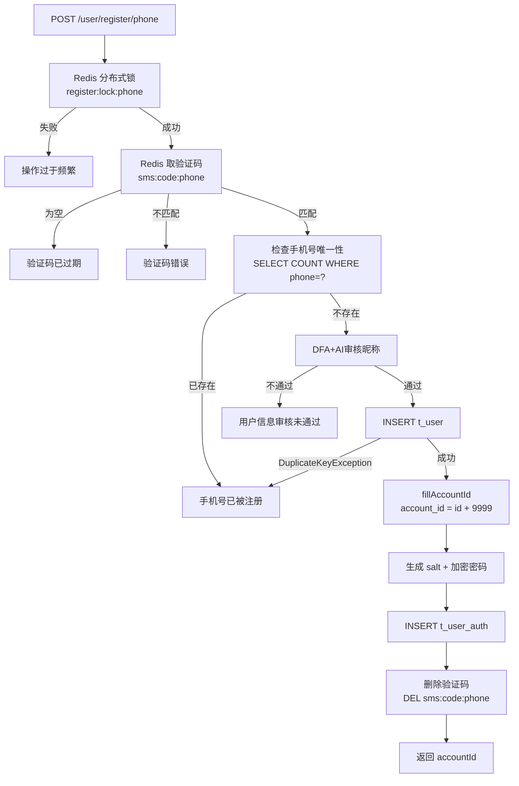

### 6.2 登录 + JWT 创建流程

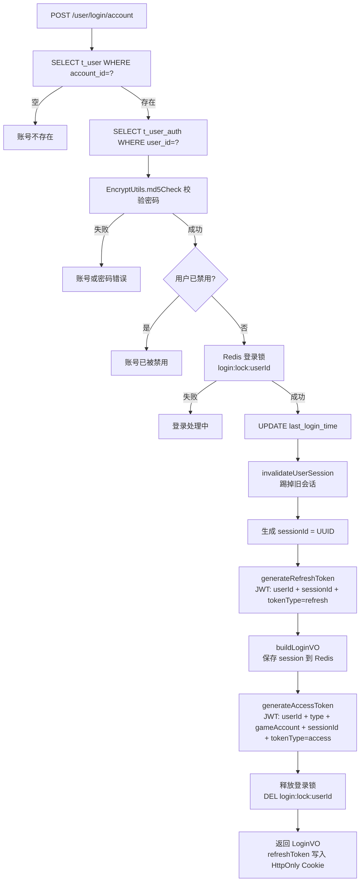

### 6.3 资料审核异步链

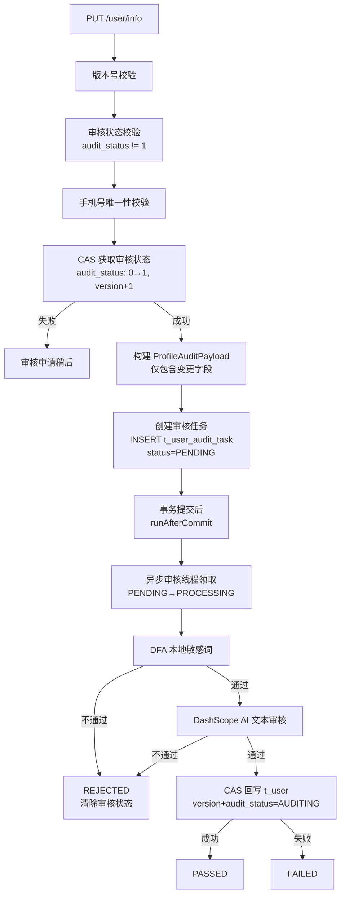

### 6.4 头像审核双桶流程

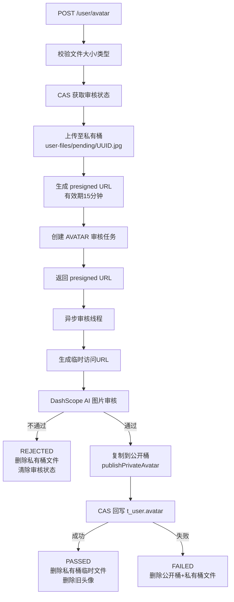

### 6.5 Token 刷新 + 轮换流程

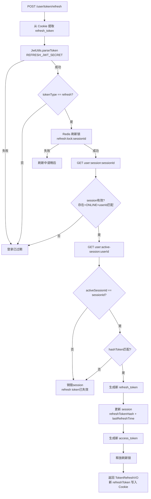

---

## 7. 配置说明

### 7.1 application.yml

```yaml
server:
  port: 8081

spring:
  application:
    name: user-service
  ai:
    dashscope:
      api-key: ${DASHSCOPE_API_KEY:your-api-key-here}
      chat:
        options:
          model: ${DASHSCOPE_CHAT_MODEL:qwen-plus}
  datasource:
    driver-class-name: com.mysql.cj.jdbc.Driver
    url: jdbc:mysql://localhost:3307/game_community?useUnicode=true&characterEncoding=UTF-8&serverTimezone=Asia/Shanghai&useSSL=false
    username: root
    password: ${MYSQL_PASSWORD:your-password}
  data:
    redis:
      host: localhost
      port: ${REDIS_PORT:6380}
      database: 0
      timeout: 5000ms
  cloud:
    nacos:
      discovery:
        server-addr: localhost:8848
      config:
        server-addr: localhost:8848
        file-extension: yml

minio:
  endpoint: http://localhost:9000
  public-endpoint: ${MINIO_PUBLIC_ENDPOINT:http://localhost:9000}
  accessKey: minioadmin
  secretKey: minioadmin123
  public-bucket-name: ${MINIO_PUBLIC_BUCKET_NAME:game-community-public}
  private-bucket-name: ${MINIO_PRIVATE_BUCKET_NAME:game-community-private}
  public-file-prefix: ${MINIO_PUBLIC_FILE_PREFIX:user-files/public}
  private-file-prefix: ${MINIO_PRIVATE_FILE_PREFIX:user-files/pending}
  presigned-expire-seconds: ${MINIO_PRESIGNED_EXPIRE_SECONDS:900}

audit:
  mode: ${AUDIT_MODE:llm}
  async:
    core-pool-size: ${AUDIT_ASYNC_CORE_POOL_SIZE:2}
    max-pool-size: ${AUDIT_ASYNC_MAX_POOL_SIZE:4}
    queue-capacity: ${AUDIT_ASYNC_QUEUE_CAPACITY:200}
    keep-alive-seconds: ${AUDIT_ASYNC_KEEP_ALIVE_SECONDS:60}
    thread-name-prefix: ${AUDIT_ASYNC_THREAD_NAME_PREFIX:audit-}

mybatis-plus:
  mapper-locations: classpath*:mapper/*.xml
  type-aliases-package: com.game.community.model.entity
  configuration:
    map-underscore-to-camel-case: true
  global-config:
    db-config:
      logic-delete-field: deleted
      logic-delete-value: 1
      logic-not-delete-value: 0
      id-type: auto

logging:
  level:
    com.game.community: debug
```

### 7.2 bootstrap.yml

```yaml
spring:
  application:
    name: user-service
  cloud:
    nacos:
      config:
        enabled: ${NACOS_CONFIG_ENABLED:true}
        server-addr: localhost:8848
        file-extension: yml
```

### 7.3 审核异步线程池配置

```java
@Configuration
@EnableConfigurationProperties(AuditAsyncProperties.class)
public class AuditAsyncConfig {
    @Bean("auditExecutor")
    public Executor auditExecutor(AuditAsyncProperties properties) {
        ThreadPoolTaskExecutor executor = new ThreadPoolTaskExecutor();
        executor.setThreadNamePrefix(properties.getThreadNamePrefix());  // 默认 "audit-"
        executor.setCorePoolSize(properties.getCorePoolSize());          // 默认 2
        executor.setMaxPoolSize(properties.getMaxPoolSize());            // 默认 4
        executor.setQueueCapacity(properties.getQueueCapacity());        // 默认 200
        executor.setKeepAliveSeconds(properties.getKeepAliveSeconds());  // 默认 60
        executor.setRejectedExecutionHandler(new ThreadPoolExecutor.CallerRunsPolicy());
        executor.initialize();
        return executor;
    }
}
```

拒绝策略为 `CallerRunsPolicy`：队列满时由提交线程自己执行审核，避免任务丢失。

### 7.4 MyBatis-Plus 配置

```java
@Configuration
public class MybatisPlusConfig {
    @Bean
    public MybatisPlusInterceptor mybatisPlusInterceptor() {
        MybatisPlusInterceptor interceptor = new MybatisPlusInterceptor();
        interceptor.addInnerInterceptor(new OptimisticLockerInnerInterceptor());  // 乐观锁
        interceptor.addInnerInterceptor(new PaginationInnerInterceptor(DbType.MYSQL));  // 分页
        return interceptor;
    }
}
```

### 7.5 关键常量汇总

| 常量 | 值 | 说明 |
|---|---|---|
| ACCESS_JWT_SECRET | "game-community-access-token-secret-key" | Access Token 签名密钥 |
| REFRESH_JWT_SECRET | "game-community-refresh-token-secret-key" | Refresh Token 签名密钥 |
| ACCESS_TOKEN_EXPIRE_TIME | 1800 (30分钟) | Access Token 有效期（秒） |
| REFRESH_TOKEN_EXPIRE_TIME | 604800 (7天) | Refresh Token 有效期（秒） |
| REFRESH_TOKEN_RENEW_WINDOW | 86400 (24小时) | Refresh Token 续期窗口 |
| REFRESH_TOKEN_COOKIE_NAME | "refreshToken" | Cookie 名称 |
| REFRESH_TOKEN_COOKIE_PATH | "/" | Cookie 路径 |
| CODE_EXPIRE | 300 (5分钟) | 验证码有效期（秒） |
| ACCOUNT_ID_MIN | 10000 | accountId 最小值 |
| ACCOUNT_ID_MAX | 99999999 | accountId 最大值 |
| UserStatus.NORMAL | 0 | 用户状态：正常 |
| UserStatus.DISABLED | 1 | 用户状态：禁用/注销 |
| UserType.NORMAL | 0 | 用户类型：普通用户 |
| UserType.ADMIN | 1 | 用户类型：管理员 |
| AuditStatus.NONE | 0 | 审核状态：无需审核/审核完成 |
| AuditStatus.AUDITING | 1 | 审核状态：审核中 |
| AuditTaskType.PROFILE | "PROFILE" | 审核任务类型：资料 |
| AuditTaskType.AVATAR | "AVATAR" | 审核任务类型：头像 |
| AuditTaskStatus.PENDING | "PENDING" | 任务状态：待处理 |
| AuditTaskStatus.PROCESSING | "PROCESSING" | 任务状态：处理中 |
| AuditTaskStatus.PASSED | "PASSED" | 任务状态：通过 |
| AuditTaskStatus.REJECTED | "REJECTED" | 任务状态：拒绝 |
| AuditTaskStatus.FAILED | "FAILED" | 任务状态：失败 |

### 7.6 Redis Key 汇总

| Key 模式 | 值类型 | TTL | 说明 |
|---|---|---|---|
| `sms:code:{phone}` | String (6位数字) | 300s | 验证码 |
| `user:session:{sessionId}` | String (UserSessionVO JSON) | 604800s | 会话数据 |
| `user:active-session:{userId}` | String (sessionId) | 604800s | 活跃会话指针 |
| `user:register:lock:{phone}` | String ("1") | 10s | 注册防重复锁 |
| `user:login:lock:{userId}` | String ("1") | 5s | 登录防并发锁 |
| `user:refresh:lock:{sessionId}` | String ("1") | 5s | 刷新防并发锁 |

### 7.7 MinIO 配置属性

| 属性 | 默认值 | 说明 |
|---|---|---|
| minio.endpoint | http://localhost:9000 | MinIO 内部地址 |
| minio.public-endpoint | http://localhost:9000 | MinIO 外部访问地址 |
| minio.accessKey | minioadmin | 访问密钥 |
| minio.secretKey | minioadmin123 | 秘密密钥 |
| minio.public-bucket-name | game-community-public | 公开桶名 |
| minio.private-bucket-name | game-community-private | 私有桶名 |
| minio.public-file-prefix | user-files/public | 公开文件前缀 |
| minio.private-file-prefix | user-files/pending | 私有文件前缀 |
| minio.presigned-expire-seconds | 900 (15分钟) | Presigned URL 有效期 |

### 7.8 网关路由配置

```yaml
spring:
  cloud:
    gateway:
      routes:
        - id: user-service
          uri: lb://user-service
          predicates:
            - Path=/user/**
```

网关端口 8080，所有 `/user/**` 路径的请求路由到 user-service。

---

## 附录 A：项目包结构

```
com.game.community.user
├── UserServiceApplication.java          # 启动类 (@SpringBootApplication + @MapperScan + @EnableFeignClients)
├── aspect/
│   └── AuthAspect.java                  # @LoginCheck / @AdminCheck 切面
├── config/
│   ├── AuditAsyncConfig.java            # 审核异步线程池
│   ├── AuditAsyncProperties.java        # 线程池配置属性
│   └── MybatisPlusConfig.java           # 乐观锁 + 分页插件
├── controller/
│   └── UserController.java              # 对外 REST 接口
├── feign/
│   └── UserFeignController.java         # Feign 内部调用接口
├── filter/
│   └── UserFilter.java                  # 网关 Header → ThreadLocal
├── mapper/
│   ├── UserMapper.java                  # 用户 Mapper
│   ├── UserAuthMapper.java              # 认证 Mapper
│   └── UserAuditTaskMapper.java         # 审核任务 Mapper
└── service/
    ├── IUserService.java                 # 用户服务接口
    ├── UserAuditService.java             # 审核服务接口
    ├── AvatarAuditTaskService.java       # 头像审核任务接口
    ├── UserProfileAuditTaskService.java  # 资料审核任务接口
    ├── UserAuditTaskRecoveryRunner.java  # 审核任务恢复
    └── impl/
        ├── UserServiceImpl.java          # 用户服务实现
        ├── UserAuditServiceImpl.java     # 审核服务实现
        ├── AvatarAuditTaskServiceImpl.java    # 头像审核实现
        └── UserProfileAuditTaskServiceImpl.java # 资料审核实现
```

## 附录 B：依赖的共享模块类

| 模块 | 类 | 用途 |
|---|---|---|
| common | Constants | JWT 密钥、Token 过期时间、Cookie 配置 |
| common | RedisConstants | Redis Key 前缀常量 |
| common | UserConstants | 用户状态/类型/审核状态常量 |
| common | GatewayConstants | 网关透传 Header 名称 |
| common | BusinessException | 业务异常 |
| common | GlobalExceptionHandler | 全局异常处理 |
| common | @LoginCheck / @AdminCheck | 权限校验注解 |
| model | User / UserAuth / UserAuditTask | 数据库实体 |
| model | RegisterDTO / AccountLoginDTO / ... | 请求 DTO |
| model | LoginVO / UserVO / UserSessionVO / ... | 响应 VO |
| model | ProfileAuditPayload / AvatarAuditPayload | 审核负载 |
| model | UserContex | ThreadLocal 用户上下文 |
| model | Result / PageResult | 通用响应包装 |
| utils | JwtUtils | JWT 生成/解析 |
| utils | EncryptUtils | 密码加盐加密/校验 |
| utils | RedisUtils | Redis 操作封装 |
| utils | MinIOUtils | MinIO 文件操作 |
| utils | DfaAuditUtils | DFA 本地敏感词审核 |
| utils | UserThreadLocal | ThreadLocal 用户上下文工具 |
| utils.audit | AuditClient | 审核客户端接口 |
| utils.audit | DashScopeAuditClient | DashScope AI 审核实现 |
| utils.audit | AuditResult | 审核结果 |
| utils.audit | DashScopeAuditProperties | DashScope 审核配置 |
| utils.config | MinIOProperties | MinIO 配置属性 |
